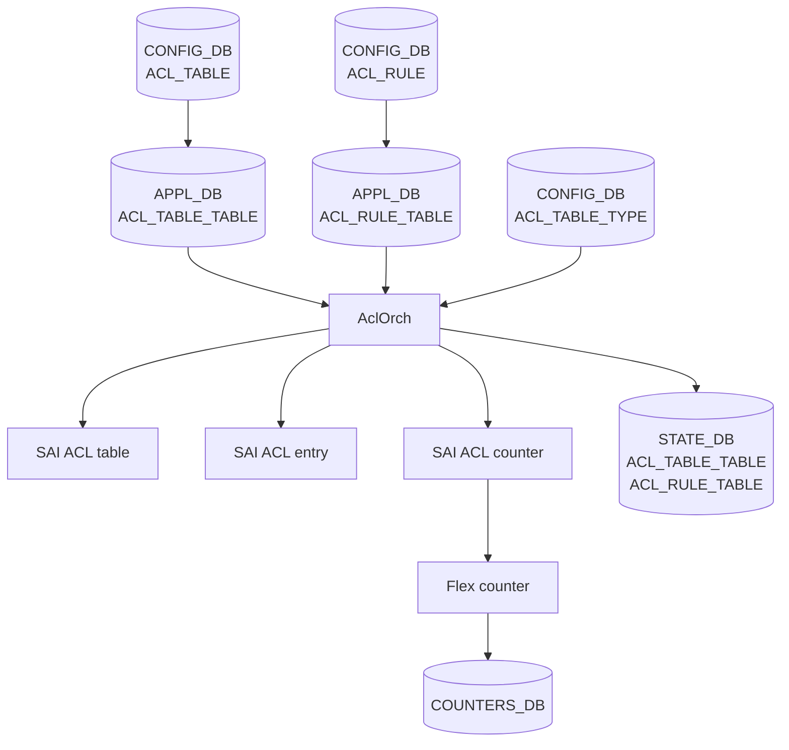
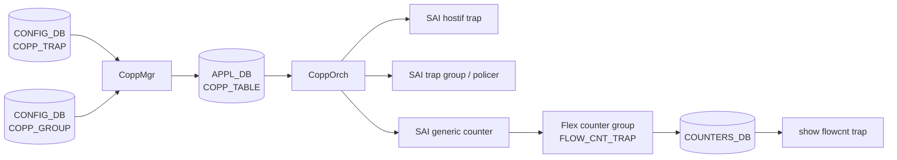

# アーキテクチャ

[ACL](../../reference/glossary.md#term-acl) の中心は `AclOrch` です。設定は [CONFIG_DB](../../reference/glossary.md#term-config_db) から入り、[APPL_DB](../../reference/glossary.md#term-appl_db) を経由して `AclOrch` が [SAI](../../reference/glossary.md#term-sai) ACL table、entry、counter に変換します。運用上の見え方は `show acl` や `aclshow` ですが、失敗や capability は [STATE_DB](../../reference/glossary.md#term-state_db) / [COUNTERS_DB](../../reference/glossary.md#term-counters_db) 側にも分かれます。

## Table / Rule / Counter の流れ

table は bind 先と stage を決め、rule は priority と action を決め、counter は rule hit を後から読めるようにします。`ACL_TABLE_TYPE` を使うと、組み込み type ではなくユーザ定義の match / action / bind point セットを `ACL_TABLE.type` から参照できます。

## 組み込み Type と拡張 Type

古い ACL は `L3`、`L3V6`、`MIRROR` などを `AclOrch` 内部の組み込み type として持ちます。新しい要求が増えると [orchagent](../../reference/glossary.md#term-orchagent) 改修と [TCAM](../../reference/glossary.md#term-tcam) 消費が増えるため、ユーザ定義 table type では `ACL_TABLE_TYPE` に match、action、bind point を宣言します。

一方、`MIRROR` / `MIRRORV6` のように特別な内部処理が必要な type は組み込みに残ります。`L3V4V6` も組み込み type で、IPv4 と IPv6 rule を 1 つの SAI ACL table に同居させ、[ASIC](../../reference/glossary.md#term-asic) が対応する場合に TCAM 消費を抑える狙いがあります。

## Flex Counter 化

ACL counter は rule ごとの packet / byte count を持ちます。以前は orchagent が固定周期で polling する設計でしたが、rule 数が増えると orchagent main loop を圧迫します。ACL flex counter 化により、polling は [syncd](../../reference/glossary.md#term-syncd) 側の flex counter infrastructure に寄せられ、`COUNTERS_ACL_COUNTER_RULE_MAP` で rule 名から counter OID を引けるようになります。

運用者にとっての意味は、`counterpoll acl` の状態と interval が counter 表示の鮮度に影響することです。ACL 設定だけを見ていても counter が更新されない場合、flex counter 側を確認します。

## CoPP Trap と Trap Flow Counter

[CoPP](../../reference/glossary.md#term-copp) は `COPP_TRAP` と `COPP_GROUP` を組み合わせ、trap ID 群を CPU queue / policer に割り当てます。Trap flow counter は hostif trap ごとに generic counter を bind し、trap 種別単位の packet / byte / PPS を観測します。

ACL counter が rule hit を見るのに対し、trap flow counter は CPU bound traffic の偏りを見ます。CoPP policer の調整や unexpected punt の調査では、ACL と別の入口として扱います。

## 関連ページ

- [ACL ユーザ定義テーブルタイプ](../../acl-qos/acl-user-defined-table-type-support.md)
- [L3V4V6 ACL テーブル型](../../acl-qos/support-a-new-acl-table-type-that-combines-l3-acl-and-l3v6-acl-tables.md)
- [ACL カウンタの flex counter 化](../../acl-qos/acl-flex-counters-support.md)
- [Trap Flow Counter](../../architecture/sonic-trap-flow-counter-design.md)

<!-- glossary-links-injected: c006405759d8 -->
