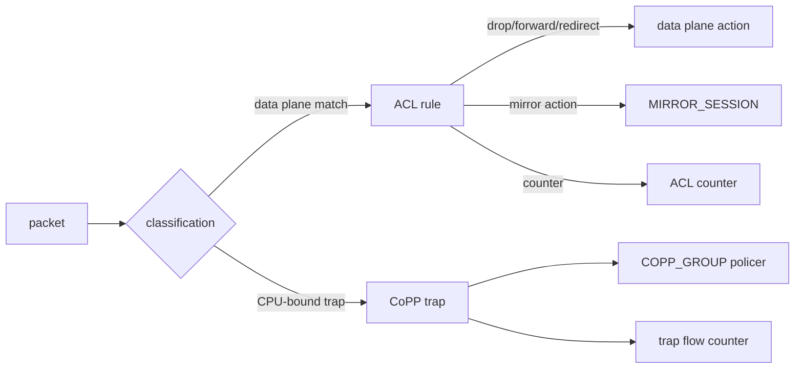

# 概念

ACL は「どのパケットに、どの action を適用するか」を表す仕組みです。SONiC では `ACL_TABLE` が適用段、bind 先、table type を決め、`ACL_RULE` が priority、match、action を決めます。まず table type を読むと、その後の設定や運用で迷いにくくなります。

## Table Type が決めること

`L3`、`L3V6`、`L3V4V6` は通常の IP ACL、`MIRROR` / `MIRRORV6` は mirror 用、`CTRLPLANE` は CoPP 系、`DROP` は drop 用の最適化、`EGR_SET_DSCP` は egress DSCP 書換のように、type は単なるラベルではありません。type ごとに利用できる match field、action、bind point、stage が変わります。

同じ `ACL_RULE` でも、`PACKET_ACTION=DROP` を使うのか、`MIRROR_INGRESS_ACTION` を使うのか、`POLICER` を参照するのかは table type と stage の組み合わせに依存します。設定を読むときは、個々の rule からではなく、先に所属 table を確認します。

## ACL / CoPP / Mirror の境界

ACL は主に data plane を分類します。CoPP は ASIC から CPU へ punt される BGP、LLDP、ARP、DHCP などの hostif trap を守るための control plane policing です。Mirror はトラフィックを観測先にコピーする機能で、ACL rule の action として使われる場合と、port mirroring の `MIRROR_SESSION` として管理される場合があります。

この図の要点は、CoPP と mirror が ACL の外側にある独立機能でありながら、policer、counter、SAI capability のような部品を共有することです。

## Counter は何を答えるか

ACL counter は「この rule に何パケット hit したか」に答えます。Trap flow counter は「CPU に punt された trap 種別ごとの量」に答えます。Drop counter は「ASIC がどの drop reason で落としたか」に答えます。同じ drop 調査でも、ACL rule の hit を見たいのか、CPU bound traffic を見たいのか、L2/L3 の不正パケットを見たいのかで入口が変わります。

## P4 / DASH ACL の置き場所

DASH ACL は通常の `ACL_TABLE` / `ACL_RULE` と同じ名前空間ではなく、DASH 用 APP_DB テーブルと DASH orch の流れで扱われます。この章では「ACL と似た分類・action 概念を持つ派生領域」として位置付け、詳細は発展トピックから辿ります。

## 関連ページ

- [ACL in SONiC](../../acl-qos/acl-in-sonic.md)
- [ACL の基本設計](../../acl-qos/acl-support-in-sonic.md)
- [SAI 拡張属性追加系](../../categories/sai-extensions.md)
