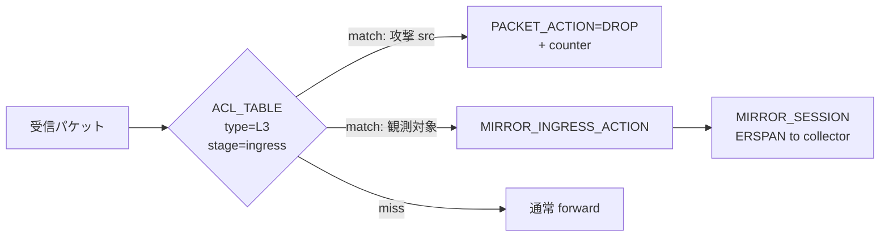
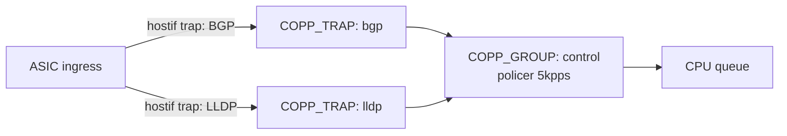
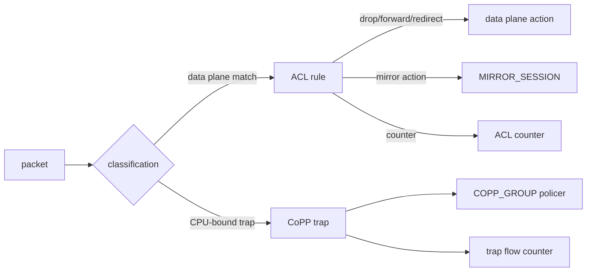
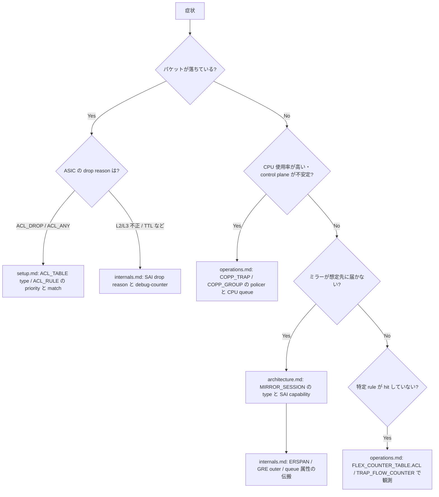
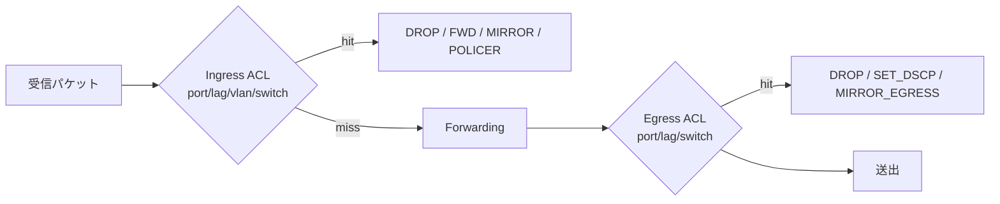

# 概念

[ACL](../../reference/glossary.md#term-acl)（Access Control List）と [CoPP](../../reference/glossary.md#term-copp)（Control Plane [Policing](../../reference/glossary.md#term-policing)）と Mirror（パケットコピー）は、[SONiC](../../reference/glossary.md#term-sonic) 内部では密接に関係していますが、**それぞれが解いている問題は別** です。最初にこの 3 つを分けて理解しておかないと、`ACL_TABLE` / `COPP_TRAP` / `MIRROR_SESSION` の使い分けで迷うことになります。

## この 3 機能は何を解決するか

| 機能 | 解いている問題 |
| --- | --- |
| ACL | data plane に流れるパケットを **classify して、許可 / 拒否 / リダイレクト / カウント / ミラー / [DSCP](../../reference/glossary.md#term-dscp) 書き換え** などの action を当てる |
| CoPP | [ASIC](../../reference/glossary.md#term-asic) から CPU へ punt される **control plane traffic（[BGP](../../reference/glossary.md#term-bgp) / [LLDP](../../reference/glossary.md#term-lldp) / [ARP](../../reference/glossary.md#term-arp) / DHCP 等）を policer で守る** |
| Mirror | 観測したいトラフィックを **指定先（local port / GRE encap / ERSPAN）へコピー** する |

つまり ACL は「data plane の流量制御 + 分類」、CoPP は「CPU 行きトラフィックの DDoS 防御」、Mirror は「観測 / トラブルシュート用のコピー」が主目的です。3 つは独立した機能ですが、[SAI](../../reference/glossary.md#term-sai) 上では policer / counter / ACL entry など部品を共有します。

## SONiC の中での位置

| 軸 | 担当 |
| --- | --- |
| Management plane | `config acl`, `acl-loader`, CoPP の `copp_cfg.j2`, `MIRROR_SESSION` [CONFIG_DB](../../reference/glossary.md#term-config_db) |
| Control plane | aclmgrd, AclOrch, CoppOrch, MirrorOrch |
| Data plane | SAI ACL table / entry, SAI policer, SAI mirror session, hostif trap |

ACL / CoPP / Mirror はいずれも **ASIC の限られたリソース（[TCAM](../../reference/glossary.md#term-tcam)、policer、mirror engine）を取り合う** ため、運用上は容量 / 優先度の設計が中心になります。

## 最初に押さえる用語

| 用語 | 意味 |
| --- | --- |
| `ACL_TABLE` | ACL の適用段、bind 先、type（L3 / L3V6 / MIRROR / CTRLPLANE / DROP / EGR_SET_DSCP 等）を決める |
| `ACL_RULE` | priority、match field、action を持つ個別ルール |
| Stage | `ingress` / `egress`。bind 先（PORT / [LAG](../../reference/glossary.md#term-lag) / [VLAN](../../reference/glossary.md#term-vlan) / SWITCH）と組み合わさる |
| Table type | L3 / MIRROR / CTRLPLANE などの分類。利用可能な match / action / bind point が決まる |
| `COPP_TRAP` / `COPP_GROUP` | CPU に punt する trap 種別と policer の組 |
| Hostif trap | SAI 上の "CPU 行きにする" 設定。BGP / ARP / LLDP / DHCP / IP2ME など |
| `MIRROR_SESSION` | mirror 先（dst IP / GRE type / queue 等）の定義 |
| ERSPAN | encapsulated RSPAN。GRE で remote 先へ mirror パケットを送る方式 |
| acl-loader | JSON 形式の ACL 定義を CONFIG_DB に流し込むツール |

## Table Type が決めること

`L3`、`L3V6`、`L3V4V6` は通常の IP ACL、`MIRROR` / `MIRRORV6` は mirror 用、`CTRLPLANE` は CoPP 系、`DROP` は drop 用の最適化、`EGR_SET_DSCP` は egress DSCP 書換のように、type は単なるラベルではありません。type ごとに利用できる match field、action、bind point、stage が変わります。

同じ `ACL_RULE` でも、`PACKET_ACTION=DROP` を使うのか、`MIRROR_INGRESS_ACTION` を使うのか、`POLICER` を参照するのかは table type と stage の組み合わせに依存します。設定を読むときは、個々の rule からではなく、先に所属 table を確認します。

## 典型的な使用シーン

### シーン 1: 入口 ACL で DDoS をドロップ + ミラーで観測

### シーン 2: BGP / LLDP が CPU で詰まらないようにする CoPP

`COPP_TRAP` で「どの trap を CPU に上げるか」、`COPP_GROUP` で「どの policer / CPU queue に乗せるか」を決めます。policer を緩めすぎると CPU 飽和、厳しすぎると BGP keepalive がドロップして session が落ちます。

## ACL / CoPP / Mirror の境界

ACL は主に data plane を分類します。CoPP は ASIC から CPU へ punt される BGP、LLDP、ARP、DHCP などの hostif trap を守るための control plane policing です。Mirror はトラフィックを観測先にコピーする機能で、ACL rule の action として使われる場合と、port mirroring の `MIRROR_SESSION` として管理される場合があります。

この図の要点は、CoPP と mirror が ACL の外側にある独立機能でありながら、policer、counter、SAI capability のような部品を共有することです。

## Counter は何を答えるか

ACL counter は「この rule に何パケット hit したか」に答えます。Trap flow counter は「CPU に punt された trap 種別ごとの量」に答えます。Drop counter は「ASIC がどの drop reason で落としたか」に答えます。同じ drop 調査でも、ACL rule の hit を見たいのか、CPU bound traffic を見たいのか、L2/L3 の不正パケットを見たいのかで入口が変わります。

## P4 / DASH ACL の置き場所

[DASH](../../reference/glossary.md#term-dash) ACL は通常の `ACL_TABLE` / `ACL_RULE` と同じ名前空間ではなく、DASH 用 APP_DB テーブルと DASH orch の流れで扱われます。この章では「ACL と似た分類・action 概念を持つ派生領域」として位置付け、詳細は発展トピックから辿ります。

## 似た / 混同しやすい機能との違い

| 比較対象 | 違い |
| --- | --- |
| ACL (data plane) vs CoPP | ACL はどのポートから来た data も分類、CoPP は CPU 行きだけを守る |
| ACL の mirror action vs `MIRROR_SESSION` | 前者は ACL rule の action として 1 つの session を参照、後者は session そのものの定義 |
| Mirror vs sFlow | Mirror は full-packet コピー、sFlow は sampling + UDP 送信 |
| Drop counter vs ACL counter | 前者は ASIC の drop reason、後者は ACL rule の hit。重なるが粒度と意味が違う |
| TCAM ACL vs DASH ACL | 前者は SAI ACL table、後者は DASH orchestration による policy table |

## 問題を切り分けるための流れ図

「ドロップしている / CPU が高い / ミラーが届かない」のいずれの症状でも、まず ACL / CoPP / Mirror のどれが関与する事象かを切り分けてから節を選ぶと迷子にならない。

3 機能が独立に見えても、`POLICER` と counter は ACL / CoPP の両方から参照される。流れ図で `setup` → `internals` のように節をまたぐときは、共有部品（policer / counter / SAI capability）を経由する点に注意。

## 読み終わったあとにできるようになること

- ACL / CoPP / Mirror の責務を 1 行で説明できる。
- ACL rule を読むときに、所属 `ACL_TABLE` の type と stage を先に確認する習慣がつく。
- CPU 負荷の問題を「CoPP policer が緩い / 厳しすぎ / 該当 trap が落ちている」のどれかに切り分けられる。
- パケットキャプチャ / 観測の要件を、ACL mirror action と `MIRROR_SESSION` のどちらで実現するか選べる。

## CONFIG_DB の主要テーブル

ACL / CoPP / Mirror の周辺で押さえておくべき CONFIG_DB を整理します。

| Table | 用途 |
| --- | --- |
| `ACL_TABLE` | type / stage / bind point / ports |
| `ACL_TABLE_TYPE` | カスタム table type（user-defined match / action / bind point） |
| `ACL_RULE` | match / action / priority |
| `MIRROR_SESSION` | 観測先 session（local / ERSPAN / DSCP / queue） |
| `POLICER` | rate-limit 単位（ACL / CoPP 双方から参照） |
| `COPP_TRAP` / `COPP_GROUP` | CPU 行き trap と policer / queue の組 |
| `FLEX_COUNTER_TABLE` の `ACL` / `TRAP_FLOW_COUNTER` | カウンタ収集設定 |

`ACL_TABLE_TYPE` を使うと「どの match を許す table を作るか」をユーザ側で定義でき、user-defined table type のサンプルとして DASH や P4 拡張系の [HLD](../../reference/glossary.md#term-hld) が引かれます。詳細は [ACL user-defined table type support](../../acl-qos/acl-user-defined-table-type-support.md) を参照してください。

## stage と bind point の組み合わせ

stage（ingress/egress）と bind point（port / LAG / VLAN / switch）の組み合わせで利用可能な match / action が決まります。例えば egress 側で SET_DSCP / MIRROR_EGRESS_ACTION を使う場合は `EGR_SET_DSCP` / `MIRROR` 系の table type を選び、対象 stage は `egress` にします。

## CoPP は SAI capability 確認とセットで読む

CoPP は ASIC 依存が強く、利用可能な trap、policer の単位、CPU queue 数がプラットフォームによって違います。`SWITCH_CAPABILITY` テーブルや `STATE_DB` の関連テーブルで「この ASIC がどの trap / policer を受けるか」を確認するのが診断の入口です。CPU 高負荷時には `show platform queue counters` などで CPU queue 側のドロップが見えていないかも併せて確認します。

## Mirror session の出力種別

| 種別 | 用途 |
| --- | --- |
| `SPAN` | 同一 ToR 上のローカルポートへコピー |
| `ERSPAN` / GRE encap | remote collector へ送る。dst IP、TTL、DSCP、queue を指定 |
| `Truncated` | 一定サイズで切る observability 用途 |

ERSPAN は GRE outer / DSCP / queue / TTL の各属性が SAI mirror session attr にそのまま伝搬します。複数 ACL ルールから同一 session を参照すると mirror engine が共有されるため、TCAM 消費は ACL 側のみで mirror engine 側は 1 リソースとして使えます。

## 関連ページ

- [ACL in SONiC](../../acl-qos/acl-in-sonic.md)
- [ACL の基本設計](../../acl-qos/acl-support-in-sonic.md)
- [SAI 拡張属性追加系](../../categories/sai-extensions.md)
- [ACL user-defined table type support](../../acl-qos/acl-user-defined-table-type-support.md)
- [Egress mirroring と ACL action capability](../../acl-qos/egress-mirroring-support-and-acl-action-capability-check.md)
- [DASH ACL タグ](../../acl-qos/dash-acl-tags.md)

<!-- xref-prereq -->
## この章の前提知識

この章を読み進める前に、次の章を押さえておくと迷子になりにくい。

- [SONiC 全体像と設定基盤](../01-overview/index.md)
- [SWSS / SAI / Redis 内部実装](../20-swss-sai-redis/index.md)

<!-- glossary-links-injected: ec18b66e3507 -->
