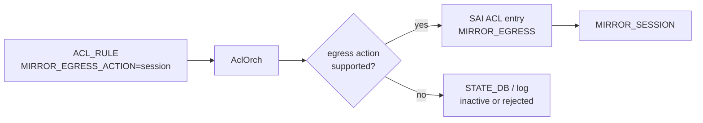
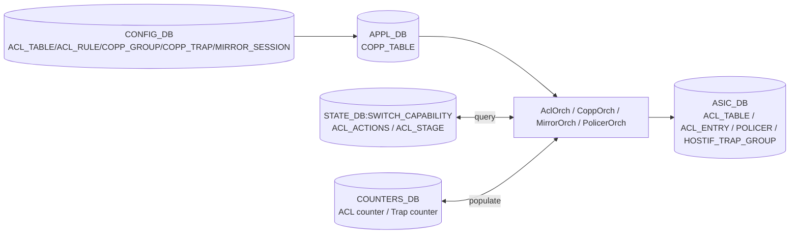

# 内部実装

[ACL](../../reference/glossary.md#term-acl) action はスキーマに書けるだけでは十分ではありません。[ASIC](../../reference/glossary.md#term-asic) がその stage でその action を受理できるか、[SAI](../../reference/glossary.md#term-sai) capability と [orchagent](../../reference/glossary.md#term-orchagent) の実装が揃っているかを確認する必要があります。egress mirror、outer [DSCP](../../reference/glossary.md#term-dscp) 書換、packet trimming はこの性質が強い機能です。

## ACL Action Capability

SAI は ingress / egress stage ごとに使える ACL action が異なります。[SONiC](../../reference/glossary.md#term-sonic) は `AclOrch` 起動時に `SAI_SWITCH_ATTR_ACL_STAGE_INGRESS` / `EGRESS` で action capability を問い合わせ、[STATE_DB](../../reference/glossary.md#term-state_db) の `SWITCH_CAPABILITY` に `ACL_ACTIONS|<stage>` フィールドとして公開します<!-- evidence: sonic-swss orchagent/aclorch.cpp queryAclActionCapability() / putAclActionCapabilityInDB() L3975-L4061 -->。`acl-loader` などの producer は投入前に capability を見て、未対応 action を早く弾けます。

この仕組みは「設定は accepted だが hardware には入らない」という問題を減らします。ただし capability が公開されていても、個別 table type や bind point、ASIC resource の都合で失敗する可能性は残るため、STATE_DB の ACL status と counter も併せて見ます。

## Egress Mirror

SAI には ingress mirror と egress mirror の action が分かれて存在します。SONiC では従来の `MIRROR_ACTION` に加えて、`MIRROR_INGRESS_ACTION` と `MIRROR_EGRESS_ACTION` を使い分け、それぞれ `SAI_ACL_ENTRY_ATTR_ACTION_MIRROR_INGRESS` / `SAI_ACL_ENTRY_ATTR_ACTION_MIRROR_EGRESS` にマップされます<!-- evidence: sonic-swss orchagent/aclorch.cpp aclMirrorStageLookup L124-L125 -->。



egress mirror は、traffic が出ていく段階での観測が必要なときに使います。ingress table に egress mirror action を書けるか、egress table で mirror できるかは platform 依存なので、capability と test coverage を確認します。

## Outer DSCP 書換

encap 後の outer header DSCP を、inner packet の field に基づいて egress で書き換えたい場合、単純な ingress DSCP rewrite では inner DSCP を壊してしまいます。Egress Outer DSCP 書換 ACL は、ingress 側で ACL metadata を付け、egress 側で metadata に match して outer DSCP を設定する設計です。

ユーザには `UNDERLAY_SET_DSCP` のような table type に見せ、内部では `MARK_META` と `EGR_SET_DSCP` に展開します。この設計は `SAI_ACL_ENTRY_ATTR_ACTION_SET_ACL_META_DATA` と `SAI_ACL_ENTRY_ATTR_FIELD_ACL_USER_META` に依存するため、[HLD](../../reference/glossary.md#term-hld)-only の仕様として読む必要があります。

## Packet Trimming

Packet Trimming は congestion 時に packet 全体を落とさず、ヘッダと先頭 payload だけ残した trimmed packet を届ける機能です。global 設定、buffer profile、[QoS](../../reference/glossary.md#term-qos)、ACL action が関係します。ACL 側では `DISABLE_TRIM` action（`SAI_ACL_ENTRY_ATTR_ACTION_PACKET_TRIM_DISABLE` に対応）により、特定 match の packet を trim 対象から外す設計です<!-- evidence: sonic-swss orchagent/aclorch.cpp aclL3ActionLookup ACTION_DISABLE_TRIM L114, L2047-L2051 -->。

運用上は packet trimming を ACL の派生 action としてだけ見ると不足します。`SWITCH_TRIMMING`、`BUFFER_PROFILE.packet_trimming`、trim 後 DSCP、queue、drop counter の組み合わせで読む必要があります。

## 読むときの注意

このページで扱う機能は ASIC / SAI の対応差が大きく、既存ページの verification も混在しています。egress mirror capability は code-verified、outer DSCP と packet trimming は HLD-only です。設計判断に使う場合は、該当 platform の STATE_DB capability、syslog、orchagent 実装、SAI 実装を必ず合わせて確認します。

## データフロー（ACL / CoPP / Mirror 共通）



## 主要 Orch / daemon の責務

| コンポーネント | 主実体 | 責務 |
| --- | --- | --- |
| `AclOrch` (`orchagent/aclorch.cpp`) | `AclOrch::doTask`、`AclTable::create`、`AclRule::create` | ACL table / rule、capability 問い合わせ、counter 登録 |
| `CoppOrch` (`orchagent/copporch.cpp`) | `CoppOrch::doTask`、`processCoppRule`、`createGenetlinkHostIf` | hostif trap group / hostif trap、policer の紐付け |
| `PolicerOrch` (`orchagent/policerorch.cpp`) | `PolicerOrch::doTask` | meter / policer object の作成 |
| `MirrorOrch` (`orchagent/mirrororch.cpp`) | `MirrorOrch::doTask`、`activateSession` | local / ERSPAN mirror session の作成、nexthop 解決まで pending |
| `acl-loader` (`sonic-utilities/acl_loader/`) | python CLI | [DASH](../../reference/glossary.md#term-dash) / data-plane ACL の JSON loader |

## SAI 属性使用一覧

ACL:

| object | 属性 |
| --- | --- |
| `SAI_OBJECT_TYPE_ACL_TABLE` | `SAI_ACL_TABLE_ATTR_ACL_STAGE = INGRESS/EGRESS`、`SAI_ACL_TABLE_ATTR_BIND_POINT_TYPE_LIST`、`SAI_ACL_TABLE_ATTR_FIELD_*` |
| `SAI_OBJECT_TYPE_ACL_ENTRY` | `SAI_ACL_ENTRY_ATTR_FIELD_*`（match）、`SAI_ACL_ENTRY_ATTR_ACTION_PACKET_ACTION / SET_TC / MIRROR_INGRESS / MIRROR_EGRESS / SET_ACL_META_DATA` |
| `SAI_OBJECT_TYPE_ACL_COUNTER` | counter object（[COUNTERS_DB](../../reference/glossary.md#term-counters_db) 反映） |
| `SAI_OBJECT_TYPE_POLICER` | `SAI_POLICER_ATTR_CBS`、`PIR`、`COLOR_SOURCE` |

[CoPP](../../reference/glossary.md#term-copp) / hostif:

| object | 属性 |
| --- | --- |
| `SAI_OBJECT_TYPE_HOSTIF_TRAP_GROUP` | `SAI_HOSTIF_TRAP_GROUP_ATTR_POLICER`、`QUEUE` |
| `SAI_OBJECT_TYPE_HOSTIF_TRAP` | `SAI_HOSTIF_TRAP_ATTR_TRAP_TYPE = LLDP/BGP/ARP_REQUEST/...`、`PACKET_ACTION`、`TRAP_PRIORITY` |
| `SAI_OBJECT_TYPE_HOSTIF_USER_DEFINED_TRAP` | `SAI_HOSTIF_USER_DEFINED_TRAP_ATTR_TYPE` |

Mirror:

| object | 属性 |
| --- | --- |
| `SAI_OBJECT_TYPE_MIRROR_SESSION` | `SAI_MIRROR_SESSION_ATTR_TYPE = LOCAL/REMOTE/ERSPAN/SFLOW`、`MONITOR_PORT`、`ERSPAN_*` |

## Redis テーブル参照関係

```yaml
CONFIG_DB:
  ACL_TABLE, ACL_RULE, ACL_TABLE_TYPE,
  COPP_GROUP, COPP_TRAP,
  MIRROR_SESSION, EVERFLOW_*,
  POLICER
APPL_DB:
  COPP_TABLE (coppmgr が CONFIG_DB COPP_GROUP/COPP_TRAP → APPL_DB COPP_TABLE に変換。CoppOrch は APPL_DB を読む。ACL は CONFIG_DB→AclOrch)
STATE_DB:
  SWITCH_CAPABILITY (ACL_ACTIONS|INGRESS / EGRESS)
COUNTERS_DB:
  COUNTERS:<acl_oid>, COUNTERS_ACL_NAME_MAP, COUNTERS_TRAP_NAME_MAP
ASIC_DB:
  ACL_TABLE, ACL_ENTRY, ACL_COUNTER, POLICER,
  HOSTIF_TRAP, HOSTIF_TRAP_GROUP, MIRROR_SESSION
```

## ZMQ / Redis pub/sub

- ACL / CoPP / Mirror は [Redis](../../reference/glossary.md#term-redis) pub/sub のみ。ZMQ は使用しない（DASH 系は別経路、→ 13 章）。
- ACL counter は `flexcounter` の `ACL_STAT_COUNTER` group が定期 polling し COUNTERS_DB を更新。
- Mirror session の nexthop 解決待ちは `MirrorOrch` 内 Observer で `NeighOrch` / `RouteOrch` の更新を待つ（プロセス内）。

## 既知の実装上の制約

- ACL の **stage / bind point / action / field** の組み合わせは ASIC の [TCAM](../../reference/glossary.md#term-tcam) レイアウト依存で、HLD で書ける組み合わせでも `STATE_DB:SWITCH_CAPABILITY` で許されていないと無効。capability が公開されていない ASIC では確認が困難。
- `MIRROR_EGRESS` action はベンダ依存が大きく、`MIRROR_INGRESS` のみ実装で `MIRROR_EGRESS` 未対応の ASIC では egress mirror が黙って ingress mirror に倒れる discrepancy が報告されている。
- CoPP の queue / policer 設定は `copp_cfg.json` のテンプレートに依存し、[CONFIG_DB](../../reference/glossary.md#term-config_db) の動的変更が即時反映されない経路がある（`hostcfgd` 経由のものは reload が必要）。
- ACL counter は ASIC によって entry per counter か rule per counter かが分かれ、SONiC は両方を抽象化するが、counter clear / reset の挙動が ASIC で違う。
- Mirror session の ERSPAN destination が [ECMP](../../reference/glossary.md#term-ecmp) の場合、`MirrorOrch` は単一 nexthop のみ採用し、ECMP の動的 rehash には追従しない<!-- evidence: sonic-swss orchagent/mirrororch.cpp activateSession() / m_routeOrch->attach() L517, L921 -->。

## 関連ページ

- [ACL の egress mirror 対応と SAI ベース action capability 問い合わせ](../../acl-qos/egress-mirroring-support-and-acl-action-capability-check.md)
- [Egress Outer DSCP 書換 ACL](../../acl-qos/egress-outer-dscp-change-table.md)
- [Packet Trimming](../../architecture/sonic-packet-trimming.md)

<!-- glossary-links-injected: ec18b66e3507 -->
