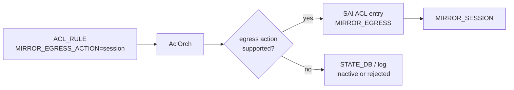

# 内部実装

ACL action はスキーマに書けるだけでは十分ではありません。ASIC がその stage でその action を受理できるか、SAI capability と orchagent の実装が揃っているかを確認する必要があります。egress mirror、outer DSCP 書換、packet trimming はこの性質が強い機能です。

## ACL Action Capability

SAI は ingress / egress stage ごとに使える ACL action が異なります。SONiC は `AclOrch` 起動時に SAI へ action capability を問い合わせ、STATE_DB の `SWITCH_CAPABILITY` に `ACL_ACTIONS|<stage>` として公開します。`acl-loader` などの producer は投入前に capability を見て、未対応 action を早く弾けます。

この仕組みは「設定は accepted だが hardware には入らない」という問題を減らします。ただし capability が公開されていても、個別 table type や bind point、ASIC resource の都合で失敗する可能性は残るため、STATE_DB の ACL status と counter も併せて見ます。

## Egress Mirror

SAI には ingress mirror と egress mirror の action が分かれて存在します。SONiC では従来の `MIRROR_ACTION` に加えて、`MIRROR_INGRESS_ACTION` と `MIRROR_EGRESS_ACTION` を使い分けます。

egress mirror は、traffic が出ていく段階での観測が必要なときに使います。ingress table に egress mirror action を書けるか、egress table で mirror できるかは platform 依存なので、capability と test coverage を確認します。

## Outer DSCP 書換

encap 後の outer header DSCP を、inner packet の field に基づいて egress で書き換えたい場合、単純な ingress DSCP rewrite では inner DSCP を壊してしまいます。Egress Outer DSCP 書換 ACL は、ingress 側で ACL metadata を付け、egress 側で metadata に match して outer DSCP を設定する設計です。

ユーザには `UNDERLAY_SET_DSCP` のような table type に見せ、内部では `MARK_META` と `EGR_SET_DSCP` に展開します。この設計は `SAI_ACL_ENTRY_ATTR_ACTION_SET_ACL_META_DATA` と `SAI_ACL_ENTRY_ATTR_FIELD_ACL_USER_META` に依存するため、HLD-only の仕様として読む必要があります。

## Packet Trimming

Packet Trimming は congestion 時に packet 全体を落とさず、ヘッダと先頭 payload だけ残した trimmed packet を届ける機能です。global 設定、buffer profile、QoS、ACL action が関係します。ACL 側では `DISABLE_TRIMMING` action により、特定 match の packet を trim 対象から外す設計です。

運用上は packet trimming を ACL の派生 action としてだけ見ると不足します。`SWITCH_TRIMMING`、`BUFFER_PROFILE.packet_trimming`、trim 後 DSCP、queue、drop counter の組み合わせで読む必要があります。

## 読むときの注意

このページで扱う機能は ASIC / SAI の対応差が大きく、既存ページの verification も混在しています。egress mirror capability は code-verified、outer DSCP と packet trimming は HLD-only です。設計判断に使う場合は、該当 platform の STATE_DB capability、syslog、orchagent 実装、SAI 実装を必ず合わせて確認します。

## 関連ページ

- [ACL の egress mirror 対応と SAI ベース action capability 問い合わせ](../../acl-qos/egress-mirroring-support-and-acl-action-capability-check.md)
- [Egress Outer DSCP 書換 ACL](../../acl-qos/egress-outer-dscp-change-table.md)
- [Packet Trimming](../../architecture/sonic-packet-trimming.md)
