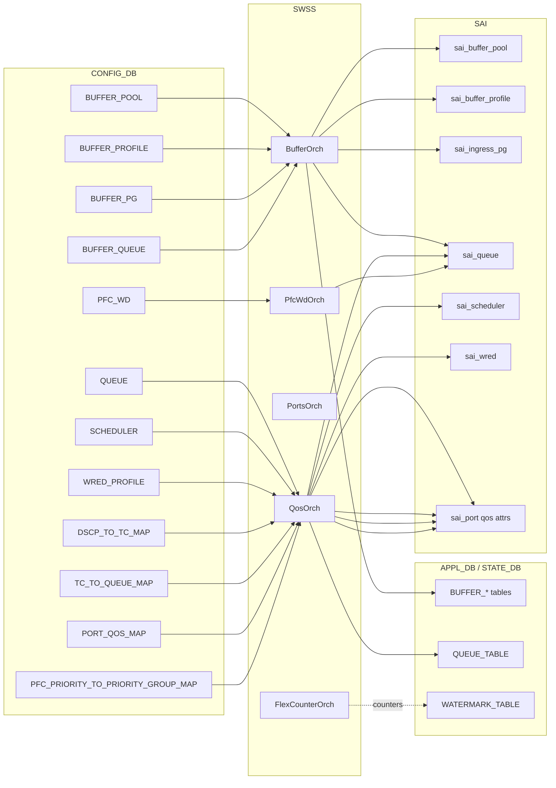

# QoS / Buffer のアーキテクチャ

ConfigDB の [QoS](../../reference/glossary.md#term-qos) / buffer テーブルが、最終的に [SAI](../../reference/glossary.md#term-sai) のどのオブジェクトに対応するか、そしてどの daemon が橋渡しをしているかをまとめます。

## ConfigDB から SAI までのデータフロー

ポイントは「ConfigDB の同じ階層構造（pool → profile → PG/queue）がそのまま SAI に届く」ことと、「PFCWD だけは別 orch」「watermark は SAI の値を [FlexCounter](../../reference/glossary.md#term-flexcounter) が [STATE_DB](../../reference/glossary.md#term-state_db) に書く」ことです。

## 各 daemon / orch の責務

- **BufferOrch** — `BUFFER_POOL` / `BUFFER_PROFILE` / `BUFFER_PG` / `BUFFER_QUEUE` を SAI buffer pool / profile / PG / queue オブジェクトへ変換します。動的バッファモードのときは buffer manager から流れてくる「再計算後の profile」を扱います。<!-- evidence: sonic-swss orchagent/bufferorch.cpp L73-L76 が APP_BUFFER_{POOL,PROFILE,QUEUE,PG}_TABLE_NAME を processBufferPool / processBufferProfile / processQueue / processPriorityGroup にディスパッチし、L527 / L572 で sai_buffer_api->create_buffer_pool / remove_buffer_pool を呼ぶ -->
- **QosOrch** — `QUEUE` / `SCHEDULER` / `WRED_PROFILE` / `*_TO_*_MAP` 系を SAI の scheduler / [WRED](../../reference/glossary.md#term-wred) / map オブジェクト、および port qos 属性に落とします。背景は [SONiC QoS scheduler and shaping](../../acl-qos/sonic-qos-scheduler-and-shaping.md) を参照。<!-- evidence: sonic-swss orchagent/qosorch.cpp L21-L24 で sai_scheduler_api / sai_wred_api / sai_scheduler_group_api を extern 宣言、L60-L69 の qos_to_attr_map が dscp_to_tc / tc_to_queue / pfc_to_pg_map / pfc_to_queue_map を SAI_PORT_ATTR_QOS_* に対応付ける -->
- **PortsOrch** — ポート単位の [PFC](../../reference/glossary.md#term-pfc) enable mask、`PORT_QOS_MAP` の参照、PG/queue 数の取得など、ポート寄りの設定を扱います。
- **PfcWdOrch** — `PFC_WD` テーブルを読み、queue ごとに storm 監視を仕掛けます。検出時には SAI 経由で queue を一時停止し、回復したら戻します。詳細は [`PFC_WD`](../../reference/config-db/pfc-wd.md) と上位の monitor 機構の説明を参照。<!-- evidence: sonic-swss orchagent/pfcwdorch.cpp L73 が CFG_PFC_WD_TABLE_NAME consumer を分岐、L528 registerInWdDb が queue ごとの監視を仕掛け、L385/L395 disableBigRedSwitchMode が回復処理を持つ -->
- **FlexCounterOrch** — queue / PG / buffer pool 単位で SAI から counter / watermark を fetch し、STATE_DB / [COUNTERS_DB](../../reference/glossary.md#term-counters_db) に書きます。<!-- evidence: sonic-swss orchagent/flexcounterorch.cpp L46/L52/L53 が BUFFER_POOL_WATERMARK / QUEUE_WATERMARK / PG_WATERMARK キーを宣言、L78-L81 で対応する FLEX_COUNTER_GROUP にマップ、L287 で BufferOrch と連携して watermark の enable を制御 -->watermark の意味は [watermark counters in SONiC](../../acl-qos/watermark-counters-in-sonic.md)、port buffer drop counter は [port buffer drop counters](../../acl-qos/port-buffer-drop-counters-in-sonic.md) を参照。

## buffer manager と動的バッファモード

`BUFFER_POOL:mode` が `dynamic` のとき、[SONiC](../../reference/glossary.md#term-sonic) は buffermgrd / buffer template によって、port speed / cable length / MTU から `BUFFER_PROFILE` を実行時に再計算します。`config interface speed` で speed を変えれば profile が差し替わる、というのがこのモードの肝です。

- ヘッドルームの計算式と再計算の境界条件は [dynamic headroom calculation](../../acl-qos/dynamically-headroom-calculation.md) にあります。
- 未使用 PG / queue 用の reserved buffer を pool に返す仕組みが [reclaim reserved buffer](../../acl-qos/reclaim-reserved-buffer.md) と [reclaim reserved buffer sequence flow](../../acl-qos/reclaim-reserved-buffer-sequence-flow.md) です。
- 実行時にポートを足したり消したりするときの buffer 再計算は [enhancements to add or del ports dynamically](../../acl-qos/enhancements-to-add-or-del-ports-dynamically.md) にあります。

これらの「動的計算」が走るのは BufferOrch ではなく buffermgrd 側で、結果が [CONFIG_DB](../../reference/glossary.md#term-config_db) / [APPL_DB](../../reference/glossary.md#term-appl_db) を経由して BufferOrch に届くという二段構えになっています。

## watermark と historical PFC

Watermark は SAI から「直近の peak」を読み取る属性で、ConfigDB から telemetry 間隔（`FLEX_COUNTER_TABLE`）を変えられます。historical PFC は別の保存パスで、`COUNTERS_DB` の長期テーブルに記録されます。詳細は [PFC historical statistics](../../acl-qos/pfc-historical-statistics.md) を参照。

Watermark の対象を「設定上有効なオブジェクトだけ」に揃える変更が [align watermark flow with port configuration](../../acl-qos/align-watermark-flow-with-port-configuration-hld.md) で、port が remove されたあと幽霊 watermark が残らないようにする仕組みです（テストは [test plan](../../acl-qos/test-plan-for-align-watermark-flow-with-port-configuration.md)）。

<!-- glossary-links-injected: 8ba32e5aa69d -->
