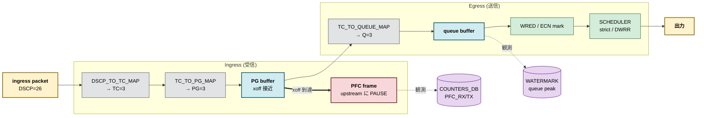

# QoS / Buffer の概念地図

[QoS](../../reference/glossary.md#term-qos) の話は語彙が多くて、どこから読めばよいかが見えづらいです。ここでは「パケットが入ってから出るまで、どこで何が決まるか」を一本道で並べ、それぞれの設定テーブルがどの段階に作用するかを示します。

## QoS / Buffer 機能は何を解決するか

ネットワーク機器の「公平性」と「優先度」は、[ASIC](../../reference/glossary.md#term-asic) のバッファとキューが有限であるという物理的な事実から逃れられません。100Gbps のリンクが 4 本同じ出口に向けて 100Gbps を送り出そうとした瞬間、3 本ぶんの 300Gbps はバッファに積むしかなく、バッファが尽きればドロップします。QoS / Buffer サブシステムが解決しているのは、この限られたバッファとキューを「どのトラフィックを優遇するか」「どこで止めるか」「どこで捨てるか」というポリシで埋め、運用が意図した挙動に揃えることです。

具体的には次の問いに答えます。

- [RoCE](../../reference/glossary.md#term-roce) のような lossless が必要なトラフィックが詰まったとき、上流に PAUSE を送って物理的に止めたい
- 動画やストリーミング telemetry のように遅延に敏感なトラフィックを strict priority で先に出したい
- best effort トラフィックは公平に分け合いつつ、急に増えたフローだけ早めに [ECN](../../reference/glossary.md#term-ecn) マークして TCP に減速を促したい
- バッファのピーク占有を可視化し、設計時の見積もりと実運用のギャップに早期に気付きたい

これらが全て同じ ASIC リソースを取り合っているので、設定テーブルが多層に分かれているわけです。

## SONiC 内での位置

QoS / Buffer は **データプレーンに最も深く張り付くサブシステム**で、控えめに見ても以下の 3 層にまたがります。

- **設定 (control plane 寄り)**: `CONFIG_DB` の `BUFFER_*`、`QUEUE`、`SCHEDULER`、`WRED_PROFILE`、各種 MAP テーブルを `qosorch` / `bufferorch` が読み、[APPL_DB](../../reference/glossary.md#term-appl_db) → [ASIC_DB](../../reference/glossary.md#term-asic_db) と流して [syncd](../../reference/glossary.md#term-syncd) 経由で [SAI](../../reference/glossary.md#term-sai) コール（`create_buffer_pool`、`create_queue`、`create_scheduler` など）に変換します。
- **データプレーン**: ASIC 内のキュー、PG、バッファプール、[WRED](../../reference/glossary.md#term-wred) ドロッパ、scheduler 木が実体です。[SONiC](../../reference/glossary.md#term-sonic) は SAI 越しに「設定」を流し込むだけで、パケットごとの判定は ASIC 側で完結します。
- **可観測性**: [FlexCounter](../../reference/glossary.md#term-flexcounter) が queue / PG / pool の使用量と WRED / ECN カウンタを定期的に [COUNTERS_DB](../../reference/glossary.md#term-counters_db) に落とし、watermark は別 group として「観測区間ピーク」を保持します。`show queue counters` / `show priority-group watermark` などの CLI は COUNTERS_DB / [STATE_DB](../../reference/glossary.md#term-state_db) を読むだけです。

つまり運用者が触れる [Redis](../../reference/glossary.md#term-redis) テーブルと、実際にパケットが通る ASIC 構造体が 1:1 に近い距離で対応している、それが QoS / Buffer 章を読むときの前提です。

## 用語の定義

混同しやすい用語をここで一度切り分けておきます。

- **[TC (Traffic Class)](../../reference/glossary.md#term-tc)**: SONiC 内部で使うクラス番号 (0〜7)。受信側で [DSCP](../../reference/glossary.md#term-dscp) / DOT1P / EXP から 1 つに決め打ちし、以後の経路選択（PG、queue、scheduler、WRED）は TC を経由します。
- **[PG (Priority Group)](../../reference/glossary.md#term-pg)**: ingress 側のバッファ計上単位。`xon`/`xoff` を持って [PFC](../../reference/glossary.md#term-pfc) のトリガを担います。lossless TC は通常 PG3 / PG4 に固定します。
- **Queue**: egress 側のバッファ計上 + 出力順制御単位。WRED ドロッパと scheduler はここに紐付きます。典型的には UC 用 8 個 + MC 用 8 個。
- **[Buffer Pool](../../reference/glossary.md#term-buffer-pool)**: ingress / egress 別に存在する共有バッファのプール。`size`、`mode` (static / dynamic)、`type` (lossless / lossy) を持ちます。
- **[Buffer Profile](../../reference/glossary.md#term-buffer-profile)**: 「ある PG / queue がこの pool からどれくらい取って、どう alpha (`dynamic_th`) で配分し、`xon`/`xoff` の閾値はいくつにするか」をまとめた 1 セット。同じ profile を複数の PG / queue で共有します。
- **WRED / ECN**: 平均キュー長がある閾値を超えたら、確率的に drop または ECN mark する仕組み。WRED テーブルは色（green / yellow / red）ごとに別閾値を持てます。
- **PFC (Priority-Based Flow Control)**: 802.1Qbb。PG 単位で「止めて」をリンク相手の MAC 層に送り、特定 priority のフレームだけ流量を絞る仕組み。
- **PFCWD**: PFC を受けたまま回復しない queue / port を強制的に drop モードに落として、PFC storm を波及させない監視 daemon。
- **Watermark**: queue / PG / pool の使用バッファ量の「観測区間内ピーク」。SAI カウンタを SONiC が定期 snapshot します。

## 典型シーン: RoCE クラスタでバッファが溢れかける夕方

GPU クラスタの allreduce が走り始めて、ToR 1 台の特定 uplink で TC3 (lossless) のキュー深さが急上昇する場面を想像してください。設定が揃っているとき、SONiC とハードウェアの間ではこう動きます。

このとき運用者が見るのは大体次の 3 つです。

- `show priority-group watermark` で PG のピーク占有を確認し、xoff にどれだけ近付いたか
- `show queue counters` で TC3 queue の `WRED_DROPPED` / `ECN_MARKED` の伸び
- `show pfc counters` で実際に PFC を送信した方向と件数

これらが揃わなければ、CLI、設定、ASIC のどこで止まっているかを切り分ける順序が立ちません。

## パケットが通る順番

1. **受信ポートで TC を決める**: `DSCP_TO_TC_MAP`（IP の場合）または `DOT1P_TO_TC_MAP`（L2 の場合）が、ポートで適用される `PORT_QOS_MAP` 経由で参照されます。[MPLS](../../reference/glossary.md#term-mpls) のラベル EXP を扱うときは [MPLS TC-to-TC マップ](../../routing/mpls-tc-to-tc-map.md) が追加で挟まります。
2. **TC を ingress PG に対応付ける**: `TC_TO_PG_MAP` が ingress priority group (PG) を決めます。ingress 側のバッファ計上は PG 単位で行われます。
3. **入力バッファに積む**: `BUFFER_PG` テーブルで PG ごとに `BUFFER_PROFILE` が割り当てられ、その profile が `BUFFER_POOL` を指します。lossless トラフィック（典型的には RoCE 用の TC3/TC4）はここで PFC 用 headroom (`xon`/`xoff`) を持ちます。
4. **出力 queue を決める**: `TC_TO_QUEUE_MAP` が egress queue を選びます。
5. **出力バッファに積む**: `BUFFER_QUEUE` が queue 単位で `BUFFER_PROFILE` を割り当てます。`QUEUE` テーブルでは queue ごとの WRED と scheduler を紐付けます。
6. **混んできたら捨てるか mark する**: `WRED_PROFILE` で WRED / ECN 閾値を決めます。詳細は [WRED and ECN statistics](../../acl-qos/wred-and-ecn-statistics.md) を参照。
7. **取り出す順番を決める**: `SCHEDULER` が strict priority / [DWRR](../../reference/glossary.md#term-dwrr) / shaping を設定します。`sonic-qos-scheduler-and-shaping` [HLD](../../reference/glossary.md#term-hld) が背景です。詳細は [SONiC QoS scheduler / shaping](../../acl-qos/sonic-qos-scheduler-and-shaping.md)。

このうち「入力側で止める仕組み」が PFC、「出力側で捨てる/mark する仕組み」が WRED / ECN、「使ったバッファのピークを覚える仕組み」が watermark です。

## バッファに登場する 4 つのテーブル

| テーブル | スコープ | 役割 |
|---------|---------|------|
| [`BUFFER_POOL`](../../reference/config-db/buffer-pool.md) | switch-wide | ingress / egress のプール総量とモード（static/dynamic） |
| [`BUFFER_PROFILE`](../../reference/config-db/buffer-profile.md) | 共有 | 各 PG / queue が使う `size` / `xon` / `xoff` / `dynamic_th` の塊 |
| [`BUFFER_PG`](../../reference/config-db/buffer-pg.md) | port × PG | 入力側の PG にプロファイルを紐付ける |
| [`BUFFER_QUEUE`](../../reference/config-db/buffer-queue.md) | port × queue | 出力側 queue にプロファイルを紐付ける |

`xon`/`xoff` を持つ profile が ingress PG に当たって初めて「lossless」と呼べる経路になります。lossless と lossy は別 TC として `DSCP_TO_TC_MAP` で振り分けるのが原則です。

## QoS と PFC の境界

PFC（Priority-Based Flow Control）は、ingress PG のバッファ占有が `xoff` を超えた瞬間に「この PG に対応する priority だけ止めて」とリンク相手に通知する仕組みです。

- どの priority に対して PFC を有効にするかは `PORT_QOS_MAP:pfc_enable`、それを PG にどう写すかは [`PFC_PRIORITY_TO_PRIORITY_GROUP_MAP`](../../reference/config-db/pfc-priority-to-priority-group-map.md) が決めます。
- 受信した側の lossless 動作は asymmetric にもできます。詳細は [asymmetric PFC test plan](../../acl-qos/asymmetric-pfc-test-plan.md)。
- PFC 暴走時にキューを強制停止して回復させるのが PFCWD で、これは別 daemon（pfcwd）として動きます。

## Watermark とは何を見ているのか

Watermark は「対象オブジェクトの使用バッファ量が、観測区間中に到達したピーク」を 1 値だけ保持する SAI カウンタです。SONiC では `WATERMARK_TABLE` の telemetry interval ごとに collect され、`show queue watermark` / `show priority-group watermark` で見えます。

- 観測対象は queue、PG（shared / headroom 別）、buffer pool（shared / headroom）。
- 観測の単位を「実際に設定で有効なポート / queue / PG だけ」に揃えるのが [align-watermark-flow-with-port-configuration HLD](../../acl-qos/align-watermark-flow-with-port-configuration-hld.md) です。
- 履歴を残すのは別仕組みで、PFC は [PFC historical statistics](../../acl-qos/pfc-historical-statistics.md) として保存できます。

詳細な意味付けは [watermark counters in SONiC](../../acl-qos/watermark-counters-in-sonic.md) を読むのが早いです。

## この章で混同しがちな概念

- **WRED と PFC は両立する**: WRED は egress、PFC は ingress。lossless TC に対しても、最終的な egress drop 抑制のために WRED / ECN を併用するのが普通です。
- **scheduler と shaping は同じテーブル**: `SCHEDULER` の `type` が `DWRR`/`STRICT`、`meter_type` + `pir` が shaping。
- **PG と queue は別物**: PG は ingress、queue は egress。`show priority-group ...` と `show queue ...` を取り違えないようにします。
- **buffer profile の数は SAI 依存**: ASIC によって最大本数が違うので、似た profile を分けすぎると SAI 側の hardware resource が先に枯渇します。

## 似た機能との違い

QoS / Buffer は他のサブシステムと領域が重なって見えがちですが、それぞれ役割が違います。

| 比較対象 | 共通点 | 違い |
|---|---|---|
| [ACL](../../reference/glossary.md#term-acl) | 「特定のトラフィックを選別する」点 | ACL は match → action（permit / deny / redirect / counter / mirror）。QoS の入口で TC を決めるのも実は ACL ベースで可能だが、通常は DSCP / DOT1P map を使う。 |
| Storm Control | 「ある種類のトラフィックを抑える」点 | Storm Control は BUM (broadcast/unknown unicast/multicast) フレームの rate を粗く制限する仕組み。queue 単位の輻輳制御ではない。 |
| [Policer](../../reference/glossary.md#term-policer) (ingress rate-limit) | 「速度を制限する」点 | Policer は ingress でトークンバケットによる drop / mark。QoS の shaper は egress queue ごとの送出速度上限で、バッファに溜める点が違う。 |
| [CoPP](../../reference/glossary.md#term-copp) | 「CPU 向けトラフィックを優先する」点 | CoPP は trap した制御パケット（[BGP](../../reference/glossary.md#term-bgp)/[LACP](../../reference/glossary.md#term-lacp)/[ARP](../../reference/glossary.md#term-arp) など）を CPU queue ごとに rate-limit する別系統。一般 forwarding 用の QoS とは queue が別。 |
| Telemetry ([gNMI](../../reference/glossary.md#term-gnmi) / DTel) | 「混雑状況を可視化する」点 | gNMI は COUNTERS_DB を読むだけ、DTel は ASIC が直接 [INT](../../reference/glossary.md#term-int) を export。QoS 自体の輻輳判断には関与しない。 |

特に **CoPP は QoS と同じ「優先制御」だが対象が CPU bound trap のみ** という分離を覚えておくと、`show queue counters CPU` が指している場所が一気に腹落ちします。

## 読了後にできること

ここまで読めば、次の判断が自分でつけられるはずです。

- 「DSCP 26 のパケットが Q3 に乗らない」という症状を、`DSCP_TO_TC_MAP` → `TC_TO_QUEUE_MAP` → `PORT_QOS_MAP` のどこで切れているか順序立てて切り分けられる
- lossless で動かしたい TC を新規追加する際、`BUFFER_PROFILE` を新規にするか既存共有にするかを「ASIC 側 profile 数の制約」と「`xon`/`xoff` を変えたいか」で判断できる
- PFC が立たない / 暴走するときに、`PFC_PRIORITY_TO_PRIORITY_GROUP_MAP` と `PORT_QOS_MAP:pfc_enable` の両方を確認すべきと分かる
- `show priority-group watermark` の数値が「観測区間中のピーク」であって瞬時値ではないことを踏まえ、`COUNTERS_DB:WATERMARK*` の polling interval と組で読める
- WRED / ECN の green / yellow / red 閾値設計が、`SCHEDULER` の strict / DWRR と一緒に設計されないと意味が薄いことが分かる

このあと細部を追うなら、テーブル定義は [BUFFER_PROFILE 仕様](../../reference/config-db/buffer-profile.md) と [QUEUE 仕様](../../reference/config-db/queue.md)、運用は [setup.md](setup.md) と [operations.md](operations.md) に進みます。

<!-- xref-prereq -->
## この章の前提知識

この章を読み進める前に、次の章を押さえておくと迷子になりにくい。

- [SONiC 全体像と設定基盤](../01-overview/index.md)
- [Platform / Port / Optics / PHY](../14-platform-port-optics/index.md)
- [SWSS / SAI / Redis 内部実装](../20-swss-sai-redis/index.md)

<!-- glossary-links-injected: d17c6a828148 -->
