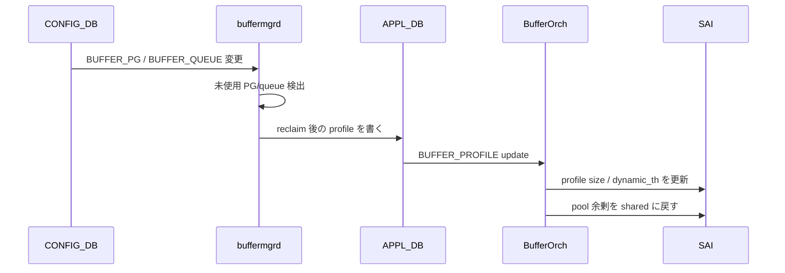
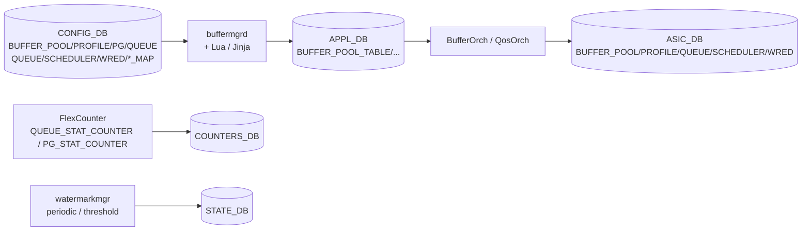

# QoS / Buffer の内部実装

ここでは「設定が変わるたびに buffer がどう再計算されるか」「ポートを足したり消したりしたとき何が起きるか」「使われていない reserved 領域はどう返却されるか」といった、動的バッファモード固有の話を扱います。

## 動的ヘッドルーム計算

[Dynamically headroom calculation](../../acl-qos/dynamically-headroom-calculation.md) は、port speed / cable length / MTU / PG mode から [PFC](../../reference/glossary.md#term-pfc) headroom（`xon` / `xoff` / `xon_offset` / `size`）を実行時に決める仕組みです。

- 入力は `PORT_TABLE` の `speed` / `mtu`、`CABLE_LENGTH` テーブル、`DEFAULT_LOSSLESS_BUFFER_PARAMETER`。
- 計算は buffermgrd 内の Lua スクリプト + Jinja テンプレートで、結果は [CONFIG_DB](../../reference/glossary.md#term-config_db) / [APPL_DB](../../reference/glossary.md#term-appl_db) の `BUFFER_PROFILE` に書き戻されます。
- 同じ条件（speed, cable, MTU）の PG は同じ profile を共有するので、profile の数は爆発しません。
- speed を変えるだけで profile が差し替わる、これが動的モードのキモです。

## Reclaim reserved buffer

[Reclaim reserved buffer](../../acl-qos/reclaim-reserved-buffer.md) は「設定上は queue / PG を持っているが、実際には使っていない」領域を pool 側に返す仕組みです。

シーケンスの詳細は [sequence flow](../../acl-qos/reclaim-reserved-buffer-sequence-flow.md) にありますが、ざっくりした流れは次のとおりです。



reclaim は port の admin down や split port の枝の片側など、「物理的に存在するが運用上は使わない」オブジェクトに対して効きます。

## 動的なポート追加・削除

[Enhancements to add or del ports dynamically](../../acl-qos/enhancements-to-add-or-del-ports-dynamically.md) は、`config interface breakout` などで port が増減したときに、関連する PG / queue / buffer profile の参照を整合させ、reclaim と再割当を行う改善です。

- 削除順序: PG/queue 参照を外す → profile 参照を外す → port を消す。
- 追加順序: port を作る → profile を当てる → PG/queue を生成する → speed / cable から headroom 再計算。
- この順序を間違えると [SAI](../../reference/glossary.md#term-sai) 側で「参照中の profile を消そうとして失敗」「存在しない queue を参照」が起きます。
- watermark 側でも、削除直後に幽霊 queue が残るのを防ぐため [align watermark flow with port configuration](../../acl-qos/align-watermark-flow-with-port-configuration-hld.md) が同期を取っています。

## Buffer drop counter の系列

[Port buffer drop counters in SONiC](../../acl-qos/port-buffer-drop-counters-in-sonic.md) は、SAI の port-level buffer drop 統計を [SONiC](../../reference/glossary.md#term-sonic) でどう公開するかを定義しています。具体的には次のような系列が `COUNTERS_DB:PORT_STAT` 配下に並びます。

- `SAI_PORT_STAT_IN_DROPPED_PKTS` — ingress buffer 起因の総 drop。
- `SAI_PORT_STAT_PFC_*_RX_PKTS` / `..._TX_PKTS` — PFC frame カウント。
- queue / PG 側のドロップは `SAI_QUEUE_STAT_DROPPED_PKTS` / `SAI_INGRESS_PRIORITY_GROUP_STAT_DROPPED_PACKETS` が一次情報。

これらを [FlexCounter](../../reference/glossary.md#term-flexcounter) が拾って [STATE_DB](../../reference/glossary.md#term-state_db) / [COUNTERS_DB](../../reference/glossary.md#term-counters_db) に書き、`show queue counters` / `show priority-group counters` / `show interfaces counters` が表示しています。

## なぜこの章だけテーブルが多いのか

[QoS](../../reference/glossary.md#term-qos) / buffer は「同じ概念をプラットフォーム差を吸収しつつ均す」ために抽象化を 3 層持っています。

1. **pool** — switch-wide のメモリ枠（プラットフォーム依存度高）。
2. **profile** — 使い方のテンプレート（lossless / lossy / mirror など）。
3. **PG / queue 割当** — ポート×index への適用。

そして「ConfigDB の SCHEDULER / [WRED](../../reference/glossary.md#term-wred) / MAP は SAI のオブジェクトに 1:1」「BUFFER_PROFILE は SAI に 1:1 だが、同じ意味のものは共有」「[BUFFER_PG](../../reference/glossary.md#term-buffer-pg) / BUFFER_QUEUE は SAI の port × index の attribute 更新になる」と、それぞれ SAI 側での扱いが違うのが厄介な点です。設定変更時に「参照を外す → 値を変える → 参照を戻す」の順序を守る必要があるのはこのためです。

## データフロー（QoS / Buffer 全体）



## 主要 Orch / daemon の責務

| コンポーネント | 主実体 | 責務 |
| --- | --- | --- |
| `buffermgrd` (`cfgmgr/buffermgr*.cpp`) | `BufferMgrDynamic` / `BufferMgr` | 動的 / 静的モードの分岐、headroom 計算（Lua）、reclaim |
| `BufferOrch` (`orchagent/bufferorch.cpp`) | `BufferOrch::doTask`、`processBufferPool` 等 | APPL_DB → SAI buffer pool / profile / PG / queue |
| `QosOrch` (`orchagent/qosorch.cpp`) | `QosMapHandler`、`TcToQueueMapHandler` 等 | QoS の各種 map、scheduler、WRED |
| `PfcWdSwOrch` (`orchagent/pfcwdorch.cpp`) | `PfcWdOrch::doTask` | PFC watchdog の queue ストーム検知 |
| `flexcounter` | `syncd/FlexCounter*` | queue / PG / pool の counter polling |
| `watermarkmgr` (`watermarkmgr/`) | bucket / table 制御 | watermark の telemetry |

## SAI 属性使用一覧

| object | 主要属性 |
| --- | --- |
| `SAI_OBJECT_TYPE_BUFFER_POOL` | `SAI_BUFFER_POOL_ATTR_TYPE = INGRESS/EGRESS`、`SAI_BUFFER_POOL_ATTR_SIZE`、`SAI_BUFFER_POOL_ATTR_THRESHOLD_MODE = DYNAMIC/STATIC` |
| `SAI_OBJECT_TYPE_BUFFER_PROFILE` | `SAI_BUFFER_PROFILE_ATTR_POOL_ID`、`SAI_BUFFER_PROFILE_ATTR_RESERVED_BUFFER_SIZE`、`SAI_BUFFER_PROFILE_ATTR_THRESHOLD_MODE`、`SAI_BUFFER_PROFILE_ATTR_XON_TH`、`XOFF_TH`、`XON_OFFSET_TH` |
| `SAI_OBJECT_TYPE_INGRESS_PRIORITY_GROUP` | `SAI_INGRESS_PRIORITY_GROUP_ATTR_BUFFER_PROFILE`、`SAI_INGRESS_PRIORITY_GROUP_ATTR_PORT` |
| `SAI_OBJECT_TYPE_QUEUE` | `SAI_QUEUE_ATTR_BUFFER_PROFILE_ID`、`SAI_QUEUE_ATTR_SCHEDULER_PROFILE_ID`、`SAI_QUEUE_ATTR_WRED_PROFILE_ID`、`SAI_QUEUE_ATTR_TYPE` |
| `SAI_OBJECT_TYPE_SCHEDULER` | `SAI_SCHEDULER_ATTR_SCHEDULING_TYPE = STRICT/WRR/DWRR`、`SAI_SCHEDULER_ATTR_MAX_BANDWIDTH_RATE` |
| `SAI_OBJECT_TYPE_WRED` | `SAI_WRED_ATTR_GREEN_*_THRESHOLD`、`SAI_WRED_ATTR_ECN_MARK_MODE` |
| `SAI_OBJECT_TYPE_QOS_MAP` | `SAI_QOS_MAP_ATTR_TYPE = DSCP_TO_TC / TC_TO_QUEUE / TC_TO_PG / PFC_PRIORITY_TO_QUEUE / ...` |

## Redis テーブル参照関係

```yaml
CONFIG_DB:
  BUFFER_POOL, BUFFER_PROFILE, BUFFER_PG, BUFFER_QUEUE,
  CABLE_LENGTH, DEFAULT_LOSSLESS_BUFFER_PARAMETER,
  QUEUE, SCHEDULER, WRED_PROFILE,
  DSCP_TO_TC_MAP, TC_TO_QUEUE_MAP, TC_TO_PRIORITY_GROUP_MAP,
  PFC_PRIORITY_TO_QUEUE_MAP, PFC_PRIORITY_TO_PRIORITY_GROUP_MAP,
  PFC_WD
APPL_DB:
  BUFFER_POOL_TABLE, BUFFER_PROFILE_TABLE, BUFFER_PG_TABLE, BUFFER_QUEUE_TABLE,
  QUEUE_TABLE, SCHEDULER_TABLE, WRED_PROFILE_TABLE, *_MAP_TABLE
STATE_DB:
  BUFFER_POOL_WATERMARK, BUFFER_PG_WATERMARK, BUFFER_QUEUE_WATERMARK,
  PFC_WD_TABLE
COUNTERS_DB:
  COUNTERS_QUEUE_NAME_MAP, COUNTERS_PG_NAME_MAP, COUNTERS:<oid>
ASIC_DB:
  BUFFER_POOL, BUFFER_PROFILE, INGRESS_PRIORITY_GROUP, QUEUE,
  SCHEDULER, WRED, QOS_MAP
```

## ZMQ / Redis pub/sub

- ZMQ は使わない。すべて [Redis](../../reference/glossary.md#term-redis) pub/sub と `flexcounter` の polling 経路。
- PFC watchdog の検出は [ASIC](../../reference/glossary.md#term-asic) からの notification ではなく、`flexcounter` 経由の queue stat polling で stuck queue を検知する仕組み。

## 既知の実装上の制約

- 動的 buffer の計算は `cable_length` の入力が **正確である前提**で、minigraph や CONFIG_DB に古い値が残ると lossless headroom が不足し PFC が誤動作する。
- `BUFFER_PROFILE` の共有は同一の dimensions（speed / cable / mtu）でのみ。CLI から無理に異なる name を作っても SAI 側 reuse は効かない。
- reclaim は port admin-down → admin-up の cycle で**毎回 profile 再計算が走る**ため、port flap が多い環境で buffermgrd の CPU を消費する。
- PFC watchdog は queue 単位の statistical detection で、瞬間的な burst にも反応する設計。`detection_time` / `restoration_time` のチューニングが必要。
- WRED / ECN の閾値は ASIC で粒度（cell vs byte）が違い、`SAI_WRED_ATTR_*` の単位解釈が SDK ベンダごとに分かれる。

<!-- glossary-links-injected: ec18b66e3507 -->
