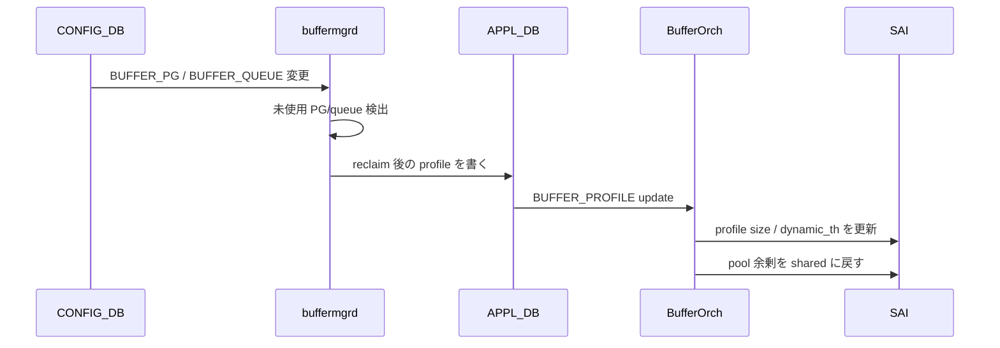

# QoS / Buffer の内部実装

ここでは「設定が変わるたびに buffer がどう再計算されるか」「ポートを足したり消したりしたとき何が起きるか」「使われていない reserved 領域はどう返却されるか」といった、動的バッファモード固有の話を扱います。

## 動的ヘッドルーム計算

[Dynamically headroom calculation](../../acl-qos/dynamically-headroom-calculation.md) は、port speed / cable length / MTU / PG mode から PFC headroom（`xon` / `xoff` / `xon_offset` / `size`）を実行時に決める仕組みです。

- 入力は `PORT_TABLE` の `speed` / `mtu`、`CABLE_LENGTH` テーブル、`DEFAULT_LOSSLESS_BUFFER_PARAMETER`。
- 計算は buffermgrd 内の Lua スクリプト + Jinja テンプレートで、結果は CONFIG_DB / APPL_DB の `BUFFER_PROFILE` に書き戻されます。
- 同じ条件（speed, cable, MTU）の PG は同じ profile を共有するので、profile の数は爆発しません。
- speed を変えるだけで profile が差し替わる、これが動的モードのキモです。

## Reclaim reserved buffer

[Reclaim reserved buffer](../../acl-qos/reclaim-reserved-buffer.md) は「設定上は queue / PG を持っているが、実際には使っていない」領域を pool 側に返す仕組みです。

シーケンスの詳細は [sequence flow](../../acl-qos/reclaim-reserved-buffer-sequence-flow.md) にありますが、ざっくりした流れは次のとおりです。

reclaim は port の admin down や split port の枝の片側など、「物理的に存在するが運用上は使わない」オブジェクトに対して効きます。

## 動的なポート追加・削除

[Enhancements to add or del ports dynamically](../../acl-qos/enhancements-to-add-or-del-ports-dynamically.md) は、`config interface breakout` などで port が増減したときに、関連する PG / queue / buffer profile の参照を整合させ、reclaim と再割当を行う改善です。

- 削除順序: PG/queue 参照を外す → profile 参照を外す → port を消す。
- 追加順序: port を作る → profile を当てる → PG/queue を生成する → speed / cable から headroom 再計算。
- この順序を間違えると SAI 側で「参照中の profile を消そうとして失敗」「存在しない queue を参照」が起きます。
- watermark 側でも、削除直後に幽霊 queue が残るのを防ぐため [align watermark flow with port configuration](../../acl-qos/align-watermark-flow-with-port-configuration-hld.md) が同期を取っています。

## Buffer drop counter の系列

[Port buffer drop counters in SONiC](../../acl-qos/port-buffer-drop-counters-in-sonic.md) は、SAI の port-level buffer drop 統計を SONiC でどう公開するかを定義しています。具体的には次のような系列が `COUNTERS_DB:PORT_STAT` 配下に並びます。

- `SAI_PORT_STAT_IN_DROPPED_PKTS` — ingress buffer 起因の総 drop。
- `SAI_PORT_STAT_PFC_*_RX_PKTS` / `..._TX_PKTS` — PFC frame カウント。
- queue / PG 側のドロップは `SAI_QUEUE_STAT_DROPPED_PKTS` / `SAI_INGRESS_PRIORITY_GROUP_STAT_DROPPED_PACKETS` が一次情報。

これらを FlexCounter が拾って STATE_DB / COUNTERS_DB に書き、`show queue counters` / `show priority-group counters` / `show interfaces counters` が表示しています。

## なぜこの章だけテーブルが多いのか

QoS / buffer は「同じ概念をプラットフォーム差を吸収しつつ均す」ために抽象化を 3 層持っています。

1. **pool** — switch-wide のメモリ枠（プラットフォーム依存度高）。
2. **profile** — 使い方のテンプレート（lossless / lossy / mirror など）。
3. **PG / queue 割当** — ポート×index への適用。

そして「ConfigDB の SCHEDULER / WRED / MAP は SAI のオブジェクトに 1:1」「BUFFER_PROFILE は SAI に 1:1 だが、同じ意味のものは共有」「BUFFER_PG / BUFFER_QUEUE は SAI の port × index の attribute 更新になる」と、それぞれ SAI 側での扱いが違うのが厄介な点です。設定変更時に「参照を外す → 値を変える → 参照を戻す」の順序を守る必要があるのはこのためです。
