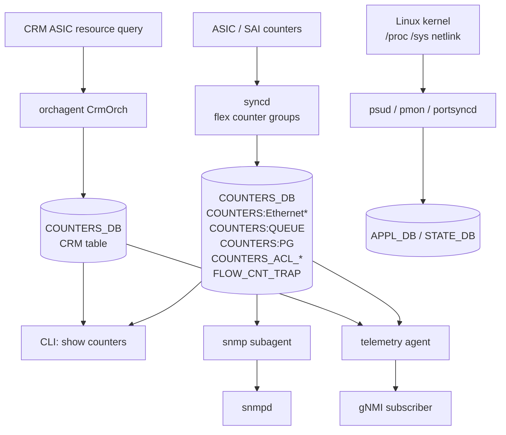
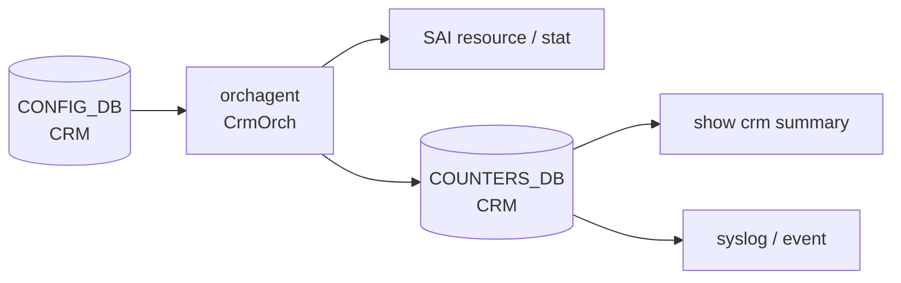

# アーキテクチャ

観測経路は [ASIC](../../reference/glossary.md#term-asic) 側で値を作り、[syncd](../../reference/glossary.md#term-syncd) / [orchagent](../../reference/glossary.md#term-orchagent) / 各 daemon が [Redis](../../reference/glossary.md#term-redis) に書き、上から [SNMP](../../reference/glossary.md#term-snmp) / [gNMI](../../reference/glossary.md#term-gnmi) / CLI が読む、という上下構造です。この構造を 1 つの図でつなげると、どこを変えると何が止まるかが分かりやすくなります。

## Counter 収集の全体像

ASIC counter は syncd 側の flex counter group がまとめて polling し、[COUNTERS_DB](../../reference/glossary.md#term-counters_db) の `COUNTERS:` 名前空間に書きます。group ごとに有効化と polling interval を `FLEX_COUNTER_TABLE` で制御します。[CRM](../../reference/glossary.md#term-crm) は orchagent 内の `CrmOrch` が ASIC resource を読み、[COUNTERS_DB](../../reference/glossary.md#term-counters_db) の CRM 名前空間に書きます。Linux side の sensor / process / memory 統計は別 daemon が [APPL_DB](../../reference/glossary.md#term-appl_db) / STATE_DB に書き、上位は同じ telemetry / SNMP / CLI から見えます。

## FlexCounter Refactor の意味

[FlexCounter](../../reference/glossary.md#term-flexcounter) refactor 以前は orchagent が固定周期で counter を読み、main loop の遅延要因になりました。Refactor 後は syncd の flex counter infra に責務が移り、group 単位で対象 OID と interval を制御します。`COUNTERS_PORT_NAME_MAP` / `COUNTERS_QUEUE_NAME_MAP` のような map が、論理名（`Ethernet0` など）から [SAI](../../reference/glossary.md#term-sai) OID への変換を提供します。

Counter initialization optimization は、起動直後に全 port / queue / PG に対して flex counter を 1 件ずつ install すると遅いという問題に対し、bulk API で一括登録する変更です。読み手にとっては、起動直後の counter 出現タイミングが早まる点と、`counterpoll` 状態が `disable` のときは MAP は作られても polling されない点を覚えておけば十分です。

## CRM のレイヤ

CRM は 2 つの世代があります。古い CRM は ASIC sdk の固有 API で resource 使用量を取り、COUNTERS_DB に書きます。新しい SAI generic extension 版は SAI 標準の object stat と attribute capability で同じ用途を実現し、CRM のための ASIC 専用 API を廃止します。読み手にとっては、`crmconfig` で閾値を設定し、`show crm summary` で resource 使用率を見る、という入口は変わりません。

`CRM` table の `polling_interval` と各 resource の `*_threshold_type` / `low_threshold` / `high_threshold` が CRM の挙動を決めます。閾値超過は syslog に出ます。

## Telemetry Agent と SNMP Subagent

gNMI telemetry は専用 container（`telemetry` / `gnmi`）が動き、Redis を購読して subscribe path に変換します。SNMP は `snmp` container 内の snmpd と [SONiC](../../reference/glossary.md#term-sonic) subagent（`sonic_ax_impl`）が組で動き、IF-MIB / Entity MIB などを Redis の値から組み立てます。両者は独立プロセスで、共通点は「Redis 読み取りに依存する」ことです。Redis が遅れれば両方とも値が遅れます。

## Logging と Event の経路

syslog は rsyslog が container と host を集約し、設定された `SYSLOG_SERVER` に転送します。Event framework（`sonic-event` 系）は syslog より構造化された通知で、telemetry agent から subscribe できる経路を提供します。Auto-techsupport は coredump や critical event を契機に `show techsupport` を実行し、tarball を `/var/dump/` に保存します。

## 関連ページ

- [FlexCounter refactor](../../internals/sonic-flexcounter-refactor.md)
- [Counter initialization optimization](../../internals/sonic-counter-initialization-optimization.md)
- [Critical Resource Monitoring](../../system/critical-resource-monitoring.md)
- [CRM in SONiC](../../system/critical-resource-monitoring-in-sonic.md)
- [Generic SAI extension CRM](../../system/generic-sai-extension-critical-resource-monitoring-crm.md)
- [CONFIG_DB CRM](../../reference/config-db/crm.md)
- [FLEX_COUNTER_TABLE](../../reference/config-db/flex-counter-table.md)

<!-- glossary-links-injected: ec18b66e3507 -->
