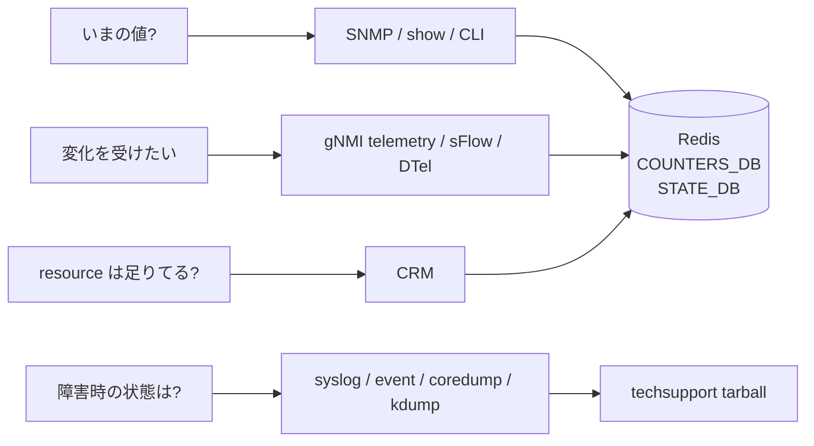
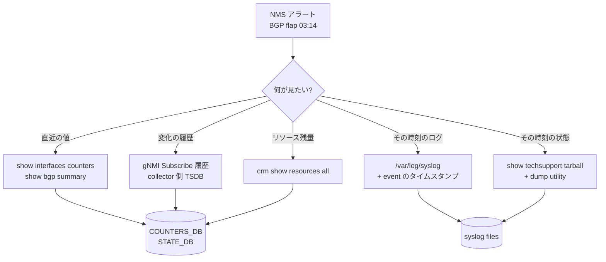

# 概念

[SONiC](../../reference/glossary.md#term-sonic) の observability は、用途ごとに別のサブシステムが担当します。読み解くときは「いま何が起きているか」「変化点をどう受け取るか」「障害時に何を残すか」の 3 つに分けると迷いません。

## Telemetry / SNMP 機能は何を解決するか

スイッチが「動いている」「壊れている」「過負荷になりかけている」を、人とシステムに伝える経路を提供するのがこの章のサブシステム群です。具体的には、次のような質問に対する受け皿を、目的別に複数並べているのが SONiC の作りになっています。

- いまこの瞬間のポート利用率を 5 秒に 1 回 NMS に push してほしい ([gNMI](../../reference/glossary.md#term-gnmi) Subscribe SAMPLE)
- [BGP](../../reference/glossary.md#term-bgp) セッションが落ちたら同じ秒のうちにイベントを受けたい (gNMI ON_CHANGE / syslog)
- 月次レポート用に既存の NMS スタックから IF-MIB を歩いて集めたい ([SNMP](../../reference/glossary.md#term-snmp))
- 顧客トラフィックの一部をミラー先 collector に流して可視化したい (sFlow / DTel)
- 「あの時間帯に何が起きていたか」を後追いするための包括 snapshot がほしい (`show techsupport`、core dump、kdump)
- [ASIC](../../reference/glossary.md#term-asic) リソース（route、[ACL](../../reference/glossary.md#term-acl) entry、neighbor 等）が枯渇する前に検知したい ([CRM](../../reference/glossary.md#term-crm))

ここで重要なのは、これらが**同じ「ポート counter」を扱っていても、入口とプロトコル、データ更新タイミングが全部違う**ということです。読む側はまず「何を答える経路か」で分類すると混乱しません。

## SONiC 内での位置

Telemetry / SNMP 系は基本的に **management plane** に属しますが、データ供給源は control / data plane の両方に深く食い込みます。

- **Management plane (経路の主役)**: `snmp` コンテナ、`telemetry` / `gnmi` コンテナ、`hsflowd`、`syslog-ng`、`auto-techsupport` などの daemon が外部とのプロトコル端点を担います。
- **Control plane (供給源の一部)**: BGP / [LLDP](../../reference/glossary.md#term-lldp) / [LACP](../../reference/glossary.md#term-lacp) などの daemon が syslog や [STATE_DB](../../reference/glossary.md#term-state_db) に状態を流し、それを上記 daemon が拾います。
- **Data plane (供給源の主体)**: [FlexCounter](../../reference/glossary.md#term-flexcounter) / DTel / sFlow agent が ASIC / [SAI](../../reference/glossary.md#term-sai) から counter / sample を引き、[COUNTERS_DB](../../reference/glossary.md#term-counters_db) に蓄積するか、ASIC から直接 wire に出します。

経路 (transport) と供給源 (data path) が独立しているのが SONiC の observability の設計思想で、新しい counter を増やすときは「SAI で取れるか → flex counter group に入れるか → DB に乗せるか → どの transport で出すか」を順に決めます。

## 用語の定義

- **SNMP**: UDP 161/162 で `snmpd` が受け、SONiC subagent (`snmp-agent` / `sonic_ax_impl`) が AgentX 経由で [Redis](../../reference/glossary.md#term-redis) を MIB 表現に変換します。polling 専用、pull 型。
- **gNMI**: gRPC 上で [YANG](../../reference/glossary.md#term-yang) path を Get / Set / Subscribe する Google の管理プロトコル。SONiC では `telemetry` コンテナの `gnmi-server` が実装。
- **[gNOI](../../reference/glossary.md#term-gnoi) / gNSI**: gNMI と同じ gRPC スタック上で「操作系 (gNOI: reboot / file / OS install / cert install)」と「セキュリティ系 (gNSI: authz / pathz / credential)」を扱う仕様。
- **FlexCounter**: [syncd](../../reference/glossary.md#term-syncd) の counter polling 機構。port、queue、PG、ACL、route flow、trap flow など複数 group を別 interval で polling し、`COUNTERS_DB` に書きます。
- **CRM (Critical Resource Monitoring)**: ACL entry、route、neighbor、nexthop group などの ASIC リソース使用量と閾値を watch する仕組み。COUNTERS_DB に publish し、閾値超過は syslog に通知。
- **sFlow**: パケットサンプリング + interface counter を `sFlow datagram` として外部 collector に UDP 送信するプロトコル。SONiC では `hsflowd` が担当。
- **DTel (Data plane Telemetry)**: [INT](../../reference/glossary.md#term-int) (In-band Network Telemetry) を ASIC が直接フレームに埋めて export。SONiC は ASIC 側の設定パスのみ。
- **[Syslog](../../reference/glossary.md#term-syslog) / Event**: テキストログと構造化イベント。`syslog-ng` で集約し、外部 collector に転送。
- **Techsupport**: `show techsupport` が作る tarball。CLI 出力、Redis dump、syslog、journal、core などをまとめる。
- **Dump utility**: `sonic-dump` がオブジェクト単位（PORT / [VLAN](../../reference/glossary.md#term-vlan) / ACL_TABLE...）で全 DB と関連 CLI を構造化収集するツール。

## 3 つの観測経路

- **Polling 系**: SNMP、`show` コマンド、CLI 経由の counter 読み取り。スナップショットを欲しいときに使います。値は Redis（COUNTERS_DB / STATE_DB / [APPL_DB](../../reference/glossary.md#term-appl_db)）か直接 SAI / Linux に取りに行きます。
- **Streaming 系**: gNMI telemetry、sFlow、DTel。ON_CHANGE か SAMPLE の subscribe を受けて push します。短い間隔で大量に集めるなら polling より向きます。
- **証跡系**: syslog、event、core dump、kdump、auto-techsupport。障害が起きた瞬間の状態を残し、後から `show techsupport` の tarball や dump utility で取り出します。

同じ「ポートの利用率」を見るのでも、SNMP では IF-MIB の counter、telemetry では `COUNTERS:Ethernet*` の path、CLI では `show interfaces counters` と入口が変わります。元データは多くの場合 `COUNTERS_DB` の同じ entry で、上に何を被せるかの違いです。

## 何を答えるか別の整理

CRM は ACL / route / neighbor / nexthop など ASIC 資源の使用量を COUNTERS_DB に publish する固有の経路です。SAI generic counter 拡張版は CRM 自身の polling 負荷を別 group の flex counter に逃がしますが、読み手から見れば「資源の上限と消費」を答える機能という位置付けは変わりません。

## FlexCounter / CRM / DTel / sFlow / watermark の棲み分け

- **FlexCounter**: [orchagent](../../reference/glossary.md#term-orchagent) ではなく syncd の flex counter infra で各種 counter（port、queue、PG、ACL、route flow、trap flow など）を定期 polling し、COUNTERS_DB に書きます。`COUNTERS:` table の供給元です。
- **CRM**: ACL entry、route、neighbor、nexthop group などの ASIC resource 使用量と閾値超過を監視し、COUNTERS_DB に publish して閾値超過は syslog に出します。FlexCounter の counter とは別目的です。
- **DTel**: Inband Network Telemetry を ASIC が直接 export するもので、SONiC からは設定パスのみ通り、データは外部 collector へ流れます。
- **sFlow**: hsflowd がサンプリングと counter を psample / kernel から取り、外部 collector に sFlow datagram を送ります。
- **Watermark**: queue / PG / buffer の高水位を ASIC が保持し、SONiC が定期 snapshot します。詳細は [QoS](../../reference/glossary.md#term-qos) 章で扱います。

## SNMP と gNMI telemetry は同じか

両者は経路が独立しています。SNMP は snmpd と SONiC subagent (`snmp-agent`) が MIB をマップし、gNMI telemetry は `telemetry` / `gnmi` コンテナが Redis path を YANG / OpenConfig schema で publish します。MIB と YANG の両方に含まれる情報は重複しますが、Entity MIB のように MIB 側でしか出ない統計、telemetry-agent 拡張のように gNMI 側で先に増える統計があるため、運用上は完全互換ではありません。

## Techsupport と dump utility

`show techsupport` は障害時の包括的な tarball を作る古典コマンドで、CLI、Redis、syslog、journal、core などをまとめます。一方 dump utility (`sonic-dump`) はオブジェクト単位（PORT / VLAN / ACL_TABLE など）で全 DB と CLI 出力を構造化して取り出します。前者は「何が起きたかの全体保全」、後者は「特定 object の状態を深掘り」に向きます。

## 典型シーン: 早朝の microburst を後追いする

03:14 に「BGP セッションが flapping した」アラートが NMS から来たとします。Telemetry / SNMP 系を使った典型的な切り分け順は次のようになります。

ここで多くの運用者がやらかすのが「直近の値しか見えない CLI で過去の microburst を追う」ことです。CLI と SNMP は今この瞬間のカウンタ値を返すだけで、**過去の値は外部 collector か `show techsupport` の tarball にしか残っていない** という前提を最初に置く必要があります。

## 似た機能との違い

| 比較対象 | 共通点 | 違い |
|---|---|---|
| SNMP と gNMI | counter / state を吐く | SNMP は pull / UDP / MIB、gNMI は push 可 / TCP+gRPC / YANG。レイテンシと粒度が違う |
| gNMI と sFlow | telemetry を push する | gNMI は state / counter の表現、sFlow はパケットサンプル + counter の datagram。後者は per-packet 情報 |
| sFlow と DTel | データプレーン情報を吐く | sFlow は CPU が定期サンプル、DTel は ASIC がフレーム単位で INT を埋める |
| Syslog と Event | 文字列で出力 | syslog はテキスト、event は構造化 JSON で外部に流す |
| Techsupport と Dump utility | 障害後の解析素材 | techsupport は switch 全体の包括、dump utility はオブジェクト指定で深掘り |
| CRM と FlexCounter | counter を扱う | CRM は ASIC リソース使用量、FlexCounter は traffic counter。目的が違う |
| Watermark と Counter | ピーク値 | watermark は観測区間内ピークの 1 値、counter は累積。重ねて見ると挙動が分かる |

## 読了後にできること

ここまで読めば、次の判断が自分でつくはずです。

- 「過去 1 時間のポート利用率」を取りたいときに、CLI / SNMP では十分ではなく gNMI Subscribe か外部 TSDB が必要だと即断できる
- 「ASIC で route が入らない」原因として、CRM の resource exhausted を最初に疑うべきと分かる
- syslog をいきなり grep する前に、`show techsupport` の tarball を保全する必要性を理解できる
- sFlow と DTel を「どちらか一方」と短絡せず、用途（CPU サンプル vs ASIC per-packet）で選べる
- SNMP と gNMI の両方が要件にあるとき、両方を独立に enable する必要があり、設定差分を片方からは見えないことを理解している

## 関連ページ

- [Logging と system dump 仕様](../../system/sonic-logging-system-dumps-arch-spec.md)
- [show techsupport](../../system/show-techsupport.md)
- [Dump utility](../../internals/dump-utility-for-easy-debugging.md)
- [System ready](../../system/system-ready-hld.md)

<!-- xref-prereq -->
## この章の前提知識

この章を読み進める前に、次の章を押さえておくと迷子になりにくい。

- [SONiC 全体像と設定基盤](../01-overview/index.md)
- [SWSS / SAI / Redis 内部実装](../20-swss-sai-redis/index.md)

<!-- glossary-links-injected: ec18b66e3507 -->
