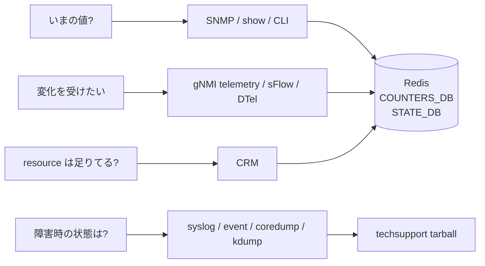

# 概念

SONiC の observability は、用途ごとに別のサブシステムが担当します。読み解くときは「いま何が起きているか」「変化点をどう受け取るか」「障害時に何を残すか」の 3 つに分けると迷いません。

## 3 つの観測経路

- **Polling 系**: SNMP、`show` コマンド、CLI 経由の counter 読み取り。スナップショットを欲しいときに使います。値は Redis（COUNTERS_DB / STATE_DB / APPL_DB）か直接 SAI / Linux に取りに行きます。
- **Streaming 系**: gNMI telemetry、sFlow、DTel。ON_CHANGE か SAMPLE の subscribe を受けて push します。短い間隔で大量の集めるなら polling より向きます。
- **証跡系**: syslog、event、core dump、kdump、auto-techsupport。障害が起きた瞬間の状態を残し、後から `show techsupport` の tarball や dump utility で取り出します。

同じ「ポートの利用率」を見るのでも、SNMP では IF-MIB の counter、telemetry では `COUNTERS:Ethernet*` の path、CLI では `show interfaces counters` と入口が変わります。元データは多くの場合 `COUNTERS_DB` の同じ entry で、上に何を被せるかの違いです。

## 何を答えるか別の整理

CRM は ACL / route / neighbor / nexthop など ASIC 資源の使用量を STATE_DB に publish する固有の経路です。SAI generic counter 拡張版は CRM 自身の polling 負荷を別 group の flex counter に逃がしますが、読み手から見れば「資源の上限と消費」を答える機能という位置付けは変わりません。

## FlexCounter / CRM / DTel / sFlow / watermark の棲み分け

- **FlexCounter**: orchagent ではなく syncd の flex counter infra で各種 counter（port、queue、PG、ACL、route flow、trap flow など）を定期 polling し、COUNTERS_DB に書きます。`COUNTERS:` table の供給元です。
- **CRM**: ACL entry、route、neighbor、nexthop group などの ASIC resource 使用量と閾値超過を監視し、STATE_DB と syslog に出します。FlexCounter の counter とは別目的です。
- **DTel**: Inband Network Telemetry を ASIC が直接 export するもので、SONiC からは設定パスのみ通り、データは外部 collector へ流れます。
- **sFlow**: hsflowd がサンプリングと counter を psample / kernel から取り、外部 collector に sFlow datagram を送ります。
- **Watermark**: queue / PG / buffer の高水位を ASIC が保持し、SONiC が定期 snapshot します。詳細は QoS 章で扱います。

## SNMP と gNMI telemetry は同じか

両者は経路が独立しています。SNMP は snmpd と SONiC subagent (`snmp-agent`) が MIB をマップし、gNMI telemetry は `telemetry` / `gnmi` コンテナが Redis path を YANG / OpenConfig schema で publish します。MIB と YANG の両方に含まれる情報は重複しますが、Entity MIB のように MIB 側でしか出ない統計、telemetry-agent 拡張のように gNMI 側で先に増える統計があるため、運用上は完全互換ではありません。

## Techsupport と dump utility

`show techsupport` は障害時の包括的な tarball を作る古典コマンドで、CLI、Redis、syslog、journal、core などをまとめます。一方 dump utility (`sonic-dump`) はオブジェクト単位（PORT / VLAN / ACL_TABLE など）で全 DB と CLI 出力を構造化して取り出します。前者は「何が起きたかの全体保全」、後者は「特定 object の状態を深掘り」に向きます。

## 関連ページ

- [Logging と system dump 仕様](../../system/sonic-logging-system-dumps-arch-spec.md)
- [show techsupport](../../system/show-techsupport.md)
- [Dump utility](../../internals/dump-utility-for-easy-debugging.md)
- [System ready](../../system/system-ready-hld.md)
