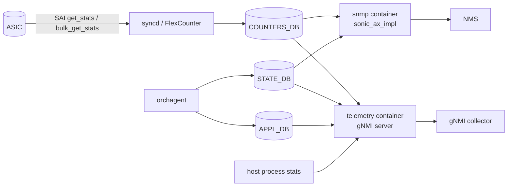

# 内部実装

このページは、observability のうち [SONiC](../../reference/glossary.md#term-sonic) 内部で「いつ何のスレッドが値を書いているか」を整理します。設定や運用の入口は前後のページで十分なので、ここは挙動の理由を読みたい人向けです。

## FlexCounter Group の仕事分担

[syncd](../../reference/glossary.md#term-syncd) 内部に flex counter infrastructure があり、group ごとに次の項目を持ちます。

- 対象 [SAI](../../reference/glossary.md#term-sai) object（port、queue、PG、buffer pool、[ACL](../../reference/glossary.md#term-acl) counter、route flow、trap flow など）
- polling interval
- 対象 stat ID のリスト
- 有効化フラグ

`FLEX_COUNTER_TABLE|PORT` のような [CONFIG_DB](../../reference/glossary.md#term-config_db) entry がこれらを制御します。group をまたぐ counter は同じ thread に乗らないため、port counter の interval を短くしても queue counter には影響しません。Refactor 以前は [orchagent](../../reference/glossary.md#term-orchagent) main loop に counter polling を抱えていたため、ACL や route 操作との競合がありました。

## Counter Initialization の bulk 化

起動直後、SONiC は全 port / queue / PG / ACL に対して flex counter を install しようとします。1 件ずつ install する古い実装では数百 port のシステムで数分かかることがあったため、bulk install API でまとめて登録するように変更されています。

Bulk 化の前後で外向きの API は変わりませんが、起動直後の `show interfaces counters` が空に見える時間が短くなり、`COUNTERS_PORT_NAME_MAP` の生成タイミングも早まります。Debug でこの map が空のときは、syncd が bulk 登録途中の可能性があります。

## Byte / Packet Rate の出どころ

ポート利用率を出す `show interfaces counters --rates` は、[COUNTERS_DB](../../reference/glossary.md#term-counters_db) の累積値そのものではなく、`portstat` ユーティリティが直前のスナップショットと現在値の差分を計算しています。一方、`RATES:` 系の table を期待するクエリは flex counter group `RATES` の更新に依存します。

「使用率の表示が止まる」原因は、累積値ではなく rate 計算側の polling、または `portstat` の cache `/tmp/portstat-*` の rotate です。累積 counter が動いているのに rate が出ないときは、まず group `RATES` の state を見ます。

## Logging Pipeline

syslog は container ごとの rsyslogd と host の rsyslogd が二段でつながります。Container の rsyslogd は `omfwd` で host の `/dev/log` 相当に転送し、host 側がさらに `SYSLOG_SERVER` で設定された外部宛先に送ります。`SYSLOG_CONFIG_FEATURE` は container 単位の severity 切替を許し、不要な debug を本番で抑えられます。

Auto-techsupport は、`coredump_gen_handler` が core 生成イベントを受け、`SystemReady` 達成後かつ rate limit 内であれば `show techsupport` を非同期で実行します。ディスク使用量とメモリ使用量の threshold を満たさないと skip し、syslog に reason を残します。

## SNMP Subagent の構造

SONiC [SNMP](../../reference/glossary.md#term-snmp) は `snmp` container 内で snmpd と Python 実装の AgentX subagent (`sonic_ax_impl`) が動きます。subagent は [Redis](../../reference/glossary.md#term-redis) を購読し、IF-MIB / IF-X-TABLE / Entity MIB / RFC1213 / SONIC-[LLDP](../../reference/glossary.md#term-lldp) 系などの OID 群を Redis の値から組み立てます。

OID から Redis path への mapping は subagent 内のクラスに分散しており、新しい MIB を増やすには subagent 側に MIB-specific クラスを書く必要があります。MIB を新設しない範囲では、Redis 側の table 構造を変えると subagent が古い key を見ようとして空値を返す挙動になる点に注意します。

## Telemetry Agent の subscribe path

`telemetry` / `gnmi` container は SONiC native [YANG](../../reference/glossary.md#term-yang) / OpenConfig を Redis path にマップし、[gNMI](../../reference/glossary.md#term-gnmi) Subscribe を CDB / SDB / [APPL_DB](../../reference/glossary.md#term-appl_db) の event listener に変換します。`ON_CHANGE` は Redis keyspace notifications に依存し、`SAMPLE` は内部の polling timer で current value を返します。

加えて telemetry-agent には、process / docker 統計、memory 統計、reboot cause のように「Redis に元々無い情報」を取り込んで gNMI で publish する拡張があり、これらは subscribe path として現れます（発展トピックで扱います）。

## データフロー（telemetry / SNMP / counter 全体）



## 主要 Orch / daemon の責務

| コンポーネント | 主実体 | 責務 |
| --- | --- | --- |
| `FlexCounter` (`syncd/FlexCounter.cpp`) | per-group polling thread | SAI stat の周期取得 |
| `FlexCounterManager` | group の追加/削除 | group 名から polling thread を解決 |
| `CounterCheck` / `flex_counter_table_consumer` | orchagent 側 | CONFIG_DB:FLEX_COUNTER_TABLE → [ASIC_DB](../../reference/glossary.md#term-asic_db):FLEX_COUNTER_TABLE 反映 |
| `sonic_ax_impl` (`src/sonic-snmpagent/`) | python AgentX subagent | OID → Redis path の解決 |
| `snmpd` | net-snmp | AgentX master |
| `telemetry` (sonic-gnmi) | go | gNMI server（→ 10 章） |
| `coredump_gen_handler` | python | core 発生 → techsupport 非同期実行 |

## SAI 属性使用一覧

主要な stat ID（[FlexCounter](../../reference/glossary.md#term-flexcounter) が `sai_get_*_stats` / `sai_bulk_get_*_stats` で取得）:

| 対象 | stat ID 群 |
| --- | --- |
| port | `SAI_PORT_STAT_IF_IN_OCTETS`、`IF_OUT_OCTETS`、`IF_IN_DISCARDS`、`PFC_*_RX_PKTS`、`IN_DROPPED_PKTS` |
| queue | `SAI_QUEUE_STAT_PACKETS`、`BYTES`、`DROPPED_PACKETS`、`DROPPED_BYTES`、`WATERMARK_BYTES` |
| PG | `SAI_INGRESS_PRIORITY_GROUP_STAT_PACKETS`、`DROPPED_PACKETS`、`XOFF_ROOM_WATERMARK_BYTES` |
| buffer pool | `SAI_BUFFER_POOL_STAT_CURR_OCCUPANCY_BYTES`、`WATERMARK_BYTES` |
| ACL | counter object 経由（`SAI_ACL_COUNTER_ATTR_PACKETS / BYTES`） |
| trap ([CoPP](../../reference/glossary.md#term-copp)) | `SAI_HOSTIF_TRAP_GROUP_STAT_PACKETS` |

`sai_query_stats_capability` で「使える stat id」を起動時に問い合わせ、サポート外の id は group から除外する設計（→ 20 章）。

## Redis テーブル参照関係

```yaml
CONFIG_DB:
  FLEX_COUNTER_TABLE|<group>  (POLL_INTERVAL / FLEX_COUNTER_STATUS)
  SYSLOG_SERVER, SYSLOG_CONFIG_FEATURE, AUTO_TECHSUPPORT, AUTO_TECHSUPPORT_FEATURE
  SNMP_AGENT_ADDRESS_CONFIG, SNMP_COMMUNITY, SNMP_USER
ASIC_DB:
  FLEX_COUNTER_TABLE / FLEX_COUNTER_GROUP_TABLE (orchagent → syncd への指示)
COUNTERS_DB:
  COUNTERS:<oid>, COUNTERS_PORT_NAME_MAP, COUNTERS_QUEUE_NAME_MAP,
  COUNTERS_PG_NAME_MAP, COUNTERS_TRAP_NAME_MAP, RATES:*
STATE_DB:
  PROCESS_STATS, SYSTEM_*, AUTO_TECHSUPPORT_DUMP_INFO
```

## ZMQ / Redis pub/sub

- FlexCounter は [ASIC](../../reference/glossary.md#term-asic) からの notification ではなく **polling**。Redis pub/sub も使わず、ASIC_DB ↔ syncd 内通信で完結。
- gNMI Subscribe は **Redis keyspace notifications** を購読（→ 10 章）。
- SNMP AgentX は `sonic_ax_impl` が Redis を polling し、AgentX subagent → snmpd（master） → NMS。

## 既知の実装上の制約

- counter の polling interval は group 単位で、CONFIG_DB に書いてから ASIC_DB に反映されるまで一拍ある。高頻度（< 1s）の interval は ASIC 側 SDK の負荷が無視できない。
- `RATES:` table は `portstat` 等の user-space ツールが計算するもので、Redis 上には rate のスナップショット保存しかなく、過去 N 秒の rate を gNMI から sample しても粒度は polling interval に律速される。
- SNMP subagent は OID から Redis path への mapping を**ハードコード**しており、新 MIB の追加には subagent コード変更が必要。
- auto-techsupport は dump サイズが /var/dump 上限を超えると古いものから削除し、保存し損ねるケースがある。
- syslog の container 二段ホップは container 内 rsyslog が停止すると host 側に何も流れない silent 失敗が起きる。

## 関連ページ

- [FlexCounter refactor](../../internals/sonic-flexcounter-refactor.md)
- [Counter initialization optimization](../../internals/sonic-counter-initialization-optimization.md)
- [Byte / packet rate と port utilization](../../internals/byte-packet-rates-port-utilization-in-sonic.md)
- [Logging と system dump 仕様](../../system/sonic-logging-system-dumps-arch-spec.md)

<!-- glossary-links-injected: ec18b66e3507 -->
