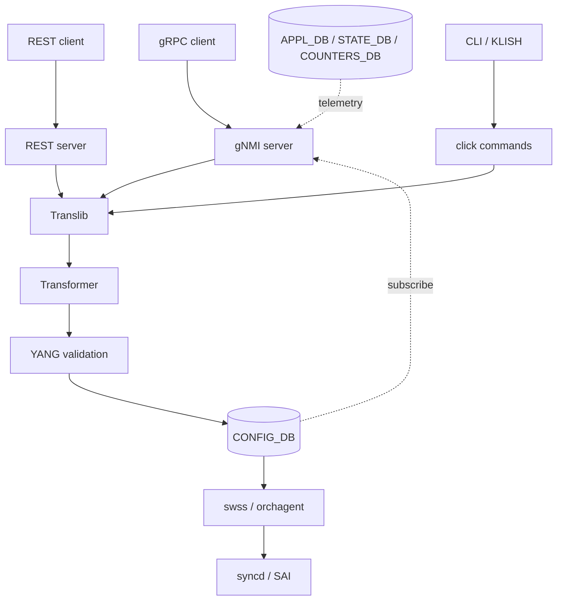

# アーキテクチャ

[gNMI](../../reference/glossary.md#term-gnmi) / REST のリクエストが [CONFIG_DB](../../reference/glossary.md#term-config_db) に到達するまでの経路は、入口の transport が違っても中間層 (Translib / Transformer) で合流する。ここでは「どの daemon を通り、どの [YANG](../../reference/glossary.md#term-yang) model がいつ validation するか」を追う。

## 全体フロー

REST と gNMI server は同じ telemetry container で動き、Translib 経由で OpenConfig / [SONiC](../../reference/glossary.md#term-sonic) YANG をどちらも扱う。Subscribe (gNMI streaming) は CONFIG_DB だけでなく [APPL_DB](../../reference/glossary.md#term-appl_db) / [STATE_DB](../../reference/glossary.md#term-state_db) / [COUNTERS_DB](../../reference/glossary.md#term-counters_db) も対象になる。

詳細な server 内部設計は [gNMI server interface design](../../management/sonic-gnmi-server-interface-design.md) と [Management Framework 全体像](../../management/sonic-management-framework.md) を参照する。

## Translib と Transformer の責務

- **Translib**: 上位 API。Get / Set / Subscribe を YANG パス単位で受け付け、リクエストを Transformer に渡して内部表現に直す。OpenConfig パスと SONiC YANG パスの両方を受ける。
- **Transformer**: YANG ノードと CONFIG_DB テーブル/カラムの対応規則を持ち、片方向ではなく Get と Set 両方に効く双方向の写像を行う。複雑な依存 (たとえば [VLAN](../../reference/glossary.md#term-vlan) member と [LAG](../../reference/glossary.md#term-lag) の整合) は Transformer のロジックで吸収する。

OpenConfig replace / delete を CONFIG_DB に正しく落とすために、Transformer は単なるフィールド変換ではなく**モデル意味論を保つ replace / delete** を実装する。挙動の詳細は [Model-based replace/delete in Mgmt Framework Transformer](../../management/model-based-replace-delete-in-mgmt-framework-transformer.md) にまとまっている。

## YANG validation はいつ走るか

YANG validation は 2 段階で走る。

1. **入口時点**: Translib が受け取った時点で構文と単純な制約 (range、enum、leafref の参照先存在) をチェックする。
2. **CONFIG_DB 書き込み前**: 依存関係を含めた制約 (must / when 式、cross-table leafref、機能間整合) を YANG モデルで検証する。

[GCU](../../reference/glossary.md#term-gcu) (Generic Config Update) や JSON patch でも同じ validator を通る設計のため、入口が違っても同じ違反は同じエラーで弾かれる。validator の設計と限界は [SONiC config update validation via YANG](../../management/sonic-config-update-validation-via-yang.md) を参照する。

## Subscribe / Telemetry の経路

Subscribe (ON_CHANGE / SAMPLE / TARGET_DEFINED) は gNMI server が CONFIG_DB / APPL_DB / STATE_DB / COUNTERS_DB の [Redis](../../reference/glossary.md#term-redis) keyspace notification を購読し、YANG path に変換して streaming する形になる。[FRR](../../reference/glossary.md#term-frr) の経路を YANG で stream する仕組みは [gNMI subscription for YANG data](../../routing/gnmi-subscription-for-yang-data.md) で [BGP](../../reference/glossary.md#term-bgp) RIB を例に説明される。

Dial-out モード (switch から collector へ push する向き) は telemetry container 内の別の経路で動作する。dial-in と dial-out の TLS / 認証境界が違う点に注意する。詳細は [運用](operations.md) と [dial-out mode](../../system/sonic-telemetry-in-dial-out-mode.md) を参照する。

## CLI 自動生成と YANG モデル

KLISH を入口にする SONiC CLI は YANG モデルから生成される。これは「CLI と gNMI の操作整合」を保つだけでなく、SONiC への CLI 追加コストを減らす目的を持つ。生成ツールの構成は [CLI auto-generation tool](../../management/sonic-cli-auto-generation-tool.md) を参照する。

## 関連ページ

- [Management Framework 全体像](../../management/sonic-management-framework.md)
- [gNMI server interface design](../../management/sonic-gnmi-server-interface-design.md)
- [Model-based replace/delete in Transformer](../../management/model-based-replace-delete-in-mgmt-framework-transformer.md)
- [SONiC config update validation via YANG](../../management/sonic-config-update-validation-via-yang.md)
- [SONiC YANG model guidelines](../../management/sonic-yang-model-guidelines.md)
- [SONiC CLI auto-generation tool](../../management/sonic-cli-auto-generation-tool.md)
- [gNMI subscription for YANG data](../../routing/gnmi-subscription-for-yang-data.md)

<!-- glossary-links-injected: 8ba32e5aa69d -->
