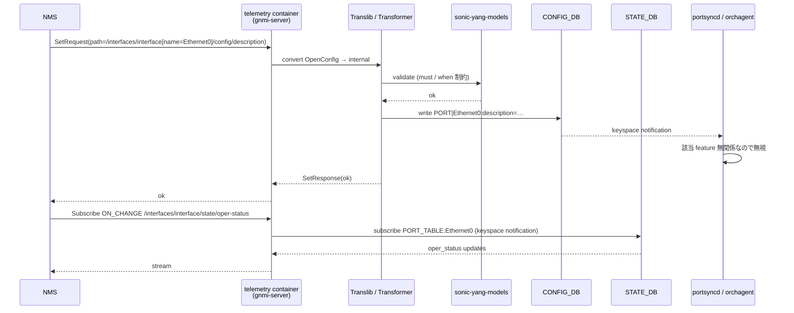

# 概要

[SONiC](../../reference/glossary.md#term-sonic) のモデル駆動管理は、CLI、[gNMI](../../reference/glossary.md#term-gnmi)、REST という 3 つの入口が、Translib / Transformer という共通の中間層を通って ConfigDB へ到達するように作られている。どの入口を使うかで操作対象が変わるわけではなく、同じ [YANG](../../reference/glossary.md#term-yang) モデルで定義された操作が、別の transport で表現されているにすぎない。この理解がないと「gNMI Set で OpenConfig をいじったら CLI が反映していない」ように見えてしまう。

## gNMI / OpenConfig 機能は何を解決するか

データセンタの規模で運用していると、CLI でログインして 1 台ずつ設定する世界はすぐに破綻する。NMS / SDN コントローラから API でまとめて投入し、戻りも構造化データで取りたい、しかもベンダーが混ざってもなるべく同じ表現で扱いたい。この要求に答えるのが gNMI（プロトコル）と OpenConfig（モデル）の組み合わせで、SONiC では次の問題を一気に解消している。

- CLI 専用機能と API 専用機能が分裂し、片方からしか触れないコマンドが生まれる問題
- ベンダー固有の MIB / CLI を毎回翻訳しないと NMS から触れない問題
- 設定の get / set を別プロトコル（SSH/CLI と [SNMP](../../reference/glossary.md#term-snmp)）で行わなければならない問題
- 「いまの設定」と「いまの状態」を片方ずつ取りに行く（candidate / running / operational がバラバラ）問題
- 設定変更を pull する手段しかなく、変更通知を push できない問題

逆に、低レイヤの [ASIC](../../reference/glossary.md#term-asic) 設定や SONiC 固有 feature flag の中には OpenConfig がまだカバーしていない領域もあり、その隙間を SONiC native YANG が埋める、という二段構えになっている。

## SONiC 内での位置

gNMI / OpenConfig は **management plane の中心** に座る。具体的には次の経路で動く。

- **Transport 層**: `telemetry` コンテナ内の gnmi-server が gRPC を受け、`mgmt-framework` コンテナの REST server が同じ Translib に乗る。
- **モデル変換層**: Translib / Transformer が OpenConfig YANG ↔ SONiC native YANG ↔ [CONFIG_DB](../../reference/glossary.md#term-config_db) の構造を相互変換する。CLI auto-generation tool は同じ YANG から CLI コマンド本体を生成する。
- **検証層**: `sonic-yang-models` が pyang ベースで YANG 制約をチェック。違反は Transport 層に RPC error として戻る。
- **永続化層**: CONFIG_DB writer が [Redis](../../reference/glossary.md#term-redis) に書き、`config save` 相当の挙動が `save-on-set` 設定で自動化される。
- **反映層**: 他章と同じく [orchagent](../../reference/glossary.md#term-orchagent) → [syncd](../../reference/glossary.md#term-syncd) → [SAI](../../reference/glossary.md#term-sai) → ASIC の通常経路を流れる。

つまり gNMI / OpenConfig 章は「**ConfigDB に到達するまでの道のり**」を扱う。ConfigDB から先（orchagent から ASIC まで）は他章の責任、という切り分けで読めばよい。

## 用語の定義

- **gNMI**: gRPC Network Management Interface。`Capabilities` / `Get` / `Set` / `Subscribe` の 4 RPC を持つ。
- **[gNOI](../../reference/glossary.md#term-gnoi)**: gRPC Network Operations Interface。`Reboot` / `File` / `OS` / `Healthz` / `Cert` などの操作 RPC。
- **gNSI**: gRPC Network Security Interface。`Authz` / `Pathz` / `Credentialz` / `Certz` などのセキュリティ管理 RPC。
- **OpenConfig**: ベンダー非依存の YANG モデル群。`openconfig-interfaces`、`openconfig-bgp` などが主要。
- **SONiC YANG (native)**: `sonic-port`、`sonic-vlan` のように CONFIG_DB スキーマ 1:1 で書かれた YANG モデル群。
- **Translib**: OpenConfig / SONiC YANG を翻訳して CONFIG_DB へ落とす中間層。YGOT ベース。
- **Transformer**: Translib 内のモデル変換。フィールド単位で OpenConfig ↔ SONiC のマッピングを定義。
- **Save-on-Set**: gNMI Set が成功した時に `/etc/sonic/config_db.json` まで永続化する設定。
- **Master Arbitration**: 複数 client が同じ path に同時 Set する競合を防ぐため、gNMI Set の「primary client」を Election で決める仕組み。
- **Dial-out subscription**: collector 側ではなく switch 側から telemetry stream を発信する telemetry の逆方向モード。

## 典型シーン: NMS から interface description をまとめて投入する

NMS が 100 台の ToR に対し interface description を OpenConfig path で Set する場面を考える。SONiC 内ではこう動く。

ポイントは **Set した path と Subscribe する path がどちらも YANG モデル上の path** で、`/config/...` と `/state/...` で writeable / read-only が分かれている、という OpenConfig の規約。SONiC native YANG にも同じ流儀がある。`/config/...` の書き込み先は CONFIG_DB、`/state/...` の読み出し元は STATE_DB（一部は APPL_DB / COUNTERS_DB）と DB が分かれている点も合わせて押さえておく。

## 入口の責務を分ける

| 層 | 主な責務 | 代表コンポーネント |
| --- | --- | --- |
| Transport | gRPC / REST 受付、認証 | telemetry container, gnmi server, REST server |
| Model 変換 | OpenConfig / SONiC YANG → 内部表現 | Translib, Transformer |
| Validation | YANG 制約のチェック、依存解決 | sonic-yang-models, ConfigDB validator |
| 永続化 | CONFIG_DB への書き込み、save-on-set | mgmt-framework, configdb writer |
| 反映 | daemon / orchagent / SAI への伝搬 | swss, orchagent, syncd |

詳細は [Management Framework 全体像](../../management/sonic-management-framework.md) を参照する。gNMI server 単体の責務は [gNMI server interface design](../../management/sonic-gnmi-server-interface-design.md) にまとまっている。入口別の使い分けの俯瞰は [gnmi-openconfig カテゴリ](../../categories/gnmi-openconfig.md) を起点にする。

## OpenConfig と SONiC native YANG の使い分け

SONiC は両方の YANG モデルを並行サポートする。

- **OpenConfig**: ベンダー非依存、業界標準。ethernet interface、[VLAN](../../reference/glossary.md#term-vlan)、[PortChannel](../../reference/glossary.md#term-portchannel)、[BGP](../../reference/glossary.md#term-bgp) など主要機能のサブセットがマップされる。NMS から差分を取り、複数ベンダー混在環境で運用するときの選択肢。
- **SONiC native YANG**: CONFIG_DB のスキーマに 1:1 で対応する。SONiC 固有機能や、OpenConfig がまだ表現しない operational 詳細を扱うときに使う。YANG モデルの命名規約と書き方は [SONiC YANG model guidelines](../../management/sonic-yang-model-guidelines.md) を参照する。

同じ機能を OpenConfig と SONiC YANG の両方から触れる場合、Transformer がフィールド単位で変換するため、片方からの設定がもう片方の get でも見えるのが原則である。ただし、OpenConfig 側がそのフィールドを表現しない場合は SONiC YANG だけで操作する。OpenConfig マップの実装範囲は機能ごとに異なるため、interface は [OpenConfig support for ethernet interfaces](../../management/openconfig-support-for-ethernet-interfaces.md)、PortChannel は [OpenConfig PortChannel](../../switching/openconfig-support-for-portchannel-aggregate-interface.md)、VLAN は [OpenConfig VLAN](../../switching/add-support-for-vlan-interface-using-openconfig-yang.md)、BGP は [SONiC FRR BGP Unified Mgmt Framework](../../routing/sonic-frr-bgp-extended-unified-configuration-management-framework.md) を参照する。

## CLI と gNMI の整合

SONiC の CLI は YANG モデルから自動生成される仕組みを持つ。同じ操作を CLI と gNMI で別実装にしないための設計で、CLI 追加時の重複を減らす目的もある。自動生成の流れは [SONiC CLI auto-generation tool](../../management/sonic-cli-auto-generation-tool.md) にまとまっている。CLI から入った設定が gNMI Get で同じ表現で戻ってくることを期待するなら、その機能が YANG モデル経由で扱われているかを最初に確認する。

## この章での読み方

- リクエストの内部フローを追いたいときは [アーキテクチャ](architecture.md) へ。
- 実際に Get / Set / Subscribe を書くときは [設定](setup.md) へ。
- 競合制御 (master arbitration)、永続化 (save-on-set)、dial-out subscription は [運用](operations.md) へ。
- gNOI、gNSI で reboot / file / OS install / healthz / 証明書配布を扱うときは [gNOI / gNSI](gnoi-gnsi.md) へ。
- YANG モジュールを機能章から逆引きするときは [YANG リファレンス](yang-reference.md) へ。

## 似た機能との違い

| 比較対象 | 共通点 | 違い |
|---|---|---|
| SNMP | NMS から状態を取れる | SNMP は MIB / UDP / pull のみ。gNMI は YANG / gRPC / push 可。Set 系も SNMP は SET PDU しかなく実運用では使われない |
| NETCONF | YANG モデル駆動 | NETCONF は SSH + XML、gNMI は gRPC + protobuf。SONiC は NETCONF を実装していないので議論はモデル互換性の話に限る |
| RESTCONF | YANG モデル駆動 + HTTP | SONiC の REST server は OpenAPI 生成版で、RESTCONF の RFC 8040 仕様には準拠しない。同じ Translib に乗るので機能は等価 |
| CLI | 設定の入口 | CLI は内部で同じ YANG / Translib を経由（auto-generate 経由）。差は transport と UX のみ |
| SAI / `sonic-cfggen` | 設定の最終形 | gNMI は ConfigDB まで、SAI は ASIC 上の object。gNMI からは SAI を直接触れない |
| gRPC で書いた独自 API | gRPC 上で動く | gNMI は仕様化された 4 RPC のみ。汎用 gRPC ではないので、独自拡張は path / extension で行う |

## 読了後にできること

- 同じ機能を OpenConfig path と SONiC native path のどちらで触るべきか、その feature が OpenConfig で表現できるかを基準に判断できる
- gNMI Set が失敗したとき、Transport 層・Translib 変換・YANG validation・ConfigDB writer のどこで止まったか順序立てて切り分けられる
- 「CLI からは見える設定が gNMI Get で取れない」現象を、YANG モデル未対応 / Transformer 未実装 / state path 未実装の 3 つから選ぶ目線を持てる
- Master arbitration / save-on-set / dial-out のような運用上の仕掛けが、なぜ必要かを CLI との対比で説明できる
- gNOI と gNSI が gNMI とは別の RPC セットで、reboot / 証明書管理が transport 共用なだけと理解できる

## 関連ページ

- [Management Framework 全体像](../../management/sonic-management-framework.md)
- [gNMI server interface design](../../management/sonic-gnmi-server-interface-design.md)
- [gnmi-openconfig カテゴリ](../../categories/gnmi-openconfig.md)
- [SONiC YANG model guidelines](../../management/sonic-yang-model-guidelines.md)
- [SONiC CLI auto-generation tool](../../management/sonic-cli-auto-generation-tool.md)

<!-- xref-prereq -->
## この章の前提知識

この章を読み進める前に、次の章を押さえておくと迷子になりにくい。

- [SONiC 全体像と設定基盤](../01-overview/index.md)
- [Telemetry / SNMP / Observability](../09-telemetry-snmp/index.md)

<!-- glossary-links-injected: ec18b66e3507 -->
