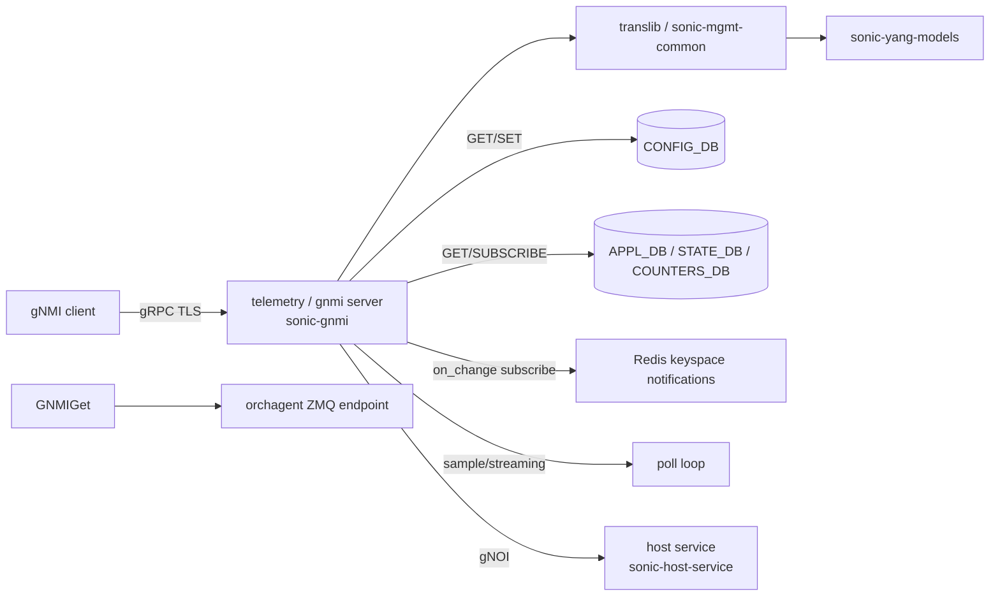

# 内部実装

[gNMI](../../reference/glossary.md#term-gnmi) / OpenConfig の内部実装は、`telemetry` コンテナの中に gNMI server があり、translib / [sonic-mgmt](../../reference/glossary.md#term-sonic-mgmt)-common 経由で [YANG](../../reference/glossary.md#term-yang) → [CONFIG_DB](../../reference/glossary.md#term-config_db) / [APPL_DB](../../reference/glossary.md#term-appl_db) / [STATE_DB](../../reference/glossary.md#term-state_db) に変換するという縦の流れを押さえると整理できる。GET / SET / SUBSCRIBE で経路がそれぞれ違うのが特徴である。

## データフロー



## 主要 daemon / コンポーネントの責務

| コンポーネント | 主な実体 | 責務 |
| --- | --- | --- |
| `telemetry` container | `sonic-gnmi`（旧 `sonic-telemetry`）/ `gnmi_server` | gNMI / [gNOI](../../reference/glossary.md#term-gnoi) / gNSI gRPC server。TLS / mTLS 終端 |
| `translib` (`sonic-mgmt-common/translib/`) | `translib.go`、`transformer/` | YANG path ↔ [Redis](../../reference/glossary.md#term-redis) テーブルの双方向変換、ocyang バインドを使う |
| `transformer` | per-module transformer（`translib/transformer/xfmr_*.go`） | OpenConfig path から [SONiC](../../reference/glossary.md#term-sonic) YANG / Redis テーブルへの mapping 規則 |
| `sonic-yang-mgmt` / `sonic-yang-models` | `yang-models/*.yang` | SONiC 独自 YANG。CONFIG_DB との整合の根拠 |
| `dialin` (gNMI Subscribe) / `dialout` server | dial-in は `gnmi_server/server.go` の Subscribe RPC が担当（独立した `dialin.go` は存在しない）。dial-out は `dialout/dialout_client/dialout_client.go` / `dialout/dialout_server/dialout_server.go` | dial-in (subscribe) と dial-out collector |
| `gNOI` services | `gnoi/system`、`gnoi/file`、`gnoi/os` | `Reboot`、`Time`、`Ping`、`SetPackage` 等。host service 経由で OS 操作 |
| `gNSI` services | `gnsi/certz`、`gnsi/authz`、`gnsi/pathz` | 証明書ローテーション / 認可ポリシー |

## SAI 属性使用

gNMI server は [SAI](../../reference/glossary.md#term-sai) 属性を直接触らない。代わりに `COUNTERS_DB` の counter（port / queue / PG / buffer pool）、`STATE_DB` の運用状態を**読み取り側**として参照する。SAI 属性は `flexcounter` が裏で populate している（→ 08 章 / 20 章）。

書き込み側で gNMI SET から SAI に到達する経路は:

1. `gnmi SET` → translib transformer → `CONFIG_DB`
2. `CONFIG_DB` 変更 → `*mgrd` / `orchagent` → SAI

であり、gNMI server から直接 [ASIC_DB](../../reference/glossary.md#term-asic_db) を叩く経路は無い。

## Redis テーブル参照関係

```text
gNMI Path                                Redis target
/sonic-port:sonic-port/PORT/...     ─>  CONFIG_DB:PORT
/sonic-port:sonic-port/PORT_TABLE/  ─>  APPL_DB:PORT_TABLE
/openconfig-interfaces:interfaces/...  ─>  transformer 経由で CONFIG_DB:PORT + APPL_DB:PORT_TABLE 合成
/openconfig-system:system/processes/  ─>  STATE_DB / proc
counters subtree                       ─>  COUNTERS_DB:COUNTERS:<oid>
```

SUBSCRIBE は target が `STATE_DB` か `COUNTERS_DB` かによって on_change（keyspace notifications）と sample（poll）を選ぶ。OpenConfig path の場合、transformer が複数 DB をまたぐためにキャッシュ + 仮想的な change-set を作って notify する。

## ZMQ / Redis pub/sub の使用

- **Redis keyspace notifications**（`__keyspace@*__`）を gNMI server が subscribe して on_change を出す。
- **ZMQ**: GNMIGet / GNMISet の一部経路で、[orchagent](../../reference/glossary.md#term-orchagent) との直結 RPC を行う実装が追加された（`gnmi-native-write` 系の [HLD](../../reference/glossary.md#term-hld)）。これにより CONFIG_DB を経由しない write が一部のテーブルで可能である。
- **dial-out**: collector への gRPC push（poll/on_change の結果）。
- gNOI の `Reboot` / `Ping` 等は **host service**（`sonic-host-service`）に DBus / Unix socket で投げ、root 権限の操作はコンテナ外で行う。

## 既知の実装上の制約

- OpenConfig path は `transformer` が個別に実装する必要があり、未実装の path は SET / GET が NotFound になる。すべての OC モジュールが網羅されているわけではない。
- gNMI Set の transaction 境界は単一 SetRequest 内のみ。複数 path で一部失敗すると rollback ロジックがあるが、CONFIG_DB に書き込んだ後の orchagent / SAI 反映を待たないため、SET が成功しても [ASIC](../../reference/glossary.md#term-asic) への反映までは別の subscribe で確認する必要がある。
- TLS 設定は `DEVICE_METADATA` 系ではなく `GNMI` / `TELEMETRY_CLIENT` テーブルで管理し、CONFIG_DB の `TELEMETRY|gnmi` などのキー構造で証明書パスを指定する。CLI/UI が `config gnmi` 系で揃っていない箇所がある点に注意。
- gNSI の certz は `sonic-host-service` に証明書ローテーションを依頼する経路で、OS 側 `/etc/sonic/telemetry/` のファイル更新まで含めて atomicity を担保する設計である（途中失敗で telemetry が起動できなくなる事故が過去 issue にある）。
- Subscribe の `sample` mode で interval を極端に短く（例: 100ms）すると、counter 読み出し（flexcounter polling は通常 10s）と整合せず、同じ値を返し続けることがある。

## 認証 / 認可の内部経路

gNMI server の認証は CONFIG_DB の `TELEMETRY` / `GNMI` / `TELEMETRY_CLIENT` テーブルを起点に、複数経路で行われる。

| 認証方式 | 入口 | 確認先 |
| --- | --- | --- |
| TLS client cert | mTLS handshake | `/etc/sonic/telemetry/dsmsroot.cer` 等 |
| `password` | gRPC metadata | `/etc/sonic/dsms_users` または PAM |
| `cert_username` | TLS CN / SAN | gNSI authz policy で確認 |
| JWT | gRPC metadata | `gnsi/authz` の policy 評価 |

`gnsi/authz` の policy は protobuf テキストで、`SetRequest` の rotate API でローテーションする設計である。policy が壊れていると gNMI 自体が起動できない fail-closed 設計である。

## 性能観点

- **subscribe sample interval** の下限は flexcounter polling と整合させるのが安全で、port counter は 10s、queue / PG は 10s、buffer pool は 60s が標準である。100ms 等は無意味（同じ値を返す）。
- **GET の最大サブツリー深さ**には実質制限が無く、`/interfaces` 全体を 1 度に取ると数千 OID の Redis 読み出しが直列で走り、数秒〜数十秒かかる。client 側でリスト要素を絞るのが定石である。
- **dial-out** は collector への gRPC で [QoS](../../reference/glossary.md#term-qos) / retry の制御が薄く、collector 側がオフラインのときに gNMI server のメモリが膨らむ報告がある。`TELEMETRY_CLIENT` の `queue_size` で抑える。

## translib transformer の責務分担

`translib/transformer/` 配下の per-module ファイル（`xfmr_<module>.go`）は、OpenConfig YANG path を SONiC YANG path に変換する mapping を提供する。

| transformer | 対象 |
| --- | --- |
| `xfmr_interfaces.go` | `/openconfig-interfaces/interfaces` ↔ `PORT` / `PORT_TABLE` |
| `xfmr_network_instance.go` | `/openconfig-network-instance` ↔ `VRF` / `BGP_NEIGHBOR` / etc |
| `xfmr_acl.go` | `/openconfig-acl` ↔ `ACL_TABLE` / `ACL_RULE` |
| `xfmr_qos.go` | `/openconfig-qos` ↔ `QUEUE` / `SCHEDULER` / `WRED_PROFILE` |
| `xfmr_system.go` | `/openconfig-system` ↔ `DEVICE_METADATA` / `SYSLOG` / etc |

未実装の transformer がある OC path に対して GET / SET を投げると、translib 層で `NotFound` を返す動作で、HLD と実装の乖離が出やすいポイントである。

## GNMIGet (ZMQ direct write) 経路

`gnmi-native-write` 系の改善で、いくつかのテーブル（`DASH_*` 系、`APP_DB:GENERIC_CONFIG_UPDATER_TABLE` 等）は GNMISet → orchagent の **ZMQ endpoint** に直接届く経路が追加された。これにより CONFIG_DB を経由しないため、CONFIG_DB rewrite race / 大量更新時の Redis 単一スレッド bottleneck を回避できる。

| 項目 | 通常経路 | ZMQ direct |
| --- | --- | --- |
| Entry point | CONFIG_DB write | orchagent ZMQ socket |
| Atomicity | Redis transaction (`MULTI/EXEC`) | ZMQ message + orchagent task |
| Failure feedback | STATE_DB から間接的 | gNMI response に直接 |
| 対象 | 全テーブル | [DASH](../../reference/glossary.md#term-dash) 等の opt-in テーブルのみ |

CONFIG_DB を bypass するため、`config save` / `config reload` の永続化対象には入らない。再起動後に再投入する責任は外部 controller 側にある。

## 関連ページ

- [SONiC gNMI server interface design](../../management/sonic-gnmi-server-interface-design.md)
- [gNMI usage](../../management/gnmi-usage.md)
- [gNMI master arbitration](../../management/gnmi-master-arbitration-hld.md)
- [gNOI / gNSI](./gnoi-gnsi.md)
- [YANG リファレンス](./yang-reference.md)

<!-- glossary-links-injected: ec18b66e3507 -->
