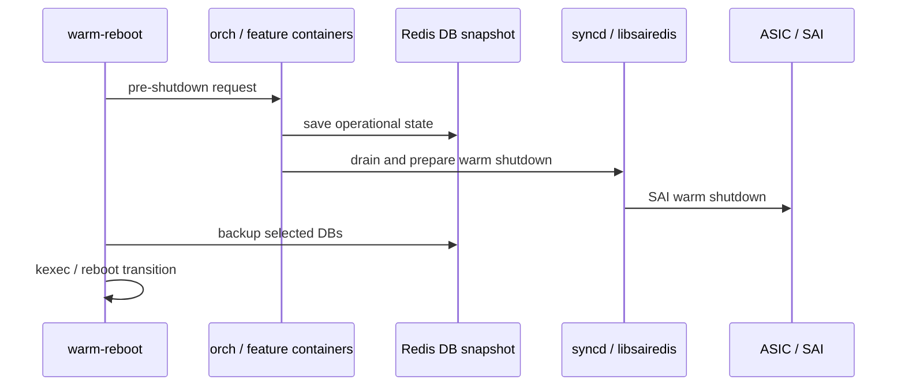

# Warm path の内部構造

warm reboot / warm restart の中心は、停止前に「復元に必要な状態」を固定し、起動後に「旧状態と新状態の差分」を安全に吸収することです。[SONiC](../../reference/glossary.md#term-sonic) ではこの役割が systemd/service orchestration、[Redis](../../reference/glossary.md#term-redis) DB backup、[orchagent](../../reference/glossary.md#term-orchagent)/[syncd](../../reference/glossary.md#term-syncd)、[SAI](../../reference/glossary.md#term-sai)、libsairedis、[ProducerStateTable](../../reference/glossary.md#term-producerstatetable) の複数層に分かれています。

## warm shutdown で作る前提

system-wide warmboot の going down path は、単に service を止めるだけではありません。上位 service に warm shutdown を通知し、application DB や [ASIC](../../reference/glossary.md#term-asic) state を保存し、syncd / SAI が warm shutdown として ASIC に伝えられる状態を作ります。この順序が崩れると、起動後に「ASIC 上には object が残っているが、SONiC 側の期待 state と一致しない」状況になります。

[System-wide Warmboot](../../system/system-wide-warmboot.md) はこの down/up path と SAI 期待値を説明しています。

## 起動後は「再作成」ではなく「照合」

warm boot の going up path では、SONiC の daemons は通常起動に近い形で desired state を Redis に書き戻します。ただし ASIC には既存 object が残っているため、syncd 側は単純な create/delete ではなく、既存 object と新しい request の差分を比較します。

この差分適用の考え方は [ProducerStateTable の view switching](../../switching/view-switching-in-producerstatetable.md) に現れます。temporary view に新しい desired state を積み、`apply_temp_view()` で既存 view と比較して、必要な set/delete だけを downstream に流します。

## SAI object をどう扱うか

warm reboot の難所は、SAI object ID が通常の process restart をまたいで同じ意味を持つとは限らない点です。[HLD](../../reference/glossary.md#term-hld) では大きく 2 つの方向が示されています。

- syncd view comparison: ASIC に残った object と新しい request を syncd が比較し、create/delete/set を最小化する。
- libsairedis idempotence: libsairedis が object cache を持ち、duplicate create や冪等な set/remove を吸収する。

[Warm Reboot 開発フェーズと OID 復元戦略](../../system/what-are-the-development-phases-and-scope-for-warm-reboot.md) は、この段階的な設計を読む入口です。実装寄りの cache や duplicate 抑止は [libsairedis API idempotence](../../system/sonic-libsairedis-api-idempotence-support.md) を参照します。

## 保持される状態と保持されない状態

warm path で守ろうとする主な状態は、ASIC 上の forwarding object、[FDB](../../reference/glossary.md#term-fdb)/neighbor/route に関係する operational state、[LAG](../../reference/glossary.md#term-lag)/[BGP](../../reference/glossary.md#term-bgp) peer が許容する graceful interval、そして Redis に保存された application state です。一方、すべての process memory が保持されるわけではありません。daemon は再起動し、[CONFIG_DB](../../reference/glossary.md#term-config_db) から desired config を読み直し、[STATE_DB](../../reference/glossary.md#term-state_db)/[APPL_DB](../../reference/glossary.md#term-appl_db)/[ASIC_DB](../../reference/glossary.md#term-asic_db) や kernel state と照合します。

そのため warm reboot の成否は、個々の feature が「restore 可能な state を持つか」「起動後の replay が冪等か」「timer 内に EOIU / reconciliation を完了できるか」に依存します。

## 関連ページ

- [System-wide Warmboot](../../system/system-wide-warmboot.md)
- [SONiC Warm Reboot](../../system/sonic-warm-reboot.md)
- [ProducerStateTable の view switching](../../switching/view-switching-in-producerstatetable.md)
- [libsairedis API idempotence](../../system/sonic-libsairedis-api-idempotence-support.md)
- [Warm Reboot 開発フェーズと OID 復元戦略](../../system/what-are-the-development-phases-and-scope-for-warm-reboot.md)

<!-- glossary-links-injected: ec18b66e3507 -->
