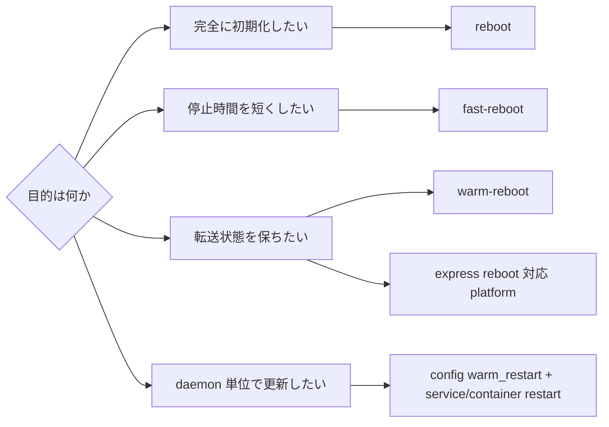

# Reboot family の選び方

SONiC の reboot は、単に「速い順」に並べるよりも、どの状態を保持し、どこで整合性を取り直すかで見ると判断しやすくなります。通常の cold reboot は最も単純で、OS と container をすべて落として再起動します。fast reboot は kernel 切替を短縮し、warm reboot は data plane を可能な限り維持しながら control plane を戻します。express reboot はさらに特定プラットフォーム向けにデータプレーン断を短くする設計です。

## まず区別する軸

| 種別 | 主な入口 | 守りたいもの | 失われるもの / 注意点 |
|---|---|---|---|
| Cold reboot | `reboot` | クリーンな再起動、platform pre-check、次回 image 検証 | control plane と data plane は停止する |
| Fast reboot | `fast-reboot` | reboot 時間の短縮、kexec による kernel 切替 | data plane は停止する。復元は DB backup と起動後 reconciliation に依存する |
| Warm reboot | `warm-reboot` | ASIC / data plane 状態、BGP GR など peer 側の継続性 | warm shutdown 準備、DB backup、SAI/アプリの対応が前提 |
| Express reboot | `fast-reboot` 拡張 | サブ秒級の data plane impact を狙う platform-specific path | Cisco 8000 向け HLD の前提が強く、汎用機能として読まない |
| Service warm restart | `config warm_restart` と container restart | swss、bgp、teamd など daemon 単位の状態復元 | OS reboot ではない。module ごとの timer と restore path を見る |

詳細な CLI オプションは [reboot / fast-reboot / warm-reboot コマンド](../../reference/cli/reboot-fast-warm.md) にまとまっています。

## fast reboot と warm reboot の違い

fast reboot は「素早く落として戻す」経路です。kexec を使い、boot loader や firmware 初期化の一部を避けますが、data plane を維持すること自体は主目的ではありません。起動後は syncd、neighsyncd、fpmsyncd などが DB や kernel state を使って復元し、最終的に reboot finalizer が整合性を締めます。詳しくは [Fast-reboot Flow Improvements](../../system/fast-reboot-flow-improvements-hld.md) を参照します。

warm reboot は「落とす前に warm shutdown を成立させ、戻る時に warm recovery と reconciliation を行う」経路です。ASIC が warm boot をサポートし、SAI object、Redis state、routing/LAG peer との graceful behavior が揃って初めて意味を持ちます。要件と順序は [SONiC Warm Reboot](../../system/sonic-warm-reboot.md) が基礎です。

## warm restart は reboot ではない

`config warm_restart` は system-wide reboot ではなく、daemon や feature container の restart 時に状態を戻すための設定です。たとえば `swss` の warm restart は、APPL_DB / ASIC_DB / kernel / orchagent の関係を検証しながら restore と sync up を行います。warm reboot と同じく「状態を保持して差分を吸収する」考え方を使いますが、対象は OS ではなく service lifecycle です。

## express reboot は派生として読む

Express reboot は [Express Reboot](../../system/sonic-express-reboot-hld-spec.md) の HLD にあるように、fast reboot script、syncd start type、platform integration を拡張して、特定 platform の sub-second data plane disruption を狙います。一般的な SONiC reboot の入口としてではなく、fast/warm の概念を理解した後の platform-specific optimization として読むのが自然です。

## 関連ページ

- [Warm-Reboot / Fast-Reboot 関連](../../categories/reboot.md)
- [SONiC Warm Reboot](../../system/sonic-warm-reboot.md)
- [Fast-reboot Flow Improvements](../../system/fast-reboot-flow-improvements-hld.md)
- [Express Reboot](../../system/sonic-express-reboot-hld-spec.md)
- [reboot / fast-reboot / warm-reboot コマンド](../../reference/cli/reboot-fast-warm.md)
