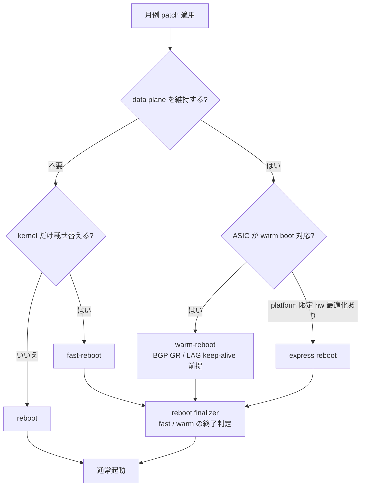
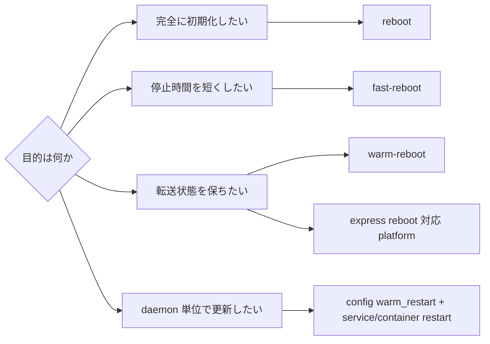

# Reboot family の選び方

[SONiC](../../reference/glossary.md#term-sonic) の reboot は、単に「速い順」に並べるよりも、どの状態を保持し、どこで整合性を取り直すかで見ると判断しやすくなります。通常の cold reboot は最も単純で、OS と container をすべて落として再起動します。fast reboot は kernel 切替を短縮し、warm reboot は data plane を可能な限り維持しながら control plane を戻します。express reboot はさらに特定プラットフォーム向けにデータプレーン断を短くする設計です。

## Reboot family は何を解決するか

データセンタでスイッチを再起動するときに困るのは、停止時間そのものよりも「停止中に転送が落ちる」「再起動後に経路が落ち着くまで通信が不安定になる」ことです。アプリケーション側からすると、TCP セッションが切れる、[RoCE](../../reference/glossary.md#term-roce) が止まる、[BGP](../../reference/glossary.md#term-bgp) がフルテーブル再収束する、というのが避けたいイベントです。Reboot family はそれぞれ違う設計判断でこの問題に取り組みます。

- 「設備保全のために完全に綺麗な状態から起動したい」→ cold reboot
- 「セキュリティパッチを当てる程度なので、停止時間は短く済ませたい」→ fast reboot
- 「BGP GR とハードウェアの転送状態を維持して、隣接機器から見えないように落としたい」→ warm reboot
- 「sub-second の data plane 断で完結させたい」→ express reboot
- 「OS ごと落とすほどではなく、特定 daemon だけ更新したい」→ service warm restart

つまり Reboot family が解決しているのは、「**どの粒度の停止で、どの状態を保持して、どこから戻すか**」という運用工程の選択肢を提供することです。逆に「速度だけ」「ダウンタイムだけ」で選ぶと、保持されない状態に依存した運用設計をしてしまって痛い目に遭います。

## SONiC 内での位置

Reboot 系の機能は **management plane と control plane の境界** に座ります。

- 入口は CLI (`reboot` / `fast-reboot` / `warm-reboot` / `config warm_restart ...`)、[gNOI](../../reference/glossary.md#term-gnoi) (`Reboot` RPC)、Ansible 等の自動化経路。
- 中間で `pre-shutdown`、`warm shutdown`、DB backup（`/host/warmboot/`）、kexec の準備が走ります。
- 起動時には reboot type を `STATE_DB` / `/proc/cmdline` から判別し、[syncd](../../reference/glossary.md#term-syncd) / [orchagent](../../reference/glossary.md#term-orchagent) / [fpmsyncd](../../reference/glossary.md#term-fpmsyncd) / [neighsyncd](../../reference/glossary.md#term-neighsyncd) / [teamd](../../reference/glossary.md#term-teamd-teamsyncd-teammgrd) などが各々 warm / fast モードで起動し、最終的に reboot finalizer が「整合性が取れた」と判定して終了します。
- データプレーン状態の維持は [SAI](../../reference/glossary.md#term-sai) の warm boot サポートと [ASIC](../../reference/glossary.md#term-asic) firmware の協力が前提です。
- BGP / [LACP](../../reference/glossary.md#term-lacp) / IGMP などの control plane プロトコルは [Graceful Restart](../../reference/glossary.md#term-graceful-restart) や warm restart 拡張で peer 側にも見えないように落ちます。

つまり Reboot は「**OS 全体の lifecycle イベントとして system 全コンポーネントを一斉に協調させる**」サブシステムです。1 コンポーネントでも warm 対応が抜けると warm reboot は不成立になります。

## 用語の定義

- **Cold reboot**: 普通の `reboot`。OS ごと止めて起動し直す。
- **Fast reboot**: kexec で kernel だけ載せ替えて bootloader / firmware 初期化を省略する。data plane は止まる。
- **Warm reboot**: data plane を維持したまま OS を再起動。SAI の warm boot と DB backup / restore に依存。
- **Express reboot**: fast reboot を拡張し、特定 ASIC で data plane 断を sub-second に詰めた派生。Cisco 8000 系向け [HLD](../../reference/glossary.md#term-hld) が背景。
- **Service warm restart**: OS は維持したまま、`swss` / `bgp` / `teamd` などの container や daemon 単位で warm 再起動する。
- **Warm shutdown / pre-shutdown**: warm reboot 前に SAI / orchagent / fpmsyncd 等に「これから warm で落ちる」と通知し、DB を凍結する手順。
- **Reconciliation**: 起動後に kernel と [APPL_DB](../../reference/glossary.md#term-appl_db) の状態を突き合わせて、抜け漏れを補正するフェーズ。
- **Reboot finalizer**: reconciliation を待ち、整合性が取れたタイミングで warm/fast モードを終了させる単純な systemd unit。
- **kexec**: Linux の機能で、既存 kernel から新 kernel を直接ロードして起動する仕組み。BIOS / bootloader を経由しない。

## 典型シーン: 月例のセキュリティパッチ適用

最も多いユースケースは、夜間メンテで OS のセキュリティパッチを適用したい、ダウンタイムは短いほどよい、BGP peer から見るとちょっと flap してくれていい、というレベルです。

警告として、warm reboot は **「事前条件が成立しないと automatic に cold reboot に落ちる」** ことが多く、その判定は `warm-reboot` script の最初に出ます。CLI が `Warm reboot is not supported` と返したらそこで一度停止し、何が足りないかを確認するのが正解です。

## まず区別する軸

| 種別 | 主な入口 | 守りたいもの | 失われるもの / 注意点 |
|---|---|---|---|
| Cold reboot | `reboot` | クリーンな再起動、platform pre-check、次回 image 検証 | control plane と data plane は停止する |
| Fast reboot | `fast-reboot` | reboot 時間の短縮、kexec による kernel 切替 | data plane は停止する。復元は DB backup と起動後 reconciliation に依存する |
| Warm reboot | `warm-reboot` | ASIC / data plane 状態、BGP GR など peer 側の継続性 | warm shutdown 準備、DB backup、SAI/アプリの対応が前提 |
| Express reboot | `fast-reboot` 拡張 | サブ秒級の data plane impact を狙う platform-specific path | Cisco 8000 向け HLD の前提が強く、汎用機能として読まない |
| Service warm restart | `config warm_restart` と container restart | swss、bgp、teamd など daemon 単位の状態復元 | OS reboot ではない。module ごとの timer と restore path を見る |

詳細な CLI オプションは [reboot / fast-reboot / warm-reboot コマンド](../../reference/cli/reboot-fast-warm.md) にまとまっています。

## fast reboot と warm reboot の違い

fast reboot は「素早く落として戻す」経路です。kexec を使い、boot loader や firmware 初期化の一部を避けますが、data plane を維持すること自体は主目的ではありません。起動後は syncd、neighsyncd、fpmsyncd などが DB や kernel state を使って復元し、最終的に reboot finalizer が整合性を締めます。詳しくは [Fast-reboot Flow Improvements](../../system/fast-reboot-flow-improvements-hld.md) を参照します。

warm reboot は「落とす前に warm shutdown を成立させ、戻る時に warm recovery と reconciliation を行う」経路です。ASIC が warm boot をサポートし、SAI object、[Redis](../../reference/glossary.md#term-redis) state、routing/[LAG](../../reference/glossary.md#term-lag) peer との graceful behavior が揃って初めて意味を持ちます。要件と順序は [SONiC Warm Reboot](../../system/sonic-warm-reboot.md) が基礎です。

## warm restart は reboot ではない

`config warm_restart` は system-wide reboot ではなく、daemon や feature container の restart 時に状態を戻すための設定です。たとえば `swss` の warm restart は、APPL_DB / [ASIC_DB](../../reference/glossary.md#term-asic_db) / kernel / orchagent の関係を検証しながら restore と sync up を行います。warm reboot と同じく「状態を保持して差分を吸収する」考え方を使いますが、対象は OS ではなく service lifecycle です。

## express reboot は派生として読む

Express reboot は [Express Reboot](../../system/sonic-express-reboot-hld-spec.md) の HLD にあるように、fast reboot script、syncd start type、platform integration を拡張して、特定 platform の sub-second data plane disruption を狙います。一般的な SONiC reboot の入口としてではなく、fast/warm の概念を理解した後の platform-specific optimization として読むのが自然です。

## 似た機能との違い

| 比較対象 | 共通点 | 違い |
|---|---|---|
| ISSU (In-Service Software Upgrade) | 無停止アップグレード狙い | ISSU はベンダー OS の概念。SONiC は「warm reboot で同等を目指す」アプローチで、ISSU 専用 path はない |
| Container restart (`docker restart`) | プロセスだけ動かす | container restart は OS 全体を維持。service warm restart はそれに「state を持って戻す」工程を追加 |
| Kernel hot patch (kpatch / livepatch) | OS 停止せず修正 | 反映できるのは kernel patch のみ。SONiC のユーザ空間 / SAI 更新は cover しない |
| BGP Graceful Restart | peer から落ちて見えない | BGP GR は protocol 機能。warm reboot は GR を「使うため」の OS 側基盤 |
| Power cycle | 完全に落とす | power cycle は人手 / PDU 操作。cold reboot より長く、BIOS POST も走る |

warm reboot と「container restart + warm restart 機能」は混同しやすいですが、**前者は kernel ごと再起動する OS イベント、後者は OS は触らない daemon イベント** という違いを覚えておくと判断が早くなります。

## 読了後にできること

- 「BGP GR 対応 peer に対しては warm reboot、GR 未対応 peer も含む場合は fast reboot」のような選択を、root cause から説明できる
- warm reboot 前に `show warm_restart config` で feature ごとの restart timer を確認する必要性が分かる
- 起動後の `show warm_restart state` で stuck している daemon を特定し、reboot finalizer がなぜ終了しないかの当たりがつく
- express reboot は platform-specific であり、自前 platform で動かない場合の原因（[ASIC SDK](../../reference/glossary.md#term-asic-sdk) / SAI 拡張 / fast-reboot script の patch）まで遡れる
- service warm restart と warm reboot の関係を「同じ DB backup / restore の枠組みを、対象範囲を変えて再利用している」と整理して説明できる

## 関連ページ

- [Warm-Reboot / Fast-Reboot 関連](../../categories/reboot.md)
- [SONiC Warm Reboot](../../system/sonic-warm-reboot.md)
- [Fast-reboot Flow Improvements](../../system/fast-reboot-flow-improvements-hld.md)
- [Express Reboot](../../system/sonic-express-reboot-hld-spec.md)
- [reboot / fast-reboot / warm-reboot コマンド](../../reference/cli/reboot-fast-warm.md)

<!-- xref-prereq -->
## この章の前提知識

この章を読み進める前に、次の章を押さえておくと迷子になりにくい。

- [SONiC 全体像と設定基盤](../01-overview/index.md)
- [SWSS / SAI / Redis 内部実装](../20-swss-sai-redis/index.md)

<!-- glossary-links-injected: ec18b66e3507 -->
