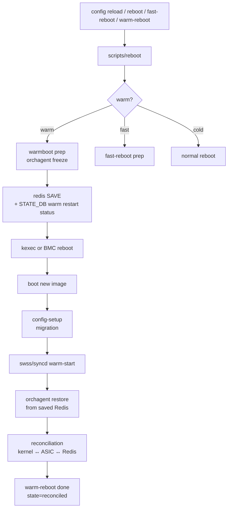
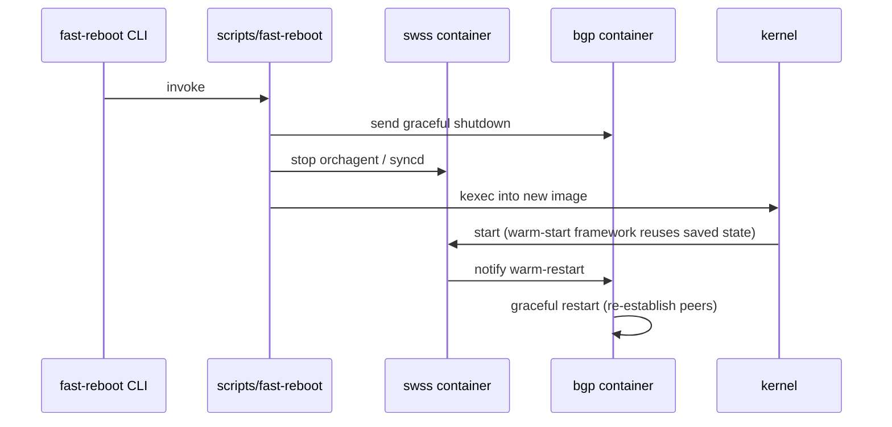

# 内部実装

reboot / upgrade / lifecycle の内部実装は「どこまで data plane を生かしたまま control plane を入れ替えるか」を決める warmboot / fastboot のステートマシン、そして config migration / image install の二つの層で動いています。

## データフロー



## 主要 daemon / コンポーネントの責務

| コンポーネント | 主実体 | 責務 |
| --- | --- | --- |
| `scripts/fast-reboot` / `scripts/warm-reboot` | bash + python | reboot 種別ごとの前準備、kexec / BMC reboot / 通常 reboot の選択 |
| `warmboot-finalizer` (`scripts/warmboot-finalizer`) | service | 各コンポーネント reconcile 完了通知を集約し、warm-reboot を最終確定 |
| `config-setup` | systemd service | 起動時の `factory` / `migrate` / `boot` を mode 切替で処理（→ 01 章） |
| `db_migrator` (`fast-reboot-dump.py` ではなく `db_migrator.py`) | python | [CONFIG_DB](../../reference/glossary.md#term-config_db) の schema migration（古い key を新形式へ） |
| `swss` warm-restart | `orchagent::warm-start` framework | `WarmStart::isWarmStart()`、`WarmStart::setWarmStartState()` で状態管理 |
| `syncd` warm-restart | `syncd/syncd.cpp` の WARM モード | [ASIC](../../reference/glossary.md#term-asic) 状態は触らず、`ASIC_DB` の view と [SAI](../../reference/glossary.md#term-sai) obj を再同期 |
| `bgp` warm-restart | [FRR](../../reference/glossary.md#term-frr) (`bgpd` の graceful restart) | helper / restarter で advertise を維持 |
| `teamd` warm-restart | [teamd](../../reference/glossary.md#term-teamd-teamsyncd-teammgrd) graceful | [LACP](../../reference/glossary.md#term-lacp) セッションを切らずに保持 |

## STATE_DB の warm-restart テーブル

`STATE_DB` の `WARM_RESTART_TABLE` と `WARM_RESTART_ENABLE_TABLE` がこの機能の心臓部です。

```yaml
STATE_DB:WARM_RESTART_ENABLE_TABLE|<comp>
  enable: "true|false"
STATE_DB:WARM_RESTART_TABLE|<comp>
  restore_count: <int>
  state: "initialized|restored|reconciled|disabled|failed"
  restart_time: <epoch>
```

`<comp>` は `swss`、`bgp`、`teamd`、`syncd`、`natsyncd` 等。warmboot-finalizer は全コンポーネントの `state = reconciled` を待ち、タイムアウト時は alarm + state=failed にします。

## SAI / syncd 側の warm-start

`syncd` は warm モードで起動すると、`SAI_SWITCH_ATTR_RESTART_WARM = true` を `sai_create_switch` に渡し、ASIC 状態を触らずに内部 view を `ASIC_DB` の最新 snapshot から復元します。これがベンダ SAI で適切に実装されていないと、warm-reboot 中にパケットドロップやリンクダウンが発生します。

主な属性:

- `SAI_SWITCH_ATTR_RESTART_WARM`
- `SAI_SWITCH_ATTR_WARM_RECOVER`
- `SAI_SWITCH_ATTR_UNINIT_DATA_PLANE_ON_REMOVAL = false`（warm-reboot 直前に SAI shutdown 時 ASIC を触らせない）

## ZMQ / Redis pub/sub

- warm-restart の進捗通知は **[STATE_DB](../../reference/glossary.md#term-state_db) の通常 key + [Redis](../../reference/glossary.md#term-redis) pub/sub** で実装され、ZMQ は使いません。
- `warmboot-finalizer` は `STATE_DB:WARM_RESTART_TABLE|*` を subscribe して全件 reconciled を検知します。
- [BGP](../../reference/glossary.md#term-bgp) は FRR 内で graceful restart の制御を行い、[SONiC](../../reference/glossary.md#term-sonic) 側は `WARM_RESTART_TABLE|bgp` の状態だけを更新します。

## 既知の実装上の制約

- **warm-reboot は ASIC の SDK が warm boot をサポートしている前提**で、Edgecore / NVIDIA Mellanox / Broadcom SAI で動作する一方、新しい SoC 上の port speed 変化や FW upgrade を含む変更は warm でカバーできません。fast-reboot にフォールバックする選択肢を運用で持つ必要があります。
- `db_migrator` の migration は前進方向のみで、新版 → 旧版の downgrade migration は基本サポートされません（image rollback 時は startup config を別途準備する運用です）。
- warmboot 中の **`CONFIG_DB` への書き込み禁止**は厳密で、`gnmi SET` や `config` CLI が走ると [orchagent](../../reference/glossary.md#term-orchagent) 復元中に整合性が崩れます。warm-reboot 中の write は管理側でブロックしてください。
- `fast-reboot` は data plane が ~30s 切れる前提で設計されており、warm-reboot より要求 SAI 機能が少なく対応 ASIC が広い一方、BGP の収束待ちが入ります。
- ONIE / image install 系（`sonic-installer`）は SONiC の docker image を持ち回るためサイズが大きく、`/host` パーティションの空き容量が問題になりやすいです。[HLD](../../reference/glossary.md#term-hld) の `image dir 構造`を運用で意識する必要があります。

## fast-reboot タイムライン

fast-reboot は data plane が一時的に切れる前提で、warm-reboot より要求 SAI 機能が少ない代わりに以下の順序で進みます。



`scripts/fast-reboot-dump.py` が ASIC/[FDB](../../reference/glossary.md#term-fdb) の dump を取ります。dump は `/host/warmboot/` 配下に保存されます。新 image 起動後の `warmboot-finalizer` (`finalize-warmboot.sh`) が dump と比較して route / neighbor の差分を打ち消します。

## sonic-installer の内部

`sonic-installer` は `/host/image-<version>/` 配下に新 image を展開する CLI です。

- `install`: `.bin` または `.swi` を展開、GRUB / aboot のエントリを追加
- `set-next-boot`: GRUB default または aboot `boot-config` を変更
- `set-default`: 永続デフォルトを設定
- `cleanup`: 起動失敗 / rollback 用に古い image を保持しつつ、定義数を超えたら削除

`/host` パーティションのサイズ（通常 数 GB）が image の数を制約します。docker image をホスト側で持ち回るため、image 1 つで 1〜2GB 消費します。

## 関連ページ

- [SONiC warm reboot](../../system/sonic-warm-reboot.md)
- [Multi-ASIC warm reboot](../../system/multi-asic-warm-reboot.md)
- [Fast reboot flow improvements](../../system/fast-reboot-flow-improvements-hld.md)
- [System-wide warmboot](../../system/system-wide-warmboot.md)
- [Warmboot manager HLD](../../system/warmboot-manager-hld.md)
- [SWSS docker warm restart](../../system/sonic-swss-docker-warm-restart.md)
- [Config setup](../../system/sonic-configuration-setup-service.md)
- [SONiC upgrade](./upgrade.md)

<!-- glossary-links-injected: ec18b66e3507 -->
