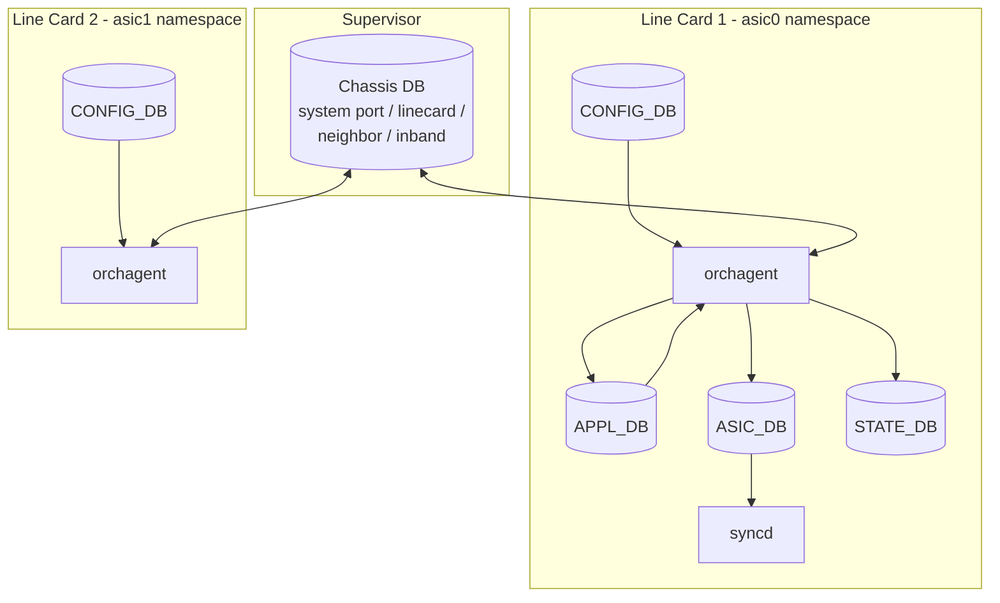
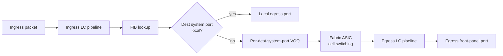

# アーキテクチャ

ここでは「supervisor の Chassis DB」「各 [ASIC](../../reference/glossary.md#term-asic) namespace の [Redis](../../reference/glossary.md#term-redis)」「fabric を介した distributed forwarding」がどう組み合わさって 1 つの論理スイッチに見えるかを、データの流れ順に並べます。

## DB レイヤの全景

`CONFIG_DB` / `APPL_DB` / `ASIC_DB` / `STATE_DB` / `COUNTERS_DB` は ASIC namespace ごとに独立しています。host namespace の `CONFIG_DB` は management 系、Chassis DB は line card 横断の system 観点を持ちます。Chassis DB は supervisor の Redis に置かれ、各 line card の [orchagent](../../reference/glossary.md#term-orchagent) が必要分を subscribe / publish します。

## System Port と FIB 解決

各 line card の orchagent は、自分の物理ポートを [SAI](../../reference/glossary.md#term-sai) 経由で port object として作る一方、Chassis DB の `SYSTEM_PORT_TABLE` を読んで「ローカルにはない他 line card 上の system port」を SAI system port object として登録します。

FIB は基本的に従来通り構築されますが、next hop の出口が他 line card の system port である場合、ingress line card の [VOQ](../../reference/glossary.md#term-voq) が宛先 system port 単位に確保されます。

VOQ は ingress 側に存在し、egress system port ごとに credit を受け取って送出可否を決めます。これにより、egress 側で輻輳しても ingress でバッファリングされ、他の egress 宛て traffic は HOL blocking されません。

## Fabric Port の役割

fabric port は line card と fabric card の間を結ぶ内部リンクです。L2 / L3 アドレスは持たず、cell スイッチングのためのリソースとして扱われます。fabric ASIC は forwarding decision をせず、ingress line card がつけた destination 情報に従って cell を中継します。

fabric port は `STATE_FABRIC_PORT_TABLE` や `STATE_FABRIC_LINK_MONITORING` のような state を持ち、`show fabric` 系コマンドや link monitoring サブシステムから運用上の異常を検出できます。

## Recirculation Port

VOQ chassis での recirculation port は、たとえば [MPLS](../../reference/glossary.md#term-mpls) pop 後の二段目 lookup、[SRv6](../../reference/glossary.md#term-srv6) の segment 残処理、IP-in-IP 二重カプセル化などで「同じ ASIC のパイプラインをもう一度通したい」ときに使われます。recirculation port は ASIC capability から自動的に確保され、`PORT` テーブルとは別に `RECIRC_PORT` 系統で管理されます。

運用者が直接設定するものではないが、SAI [ACL](../../reference/glossary.md#term-acl) の bind 先や counter で recirculation port 経由のパケットが見えると混乱しがちなので、「内部リソースで、利用機能に応じて見える」と理解しておくと整合が取れます。

## Distributed Forwarding と Counter

distributed VOQ forwarding [HLD](../../reference/glossary.md#term-hld) で押さえる重要点:

- 統計の「正解」は ingress 側 VOQ counter と egress 側 port counter の両方にある。
- 単一 port から見える drop は、実は他 line card の VOQ credit 不足が原因の場合がある。
- [COUNTERS_DB](../../reference/glossary.md#term-counters_db) は ASIC namespace ごとに分かれているため、aggregate 表示は CLI 側で集約する必要がある。

aggregate VOQ counter の集約は [運用](operations.md) で扱います。

## Multi-Namespace Redis の制約

`support-redis-databases-in-multiple-namespaces` HLD は、[SONiC](../../reference/glossary.md#term-sonic) のプロセスがどうやって自身の namespace に属する Redis を見つけるかを定義します。`/var/run/redisN` のソケット、`database_config.json` の namespace 別エントリ、`SonicV2Connector(namespace=...)` の挙動などが規定されており、外部から触るスクリプトは「namespace を意識せずに書くと host の Redis にしか繋がらない」点に注意します。

orchagent / sai_redis / [syncd](../../reference/glossary.md#term-syncd) は通常起動時に自分の namespace 用 Redis を読みますが、Chassis DB に書き込む処理だけは supervisor の Redis を明示参照します。

## 関連ページ

- [Distributed Forwarding in VOQ Architecture](../../acl-qos/distributed-forwarding-in-a-virtual-output-queue-voq-architecture.md)
- [VOQ SONiC](../../platform/voq-sonic.md)
- [Fabric Port Support](../../platform/fabric-port-support-on-sonic.md)
- [Recirculation Port on VOQ Chassis](../../platform/recirculation-port-support-on-voq-chassis.md)
- [Redis Databases in Multiple Namespaces](../../internals/support-redis-databases-in-multiple-namespaces.md)
- [DB Design for Multi-ASIC Scenarios](../../platform/db-design-for-multi-asic-scenarios.md)

<!-- glossary-links-injected: ec18b66e3507 -->
