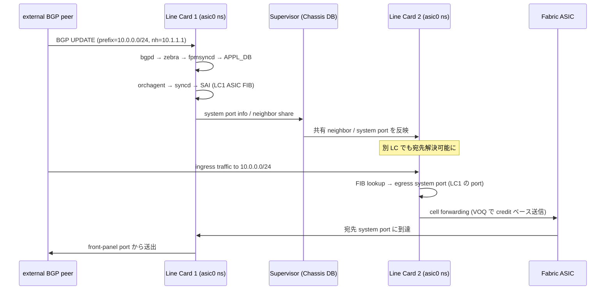

# 概念

[Multi-ASIC](../../reference/glossary.md#term-multi-asic) と [VOQ](../../reference/glossary.md#term-voq) chassis は別の話に見えて段階的につながっています。ここでは pizza-box 1 [ASIC](../../reference/glossary.md#term-asic) を基準に、どこから「Multi-ASIC」になり、どこから「VOQ chassis」になるのかを言葉のレベルで整理します。

## Multi-ASIC / VOQ は何を解決するか

1 ASIC の pizza-box では足りない radix（ポート数 × 帯域）が必要になったとき、ハードウェア側は「1 筐体に複数 ASIC を載せる」「複数 line card を fabric でつなぐ」という拡張を取ります。ところが NOS から見ると、ASIC が複数あるだけで以下が一気に難しくなります。

- ポート命名空間: `Ethernet0` が複数 ASIC の片方にあるのか、どちらにあるのか
- routing daemon: 同じ [BGP](../../reference/glossary.md#term-bgp) プロセスから複数 ASIC の RIB を更新するのか、ASIC ごとに別 daemon を立てるのか
- 設定永続化: [CONFIG_DB](../../reference/glossary.md#term-config_db) は 1 つで全 ASIC を表すのか、ASIC ごとに 1 つ持つのか
- counter / show: `show interfaces counters` は ASIC を跨ぐのか、まとめるのか
- fabric / chassis: line card を跨いだ system port は単一 switch に見えるのか

Multi-ASIC [SONiC](../../reference/glossary.md#term-sonic) と VOQ SONiC が解決しているのは、**「複数 ASIC があるのに 1 つのスイッチとして運用できる」UX を NOS 側で組み上げる**ことです。具体的な手段が、namespace 分離、[Redis](../../reference/glossary.md#term-redis) インスタンス多重化、Chassis DB、system port、distributed VOQ の組み合わせです。

## SONiC 内での位置

Multi-ASIC / VOQ は data plane の構造を反映した **全層横断のアーキテクチャ変更** で、特定 1 機能ではなく次の各層に変更が入ります。

- **Linux**: ASIC ごとに `asic0`、`asic1` ... の network namespace を作り、portmgmtd / [orchagent](../../reference/glossary.md#term-orchagent) / [syncd](../../reference/glossary.md#term-syncd) / bgpd を namespace 内で複数起動
- **Redis / DB**: ASIC ごとに `redis<N>.sock` を立て、CONFIG_DB / [APPL_DB](../../reference/glossary.md#term-appl_db) / [ASIC_DB](../../reference/glossary.md#term-asic_db) / [STATE_DB](../../reference/glossary.md#term-state_db) / [COUNTERS_DB](../../reference/glossary.md#term-counters_db) をそれぞれ分離。host namespace は管理系の CONFIG_DB を別途持つ
- **Routing**: BGP は ASIC namespace ごとに bgpd を立て、internal-BGP で各 ASIC 間を繋ぐ。[FRR](../../reference/glossary.md#term-frr) の `vrf` ではなく namespace で分離
- **Forwarding plane**: VOQ chassis では fabric ASIC + system port + distributed VOQ により、line card 間で 1 つの論理 switch を構成
- **CLI**: `show` 系コマンドが `--namespace` を取り、引数なしのときは全 namespace を集約。`sonic-utilities` が namespace 一覧を `/usr/share/sonic/device/.../asic.conf` から読む

つまり Multi-ASIC / VOQ 章は、他の機能章（BGP / [VXLAN](../../reference/glossary.md#term-vxlan) / [QoS](../../reference/glossary.md#term-qos) / Reboot...）が**「1 ASIC の前提」で書かれている内容に対する例外条項集**でもあります。BGP 章の話を Multi-ASIC で適用するときに何が変わるか、というレンズで読み返すと意味が立ち上がります。

## 用語の定義

- **Pizza-box**: 1U〜2U 程度の fixed switch。多くは 1 ASIC。
- **Multi-ASIC platform**: 1 筐体に複数 ASIC を搭載した固定スイッチ。例: 一部 7800 / 7050 系の大型機。
- **VOQ chassis**: 複数 line card と fabric / supervisor card を持つシャーシ型システム。modular chassis とも。
- **Line card (LC)**: front-panel port と 1 つ以上の ASIC を搭載する差し込みカード。
- **Fabric card / supervisor**: line card 間を fabric ASIC で結ぶ内部スイッチング層を担当するカード。
- **Namespace**: Linux network namespace。SONiC では ASIC ごとに 1 つ。
- **Front-panel port**: 運用者が実際にケーブルを挿す物理 port。`Ethernet0` などの命名。
- **System port**: VOQ chassis 全体で一意な論理 port ID。chassis 内の全 front-panel port を 1 名前空間で表現する。
- **Fabric port**: line card と fabric ASIC を結ぶ内部 port。L2/L3 forwarding はせず cell スイッチング。
- **Recirculation port**: ASIC 内でパケットを再度パイプライン入力に戻すための内部 loop port。
- **Chassis DB**: supervisor 上に立つ Redis インスタンスで、全 line card に共通な system port、neighbor、router 等を集約。
- **Distributed VOQ**: ingress 側で egress system port 単位の virtual output queue を持ち、credit ベースで egress に送る仕組み。HOL blocking を回避。
- **Switch type**: `DEVICE_METADATA.localhost.switch_type` に `chassis-packet` / `voq` / `fabric` などが入り、起動時の挙動を分岐。

## Pizza-box / Multi-ASIC / VOQ Chassis の三層

- **Pizza-box (1 ASIC)**: NOS は単一の Redis インスタンスと単一の network namespace で動きます。CLI と CONFIG_DB が 1 対 1 です。
- **Multi-ASIC (1 筐体・複数 ASIC)**: 1 つの NOS インスタンスの中で、ASIC ごとに独立した network namespace (`asic0`, `asic1`, ...) と独立した Redis インスタンスを持ちます。host namespace は外向きの CLI / management、ASIC namespace は実際の port / route を持ちます。
- **VOQ Chassis (複数 line card + supervisor)**: 各 line card が Multi-ASIC SONiC として動き、supervisor 上の **Chassis DB** と fabric ASIC が、複数 line card の system port を 1 つの論理スイッチとして束ねます。

つまり VOQ chassis は Multi-ASIC を内包しつつ、さらに「複数 line card を 1 つの switch に見せる」層を持ちます。Multi-ASIC platforms [HLD](../../reference/glossary.md#term-hld) が namespace の枠組みを定義し、VOQ SONiC HLD がその上に Chassis DB / system port / distributed VOQ を載せる構造です。

## Namespace と Redis インスタンス

Multi-ASIC では、ASIC ごとに `/var/run/redis<N>/redis.sock` のような分離された Redis を持ち、`CONFIG_DB`, `APPL_DB`, `STATE_DB`, `ASIC_DB`, `COUNTERS_DB` がそれぞれの namespace 内に存在します。host namespace は別に `CONFIG_DB` を持ち、管理系（hostname、management interface、BGP の grouping 情報など）を扱います。

orchagent / syncd / bgpd といった主要プロセスは namespace ごとに 1 セット起動します。CLI ツールは `--namespace` 引数を取り、引数なしの場合は内部で全 namespace に対して問い合わせて集約表示します。

## System Port と Front-panel Port

VOQ chassis で重要なのが **system port** という概念です。

- **front-panel port**: line card の物理ポート。従来の `Ethernet0`, `Ethernet4`, ... と同じ感覚で、各 line card が持ちます。
- **system port**: chassis 全体で一意な論理ポート ID。`<line-card>|<asic>|<port>` のような形で命名され、Chassis DB が全 system port を保持します。

データプレーン上は、ある line card に入ったパケットが宛先 system port に向けて fabric を経由して送られます。FIB は宛先 system port を解決し、egress line card の出口で実際の front-panel port にマップされます。

## Fabric Port と Recirculation Port

- **fabric port**: line card と fabric card を結ぶ内部 port です。fabric ASIC は L2 / L3 forwarding をせず、cell ベースで line card 間をつなぐスイッチング機構を提供します。
- **recirculation port**: 1 つの ASIC の中で「もう一度パイプラインを通したい」ときに使う内部ループ用 port です。VOQ 系では特に [MPLS](../../reference/glossary.md#term-mpls) / GRE / IP-in-IP のような multi-pass 処理で利用されます。

front-panel port は運用者が触る port、fabric port は normally hidden、recirculation port は ASIC capability に応じて自動確保されるリソース、と覚えると見分けがつきやすいです。

## Distributed VOQ アーキテクチャ

VOQ chassis では、ingress line card が egress system port ごとに **virtual output queue** を持ち、credit ベースで egress に送れるかを判断します。HOL blocking を避けつつ、line card 間で QoS を保つための仕組みです。

詳細は [アーキテクチャ](architecture.md) で扱いますが、運用上の意味として「VOQ chassis では queue は egress port 単位ではなく ingress 側で egress system port ごとに持つ」ことを押さえると、counter や輻輳調査の入口が変わることに気付けます。

## Single-ASIC Fixed VOQ System

1 ASIC の pizza-box でも、内部で VOQ アーキテクチャを採用するシステムが定義されています。これは「pizza-box でありながら、将来的に VOQ chassis の line card として組み込むことを想定する」中間形態で、Chassis DB を持たず、system port は自分自身に閉じます。

単独運用する場合は通常の Multi-ASIC として見え、`CONFIG_DB` の `DEVICE_METADATA.localhost.switch_type = voq` のような印で識別します。設定の流儀は [設定](setup.md) で扱います。

## 典型シーン: VOQ chassis での経路投入と転送

外部 BGP peer から受けた route が、ある line card に着信して、別 line card の port から出ていく場面を考えます。

ここで重要なのは、**LC1 で受信した route 情報が Chassis DB を経由して LC2 にも届く** という点と、**LC2 で「LC1 の port が egress」と解決できる system port 抽象が要る** という点。pizza-box の感覚で「ingress 側 LC でだけ route が見えていればいい」と思うと FIB miss を量産します。

## 似た機能との違い

| 比較対象 | 共通点 | 違い |
|---|---|---|
| MLAG ([MCLAG](../../reference/glossary.md#term-mclag)) | 複数装置を 1 つに見せたい | MLAG は別筐体 2 台を [LACP](../../reference/glossary.md#term-lacp) 観点で 1 つに見せるだけ。control plane は分離、forwarding は分散 |
| Stack switch | 1 system に統合 | stack は management の統合が主、forwarding は stack link 経由。VOQ chassis のような cell-based fabric ではない |
| [VRF](../../reference/glossary.md#term-vrf) | namespace に似て見える | VRF は L3 route table の論理分離。Multi-ASIC namespace は OS レベルの完全分離 |
| Docker container | プロセス分離 | container は process / mount / network の分離。namespace 分離は network 軸のみ |
| [SmartSwitch](../../reference/glossary.md#term-smartswitch) ([DPU](../../reference/glossary.md#term-dpu)) | 複数 ASIC 的に見える | SmartSwitch は switch ASIC + DPU の組合せで、Multi-ASIC とは構造が違う。詳細は dash-smartswitch 章 |

特に **「VOQ chassis ≒ stack」 と思うのは誤読** で、VOQ chassis はハードウェアレベルで全 line card が cell-based fabric で 1 つの switch を構成するのに対し、stack は別装置の管理統合という質的に違うものです。

## 読了後にできること

- `show interfaces counters` の挙動が pizza-box と Multi-ASIC で違うことを知って、`-n asic0` を意識的に使える
- ある CLI が引数なしで「全 namespace まとめ」を返すか「host namespace だけ」を返すかを、まず疑えるようになる
- VOQ chassis 上で「BGP route が入っているのに forwarding しない」現象を、Chassis DB → system port → distributed VOQ credit のどこで止まったかで切り分けられる
- recirculation port は ASIC 機能であって front-panel port ではないので、`show interfaces` に出ない / 出ても触らない、と判断できる
- Single-ASIC VOQ system が「VOQ chassis 線形の予習」用の中間形態で、Chassis DB を持たない閉じた構成だと理解した上で switch_type を確認できる

## 関連ページ

- [SONiC on Multi-ASIC Platforms](../../platform/1-sonic-on-multi-asic-platforms.md)
- [VOQ SONiC](../../platform/voq-sonic.md)
- [Fabric Port Support](../../platform/fabric-port-support-on-sonic.md)
- [Recirculation Port on VOQ Chassis](../../platform/recirculation-port-support-on-voq-chassis.md)
- [Single-ASIC VOQ Fixed System](../../platform/single-asic-voq-fixed-system-sonic.md)

<!-- xref-prereq -->
## この章の前提知識

この章を読み進める前に、次の章を押さえておくと迷子になりにくい。

- [SONiC 全体像と設定基盤](../01-overview/index.md)
- [SWSS / SAI / Redis 内部実装](../20-swss-sai-redis/index.md)
- [BGP と FRR 制御プレーン](../02-bgp/index.md)

<!-- glossary-links-injected: 5c9b3765d470 -->
