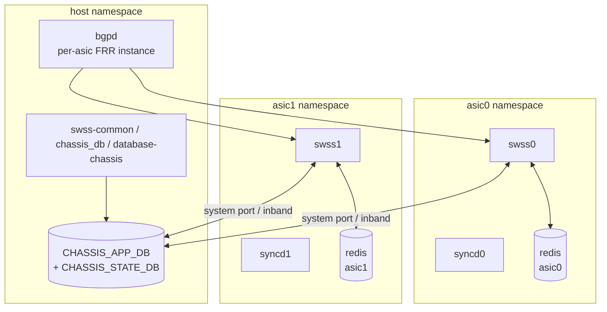

# 内部実装

[Multi-ASIC](../../reference/glossary.md#term-multi-asic) / [VOQ](../../reference/glossary.md#term-voq) chassis の内部実装は「namespace で分けられた [Redis](../../reference/glossary.md#term-redis) / [orchagent](../../reference/glossary.md#term-orchagent) / [syncd](../../reference/glossary.md#term-syncd) インスタンス」と「chassis 全体を束ねる chassis_db / database-chassis container」の二重構造で動きます。論理スイッチ単位の Redis インスタンスと、シャーシ全体で共有する Redis インスタンスを混同しないことが重要です。

## データフロー



## 主要 daemon / コンポーネントの責務

| コンポーネント | 主実体 | 責務 |
| --- | --- | --- |
| `database-chassis` container | chassis-wide `redis-server` | `CHASSIS_APP_DB` と `CHASSIS_STATE_DB` をホスト |
| per-asic `database` container | namespace 内 `redis-server` | `APPL_DB` / `ASIC_DB` / `CONFIG_DB` / `STATE_DB` / `COUNTERS_DB` |
| `orchagent` per-asic | `SwitchOrch` で `SAI_SWITCH_ATTR_TYPE = VOQ` を指定 | system port、fabric port、inband interface を作成 |
| `FabricPortsOrch` (`orchagent/fabricportsorch.cpp`) | fabric link 監視 | fabric 側 link の up/down と link mon |
| `VoqOrch` / `SystemPortOrch` | `SystemNeighOrch`、`SystemLagOrch` 等 | system port を chassis 全体で広報、neighbor / [LAG](../../reference/glossary.md#term-lag) を chassis 規模で同期 |
| `chassisd` / `chassis_db` | chassis init scripts | 全 [ASIC](../../reference/glossary.md#term-asic) の system port を `CHASSIS_APP_DB:SYSTEM_PORT_TABLE` に登録 |
| `bgpcfgd` per-asic | per-namespace [FRR](../../reference/glossary.md#term-frr) | 各 ASIC が独自の [BGP](../../reference/glossary.md#term-bgp) プロセスを持つ |

## SAI 属性使用一覧

VOQ chassis 固有:

| object | 属性 |
| --- | --- |
| `SAI_OBJECT_TYPE_SWITCH` | `SAI_SWITCH_ATTR_TYPE = SAI_SWITCH_TYPE_VOQ`、`SAI_SWITCH_ATTR_SWITCH_ID`、`SAI_SWITCH_ATTR_MAX_SYSTEM_CORES`、`SAI_SWITCH_ATTR_SYSTEM_PORT_CONFIG_LIST` |
| `SAI_OBJECT_TYPE_SYSTEM_PORT` | `SAI_SYSTEM_PORT_ATTR_CONFIG_INFO`、`SAI_SYSTEM_PORT_ATTR_ADMIN_STATE`、`SAI_SYSTEM_PORT_ATTR_QOS_TC_TO_QUEUE_MAP` |
| `SAI_OBJECT_TYPE_FABRIC_PORT` | `SAI_PORT_ATTR_TYPE = FABRIC`、`SAI_PORT_ATTR_FABRIC_ATTACHED`、`SAI_PORT_ATTR_FABRIC_REACHABILITY` |
| `SAI_OBJECT_TYPE_NEIGHBOR_ENTRY` (system) | system port を nexthop とする encap 情報を含む |

Multi-ASIC（pizza-box の packet mode 含む）では `SAI_SWITCH_ATTR_TYPE = SAI_SWITCH_TYPE_NPU` のままで、ASIC ごとに独立した [SAI](../../reference/glossary.md#term-sai) switch object を作る点が VOQ と違います。

## Redis テーブル参照関係

```yaml
Per-ASIC namespace:
  APPL_DB / CONFIG_DB / ASIC_DB / STATE_DB / COUNTERS_DB
Chassis global:
  CHASSIS_APP_DB:
    SYSTEM_PORT_TABLE
    SYSTEM_NEIGH_TABLE
    SYSTEM_LAG_TABLE
    SYSTEM_LAG_MEMBER_TABLE
  CHASSIS_STATE_DB:
    LINECARD_TABLE
    FABRIC_ASIC_TABLE
    HOSTNAME_ASIC_MAP
```

各 ASIC orchagent は自身の `APPL_DB:NEIGH_TABLE` から学習した neighbor を `CHASSIS_APP_DB:SYSTEM_NEIGH_TABLE` に複製し、他 ASIC の orchagent はそれを subscribe して自身の system port nexthop に変換します。

## ZMQ / Redis pub/sub

- chassis 内通信は **Redis pub/sub のみ**で、inband (cpu) や fabric 専用回線を経由した IP 接続上で chassis_db redis サーバに接続します。
- ZMQ は VOQ chassis では使われていません（一部の [SONiC](../../reference/glossary.md#term-sonic) chassis variant では検討された経緯はあるが master では Redis のみ）。
- `database-chassis` の redis は `0.0.0.0` で listen し、IPSec / TLS を使わない平文通信が前提。シャーシ内通信路（midplane）が信頼境界です。

## 既知の実装上の制約

- chassis_db への接続切断は ASIC 間の neighbor / system port 情報の同期を止め、データプレーンの forwarding は維持しつつ control plane は段階的に古い状態を信用する設計です。長時間の切断は警告のみで自動 reboot にはなりません。
- VOQ chassis では、各 ASIC の `CONFIG_DB` を**共通設定として一括反映**する仕組みが limited で、運用者は per-asic の [config_db.json](../../reference/glossary.md#term-config_db.json) + chassis 全体 minigraph の二段管理になります。
- Multi-ASIC pizza-box（VOQ ではなく packet mode の multi-[NPU](../../reference/glossary.md#term-npu)）は LAG / [VLAN](../../reference/glossary.md#term-vlan) が ASIC を跨げないため、サブインタフェース化や PE-CE モデルで運用されます。
- BGP は per-asic で独立した FRR process が走り、internal BGP（iBGP）で ASIC 間を結ぶ構成が一般的。external BGP の view を一つにする abstraction は SONiC master にはありません。
- `show` 系 CLI は `--namespace` を取らない場合に host namespace から各 namespace に exec する構造で、多 ASIC では出力が長くなり、collect 時にエラーが部分的に出ても全体が成功扱いになる落とし穴があります。

## chassis_db / system port の同期

`chassis_db` は線カード (LC) / supervisor (SUP) 間で system-wide な状態を共有する Redis インスタンスで、各 ASIC namespace の `CONFIG_DB` / `APPL_DB` とは別に SUP 上に置かれます。同期対象は次の通りです。

| テーブル | 役割 |
| --- | --- |
| `SYSTEM_PORT_TABLE` | chassis 全体での system port ID 割当（VOQ 設計上の必須） |
| `SYSTEM_NEIGH_TABLE` | 全 LC 共有の neighbor entry |
| `SYSTEM_LAG_TABLE` | chassis 跨ぎ LAG（VOQ chassis only） |
| `SYSTEM_INTERFACE` | router-interface の system-wide view |

`SystemPortOrch` / `SystemNeighOrch` が chassis_db を subscribe して、自 ASIC の `SAI_OBJECT_TYPE_SYSTEM_PORT` を作成 / 更新します。chassis_db 自体は SUP 上の Redis で、LC 側からは TCP で接続します（接続切断時は前述の段階的劣化）。

## fabric link 監視と `FabricPortsOrch`

VOQ chassis では fabric port が線カード間の中継を担い、`FabricPortsOrch` がその状態を監視します。

| 状態 | 検出 | 反映先 |
| --- | --- | --- |
| `FABRIC_ATTACHED` | SAI port attribute から fabric 接続済みか | `STATE_DB:FABRIC_PORT_TABLE` |
| `FABRIC_REACHABILITY` | 各 fabric switch への到達性 | `CHASSIS_STATE_DB:FABRIC_ASIC_TABLE` |
| `isolated` | port が isolation domain にあるか | counter / `show fabric` |

fabric link の flap は `SAI_PORT_ATTR_FABRIC_ATTACHED` の notification で `FabricPortsOrch::refreshFabricPortMonitor` に届き、閾値を超えた error count で isolation の判定がなされます。chassis 全体の health を `chassisd` が `CHASSIS_STATE_DB:LINECARD_TABLE` で集約します。

## per-ASIC FRR と internal BGP の構成

VOQ chassis では各 ASIC namespace で独立した FRR が動き、ASIC 間は internal BGP（多くは iBGP over loopback over inband）でつなぐ構成が標準です。

| 観点 | 説明 |
| --- | --- |
| AS 番号 | 同一（iBGP） |
| nexthop | inband interface 経由の loopback |
| advertise | 外部 BGP の view は per-asic、abstraction なし |
| convergence | ASIC 間で routes が異なる時間帯が存在しうる |

`minigraph.xml` の `<BGPSessions>` セクションで internal session が定義され、`bgpcfgd` per-namespace が反映します。abstraction が必要な運用では Route Reflector を SUP 上に立てる構成が `BGP setup for VOQ chassis` [HLD](../../reference/glossary.md#term-hld) に書かれています。

## 関連ページ

- [VOQ SONiC](../../platform/voq-sonic.md)
- [Single ASIC VOQ fixed system](../../platform/single-asic-voq-fixed-system-sonic.md)
- [SONiC on multi-ASIC platforms](../../platform/1-sonic-on-multi-asic-platforms.md)
- [DB design for multi-ASIC scenarios](../../platform/db-design-for-multi-asic-scenarios.md)
- [Multi-ASIC warm reboot](../../system/multi-asic-warm-reboot.md)
- [Aggregate VOQ counters in SONiC](../../internals/aggregate-voq-counters-in-sonic.md)
- [BGP setup for VOQ chassis](../../routing/bgp-setup-for-voq-chassis.md)

<!-- glossary-links-injected: 5c9b3765d470 -->
