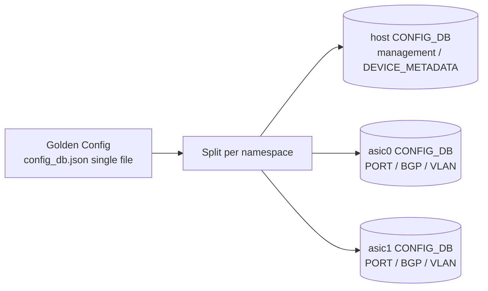
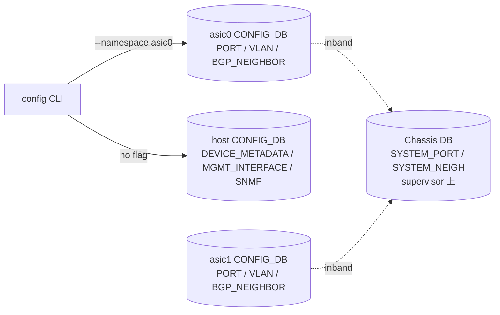

# 設定

[Multi-ASIC](../../reference/glossary.md#term-multi-asic) / [VOQ](../../reference/glossary.md#term-voq) chassis の設定の核心は「[ASIC](../../reference/glossary.md#term-asic) ごとに別 JSON を持つのではなく、1 枚の Golden Config から各 namespace に分配する」「line card は supervisor の module provisioning 経由で自動的に組み込む」の 2 点です。

## ASIC namespace と CONFIG_DB の見取り図



host namespace は管理面（hostname、`MGMT_INTERFACE`、`SNMP`、`DEVICE_METADATA.localhost`）を持ち、ASIC namespace は port、[VLAN](../../reference/glossary.md#term-vlan)、[BGP](../../reference/glossary.md#term-bgp)、interface など実データプレーンを構成する table を持ちます。CLI 引数の `--namespace` は ASIC 側を指す概念で、host [CONFIG_DB](../../reference/glossary.md#term-config_db) は名前空間引数なしでアクセスします。

## Single JSON Configuration

`multi-asic-single-json-configuration-design` [HLD](../../reference/glossary.md#term-hld) は、複数 namespace 用に分かれた `config_db.json` を 1 ファイルに統合する形式を定義します。トップレベルに `localhost` (host) と `asic0`, `asic1`, ... のキーを持つ構造で、`config load`/`config reload` がそれぞれの namespace の [Redis](../../reference/glossary.md#term-redis) に分配します。

これにより Golden Config を 1 枚で管理でき、`sonic-cfggen` 経由で minigraph や Jinja テンプレからの生成も namespace 別に行わずに済みます。逆に、namespace ごとの個別ファイルを管理する従来形式も後方互換で残っているため、運用方針として「single JSON に寄せる」かどうかは事前に決めておく必要があります。

## asic.conf と num_asic

ハードウェア側の事実、つまり「この box に何個の ASIC があるか」は `/usr/share/sonic/device/<platform>/asic.conf` の `NUM_ASIC=` で宣言されます。これは Golden Config 読み込みより前に確定する情報で、`hwsku.json` などのデータがどの namespace に対応するかを [SONiC](../../reference/glossary.md#term-sonic) 起動スクリプトが決めるための入力です。

## VOQ Switch Type

VOQ chassis や single-ASIC fixed VOQ system では、`DEVICE_METADATA.localhost` に以下のような印が付きます。

- `switch_type = voq`: VOQ ベースのスイッチであること。
- `chassis_hostname`: chassis 全体の名前（supervisor からも参照）。
- `sub_role`: line card / supervisor の区別。

これらは [orchagent](../../reference/glossary.md#term-orchagent) が VOQ orchestrator を有効化するか、Chassis DB に接続するか、自分が supervisor として動くかを決めるための識別子です。

## Chassis DB と Inband Configuration

Chassis DB は supervisor 上の Redis なので、各 line card は supervisor まで到達できる必要があります。`db-design-for-multi-asic-scenarios` HLD では、Chassis DB 用の inband network、ソケットパス、namespace 跨ぎの DB ID 割り当てなどが定義されます。

設計上は Chassis DB 経由でやりとりするのは「全 system port のリスト」「line card / fabric card の up/down」「neighbor 情報の chassis 内同期」など、各 line card が自律的に動くために必要な共通知識のみで、データプレーンの per-flow state は持ちません。

## Automatic Module Provisioning

`automatic-module-provisioning-for-chassis` HLD は、line card が挿入されたときの自動構成を定義します。supervisor は PMON 経由で挿入検出し、Chassis DB に line card の存在を登録、line card 側は起動時に Chassis DB から自分の sub_role / hwsku / fabric topology を読み取って自律的に立ち上がります。

運用上の意味は、line card 個別の手動 onboarding 手順が原則不要で、supervisor の Golden Config に line card slot 別エントリを持っておけば、物理挿入だけで一貫した SONiC が動き始めることです。

## Single-ASIC Fixed VOQ System の設定差分

1 ASIC pizza-box ながら VOQ アーキテクチャを使うシステムは、以下の点で通常の pizza-box 設定と異なります。

- `switch_type = voq` を `DEVICE_METADATA.localhost` に付ける。
- system port table を自分自身の port から生成する（Chassis DB は持たないが、[SAI](../../reference/glossary.md#term-sai) system port object は作る）。
- VOQ counter、scheduler 設定は通常の pizza-box と異なる counter naming を持つ。

通常運用では pizza-box と同じ感覚で扱えますが、CLI の `show queue` 系で system port 由来の出力が混じる点だけ注意します。

## シナリオ 1: 2 ASIC pizza-box の single JSON config を書く

`asic.conf` で `NUM_ASIC=2` の box を例に、Golden Config を 1 ファイルで作って `config load` する流れ。

```bash
# asic.conf の確認 (platform 由来、これは触らない)
$ cat /usr/share/sonic/device/x86_64-vendor_box-r0/asic.conf
NUM_ASIC=2
NUM_FABRIC_ASIC=0

# Golden Config (single JSON 形式)
cat > /etc/sonic/config_db.json <<'JSON'
{
  "localhost": {
    "DEVICE_METADATA": {"localhost": {"hostname":"sonic-2asic-01","platform":"x86_64-vendor_box-r0","mac":"00:11:22:33:44:55"}},
    "MGMT_INTERFACE": {"eth0|10.0.0.10/24": {"gwaddr":"10.0.0.1"}}
  },
  "asic0": {
    "DEVICE_METADATA": {"localhost": {"hostname":"sonic-2asic-01-asic0","sub_role":"FrontEnd","switch_type":"npu"}},
    "PORT":  {"Ethernet0": {"admin_status":"up","speed":"100000","lanes":"0,1,2,3"}},
    "BGP_NEIGHBOR": {"10.1.0.1": {"asn":65001,"local_addr":"10.1.0.0"}}
  },
  "asic1": {
    "DEVICE_METADATA": {"localhost": {"hostname":"sonic-2asic-01-asic1","sub_role":"FrontEnd","switch_type":"npu"}},
    "PORT":  {"Ethernet32": {"admin_status":"up","speed":"100000","lanes":"32,33,34,35"}},
    "BGP_NEIGHBOR": {"10.2.0.1": {"asn":65002,"local_addr":"10.2.0.0"}}
  }
}
JSON

# 適用 (各 namespace に分配される)
config load /etc/sonic/config_db.json -y
config save -y
```

確認:

```bash
$ show platform summary
Platform: x86_64-vendor_box-r0
HwSKU:    Vendor-2ASIC-100G
ASIC:     vendor
ASIC Count: 2

$ ip netns list
asic1 (id: 1)
asic0 (id: 0)

$ sudo ip netns exec asic0 redis-cli -n 4 KEYS 'PORT|*' | head
PORT|Ethernet0
PORT|Ethernet4
...

$ show interfaces status -n asic0 | head -5
  Interface    Lanes    Speed    MTU    FEC    Alias    Vlan    Oper    Admin    Type    Asym PFC
-----------  -------  -------  -----  -----  --------  ------  ------  -------  ------  ---------
  Ethernet0   0,1,2,3  100G    9100   rs     eth0/1    routed  up      up       QSFP28  off
```

CLI で host / namespace を呼び分けるときは `-n asic0` を付けます。付けないと host namespace が暗黙の対象です。

## シナリオ 2: VOQ chassis line card の onboarding

supervisor + 複数 line card 構成で、新しい line card を slot1 に挿入したときの自動構成。Chassis DB は supervisor 上に存在し、line card は inband 経由で読みに行きます。

```bash
# supervisor 側: Chassis DB が稼働しているか
$ sudo docker ps | grep database-chassis
abc1...   docker-database:latest   ...   Up 2 days    database-chassis

# supervisor 側: chassis 全体の view
$ show chassis modules status
        Name          Description    Physical-Slot    Oper-Status    Admin-Status
------------  ----------------- ----------------  -------------  --------------
   SUPERVISOR0   Supervisor card               17        Online         up
   LINE-CARD0    100G line card                 1        Online         up
   LINE-CARD1    100G line card                 2        Empty          up

# line card 側: 自分の sub_role / hwsku を Chassis DB から読んだか
[lc1] $ redis-cli -n 4 HGETALL 'DEVICE_METADATA|localhost' | grep -E 'sub_role|chassis_hostname|switch_type'
sub_role         LineCard
chassis_hostname sonic-chassis-01
switch_type      voq
```

CONFIG_DB の `CHASSIS_MODULE` table で個別に admin shutdown も可能:

```bash
sudo config chassis modules shutdown LINE-CARD1
# CONFIG_DB:
# "CHASSIS_MODULE": {"LINE-CARD1": {"admin_status":"down"}}
```

## シナリオ 3: 1 ASIC fixed VOQ system

1 ASIC pizza-box ながら VOQ architecture を使う box の最小設定差分。`switch_type = voq` を付けるのが核心で、他は通常の pizza-box と同じ。

```bash
# DEVICE_METADATA に VOQ 印
redis-cli -n 4 HSET 'DEVICE_METADATA|localhost' \
  switch_type voq \
  switch_id   0 \
  max_cores   1

# system port table を自前で持つ
cat > /tmp/system_port.json <<'JSON'
{
  "SYSTEM_PORT": {
    "sonic-fixed-voq-01|Ethernet0":   {"system_port_id":"1","switch_id":"0","core_index":"0","core_port_index":"0","speed":"100000"},
    "sonic-fixed-voq-01|Ethernet4":   {"system_port_id":"2","switch_id":"0","core_index":"0","core_port_index":"1","speed":"100000"}
  }
}
JSON
sonic-cfggen -j /tmp/system_port.json --write-to-db
config save -y
```

確認:

```bash
$ redis-cli -n 4 HGET 'DEVICE_METADATA|localhost' switch_type
voq

$ show system-port
                       System Port Name    Port Id    Switch Id    Core    Core Port    Speed
---------------------------------------  ---------  -----------  ------  -----------  -------
sonic-fixed-voq-01|Ethernet0                     1            0       0            0    100G
sonic-fixed-voq-01|Ethernet4                     2            0       0            1    100G

$ show queue counters | grep -E 'system|MC'
sonic-fixed-voq-01|Ethernet0  MC0   ...
```

通常の `show queue` 出力に system port 由来の queue が混じる点だけ意識します。

## ASIC namespace と CONFIG_DB の見取り図 (改めて)

CLI / DB アクセスの分担を改めて図にする。



## よくある設定エラーと対処

| 症状 | 典型的な原因 | 対処 |
|---|---|---|
| `config load` で `KeyError: 'asic0'` | single JSON のトップキーが `localhost`/`asic0`/... になっていない | `localhost` キーを必ず含める、ASIC は 0-indexed |
| `config -n asic0` で `unknown namespace` | `asic.conf` の `NUM_ASIC` が実機より小さい | `/usr/share/sonic/device/<platform>/asic.conf` を platform に合致させる (基本変更不可) |
| 全 ASIC namespace の `show` が同じ port を表示 | host namespace で `show interface` を叩いた | `show interface -n asic0` のように namespace 明示 |
| line card が Chassis DB に登録されない | inband interface 未到達、supervisor 側の `INTER_ASIC_VLAN` 未設定 | supervisor ⇔ line card 間の inband 疎通 (ping)、`PORT_NAME_MAP` 確認 |
| VOQ chassis で system port が増えない | `switch_type=voq` を `DEVICE_METADATA` に書き忘れ | `redis-cli -n 4 HSET 'DEVICE_METADATA|localhost' switch_type voq` を全 namespace |
| line card 起動後に `sub_role` が未設定 | Chassis DB との sync 前に CONFIG_DB を save した | `config save` 前に `show chassis modules status` で Online を確認 |
| BGP neighbor が片方の ASIC でしか上がらない | single JSON の asic0/asic1 で `local_addr` が分かれていない | 各 ASIC の正しい local IP を namespace 別に持たせる |
| Golden Config を更新したのに line card 側に反映されない | line card は Chassis DB 由来の data を優先 | supervisor の Golden Config を更新し、`config reload` を line card 側でも実行 |

## 関連リファレンス

- [Multi-ASIC Single JSON Configuration](../../platform/multi-asic-single-json-configuration-design.md)
- [DB Design for Multi-ASIC Scenarios](../../platform/db-design-for-multi-asic-scenarios.md)
- [Automatic Module Provisioning for Chassis](../../platform/automatic-module-provisioning-for-chassis.md)
- [Single-ASIC VOQ Fixed System](../../platform/single-asic-voq-fixed-system-sonic.md)
- 同章の [concept](concept.md) / [architecture](architecture.md) / [operations](operations.md) / [advanced](advanced.md)

<!-- glossary-links-injected: 5c9b3765d470 -->
