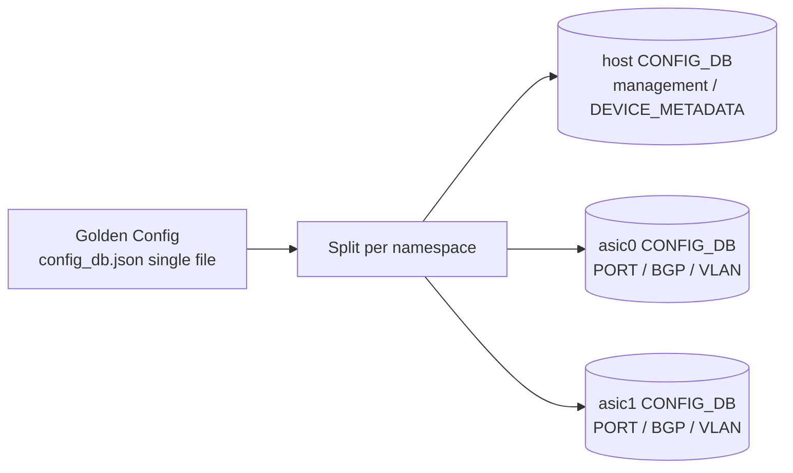

# 設定

Multi-ASIC / VOQ chassis の設定の核心は「ASIC ごとに別 JSON を持つのではなく、1 枚の Golden Config から各 namespace に分配する」「line card は supervisor の module provisioning 経由で自動的に組み込む」の 2 点です。

## ASIC namespace と CONFIG_DB の見取り図

host namespace は管理面（hostname、`MGMT_INTERFACE`、`SNMP`、`DEVICE_METADATA.localhost`）を持ち、ASIC namespace は port、VLAN、BGP、interface など実データプレーンを構成する table を持ちます。CLI 引数の `--namespace` は ASIC 側を指す概念で、host CONFIG_DB は名前空間引数なしでアクセスします。

## Single JSON Configuration

`multi-asic-single-json-configuration-design` HLD は、複数 namespace 用に分かれた `config_db.json` を 1 ファイルに統合する形式を定義します。トップレベルに `localhost` (host) と `asic0`, `asic1`, ... のキーを持つ構造で、`config load`/`config reload` がそれぞれの namespace の Redis に分配します。

これにより Golden Config を 1 枚で管理でき、`sonic-cfggen` 経由で minigraph や Jinja テンプレからの生成も namespace 別に行わずに済みます。逆に、namespace ごとの個別ファイルを管理する従来形式も後方互換で残っているため、運用方針として「single JSON に寄せる」かどうかは事前に決めておく必要があります。

## asic.conf と num_asic

ハードウェア側の事実、つまり「この box に何個の ASIC があるか」は `/usr/share/sonic/device/<platform>/asic.conf` の `NUM_ASIC=` で宣言されます。これは Golden Config 読み込みより前に確定する情報で、`hwsku.json` などのデータがどの namespace に対応するかを SONiC 起動スクリプトが決めるための入力です。

## VOQ Switch Type

VOQ chassis や single-ASIC fixed VOQ system では、`DEVICE_METADATA.localhost` に以下のような印が付きます。

- `switch_type = voq`: VOQ ベースのスイッチであること。
- `chassis_hostname`: chassis 全体の名前（supervisor からも参照）。
- `sub_role`: line card / supervisor の区別。

これらは orchagent が VOQ orchestrator を有効化するか、Chassis DB に接続するか、自分が supervisor として動くかを決めるための識別子です。

## Chassis DB と Inband Configuration

Chassis DB は supervisor 上の Redis なので、各 line card は supervisor まで到達できる必要があります。`db-design-for-multi-asic-scenarios` HLD では、Chassis DB 用の inband network、ソケットパス、namespace 跨ぎの DB ID 割り当てなどが定義されます。

設計上は Chassis DB 経由でやりとりするのは「全 system port のリスト」「line card / fabric card の up/down」「neighbor 情報の chassis 内同期」など、各 line card が自律的に動くために必要な共通知識のみで、データプレーンの per-flow state は持ちません。

## Automatic Module Provisioning

`automatic-module-provisioning-for-chassis` HLD は、line card が挿入されたときの自動構成を定義します。supervisor は PMON 経由で挿入検出し、Chassis DB に line card の存在を登録、line card 側は起動時に Chassis DB から自分の sub_role / hwsku / fabric topology を読み取って自律的に立ち上がります。

運用上の意味は、line card 個別の手動 onboarding 手順が原則不要で、supervisor の Golden Config に line card slot 別エントリを持っておけば、物理挿入だけで一貫した SONiC が動き始めることです。

## Single-ASIC Fixed VOQ System の設定差分

1 ASIC pizza-box ながら VOQ アーキテクチャを使うシステムは、以下の点で通常の pizza-box 設定と異なります。

- `switch_type = voq` を `DEVICE_METADATA.localhost` に付ける。
- system port table を自分自身の port から生成する（Chassis DB は持たないが、SAI system port object は作る）。
- VOQ counter、scheduler 設定は通常の pizza-box と異なる counter naming を持つ。

通常運用では pizza-box と同じ感覚で扱えますが、CLI の `show queue` 系で system port 由来の出力が混じる点だけ注意します。

## 関連ページ

- [Multi-ASIC Single JSON Configuration](../../platform/multi-asic-single-json-configuration-design.md)
- [DB Design for Multi-ASIC Scenarios](../../platform/db-design-for-multi-asic-scenarios.md)
- [Automatic Module Provisioning for Chassis](../../platform/automatic-module-provisioning-for-chassis.md)
- [Single-ASIC VOQ Fixed System](../../platform/single-asic-voq-fixed-system-sonic.md)
