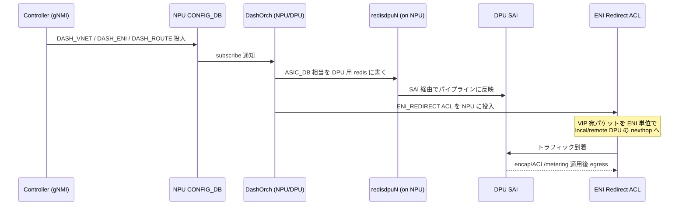

# DASH と SmartSwitch の考え方

[DASH](../../reference/glossary.md#term-dash) と [SmartSwitch](../../reference/glossary.md#term-smartswitch) は混同されやすい言葉ですが、別レイヤのものです。DASH は **「[ENI](../../reference/glossary.md#term-eni) 単位で VNet / [ACL](../../reference/glossary.md#term-acl) / metering / Service Tunnel を高速にこなす」データプレーン API と [SONiC](../../reference/glossary.md#term-sonic) 実装** を指し、SmartSwitch は **「[NPU](../../reference/glossary.md#term-npu) スイッチに複数の [DPU](../../reference/glossary.md#term-dpu) をぶら下げ、DASH を含む処理を DPU で動かす」物理 / 制御プラットフォーム** を指します。

つまり「DASH を動かす器」が SmartSwitch であり、SmartSwitch 上で動く主役のオーバーレイ処理が DASH です。

## DASH は何を解くか

DASH は ENI（Elastic Network Interface）という単位を中心に置きます。1 つの ENI は 1 つの VM ないしテナント接続点で、その配下に VNet（VxLAN VNI と underlay）、Outbound / Inbound ルーティング、ACL、metering、Service Tunnel、Private Link 等の設定が紐付きます。コントローラはこれらを `DASH_VNET` / `DASH_ENI` / `DASH_ROUTE` / `DASH_ACL_GROUP` 等のテーブルとしてプッシュし、`DashOrch` / `DashVnetOrch` / `DashAclOrch` といった [orchagent](../../reference/glossary.md#term-orchagent) が [SAI](../../reference/glossary.md#term-sai) へ落とします。

DASH 自体はホスト型 [SmartNIC](../../reference/glossary.md#term-smartnic) でも appliance card でも動く設計ですが、SONiC コミュニティの SmartSwitch では「DPU を SONiC で動かし、その上で DASH を回す」形を取ります。

## SmartSwitch の役割分担

SmartSwitch は次の 2 つから成ります。

- **NPU**: 従来の SONiC スイッチ。物理 port、underlay forwarding、ACL、[BGP](../../reference/glossary.md#term-bgp)、HA の制御 daemon、DPU 管理を担う。
- **DPU**: DASH オーバーレイ処理用の SoC。SONiC OS が乗り、`DashOrch` 系の orchagent と SAI 実装が走る。NPU と midplane で繋がる。

NPU は DPU に対して次を提供します。

- DPU の電源 / リセット / PCIe 制御（PMON）
- 管理 IP の払い出し（midplane bridge 上の DHCP server）
- overlay 設定の中継先 redis（後述）
- HA actor（HAMgrD）
- [gNMI](../../reference/glossary.md#term-gnmi) / [gNOI](../../reference/glossary.md#term-gnoi) 経由の外部 API 接続点

DPU は NPU を gateway のように扱い、自身の overlay 状態を NPU 側に置いた redis に書き出します。

## NPU 側 DB と DPU overlay DB

DPU はメモリが厳しいため、DASH の全オブジェクト（多数の ENI、[VNET](../../reference/glossary.md#term-vnet)、ACL、route 等）を DPU 自身の redis に保持するのは現実的ではありません。そこで **DPU 用の overlay redis を NPU 上に立てて、DPU から remote 接続させる** 構成を取ります。NPU 上には DPU 数だけ独立した `database` container（`redisdpu0` / `redisdpu1` …）が動き、それぞれ別 redis インスタンスとして DPU 1 つに対応します。

この設計の利点は次の通りです。

- DPU 側の RAM 圧迫を避ける
- コントローラは NPU 側に書くだけで DPU を意識せず済む（API 表面が単純化）
- multi-[ASIC](../../reference/glossary.md#term-asic) と同じ daemon (`featured`) で機構を再利用できる

## ENI ベース転送と VIP

NPU から DPU へのトラフィック振り分け方式は 2 つあります。

| 方式 | 振り分けの単位 | VIP 消費 | 拡張性 |
|---|---|---|---|
| VIP ベース | DPU ごとに別 VIP | DPU 数だけ消費 | 小規模向け |
| ENI ベース転送 | スイッチ単位 VIP + ENI 単位 ACL リダイレクト | 1 cluster 1 VIP | SmartSwitch を跨いだ ENI 配置が可能 |

SmartSwitch では ENI ベース転送が採用され、NPU 上で `ENI_REDIRECT` 型 ACL が ENI 宛パケットをローカル DPU またはリモート DPU の tunnel nexthop へ落とします。これを生成するのが `DashEniFwdOrch` です。

## HA の考え方

SmartSwitch HA は「DPU レベルで active / standby のペアを作り、フェイルオーバーは NPU 側の HAMgrD が駆動する」モデルです。HAMgrD は NPU 側の actor で、DPU の状態、peer DPU との同期、SAI HA セッションを管理します。DPU 自体は自分の HA 状態を knows しますが、誰と誰がペアか・どちらが active かは NPU 側で決めます。

## 用語の整理

| 用語 | 意味 |
|---|---|
| DASH | ENI 単位で VNet / ACL / metering を扱うオーバーレイデータプレーン API |
| ENI | Elastic Network Interface。テナント / VM 接続点の論理単位 |
| DPU | DASH 処理をこなす SoC。SONiC OS が動く |
| NPU | 従来の SONiC スイッチ部分。DPU を抱える親 |
| SmartSwitch | NPU + 複数 DPU から成る物理プラットフォーム |
| midplane bridge | NPU と DPU を繋ぐ内部 L2 / 管理ネットワーク（`169.254.200.254` 系） |
| HAMgrD | NPU 側 HA actor daemon |
| `has_per_dpu_scope` | FEATURE テーブルの leaf。DPU 数分の instance を起動するかを示す |

## まず読み手の質問に答える

### この機能はそもそも何か

DASH は「VM / コンテナ単位のオーバーレイ処理を、ホスト CPU ではなく専用ハードウェア（DPU や appliance）に下ろすための SONiC データプレーン API」です。SmartSwitch は「その DPU を 1 〜数台ぶら下げた物理スイッチを SONiC として制御する箱」です。前者がソフトウェア契約、後者が箱の話です。

エンドユーザ視点では、「テナント単位の VNet ルーティング・ACL・metering・Service Tunnel をパブリッククラウド規模（数万 ENI 級）で 1 装置にまとめたい」というニーズに応えます。これを SONiC ノースバウンド API（gNMI / [Redis](../../reference/glossary.md#term-redis)）で投入すると、ノースバウンド側は DPU を意識せず、SmartSwitch 内部の NPU/DPU 分担は SONiC 側が引き受けます。

### 何を解決するか

従来の VxLAN gateway や software ロードバランサで「テナント数が増えると CPU が詰まる / フロー数が増えると state table が破綻する」問題が起きていました。DASH は次のように分解して解決します。

- ENI ごとの per-tenant 状態（VNet route、ACL、metering）を **DPU の専用テーブル** に積み、線形にスケールさせる
- VxLAN / NSH / Service Tunnel の encap/decap を **DPU のパケット処理パイプライン** に固定し、CPU 経由を回避する
- スイッチ単位の VIP で受けて ENI 単位で DPU に振り分ける（ENI ベース転送）ことで、テナント追加に伴う VIP 消費を抑える

### SONiC 全体での位置

DASH は **オーバーレイ転送のスキーマ拡張**、SmartSwitch は **箱の構成プロファイル** という関係です。

| 層 | 関係する SONiC コンポーネント | 役割 |
| --- | --- | --- |
| ノースバウンド | gNMI / Redis [CONFIG_DB](../../reference/glossary.md#term-config_db) / `DASH_*` テーブル | テナント / ENI / VNet 設定の投入口 |
| NPU 制御面 | `swss`、`bgpd`（[FRR](../../reference/glossary.md#term-frr)）、`HAMgrD`、`pmon`、`featured` | underlay 経路、DPU 管理、HA actor |
| NPU データ面 | `syncd`、SAI、ACL（ENI Redirect）、midplane bridge | ENI ベース転送、underlay VxLAN |
| DPU 制御面 | DPU 側 SONiC OS、`DashOrch` 系 | DASH オブジェクトの SAI への落とし込み |
| DPU データ面 | DASH 対応 SAI 実装（ベンダー）、DPU パイプライン | overlay encap/decap、ACL、metering |
| ストレージ | NPU 上の `redisdpu0..N` container | DPU 用 overlay DB の host |

### 用語定義（章内で繰り返し出るもの）

- **ENI**: Elastic Network Interface。テナント／VM の接続点を表す論理単位。1 ENI = 1 MAC + (任意の) VNet 紐付き。
- **VNet**: VxLAN VNI で識別されるテナント仮想 L3 ネットワーク。`DASH_VNET` テーブルが定義する。
- **DPU**: Data Processing Unit。DASH パイプラインを持つ SoC ないし SmartNIC。
- **NPU**: Network Processing Unit。従来の SONiC スイッチ ASIC。
- **midplane bridge**: NPU と DPU を繋ぐ内部 L2 ネットワーク（`169.254.200.x` 系）。管理 IP、HA、redis 通信に使う。
- **`redisdpuN`**: NPU 上に立つ DPU 専用 redis container。DPU は自分の overlay 状態をここに書く。
- **ENI ベース転送**: スイッチ単位の VIP で受け、ACL の `ENI_REDIRECT` 型で ENI 別 DPU に振る方式。
- **HAMgrD**: NPU 側に立つ HA actor。DPU ペアの active/standby を駆動する。
- **`has_per_dpu_scope`**: `FEATURE` テーブルの leaf。`true` の feature は DPU 数だけ instance を起動する。
- **Service Tunnel / Private Link**: テナントが Azure 系の SaaS や PrivateLink endpoint に抜けるための named tunnel 機能。
- **Outbound / Inbound 方向**: ENI を中心に「VM → 外」が Outbound、「外 → VM」が Inbound。ルーティングテーブルが別建て。

### 典型シーン

ポイントは「制御は NPU 側 redis を一意の入口にする」「データプレーンの分岐は NPU 上 ACL で済ます」の二段で、ノースバウンドからは DPU の存在が透けて見えにくい点です。

### 似ているが別物のもの

| 比較対象 | DASH / SmartSwitch との違い |
| --- | --- |
| 通常の SONiC VxLAN / [EVPN](../../reference/glossary.md#term-evpn) ゲートウェイ（[03 章](../03-vxlan-evpn/index.md)） | テナント数・per-ENI state が増えると CPU/[TCAM](../../reference/glossary.md#term-tcam) が破綻する。DASH は per-ENI state を DPU 側に押し込む |
| [Multi-ASIC](../../reference/glossary.md#term-multi-asic) chassis（[12 章](../12-multi-asic-voq/index.md)） | 複数 ASIC を 1 装置に積む点は似るが、Multi-ASIC は単一スイッチング機能、SmartSwitch は NPU + 別役割の DPU |
| 単体 SmartNIC（DPU 単独） | SmartNIC は server NIC 側に DPU を載せる発想。SmartSwitch は ToR 側に集約 |
| ホストベースの仮想 router（OVS / VPP） | CPU 上で動かす分柔軟だが、per-flow CPU コストが線形に効く。DASH はパイプライン処理 |
| [MPLS](../../reference/glossary.md#term-mpls) / [SRv6](../../reference/glossary.md#term-srv6) ベース L3VPN（[17 章](../17-srv6-mpls/index.md)） | DASH は ENI 単位の policy / metering まで含む。MPLS / SRv6 はラベル経路提供が主 |

### 読了後にできるようになること

- [HLD](../../reference/glossary.md#term-hld) のどれが「DASH スキーマ側」でどれが「SmartSwitch 物理側」なのかを切り分けて読める
- `DASH_*` テーブルや `redisdpuN` container の役割を見て「どのレイヤの問題か」を判定できる
- HA や DPU 障害時の駆動主体が NPU 側（HAMgrD）であることを前提に [運用](operations.md) を組める
- 他社 SmartSwitch / DPU 製品との比較で SONiC / DASH 採用範囲を質問できる

## 関連ページ

- [SONiC-DASH アーキテクチャ概観](../../overlay/sonic-dash-hld.md)
- [Smart Switch のデータベース構成](../../architecture/smart-switch-database-design.md)
- [SmartSwitch ENI Based Forwarding](../../overlay/smartswitch-eni-based-forwarding.md)
- [DASH 関連カテゴリ](../../categories/dash.md)
- [SmartSwitch 関連カテゴリ](../../categories/smartswitch.md)

<!-- xref-prereq -->
## この章の前提知識

この章を読み進める前に、次の章を押さえておくと迷子になりにくい。

- [SONiC 全体像と設定基盤](../01-overview/index.md)
- [VXLAN / EVPN / VNET オーバーレイ](../03-vxlan-evpn/index.md)
- [SWSS / SAI / Redis 内部実装](../20-swss-sai-redis/index.md)

<!-- glossary-links-injected: 5c9b3765d470 -->
