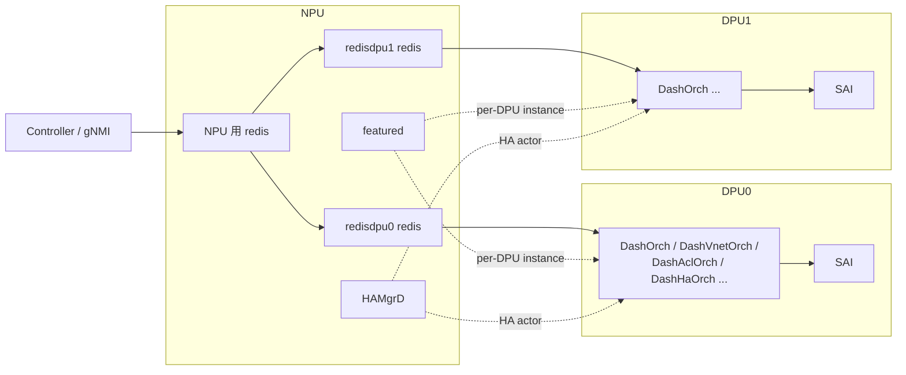

# NPU-DPU DB と ENI ベース転送の内部構造

[DASH](../../reference/glossary.md#term-dash) / [SmartSwitch](../../reference/glossary.md#term-smartswitch) を実装視点で読むときは、「設定がコントローラから [DPU](../../reference/glossary.md#term-dpu) の [SAI](../../reference/glossary.md#term-sai) に届くまで」と「データプレーンが [NPU](../../reference/glossary.md#term-npu) 上の [ACL](../../reference/glossary.md#term-acl) でどう振り分けられるか」を分けて追うと理解しやすくなります。ここでは DB レイヤ、[ENI](../../reference/glossary.md#term-eni) ベース転送、DASH ACL タグ、HA の actor 関係を順に見ていきます。

## NPU 上の DPU overlay DB

NPU 上には DPU 数だけ独立した `database` container（`redisdpu0` / `redisdpu1` …）が立ち上がります。各々は別 TCP port / 別 unix socket / 別 `redis-server` プロセスです。DPU は自分専用の redis を NPU 上で参照し、`APPL_DB` / `CONFIG_DB` / `STATE_DB` などを通常通り使います。



`featured` daemon は `FEATURE` テーブルの `has_per_dpu_scope` を読んで「この feature は DPU 数だけ instance を起こす」と判断します。これは multi-[ASIC](../../reference/glossary.md#term-asic) の per-namespace 起動と同じ仕組みの再利用です。詳細は [Smart Switch のデータベース構成](../../architecture/smart-switch-database-design.md) を参照してください。

## DASH オブジェクトの流れ

コントローラからの設定は次のように流れます。

1. コントローラが NPU 側 [gNMI](../../reference/glossary.md#term-gnmi) / `swssconfig` に `DASH_VNET` / `DASH_ENI` / `DASH_ROUTE` / `DASH_ACL_GROUP` / `DASH_PREFIX_TAG_TABLE` 等を入れる。
2. 対象 DPU 向けに NPU の `redisdpuN` に書き込まれる（あるいは DPU 側 [orchagent](../../reference/glossary.md#term-orchagent) がここを購読する）。
3. DPU 側 `DashOrch` 系が [APPL_DB](../../reference/glossary.md#term-appl_db) を読み、SAI へ落とす。

主要 orchagent は次の通りです。

| Orch | 役割 |
|---|---|
| `DashOrch` | ENI / appliance / 全体管理 |
| `DashVnetOrch` | VNet と VNet mapping（`APP_DASH_VNET_TABLE_NAME` / `APP_DASH_VNET_MAPPING_TABLE_NAME`） |
| `DashAclOrch` | ACL group / rule / prefix tag |
| `DashMeterOrch` | metering |
| `DashHaOrch` / `DashHaFlowOrch` | HA セッション / flow sync |
| `DashEniFwdOrch` | **NPU 側で動く**。ENI_REDIRECT ACL の生成 |
| `DashCounter` | counter / metering 観測 |

詳細は [SONiC-DASH アーキテクチャ概観](../../overlay/sonic-dash-hld.md) を参照してください。

## ENI ベース転送と ENI_REDIRECT ACL

NPU 上で動く `DashEniFwdOrch` は、ENI ごとに「どの DPU に流すか」をテーブル (`DASH_ENI_FORWARD_TABLE`) と DPU registry から決め、`ACL_TABLE_TYPE = ENI_REDIRECT` の ACL を生成します。

ACL の基本優先度は `EniAclRule::BASE_PRIORITY = 9996` で、ローカル ENI 向けと tunnel 終端向けで `BASE_PRIORITY + type` により 9996 / 9997 を生成します。これにより 1 つの VIP（スイッチ単位）で受けたパケットを、ENI 単位の宛先解決でローカル DPU またはリモート DPU の tunnel へ振り分けられます。

詳細は [SmartSwitch ENI Based Forwarding](../../overlay/smartswitch-eni-based-forwarding.md) を参照してください。

## DASH ACL タグ

DASH ACL は「サービスタグ = プレフィックス群」という抽象を持ち、`DASH_PREFIX_TAG_TABLE` でタグを定義し、ACL ルール側から参照できます。Stage 1（現行）は SWSS 側でタグをルール生成時にプレフィックス列に展開するソフトウェア実装で、SAI 変更はありません。Stage 2 として SAI API でタグを直接扱う計画は [HLD](../../reference/glossary.md#term-hld) 範囲外です。

タグの利点は次の通りです。

- メンバ追加 / 削除時に ACL ルールの書き換えが不要
- 1 プレフィックスが複数タグに属せる
- ルール展開時の重複プレフィックスを抑えてメモリ効率を上げる

詳細は [DASH ACL タグ](../../acl-qos/dash-acl-tags.md) を参照してください。

## HAMgrD と HA actor 構造

SmartSwitch HA は NPU 側 daemon **HAMgrD** が actor として動きます。HAMgrD は次を担います。

- DPU ごとに「自 DPU の HA state」「peer DPU との同期」を持つ
- 物理 / 論理障害を検知し、active / standby 切替を駆動する
- DPU 側 `DashHaOrch` と APPL_DB / [STATE_DB](../../reference/glossary.md#term-state_db) を介して連携する
- HA グループや HA セット（DPU ペア / フロー）を管理する

データプレーンの flow sync は DPU 側 `DashHaFlowOrch` が持ち、HAMgrD が制御メッセージを発行する分業です。NPU 側 / DPU 側で actor を分けるのは、NPU が複数 DPU をまとめて見やすい一方、DPU 側はフロー状態を SAI に近い場所で扱う必要があるためです。HAMgrD は実装上 `discrepancy-found` 扱いの点があるため、[HAMgrD ページ](../../architecture/smartswitch-high-availability-manager-daemon-hamgrd-design.md) で個別差分を確認してください。

## SAI 属性使用一覧（DASH 専用 SAI 拡張）

DASH SAI は `sai/experimental/saiexperimentaldash*.h` 系で定義される DASH 専用 object です。

| object | 主属性 |
| --- | --- |
| `SAI_OBJECT_TYPE_DASH_APPLIANCE` | `SAI_DASH_APPLIANCE_ATTR_LOCAL_REGION_ID`、`VM_VNI` |
| `SAI_OBJECT_TYPE_ENI` | `SAI_ENI_ATTR_VM_VNI`、`MAC_ADDRESS`、`ADMIN_STATE`、`VNET_ID`、`INBOUND_V4_STAGE*` |
| `SAI_OBJECT_TYPE_ENI_ETHER_ADDRESS_MAP_ENTRY` | inbound 用 MAC → ENI mapping |
| `SAI_OBJECT_TYPE_VNET` | `SAI_VNET_ATTR_VNI` |
| `SAI_OBJECT_TYPE_OUTBOUND_ROUTING_ENTRY` | encap 種別、tunnel_id、overlay_ip |
| `SAI_OBJECT_TYPE_OUTBOUND_CA_TO_PA_ENTRY` | customer addr → provider addr の mapping |
| `SAI_OBJECT_TYPE_INBOUND_ROUTING_ENTRY` | inbound 側の VNI / [VNET](../../reference/glossary.md#term-vnet) 解決 |
| `SAI_OBJECT_TYPE_DASH_ACL_GROUP` / `DASH_ACL_RULE` | DASH ACL（NSG / SG 用） |
| `SAI_OBJECT_TYPE_FLOW_TABLE` / `FLOW_ENTRY` | HA flow sync（DPU 側） |
| `SAI_OBJECT_TYPE_METER_*` | metering / billing |

これらは通常 SAI には無く、DPU 上の SAI 実装でのみ公開されます。NPU 側 SAI（Broadcom / Mellanox 等）は ENI_REDIRECT ACL を通常の `SAI_OBJECT_TYPE_ACL_ENTRY` で実装します。

## Redis テーブル参照関係（per-DPU）

```text
APPL_DB (per-DPU redisdpuN):
  APP_DASH_APPLIANCE_TABLE, APP_DASH_ENI_TABLE,
  APP_DASH_VNET_TABLE, APP_DASH_VNET_MAPPING_TABLE,
  APP_DASH_ROUTE_TABLE, APP_DASH_ROUTE_RULE_TABLE,
  APP_DASH_PREFIX_TAG_TABLE, APP_DASH_ACL_GROUP_TABLE, APP_DASH_ACL_RULE_TABLE,
  APP_DASH_HA_SET_TABLE, APP_DASH_HA_SCOPE_TABLE,
  APP_DASH_FLOW_TABLE, APP_DASH_METER_RULE_TABLE
DPU_STATE_DB / DPU_APPL_DB / DPU_COUNTERS_DB:
  DPU 側で観測される counter / state
CHASSIS_STATE_DB (NPU 側):
  DPU_TABLE, DPU_STATE_TABLE (HAMgrD / pmon が更新)
NPU 側 CONFIG_DB / APPL_DB:
  DASH_ENI_FORWARD_TABLE (NPU EniFwdOrch 用)
  ACL_TABLE/ACL_RULE (ENI_REDIRECT type)
```

## ZMQ / SWBUS / Redis pub/sub

- DASH は **ZMQ + SWBUS** を多用します。NPU ↔ DPU 間の制御パスは [SONiC](../../reference/glossary.md#term-sonic) 標準の [Redis](../../reference/glossary.md#term-redis) pub/sub ではなく、SWBUS (`sonic-swbus` based。`gnmi-native-write` と並び ZMQ producer/consumer を使う) でメッセージを配送します。これは大量の DASH route / ENI / flow を Redis を介さず直接 orchagent に流すためです。
- HA flow sync は DPU 間の専用 channel（DASH-HA dataplane channel）で行い、Redis を経由しません。
- 通常の DASH 設定（ENI / VNET / route）は SWBUS → 各 DPU の APPL_DB に書かれ、`DashOrch` 系が SubscriberStateTable で読み取ります。

## 既知の実装上の制約

- DASH SAI は **experimental** に分類され、SAI ABI が安定していない。DPU SDK の更新で SONiC 側の sai header 同期が必要。
- ENI 数の上限はベンダ DPU の SDK 制約に依存。HLD 上は「数万 ENI」を想定するが、実機ベンチで上限が変わる。
- HAMgrD と DashHaOrch / DashHaFlowOrch の通信は実装途中の箇所があり、failure scenario（DPU crash / link down / split brain）のカバレッジは limited。`discrepancy-found` ページに詳細を記録。
- NPU 側 ENI_REDIRECT ACL は ENI 数に比例して ACL rule 数が増えるため、NPU の [TCAM](../../reference/glossary.md#term-tcam) 上限を超える可能性がある。`SAI_ACL_TABLE_ATTR_SIZE` の事前確認が必要。
- DASH prefix tag の Stage 1（SWSS 展開）は ACL rule 数を `タグメンバ数 × ルール数` に膨らませる。Stage 2（SAI ネイティブ）の計画はあるが未着手。
- per-DPU redis / orchagent は `featured` で起動し、DPU instance の crash 時に NPU 側の `pmon` が detect → restart する設計だが、HA 切替と orchagent restart の競合は HLD 範囲外。

## 関連ページ

- [Smart Switch のデータベース構成](../../architecture/smart-switch-database-design.md)
- [SONiC-DASH アーキテクチャ概観](../../overlay/sonic-dash-hld.md)
- [SmartSwitch ENI Based Forwarding](../../overlay/smartswitch-eni-based-forwarding.md)
- [DASH ACL タグ](../../acl-qos/dash-acl-tags.md)
- [SmartSwitch HAMgrD 設計](../../architecture/smartswitch-high-availability-manager-daemon-hamgrd-design.md)

<!-- glossary-links-injected: ec18b66e3507 -->
