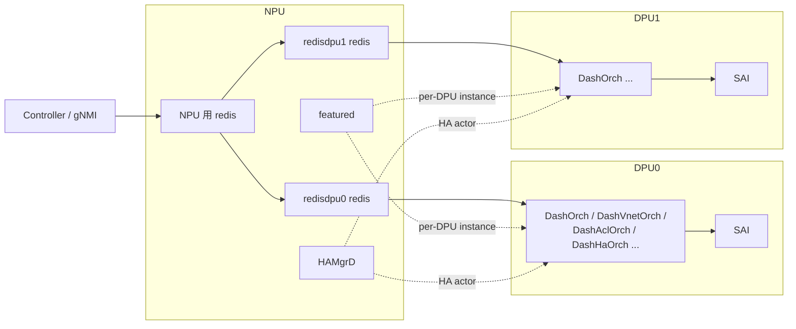

# NPU-DPU DB と ENI ベース転送の内部構造

DASH / SmartSwitch を実装視点で読むときは、「設定がコントローラから DPU の SAI に届くまで」と「データプレーンが NPU 上の ACL でどう振り分けられるか」を分けて追うと理解しやすくなります。ここでは DB レイヤ、ENI ベース転送、DASH ACL タグ、HA の actor 関係を順に見ていきます。

## NPU 上の DPU overlay DB

NPU 上には DPU 数だけ独立した `database` container（`redisdpu0` / `redisdpu1` …）が立ち上がります。各々は別 TCP port / 別 unix socket / 別 `redis-server` プロセスです。DPU は自分専用の redis を NPU 上で参照し、`APPL_DB` / `CONFIG_DB` / `STATE_DB` などを通常通り使います。

`featured` daemon は `FEATURE` テーブルの `has_per_dpu_scope` を読んで「この feature は DPU 数だけ instance を起こす」と判断します。これは multi-ASIC の per-namespace 起動と同じ仕組みの再利用です。詳細は [Smart Switch のデータベース構成](../../architecture/smart-switch-database-design.md) を参照してください。

## DASH オブジェクトの流れ

コントローラからの設定は次のように流れます。

1. コントローラが NPU 側 gNMI / `swssconfig` に `DASH_VNET` / `DASH_ENI` / `DASH_ROUTE` / `DASH_ACL_GROUP` / `DASH_PREFIX_TAG_TABLE` 等を入れる。
2. 対象 DPU 向けに NPU の `redisdpuN` に書き込まれる（あるいは DPU 側 orchagent がここを購読する）。
3. DPU 側 `DashOrch` 系が APPL_DB を読み、SAI へ落とす。

主要 orchagent は次の通りです。

| Orch | 役割 |
|---|---|
| `DashOrch` | ENI / appliance / 全体管理 |
| `DashVnetOrch` | VNet と VNet mapping（`APP_DASH_VNET_TABLE_NAME` / `APP_DASH_VNET_MAPPING_TABLE_NAME`） |
| `DashAclOrch` | ACL group / rule / prefix tag |
| `DashMeterOrch` | metering |
| `DashHaOrch` / `DashHaFlowOrch` | HA セッション / flow sync |
| `DashEniFwdOrch` | **NPU 側で動く**。ENI_REDIRECT ACL の生成 |
| `DashCounter` | counter / metering 観測 |

詳細は [SONiC-DASH アーキテクチャ概観](../../overlay/sonic-dash-hld.md) を参照してください。

## ENI ベース転送と ENI_REDIRECT ACL

NPU 上で動く `DashEniFwdOrch` は、ENI ごとに「どの DPU に流すか」をテーブル (`DASH_ENI_FORWARD_TABLE`) と DPU registry から決め、`ACL_TABLE_TYPE = ENI_REDIRECT` の ACL を生成します。

ACL の基本優先度は `EniAclRule::BASE_PRIORITY = 9996` で、ローカル ENI 向けと tunnel 終端向けで `BASE_PRIORITY + type` により 9996 / 9997 を生成します。これにより 1 つの VIP（スイッチ単位）で受けたパケットを、ENI 単位の宛先解決でローカル DPU またはリモート DPU の tunnel へ振り分けられます。

詳細は [SmartSwitch ENI Based Forwarding](../../overlay/smartswitch-eni-based-forwarding.md) を参照してください。

## DASH ACL タグ

DASH ACL は「サービスタグ = プレフィックス群」という抽象を持ち、`DASH_PREFIX_TAG_TABLE` でタグを定義し、ACL ルール側から参照できます。Stage 1（現行）は SWSS 側でタグをルール生成時にプレフィックス列に展開するソフトウェア実装で、SAI 変更はありません。Stage 2 として SAI API でタグを直接扱う計画は HLD 範囲外です。

タグの利点は次の通りです。

- メンバ追加 / 削除時に ACL ルールの書き換えが不要
- 1 プレフィックスが複数タグに属せる
- ルール展開時の重複プレフィックスを抑えてメモリ効率を上げる

詳細は [DASH ACL タグ](../../acl-qos/dash-acl-tags.md) を参照してください。

## HAMgrD と HA actor 構造

SmartSwitch HA は NPU 側 daemon **HAMgrD** が actor として動きます。HAMgrD は次を担います。

- DPU ごとに「自 DPU の HA state」「peer DPU との同期」を持つ
- 物理 / 論理障害を検知し、active / standby 切替を駆動する
- DPU 側 `DashHaOrch` と APPL_DB / STATE_DB を介して連携する
- HA グループや HA セット（DPU ペア / フロー）を管理する

データプレーンの flow sync は DPU 側 `DashHaFlowOrch` が持ち、HAMgrD が制御メッセージを発行する分業です。NPU 側 / DPU 側で actor を分けるのは、NPU が複数 DPU をまとめて見やすい一方、DPU 側はフロー状態を SAI に近い場所で扱う必要があるためです。HAMgrD は実装上 `discrepancy-found` 扱いの点があるため、[HAMgrD ページ](../../architecture/smartswitch-high-availability-manager-daemon-hamgrd-design.md) で個別差分を確認してください。

## 関連ページ

- [Smart Switch のデータベース構成](../../architecture/smart-switch-database-design.md)
- [SONiC-DASH アーキテクチャ概観](../../overlay/sonic-dash-hld.md)
- [SmartSwitch ENI Based Forwarding](../../overlay/smartswitch-eni-based-forwarding.md)
- [DASH ACL タグ](../../acl-qos/dash-acl-tags.md)
- [SmartSwitch HAMgrD 設計](../../architecture/smartswitch-high-availability-manager-daemon-hamgrd-design.md)
