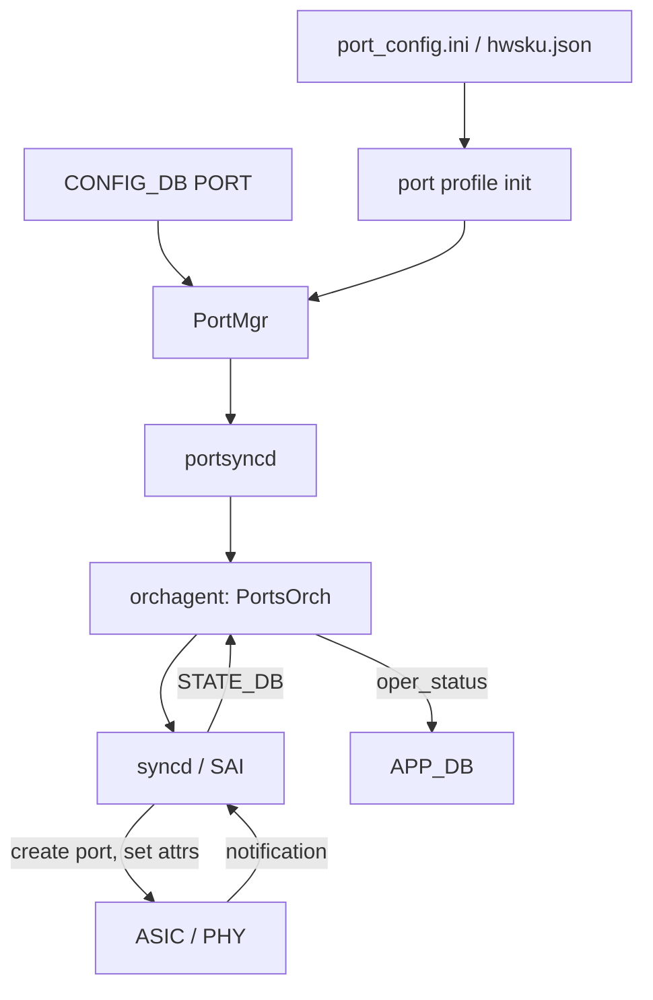

# アーキテクチャ

ここでは、ポート 1 本がリンクアップに至るまでに通る要素を、[SONiC](../../reference/glossary.md#term-sonic) 内部のコンポーネント単位で並べ直します。[HLD](../../reference/glossary.md#term-hld) 個別では「FEC」「auto-neg」「link training」「fast link up」が独立した提案として書かれていますが、実装上は同じ port bring-up シーケンスに乗っています。

## Port bring-up の全体像

`port_config.ini` と `hwsku.json` で決まる初期プロファイルは [port profile init HLD](../../architecture/port-profile-init-hld.md) で詳細化されています。設定が [CONFIG_DB](../../reference/glossary.md#term-config_db) の `PORT` に入ると、`PortMgr` と `portsyncd` を経由して [orchagent](../../reference/glossary.md#term-orchagent) の `PortsOrch` に到達し、[SAI](../../reference/glossary.md#term-sai) 経由で [ASIC](../../reference/glossary.md#term-asic) に書かれます。

## Dynamic breakout

1 つの物理ケージを複数の論理 port に分割する dynamic breakout は、運用中に `PORT` 行を削除・再生成する操作として実装されています。詳細は [dynamic port breakout HLD](../../system/sonic-dynamic-port-breakout-feature-high-level-design.md) を参照してください。breakout に伴って、buffer profile、queue、[ACL](../../reference/glossary.md#term-acl) bind は再構築されるため、[QoS](../../reference/glossary.md#term-qos) / ACL 章と影響範囲が重なります。

## Auto-negotiation と link training

光モジュールやコパー DAC では、リンクパラメータをハード同士でネゴシエーションする auto-negotiation と、シリアルリンクの等化を行う link training が走ります。SONiC では、ユーザ設定 (`autoneg`、`adv_speeds`、`adv_interface_types` など) を `PORT` テーブルから受け取り、SAI 属性に変換します。

- [auto-negotiation design](../../architecture/sonic-port-auto-negotiation-design.md)
- [link training design](../../architecture/sonic-port-link-training-design.md)

## FEC: 手動・自動・FLR

FEC (Forward Error Correction) は速度ごとに既定値があり、SONiC では `fec` カラムで明示するか、auto FEC に任せます。

- [auto FEC design](../../architecture/sonic-port-auto-fec-design.md): リンク側の能力と速度から FEC モードを決定する仕組み。
- [port FEC / BER](../../platform/sonic-port-fec-ber.md): pre-FEC BER / post-FEC counter の取り出し方。
- [FEC FLR support](../../platform/fec-flr-support-in-sonic.md): FEC frame loss recovery の扱い。

運用上の「リンクは上がっているが errored」の切り分けは、これらの counter を読むところから始めます。

## Fast link up

リンクのフラップ収束を速くするための fast link up は、port bring-up シーケンスを短縮する最適化です。詳細は [SONiC fast link up](../../platform/sonic-fast-link-up.md) を参照してください。一般運用では明示的に意識する必要はありませんが、再収束が遅いと感じたときに最初に確認する観点です。

## Port configuration refactor の位置付け

[port configuration refactor design](../../architecture/sonic-port-configuration-refactor-design.md) は、ここまでの bring-up を支える「設定をどの順で何回 SAI に流すか」の再設計です。breakout、speed 変更、buffer 再構成のような重い更新で、整合の取りにくさを下げることが狙いです。

## 関連ページ

- [port profile init HLD](../../architecture/port-profile-init-hld.md)
- [dynamic port breakout HLD](../../system/sonic-dynamic-port-breakout-feature-high-level-design.md)
- [auto-negotiation design](../../architecture/sonic-port-auto-negotiation-design.md)
- [link training design](../../architecture/sonic-port-link-training-design.md)
- [auto FEC design](../../architecture/sonic-port-auto-fec-design.md)
- [port configuration refactor design](../../architecture/sonic-port-configuration-refactor-design.md)

<!-- glossary-links-injected: ec18b66e3507 -->
