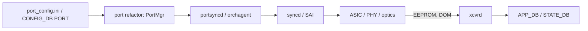

# 概要

SONiC の物理層は、大きく「port そのもの」「optics / PHY」「装置側 health」の 3 系統に分けると整理しやすくなります。HLD 単位では別物に見えても、CONFIG_DB の `PORT` や `DEVICE_METADATA`、pmon コンテナ内の各 daemon といった共通点があります。

## Platform abstraction の層

SONiC は、ベンダーハードウェアの差を `sonic_platform` パッケージとして抽象化します。`psuutil` のような旧来クラスは platform 固有実装でしたが、現在は global な base class とプラグイン的な platform 実装に分かれており、共通 CLI / daemon が同じ API を呼びます。詳細は [global platform specific PSU util class instance](../../platform/global-platform-specific-psuutil-class-instance.md) を参照してください。

この抽象化があるため、`show platform` 系コマンドや pmon の各 daemon (`thermalctld`、`psud`、`pcied`、`ssdmon`、`xcvrd` など) は、ハード差を意識せずに同じ DB / sysfs パスへ書き込めます。

## Port lifecycle

ポート 1 本が「設定された 1 行の `PORT` エントリ」から「リンクアップしてトラフィックを流す状態」に至るまでには、いくつかの段階があります。

ここで重要なのは、port 設定が `PORT` テーブル → PortMgr → orchagent → SAI と一方向に流れる一方で、optics 側の検出や DOM 値は逆向きに STATE_DB へ反映される点です。port 設定の再構成は [port configuration refactor design](../../architecture/sonic-port-configuration-refactor-design.md) にまとまっています。

## 「ポート」とは何のことか

SONiC で「ポート」と言ったとき、対象は文脈で変わります。

- `PORT` テーブルの行: 名前 (`Ethernet0` など)、speed、lanes、auto-neg、FEC、admin/oper status を持つ論理単位。
- 物理ケージ / モジュール: SFP / QSFP / OSFP のスロット。breakout で 1 ケージから複数 `PORT` が生える。
- SAI port object: ASIC 側の port object ID。
- PHY / Gearbox port: NPU と optics の間に挟まる PHY デバイスのチャネル。

スキーマ詳細は [PORT テーブル](../../reference/config-db/port.md) と [sonic-port YANG](../../reference/yang/sonic-port.md) が一次資料です。

## 装置 health の系統

ポートの上下とは独立に、装置側の状態 (thermal、PSU、fan、SSD、PCIe、BMC) も常時監視されます。これらは pmon コンテナ内の各 daemon が STATE_DB を更新し、CLI / SNMP / Redfish が同じ DB を見ます。port 章と切り離しても良いように見えますが、thermal shutdown は port を強制 down させるため、運用上は同じ章で読むのが楽です。

## 関連ページ

- [global platform specific psuutil class instance](../../platform/global-platform-specific-psuutil-class-instance.md)
- [port configuration refactor design](../../architecture/sonic-port-configuration-refactor-design.md)
- [PORT テーブル](../../reference/config-db/port.md)
- [sonic-port YANG](../../reference/yang/sonic-port.md)
