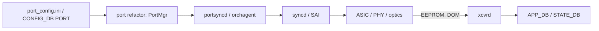
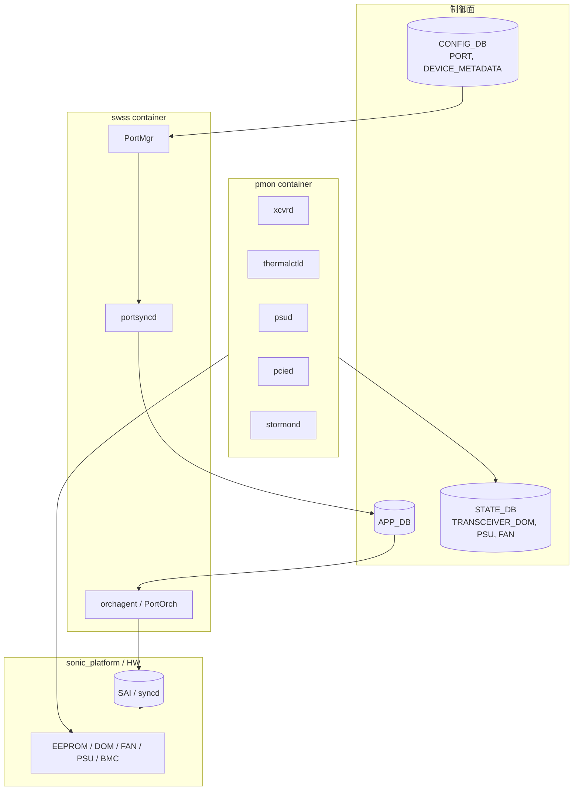
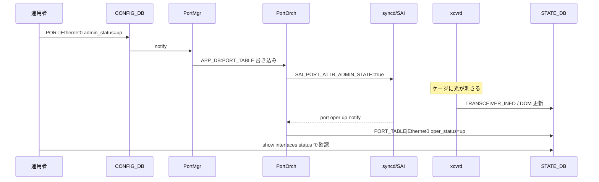

# 概要

[SONiC](../../reference/glossary.md#term-sonic) の物理層は、大きく「port そのもの」「optics / PHY」「装置側 health」の 3 系統に分けると整理しやすくなります。[HLD](../../reference/glossary.md#term-hld) 単位では別物に見えても、[CONFIG_DB](../../reference/glossary.md#term-config_db) の `PORT` や `DEVICE_METADATA`、pmon コンテナ内の各 daemon といった共通点があります。

## Platform abstraction の層

SONiC は、ベンダーハードウェアの差を `sonic_platform` パッケージとして抽象化します。`psuutil` のような旧来クラスは platform 固有実装でしたが、現在は global な base class とプラグイン的な platform 実装に分かれており、共通 CLI / daemon が同じ API を呼びます。詳細は [global platform specific PSU util class instance](../../platform/global-platform-specific-psuutil-class-instance.md) を参照してください。

この抽象化があるため、`show platform` 系コマンドや pmon の各 daemon (`thermalctld`、`psud`、`pcied`、`stormond`、`xcvrd` など) は、ハード差を意識せずに同じ DB / sysfs パスへ書き込めます[^pmon-daemons]。なお `stormond` はかつて SSD 監視のみを担当した `ssdmon` の後継で、現在は SSD/eMMC を含むストレージ全般を監視する storage monitor daemon です[^stormond-naming]。

[^pmon-daemons]: pmon コンテナの supervisord 構成は `sonic-buildimage/dockers/docker-platform-monitor/docker-pmon.supervisord.conf.j2` で定義され、`chassisd` / `ledd` / `xcvrd` / `psud` / `pcied` / `thermalctld` / `stormond` / `sensormond` などをスキップフラグ付きで起動する。
[^stormond-naming]: `sonic-platform-daemons/sonic-stormond/scripts/stormond` 冒頭のモジュール docstring に "Storage device Monitoring daemon for SONiC" と明記されており、SYSLOG identifier も `stormond`。リポジトリ上に `ssdmon` ディレクトリは存在しない。

## Port lifecycle

ポート 1 本が「設定された 1 行の `PORT` エントリ」から「リンクアップしてトラフィックを流す状態」に至るまでには、いくつかの段階があります。

ここで重要なのは、port 設定が `PORT` テーブル → PortMgr → [orchagent](../../reference/glossary.md#term-orchagent) → [SAI](../../reference/glossary.md#term-sai) と一方向に流れる一方で、optics 側の検出や DOM 値は逆向きに [STATE_DB](../../reference/glossary.md#term-state_db) へ反映される点です。port 設定の再構成は [port configuration refactor design](../../architecture/sonic-port-configuration-refactor-design.md) にまとまっています。

## 「ポート」とは何のことか

SONiC で「ポート」と言ったとき、対象は文脈で変わります。

- `PORT` テーブルの行: 名前 (`Ethernet0` など)、speed、lanes、auto-neg、FEC、admin/oper status を持つ論理単位。
- 物理ケージ / モジュール: SFP / QSFP / OSFP のスロット。breakout で 1 ケージから複数 `PORT` が生える。
- SAI port object: [ASIC](../../reference/glossary.md#term-asic) 側の port object ID。
- PHY / Gearbox port: [NPU](../../reference/glossary.md#term-npu) と optics の間に挟まる PHY デバイスのチャネル。

スキーマ詳細は [PORT テーブル](../../reference/config-db/port.md) と [sonic-port YANG](../../reference/yang/sonic-port.md) が一次資料です。

## 装置 health の系統

ポートの上下とは独立に、装置側の状態 (thermal、PSU、fan、SSD、PCIe、BMC) も常時監視されます。これらは pmon コンテナ内の各 daemon が STATE_DB を更新し、CLI / [SNMP](../../reference/glossary.md#term-snmp) / Redfish が同じ DB を見ます。port 章と切り離しても良いように見えますが、thermal shutdown は port を強制 down させるため、運用上は同じ章で読むのが楽です。

## まず読み手の質問に答える

### この機能はそもそも何か

「Platform / Port / Optics」は単独の機能名ではなく、**SONiC が一台のスイッチ装置として動くために最低限必要な物理層・装置層の抽象化** をまとめた章です。具体的には次の 3 系統です。

1. **Platform abstraction** — ベンダー固有 HW（PSU / FAN / 温度センサ / EEPROM / LED / BMC / PCIe / SSD）を `sonic_platform` パッケージで包む層
2. **Port lifecycle** — `port_config.ini` から `PORT` テーブル、PortMgr、orchagent、SAI 経由で ASIC に届くまでの設定経路
3. **Optics / Transceiver** — SFP / QSFP / OSFP モジュールの EEPROM 読み出し、DOM 監視、CMIS（Common Management Interface Spec）対応、Y-Cable など特殊光モジュール

### 何を解決するか

NOS としての SONiC は数十のベンダースイッチで動く必要があります。ここで放置すると次の問題が起きます。

- ベンダーごとに `show platform fan` の挙動が違って CLI が分裂する
- port breakout / FEC / auto-neg の組み合わせがハードコードで散らばる
- 光モジュールの DOM 値（温度・Tx/Rx power）の読み方がベンダー固有 daemon に閉じる
- 装置 health（温度シャットダウン、PSU 障害）が監視に届かない

このため SONiC は「`sonic_platform` の共通 API」「`PORT` テーブルを唯一の port 定義入口にする refactor」「`xcvrd` を中心とした optics の標準化」で、装置差を CLI / DB レイヤから消しに行きます。

### SONiC 全体での位置

データ面ではなく **「装置を成り立たせるための骨格」** で、上位の switching / routing / overlay / observability すべてが暗黙にこの章に依存します。

### 用語定義

- **`sonic_platform`**: Python パッケージ。各ベンダー platform 実装が継承する base クラス群（Chassis / Module / PSU / Fan / Thermal / Sfp / Eeprom）を提供。
- **`pmon`**: Platform MONitor container。`thermalctld` / `psud` / `pcied` / `ledd` / `xcvrd` / `stormond` (旧 `ssdmon`) / `sensormond` / `chassisd` / `bmcctld` / `ycabled` / `syseepromd` などをスキップフラグ付きで抱える。
- **`xcvrd`**: Transceiver daemon。SFP/QSFP/OSFP の EEPROM 読み出し、CMIS state machine、DOM 監視、PM（performance monitoring）を STATE_DB に書く。
- **PortMgr / `portsyncd`**: CONFIG_DB の `PORT` を読んで APP_DB に流す側と、Linux netdev 状態を APP_DB に同期する側。
- **PortOrch**: orchagent 内の port object responsible。SAI port を生成 / 設定する。
- **[port_config.ini](../../reference/glossary.md#term-port-config-ini)**: HwSKU ごとの port lane / speed の初期マップ。CONFIG_DB が無い起動初期に PortMgr が参照する。
- **breakout**: 1 物理ケージから複数 `PORT` を生やす機能（例 400G OSFP → 4×100G）。
- **CMIS**: Common Management Interface Specification（OIF）。400G/800G 世代の optics 標準。state machine を `xcvrd` が回す。
- **DOM**: Digital Optical Monitoring。Tx/Rx power、温度、Vcc、bias current。
- **Y-Cable**: Dual-ToR 用の active L1 切替モジュール。`xcvrd` の Y-Cable サブモジュールが状態遷移を持つ。
- **BMC**: Baseboard Management Controller。一部 platform で thermal / PSU を BMC 経由で吸う。
- **FEC**: Forward Error Correction。25G / 100G / 400G で必要な誤り訂正設定（RS / FC / none）。

### 典型シーン: ポート 1 本のリンクアップ

光が刺さらない / DOM が読めない場合、`xcvrd` 側の vendor SFP 実装か EEPROM 読み出しエラーを疑うのが先で、PortOrch ではないことが分かります。

### 似ているが別物のもの

| 比較対象 | この章との違い |
| --- | --- |
| [QoS / Buffer](../08-qos-buffer/index.md) | ポート上のキュー・バッファ・FEC は [QoS](../../reference/glossary.md#term-qos) 章。物理層の存在そのものはこの章 |
| [ACL / CoPP](../07-acl-copp-mirror/index.md) | [ACL](../../reference/glossary.md#term-acl) は port を入力として参照するが、port 定義そのものはこの章 |
| [Dual-ToR](../05-dual-tor/index.md) | Y-Cable の状態管理は xcvrd 側だがロジックは Dual-ToR で、ここでは「Y-Cable はそういうモジュールがある」までを扱う |
| [Reboot / Lifecycle](../11-reboot/index.md) | warm reboot 時の port flap 回避は reboot 章。port のフロー定義はこの章 |
| [SWSS / SAI / Redis](../20-swss-sai-redis/index.md) | SAI そのものの抽象は 20 章。ここでは port object 周りの SAI 属性に絞る |
| [Telemetry / SNMP](../09-telemetry-snmp/index.md) | DOM 値の収集経路は 09 章、データ源と STATE_DB スキーマは本章 |

### 読了後にできるようになること

- 「port が up しない」事象に対し、PortMgr / PortOrch / SAI / xcvrd / EEPROM のどれを最初に見るかを判断できる
- platform 移植時に最低限触る `sonic_platform` クラスと `port_config.ini` の関係が説明できる
- breakout / FEC / auto-neg の変更がどの DB / どの daemon を経由するか追える
- BMC 経由の platform と直接 sysfs 駆動の platform の差を意識して運用設計できる

## 関連ページ

- [global platform specific psuutil class instance](../../platform/global-platform-specific-psuutil-class-instance.md)
- [port configuration refactor design](../../architecture/sonic-port-configuration-refactor-design.md)
- [PORT テーブル](../../reference/config-db/port.md)
- [sonic-port YANG](../../reference/yang/sonic-port.md)

<!-- xref-prereq -->
## この章の前提知識

この章を読み進める前に、次の章を押さえておくと迷子になりにくい。

- [SONiC 全体像と設定基盤](../01-overview/index.md)

<!-- glossary-links-injected: ec18b66e3507 -->
