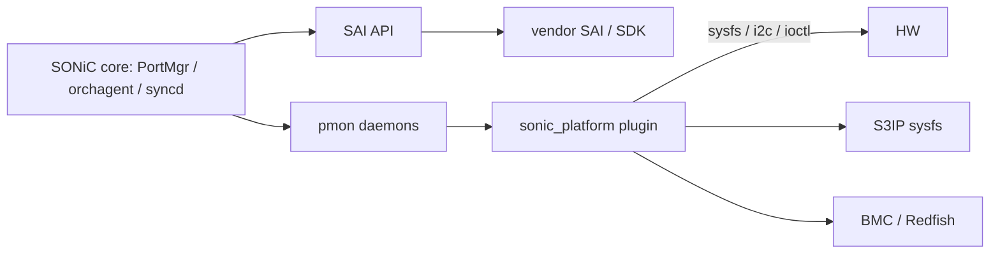

# 内部実装

ここでは、port / optics / PHY を「ベンダー実装の境界」から見直します。SONiC core と platform driver の責任分担、Gearbox 接続、sysfs / BMC 経由の管理を 1 枚にして読みます。

## Driver boundary

SAI 側はベンダー SDK が、`sonic_platform` プラグイン側は装置依存の sysfs / i2c アクセスが担当します。BMC を持つ装置では sensor / FRU / chassis 情報が BMC 経由で取得されます。

## Media-based port settings

光モジュールやケーブル種別 (media) に応じて、port の serdes 設定 (pre-emphasis、main、post-emphasis など) を切り替える仕組みが [media-based port settings in SONiC](../../platform/media-based-port-settings-in-sonic.md) にまとまっています。誤った SI ではリンクが上がらない、または BER が高くなるため、optics 交換と組み合わせて変更されることが多い領域です。

## Gearbox

NPU と optics の間に PHY (Gearbox) を挟む装置では、SAI 経由で Gearbox 側もプログラムされます。動的に Gearbox の SI を調整する設計は [SONiC dynamic Gearbox tuning design plan](../../platform/sonic-dynamic-gearbox-tuning-design-plan.md) を参照してください。

## MDIO アクセスと gbsyncd

NPU 経由で PHY を読み書きする MDIO の取り扱いは、`gbsyncd` コンテナの拡張で実現されています。設計は [NPU MDIO access support and gbsyncd docker enhancement HLD](../../platform/sonic-npu-mdio-access-support-and-gbsyncd-docker-enhancement-hld.md) にまとまっています。Gearbox を持つ装置のデバッグや register dump はこの経路です。

## LPO debug registers

LPO (Linear Pluggable Optics) の追加デバッグレジスタを SONiC 側から扱えるようにする設計が [enhanced LPO debug registers HLD](../../platform/enhanced-lpo-debug-registers-hld.md) です。新しい optics 形態のデバッグを既存ツール経路に乗せる例として参考になります。

## S3IP sysfs

S3IP は、装置側 platform 情報を sysfs ツリーとして公開する仕様で、SONiC は sonic_platform プラグインがその sysfs を読みます。

- [S3IP sysfs specification](../../platform/s3ip-sysfs-specification.md)
- [S3IP sysfs specification and framework HLD](../../architecture/s3ip-sysfs-specification-and-s3ip-sysfs-framework-hld.md)

S3IP に準拠した装置では、PSU、fan、temperature、transceiver、CPLD、LED などのアクセスが標準化されたパスで提供されます。

## BMC / Redfish

データセンタ装置では、BMC が PSU / fan / FRU / sensor を握っていることが多いため、SONiC は BMC 経由のフローも統合します。

- [support BMC flows in SONiC](../../platform/support-bmc-flows-in-sonic.md): BMC を sonic_platform 実装の裏側として扱う方針。
- [SONiC BMC platform management / monitoring](../../system/sonic-bmc-platform-management-monitoring.md): 監視と管理を BMC に委ねるときの境界。

BMC 経由のときは、SONiC OS 側の daemon が直接 sensor を叩かないため、障害解析時にどちらの経路を見るべきかを意識する必要があります。

## 関連ページ

- [media-based port settings in SONiC](../../platform/media-based-port-settings-in-sonic.md)
- [SONiC dynamic Gearbox tuning design plan](../../platform/sonic-dynamic-gearbox-tuning-design-plan.md)
- [NPU MDIO access support and gbsyncd docker enhancement HLD](../../platform/sonic-npu-mdio-access-support-and-gbsyncd-docker-enhancement-hld.md)
- [enhanced LPO debug registers HLD](../../platform/enhanced-lpo-debug-registers-hld.md)
- [S3IP sysfs specification](../../platform/s3ip-sysfs-specification.md)
- [S3IP sysfs framework HLD](../../architecture/s3ip-sysfs-specification-and-s3ip-sysfs-framework-hld.md)
- [support BMC flows in SONiC](../../platform/support-bmc-flows-in-sonic.md)
- [SONiC BMC platform management monitoring](../../system/sonic-bmc-platform-management-monitoring.md)
