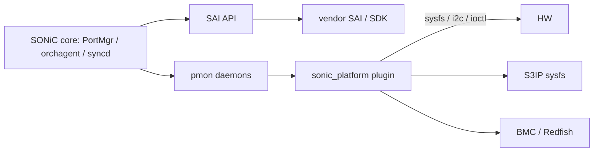
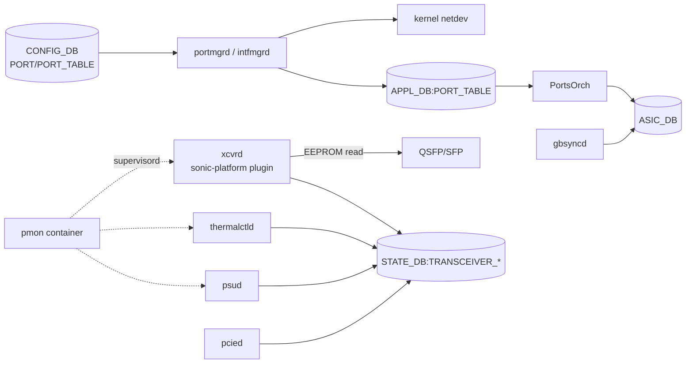

# 内部実装

ここでは、port / optics / PHY を「ベンダー実装の境界」から見直します。[SONiC](../../reference/glossary.md#term-sonic) core と platform driver の責任分担、Gearbox 接続、sysfs / BMC 経由の管理を 1 枚にして読みます。

## Driver boundary



[SAI](../../reference/glossary.md#term-sai) 側はベンダー SDK が、`sonic_platform` プラグイン側は装置依存の sysfs / i2c アクセスが担当します。BMC を持つ装置では sensor / FRU / chassis 情報が BMC 経由で取得されます。

## Media-based port settings

光モジュールやケーブル種別 (media) に応じて、port の serdes 設定 (pre-emphasis、main、post-emphasis など) を切り替える仕組みが [media-based port settings in SONiC](../../platform/media-based-port-settings-in-sonic.md) にまとまっています。誤った SI ではリンクが上がらない、または BER が高くなるため、optics 交換と組み合わせて変更されることが多い領域です。

## Gearbox

[NPU](../../reference/glossary.md#term-npu) と optics の間に PHY (Gearbox) を挟む装置では、SAI 経由で Gearbox 側もプログラムされます。動的に Gearbox の SI を調整する設計は [SONiC dynamic Gearbox tuning design plan](../../platform/sonic-dynamic-gearbox-tuning-design-plan.md) を参照してください。

## MDIO アクセスと gbsyncd

NPU 経由で PHY を読み書きする MDIO の取り扱いは、`gbsyncd` コンテナの拡張で実現されています。設計は [NPU MDIO access support and gbsyncd docker enhancement HLD](../../platform/sonic-npu-mdio-access-support-and-gbsyncd-docker-enhancement-hld.md) にまとまっています。Gearbox を持つ装置のデバッグや register dump はこの経路です。

## LPO debug registers

LPO (Linear Pluggable Optics) の追加デバッグレジスタを SONiC 側から扱えるようにする設計が [enhanced LPO debug registers HLD](../../platform/enhanced-lpo-debug-registers-hld.md) です。新しい optics 形態のデバッグを既存ツール経路に乗せる例として参考になります。

## S3IP sysfs

S3IP は、装置側 platform 情報を sysfs ツリーとして公開する仕様で、SONiC は sonic_platform プラグインがその sysfs を読みます。

- [S3IP sysfs specification](../../platform/s3ip-sysfs-specification.md)
- [S3IP sysfs specification and framework HLD](../../architecture/s3ip-sysfs-specification-and-s3ip-sysfs-framework-hld.md)

S3IP に準拠した装置では、PSU、fan、temperature、transceiver、CPLD、LED などのアクセスが標準化されたパスで提供されます。

## BMC / Redfish

データセンタ装置では、BMC が PSU / fan / FRU / sensor を握っていることが多いため、SONiC は BMC 経由のフローも統合します。

- [support BMC flows in SONiC](../../platform/support-bmc-flows-in-sonic.md): BMC を sonic_platform 実装の裏側として扱う方針。
- [SONiC BMC platform management / monitoring](../../system/sonic-bmc-platform-management-monitoring.md): 監視と管理を BMC に委ねるときの境界。

BMC 経由のときは、SONiC OS 側の daemon が直接 sensor を叩かないため、障害解析時にどちらの経路を見るべきかを意識する必要があります。

## データフロー（port / optics 全体）



## 主要 daemon の責務

| コンポーネント | 主実体 | 責務 |
| --- | --- | --- |
| `PortsOrch` (`orchagent/portsorch.cpp`) | `PortsOrch::doTask`、`initializePort`、`setPortAdminStatus` | port SAI object 作成、speed/FEC/autoneg 設定 |
| `portsyncd` | netlink listener | kernel link state を [APPL_DB](../../reference/glossary.md#term-appl_db) へ |
| `xcvrd` (`sonic-platform-daemons/sonic-xcvrd/`) | `xcvrd.py` | transceiver EEPROM 読み出し、SI 適用、TRANSCEIVER_INFO/DOM/STATUS を [STATE_DB](../../reference/glossary.md#term-state_db) に書く |
| `thermalctld` | platform plugin で温度センサ取得 | thermal policy 反映 |
| `psud`、`pcied`、`syseepromd`、`ledd` | 各種 sensor / FRU | STATE_DB に状況書き込み |
| `gbsyncd` | Gearbox 用 [syncd](../../reference/glossary.md#term-syncd) | NPU 経由の PHY MDIO |
| `sfputil` / `sfpshow` | CLI | xcvrd の出力を整形 |

## SAI 属性使用一覧

| object | 主属性 |
| --- | --- |
| `SAI_OBJECT_TYPE_PORT` | `SAI_PORT_ATTR_ADMIN_STATE`、`SPEED`、`AUTO_NEG_MODE`、`MEDIA_TYPE`、`INTERFACE_TYPE`、`MTU`、`PORT_VLAN_ID`、`FEC_MODE` |
| `SAI_OBJECT_TYPE_PORT_SERDES` | `SAI_PORT_SERDES_ATTR_PREEMPHASIS`、`IDRIVER`、`TX_FIR_PRE1/MAIN/POST1/...` |
| `SAI_OBJECT_TYPE_GEARBOX` 系 | Gearbox model object（experimental） |
| `SAI_OBJECT_TYPE_HOSTIF` | `SAI_HOSTIF_ATTR_TYPE = NETDEV`、`OPER_STATUS` |

`PORT_SERDES` は media-based port settings の主入口で、media type ごとに `media_settings.json` を読み xcvrd が適用要求を出します。

## Redis テーブル参照関係

```yaml
CONFIG_DB:
  PORT, BREAKOUT_CFG, INTERFACE,
  CABLE_LENGTH, MEDIA_SETTINGS (一部は file)
APPL_DB:
  PORT_TABLE, HOSTIF_TABLE
STATE_DB:
  TRANSCEIVER_INFO, TRANSCEIVER_DOM_SENSOR, TRANSCEIVER_STATUS, TRANSCEIVER_PM,
  PORT_TABLE, PORT_OPER_STATUS,
  FAN_INFO, PSU_INFO, TEMPERATURE_INFO,
  CHASSIS_INFO, PCIE_DEVICES_INFO
COUNTERS_DB:
  COUNTERS_PORT_NAME_MAP, COUNTERS:<port-oid>
ASIC_DB:
  PORT, PORT_SERDES, HOSTIF, GEARBOX
```

## ZMQ / Redis pub/sub

- pmon 系 daemon 間では ZMQ は使わない。
- `xcvrd` は sonic_platform plugin を直接呼び、結果を [Redis](../../reference/glossary.md#term-redis) に push。
- PMON 系 daemon は `supervisord` で管理され、互いに Redis 経由でしか通信しない。
- BMC 経路を持つ場合、`pmon` 配下の daemon が REST/Redfish を直接呼び、結果を STATE_DB に統一形式で書く。

## 既知の実装上の制約

- `xcvrd` の EEPROM polling 周期は default 60s 程度で、optics の即時 plug/unplug 検知は GPIO interrupt 経路（あれば）を `xcvrd` の event API で取り込む実装に依存する。これがベンダ plugin で未実装だと polling 周期分の遅延が出る。
- media_settings の SI は port speed × media の組み合わせで `media_settings.json` に static に書く設計で、新規 optic 投入時にファイル更新と config reload が必要。
- Gearbox SI 動的調整は `gbsyncd` の [HLD](../../reference/glossary.md#term-hld) では将来的な拡張で、master ではまだ static 適用のみのケースが多い（discrepancy として記録される）。
- breakout（4×25G ↔ 100G 等）時の sequence は `PortsOrch` が `removePort` → `createPort` を行うため、kernel netdev が瞬間的に消える。[LACP](../../reference/glossary.md#term-lacp) / [LLDP](../../reference/glossary.md#term-lldp) / route が影響を受ける。
- S3IP sysfs を使わないレガシー platform plugin では sysfs パスがベンダ独自で、共通 CLI（`show platform fan` 等）の出力に差が出る。
- BMC 経由運用では、host OS の sensor 値が BMC の cache に律速され、host OS の `pmon` 周期と BMC polling 周期がずれて oscillation することがある。

## 関連ページ

- [media-based port settings in SONiC](../../platform/media-based-port-settings-in-sonic.md)
- [SONiC dynamic Gearbox tuning design plan](../../platform/sonic-dynamic-gearbox-tuning-design-plan.md)
- [NPU MDIO access support and gbsyncd docker enhancement HLD](../../platform/sonic-npu-mdio-access-support-and-gbsyncd-docker-enhancement-hld.md)
- [enhanced LPO debug registers HLD](../../platform/enhanced-lpo-debug-registers-hld.md)
- [S3IP sysfs specification](../../platform/s3ip-sysfs-specification.md)
- [S3IP sysfs framework HLD](../../architecture/s3ip-sysfs-specification-and-s3ip-sysfs-framework-hld.md)
- [support BMC flows in SONiC](../../platform/support-bmc-flows-in-sonic.md)
- [SONiC BMC platform management monitoring](../../system/sonic-bmc-platform-management-monitoring.md)

<!-- glossary-links-injected: 8ba32e5aa69d -->
