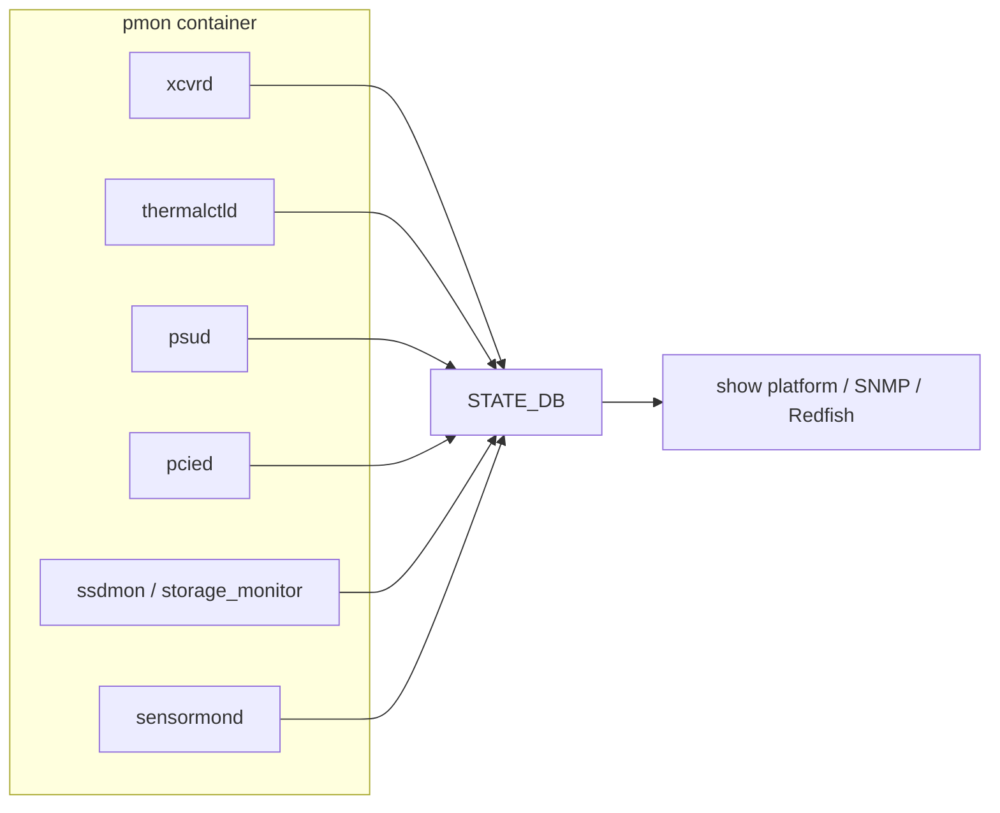

# 運用

ここでは、装置 health と optics に関連する確認順序を、運用シナリオ別に整理します。各 daemon の詳細は元 [HLD](../../reference/glossary.md#term-hld) を参照してください。

## どの daemon がどこを見ているか



`show platform` 系コマンドは基本的に [STATE_DB](../../reference/glossary.md#term-state_db) を経由するため、daemon が値を更新できていないと CLI も空に見えます。最初に確認するのは daemon の up/down です。

### daemon の起動確認

```bash
admin@sonic:~$ docker exec pmon supervisorctl status
xcvrd                            RUNNING   pid 42, uptime 5 days, 02:13:41
thermalctld                      RUNNING   pid 45, uptime 5 days, 02:13:41
psud                             RUNNING   pid 48, uptime 5 days, 02:13:41
pcied                            RUNNING   pid 51, uptime 5 days, 02:13:41
ledd                             RUNNING   pid 54, uptime 5 days, 02:13:41
syseepromd                       EXITED    Mar 03 12:00 PM
chassisd                         RUNNING   pid 60, uptime 5 days, 02:13:41
```

`EXITED` / `FATAL` の daemon があると STATE_DB が更新されません。`docker logs pmon` から該当 daemon の例外を拾います。

## Optics: SFP / QSFP / CMIS

xcvrd は SFP 系の EEPROM 読出しと state machine を担当します。CMIS (Common Management Interface Spec) 採用モジュールは、レガシー SFP より複雑な state machine を持ちます。

- 全体像: [SFP refactoring](../../platform/sonic-sfp-refactoring.md)
- CMIS 強化: [enhancement of CMIS module management](../../management/enhancement-of-cmis-module-management.md)
- ZR 対応: [CMIS / C-CMIS support for ZR](../../platform/cmis-and-c-cmis-support-for-zr.md)
- カスタム SI: [custom SI settings for CMIS modules](../../platform/custom-si-settings-for-cmis-modules.md)
- transceiver / sensor 監視: [transceiver and sensor monitoring HLD](../../system/transceiver-and-sensor-monitoring-hld.md)

「モジュールを挿したのに認識されない / DOM が出ない / link が上がらない」は、まず xcvrd ログと STATE_DB の `TRANSCEIVER_INFO` / `TRANSCEIVER_DOM_SENSOR` を見ます。

### show / DB 確認の典型

```bash
admin@sonic:~$ show interfaces transceiver presence Ethernet0
Port         Presence
-----------  ----------
Ethernet0    Present

admin@sonic:~$ show interfaces transceiver eeprom -d Ethernet0
Ethernet0: SFP EEPROM detected
        Vendor Name: ARISTA NETWORKS
        Vendor PN: QSFP-100G-SR4
        Vendor SN: XKT201234567
        Module Temperature: 41C
        Module Voltage: 3.28V
        ChannelMonitorValues:
          RX1Power: -1.5dBm  TX1Bias: 7.5mA  TX1Power: -2.0dBm
          ...

admin@sonic:~$ redis-cli -n 6 hgetall 'TRANSCEIVER_INFO|Ethernet0'
1) "type"
2) "QSFP28 or later"
3) "vendor_name"
4) "ARISTA NETWORKS"
...

admin@sonic:~$ redis-cli -n 6 hgetall 'TRANSCEIVER_STATUS|Ethernet0'
1) "status"
2) "READY"
3) "cmis_state"
4) "DP_ACTIVATED"
```

CMIS の場合、`cmis_state` が `DP_ACTIVATED` まで進まないとデータパスが上がりません。`DP_INIT` で止まる、`MODULE_LOW_PWR` のままなどは、xcvrd ログで state machine 遷移を追います。

```bash
admin@sonic:~$ docker exec pmon tail -n 50 /var/log/syslog | grep xcvrd
xcvrd[42]: Ethernet0: CMIS state INACTIVE -> MODULE_HW_INIT
xcvrd[42]: Ethernet0: CMIS state MODULE_HW_INIT -> DP_DEINIT
xcvrd[42]: Ethernet0: CMIS state DP_DEINIT -> DP_ACTIVATED
xcvrd[42]: Ethernet0: error reading page 0x10: I/O timeout
```

I2C エラーが頻発する場合は SFP 抜き差し、それでも直らなければプラットフォームの SFP refactoring 経路 (`sfp_optoe`) を疑います。

## Thermal / Fan / 液冷

- [SONiC thermal control design](../../platform/sonic-thermal-control-design.md): thermalctld の制御ループ。
- [thermal control test plan](../../platform/thermal-control-test-plan.md): 期待される挙動と試験観点。
- [liquid cooling leakage detection](../../platform/liquid-cooling-leakage-detection-in-sonic.md): 液冷装置のリーク検知。

thermal shutdown が走ると port は強制 down します。port down の原因解析で見落としやすい経路です。

### thermal / fan 確認の典型

```bash
admin@sonic:~$ show platform temperature
        Sensor          Temperature    High TH    Crit High TH    Warning
------------------  -------------  ---------  --------------  ---------
ASIC                         62.0       85.0           100.0       False
CPU                          45.0       90.0           105.0       False
PSU 1                        38.0       70.0            80.0       False
Inlet                        29.0       60.0            70.0       False

admin@sonic:~$ show platform fan
       Drawer    LED         FAN     Speed    Direction    Presence    Status     Timestamp
-------------  -----  ----------  --------  -----------  ----------  --------  --------------
fantray1       green   fantray1     45%       intake       Present         OK   20260510 03:21
fantray2       green   fantray2     45%       intake       Present         OK   20260510 03:21

admin@sonic:~$ docker exec pmon tail -n 30 /var/log/syslog | grep thermalctld
thermalctld[45]: thermal action: increase fan speed to 80% due to ASIC=92C
thermalctld[45]: thermal warning: ASIC temperature 92.0C exceeds 85.0C
```

`Warning=True` が継続するセンサーは、`thermalctld` のポリシーで自動的に fan を上げます。それでも下がらない場合は `over_temperature` action で port shutdown まで進むため、`/var/log/syslog` の `OvertempPolicy` 等を検索します。液冷装置の場合は `liquid_leak_detector` の event を最優先で確認します。

## PSU

- [SONiC PSU daemon design](../../platform/sonic-psu-daemon-design.md): psud の責任範囲。

電源冗長の片系障害は `show platform psustatus` 等で確認できます。

```bash
admin@sonic:~$ show platform psustatus
    PSU    Model         Serial     HW Rev    Voltage (V)    Current (A)    Power (W)    Status    LED
-------  -----------  ------------ --------  -------------  -------------  -----------  --------  -------
PSU 1    PS1-1100W    XKT12345        A2          11.95           45.10        540.0        OK    green
PSU 2    PS1-1100W    XKT12346        A2           0.00            0.00          0.0    NOT OK      red

admin@sonic:~$ redis-cli -n 6 hgetall 'PSU_INFO|PSU 2'
1) "presence"
2) "true"
3) "status"
4) "false"
5) "voltage"
6) "0.00"
```

`status=false` + `presence=true` は「装着されているが死んでいる」状態。AC ケーブル / breaker / コンセントを順に確認。`presence=false` は物理的に未装着、または PSU 検出 GPIO の reverse logic 問題（platform.json で `psu_status_reverse_logic` 設定）を疑います。

## Storage / SSD

[SONiC](../../reference/glossary.md#term-sonic) は装置の SSD 寿命を継続監視します。

- [ssdhealth design](../../architecture/ssdhealth-design.md): 旧来の SSD 健全性デザイン。
- [storage monitoring daemon design](../../system/sonic-storage-monitoring-daemon-design.md): 新しい storage monitor の方針。

書込み量や bad block 増加は装置交換判断につながるため、定期確認の対象です。

```bash
admin@sonic:~$ show platform ssdhealth
Device Model       :  Innodisk SATADOM-SH 3SE3 V2 16GB
Serial            :  20150818AAAA0000019
Firmware          :  S140714
Health            :  87%
Temperature       :  44C
Power Cycles      :  324
Power On Hours    :  43890
Reallocated Sectors: 0
```

`Health < 50%` または `Reallocated Sectors` が急増した装置は計画交換対象です。`storage_monitor` daemon が定期的に SMART 値を STATE_DB に書き、syslog にもしきい値超過を吐きます。

## PCIe

- [pcieinfo design](../../platform/pcieinfo-design.md): `pcieutil` / `pcied` の旧設計。
- [SONiC PCIe monitoring services HLD](../../system/sonic-pcie-monitoring-services-hld.md): PCIe 経路の健全性監視。

PCIe error は [ASIC](../../reference/glossary.md#term-asic) との通信不能や [syncd](../../reference/glossary.md#term-syncd) 落ちにつながるため、syslog と STATE_DB を併せて確認します。

```bash
admin@sonic:~$ show platform pcieinfo -c
PCIe Device Checking All Test
PCI Device:  ASIC 0000:03:00.0 ........ Passed
PCI Device:  NIC 0000:05:00.0 ......... Passed
PCI Device:  USB 0000:00:14.0 ......... Passed

admin@sonic:~$ docker logs pmon 2>&1 | grep pcied | tail
pcied[51]: PCIe AER: Bus error detected on 0000:03:00.0
pcied[51]: PCIe AER: Uncorrectable error: severity=fatal
```

AER (Advanced Error Reporting) の `severity=fatal` は次に syncd が落ちる前兆です。lspci `-vv` の `DevSta` / `UncorrErr` も併せて確認。

## DB 参照表

主要 platform daemon の出力先:

| Daemon | DB | テーブル |
|---|---|---|
| `xcvrd` | `STATE_DB` (6) | `TRANSCEIVER_INFO`, `TRANSCEIVER_DOM_SENSOR`, `TRANSCEIVER_STATUS` |
| `thermalctld` | `STATE_DB` | `TEMPERATURE_INFO`, `FAN_INFO` |
| `psud` | `STATE_DB` | `PSU_INFO` |
| `pcied` | `STATE_DB` | `PCIE_DEVICES_INFO`, `PCIE_DEVICE` |
| `ssdmon` / `storage_monitor` | `STATE_DB` | `STORAGE_INFO` |
| `chassisd` | `CHASSIS_STATE_DB` | `CHASSIS_INFO`, `CHASSIS_MODULE_TABLE` |
| `syseepromd` | `STATE_DB` | `EEPROM_INFO` |

`redis-cli -n 6 keys '*INFO*'` で daemon が更新中のテーブルを一覧確認できます。

## `show platform` の読み方

`show platform` 配下は、装置情報、PSU、fan、temperature、transceiver、SSD、PCIe など、上で挙げた daemon の出力をまとめた CLI です。詳細は [show platform リファレンス](../../reference/cli/show-platform.md) を参照してください。「装置全体の健康診断」を 1 か所で見たいときの入口になります。

## 異常検出と復旧の早見表

| 症状 | 確認順 | 想定原因 |
|---|---|---|
| `show interfaces transceiver presence` が `Not present` | 物理挿抜 → `dmesg \| grep -i sfp` → xcvrd ログ | GPIO 反転、ケーブル抜け、I2C 通信不可 |
| port が `Down/Down` で link 上がらない | optics presence → DOM Rx Power → FEC 設定 | 対向 speed/FEC 不一致、SI 設定 |
| CMIS DP_ACTIVATED に到達せず | xcvrd ログ → `media_settings.json` → `optoe` driver | CMIS app_select 未設定 |
| 全 port が同時 down | thermal → PCIe AER → syncd 状態 | thermal shutdown、ASIC リセット |
| PSU 片系 NOT OK | `show platform psustatus` → AC ケーブル → `psud` ログ | 電源喪失、PSU 故障 |
| fan 100% に張り付き | `show platform temperature` → thermal policy ファイル | sensor 故障、policy 設定 |
| SSD Health 急減 | `show platform ssdhealth` → SMART logs | NAND 寿命、書込み量超過 |
| syncd が周期的に落ちる | `pcied` ログ → `dmesg \| grep AER` | PCIe error、ASIC 過熱 |

## 復旧コマンドの目安

| 操作 | コマンド | 副作用 |
|---|---|---|
| pmon container 再起動 | `sudo systemctl restart pmon` | sensor 値が一時 N/A、port は維持 |
| xcvrd のみ再起動 | `docker exec pmon supervisorctl restart xcvrd` | TRANSCEIVER_* が一時的に空 |
| port reset (CMIS 再初期化) | `sudo sfputil reset Ethernet0` | 該当 port が link down → 再初期化 |
| transceiver 低消費電力モード解除 | `sudo sfputil lpmode off Ethernet0` | データパス再初期化 |
| 装置 EEPROM 再読込 | `sudo decode-syseeprom -d` | なし |

## 他章への誘導

- chassis / multi-ASIC 装置での PMON 経路は [Multi-ASIC / VOQ の運用](../12-multi-asic-voq/operations.md) を参照。
- 装置内部 daemon の実装詳細は [internals](./internals.md) を参照。
- port speed / FEC 設定の方針は [setup](./setup.md)、L2 側の運用は [L2 / VLAN / LAG の運用](../06-l2-vlan-lag/operations.md) を参照。

## 関連ページ

- [show platform](../../reference/cli/show-platform.md)
- [SFP refactoring](../../platform/sonic-sfp-refactoring.md)
- [transceiver and sensor monitoring HLD](../../system/transceiver-and-sensor-monitoring-hld.md)
- [SONiC thermal control design](../../platform/sonic-thermal-control-design.md)
- [SONiC PSU daemon design](../../platform/sonic-psu-daemon-design.md)
- [storage monitoring daemon design](../../system/sonic-storage-monitoring-daemon-design.md)
- [SONiC PCIe monitoring services HLD](../../system/sonic-pcie-monitoring-services-hld.md)

<!-- glossary-links-injected: ec18b66e3507 -->
