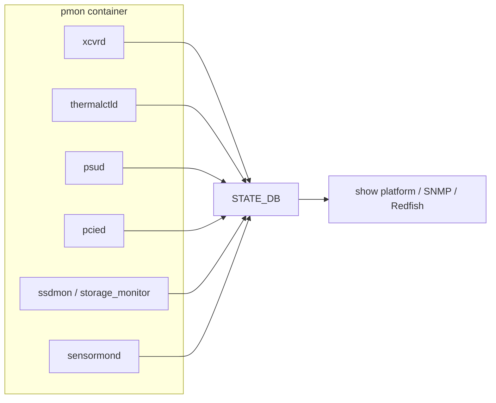

# 運用

ここでは、装置 health と optics に関連する確認順序を、運用シナリオ別に整理します。各 daemon の詳細は元 HLD を参照してください。

## どの daemon がどこを見ているか

`show platform` 系コマンドは基本的に STATE_DB を経由するため、daemon が値を更新できていないと CLI も空に見えます。最初に確認するのは daemon の up/down です。

## Optics: SFP / QSFP / CMIS

xcvrd は SFP 系の EEPROM 読出しと state machine を担当します。CMIS (Common Management Interface Spec) 採用モジュールは、レガシー SFP より複雑な state machine を持ちます。

- 全体像: [SFP refactoring](../../platform/sonic-sfp-refactoring.md)
- CMIS 強化: [enhancement of CMIS module management](../../management/enhancement-of-cmis-module-management.md)
- ZR 対応: [CMIS / C-CMIS support for ZR](../../platform/cmis-and-c-cmis-support-for-zr.md)
- カスタム SI: [custom SI settings for CMIS modules](../../platform/custom-si-settings-for-cmis-modules.md)
- transceiver / sensor 監視: [transceiver and sensor monitoring HLD](../../system/transceiver-and-sensor-monitoring-hld.md)

「モジュールを挿したのに認識されない / DOM が出ない / link が上がらない」は、まず xcvrd ログと STATE_DB の `TRANSCEIVER_INFO` / `TRANSCEIVER_DOM_SENSOR` を見ます。

## Thermal / Fan / 液冷

- [SONiC thermal control design](../../platform/sonic-thermal-control-design.md): thermalctld の制御ループ。
- [thermal control test plan](../../platform/thermal-control-test-plan.md): 期待される挙動と試験観点。
- [liquid cooling leakage detection](../../platform/liquid-cooling-leakage-detection-in-sonic.md): 液冷装置のリーク検知。

thermal shutdown が走ると port は強制 down します。port down の原因解析で見落としやすい経路です。

## PSU

- [SONiC PSU daemon design](../../platform/sonic-psu-daemon-design.md): psud の責任範囲。

電源冗長の片系障害は `show platform psustatus` 等で確認できます。

## Storage / SSD

SONiC は装置の SSD 寿命を継続監視します。

- [ssdhealth design](../../architecture/ssdhealth-design.md): 旧来の SSD 健全性デザイン。
- [storage monitoring daemon design](../../system/sonic-storage-monitoring-daemon-design.md): 新しい storage monitor の方針。

書込み量や bad block 増加は装置交換判断につながるため、定期確認の対象です。

## PCIe

- [pcieinfo design](../../platform/pcieinfo-design.md): `pcieutil` / `pcied` の旧設計。
- [SONiC PCIe monitoring services HLD](../../system/sonic-pcie-monitoring-services-hld.md): PCIe 経路の健全性監視。

PCIe error は ASIC との通信不能や syncd 落ちにつながるため、syslog と STATE_DB を併せて確認します。

## `show platform` の読み方

`show platform` 配下は、装置情報、PSU、fan、temperature、transceiver、SSD、PCIe など、上で挙げた daemon の出力をまとめた CLI です。詳細は [show platform リファレンス](../../reference/cli/show-platform.md) を参照してください。「装置全体の健康診断」を 1 か所で見たいときの入口になります。

## 関連ページ

- [show platform](../../reference/cli/show-platform.md)
- [SFP refactoring](../../platform/sonic-sfp-refactoring.md)
- [transceiver and sensor monitoring HLD](../../system/transceiver-and-sensor-monitoring-hld.md)
- [SONiC thermal control design](../../platform/sonic-thermal-control-design.md)
- [SONiC PSU daemon design](../../platform/sonic-psu-daemon-design.md)
- [storage monitoring daemon design](../../system/sonic-storage-monitoring-daemon-design.md)
- [SONiC PCIe monitoring services HLD](../../system/sonic-pcie-monitoring-services-hld.md)
