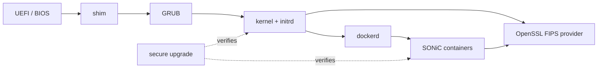

# 発展トピック

ここでは platform 層の信頼チェーンと container hardening を扱います。OpenSSL FIPS、secure boot、secure upgrade、container hardening は、それぞれ独立した HLD として整備されており、本ページは「どの順で読み、どこで交わるか」を示すための導線です。

## 信頼チェーンの全体像

secure boot は起動時の真正性、OpenSSL FIPS は実行時の暗号モジュールの認証、secure upgrade は image 更新時の真正性、container hardening は実行時の attack surface 縮小に対応します。

## OpenSSL FIPS 140-3

OpenSSL FIPS は、暗号モジュールが FIPS 140-3 の要件を満たして動作することを保証する仕組みです。SONiC では FIPS provider の有効化と、FIPS モード時に許可されるアルゴリズム集合の制約が [OpenSSL FIPS 140-3 HLD](../../system/sonic-openssl-fips-140-3-hld.md) に整理されています。

実装と運用は [SONiC FIPS deployment](../../system/sonic-fips-deployment.md) で別ページに分けられており、image ビルド、起動時の自己テスト、CLI からの状態確認、トラブルシュートの観点が含まれます。FIPS モードを有効にすると SSH、IPsec、HTTPS、MACsec MKA など暗号を使う全ての経路の挙動が変わるため、本機能を導入するときは [認証認可の設定](setup.md) で並べたバックエンドの cipher suite と矛盾しないかを確認します。

## Secure boot

[secure boot HLD](../../system/hld-secure-boot.md) は、UEFI Secure Boot を前提に shim、GRUB、kernel、initrd の署名検証を連鎖させ、改ざんされたコンポーネントの実行を拒否する仕組みを定義します。SONiC image の build と shim 証明書配布が密接に絡むため、ビルド側の章（[Build / Packaging](../../topics/index.md) 配下の該当章があれば）と合わせて読みます。

## Secure upgrade

[secure upgrade](../../system/secure-upgrade.md) は、`sonic-installer` などで適用する image を署名検証込みで取り扱うための仕組みです。warm/fast/SONiC-To-SONiC の手順そのものは [Reboot / Upgrade / Lifecycle](../11-reboot/index.md) で扱い、本章では「どの鍵で誰が署名し、どこで検証するか」という信頼チェーンの面に絞ります。

## Container hardening

SONiC は機能を Docker コンテナに分割しており、各コンテナの権限・capabilities・mount を絞ることが防御深度の鍵になります。設計の意図と推奨デフォルトは [container hardening](../../system/sonic-container-hardening.md) にまとまっています。AAA や MACsec のような機密に近い経路を持つコンテナほど、不要な capability を削る恩恵が大きい点に注意します。

## 章間リンク

- 認証認可・管理面: [概念](concept.md)、[アーキテクチャ](architecture.md)、[設定](setup.md)、[運用](operations.md)
- データプレーン暗号: [内部実装](internals.md)
- ライフサイクル: [Reboot / Upgrade / Lifecycle](../11-reboot/index.md)
- 設定基盤: [SONiC 全体像と設定基盤](../01-overview/index.md)
