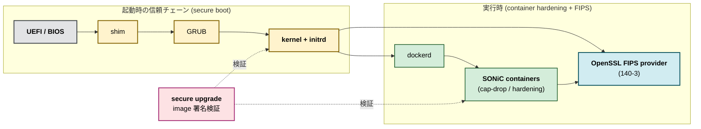

# 発展トピック

ここでは platform 層の信頼チェーンと container hardening を扱います。OpenSSL FIPS、secure boot、secure upgrade、container hardening は、それぞれ独立した [HLD](../../reference/glossary.md#term-hld) として整備されており、本ページは「どの順で読み、どこで交わるか」を示すための導線です。

## 信頼チェーンの全体像

secure boot は起動時の真正性、OpenSSL FIPS は実行時の暗号モジュールの認証、secure upgrade は image 更新時の真正性、container hardening は実行時の attack surface 縮小に対応します。

## OpenSSL FIPS 140-3

OpenSSL FIPS は、暗号モジュールが FIPS 140-3 の要件を満たして動作することを保証する仕組みです。[SONiC](../../reference/glossary.md#term-sonic) では FIPS provider の有効化と、FIPS モード時に許可されるアルゴリズム集合の制約が [OpenSSL FIPS 140-3 HLD](../../system/sonic-openssl-fips-140-3-hld.md) に整理されています。

実装と運用は [SONiC FIPS deployment](../../system/sonic-fips-deployment.md) で別ページに分けられており、image ビルド、起動時の自己テスト、CLI からの状態確認、トラブルシュートの観点が含まれます。FIPS モードを有効にすると SSH、IPsec、HTTPS、[MACsec](../../reference/glossary.md#term-macsec) MKA など暗号を使う全ての経路の挙動が変わるため、本機能を導入するときは [認証認可の設定](setup.md) で並べたバックエンドの cipher suite と矛盾しないかを確認します。

## Secure boot

[secure boot HLD](../../system/hld-secure-boot.md) は、UEFI Secure Boot を前提に shim、GRUB、kernel、initrd の署名検証を連鎖させ、改ざんされたコンポーネントの実行を拒否する仕組みを定義します。SONiC image の build と shim 証明書配布が密接に絡むため、ビルド側の章（[Build / Packaging](../../topics/index.md) 配下の該当章があれば）と合わせて読みます。

## Secure upgrade

[secure upgrade](../../system/secure-upgrade.md) は、`sonic-installer` などで適用する image を署名検証込みで取り扱うための仕組みです。warm/fast/SONiC-To-SONiC の手順そのものは [Reboot / Upgrade / Lifecycle](../11-reboot/index.md) で扱い、本章では「どの鍵で誰が署名し、どこで検証するか」という信頼チェーンの面に絞ります。

## Container hardening

SONiC は機能を Docker コンテナに分割しており、各コンテナの権限・capabilities・mount を絞ることが防御深度の鍵になります。設計の意図と推奨デフォルトは [container hardening](../../system/sonic-container-hardening.md) にまとまっています。[AAA](../../reference/glossary.md#term-aaa) や MACsec のような機密に近い経路を持つコンテナほど、不要な capability を削る恩恵が大きい点に注意します。

## 章間リンク

- 認証認可・管理面: [概念](concept.md)、[アーキテクチャ](architecture.md)、[設定](setup.md)、[運用](operations.md)
- データプレーン暗号: [内部実装](internals.md)
- ライフサイクル: [Reboot / Upgrade / Lifecycle](../11-reboot/index.md)
- 設定基盤: [SONiC 全体像と設定基盤](../01-overview/index.md)

## 発展トピック

- **gNSI による証明書 / authz 集中管理**: [gNMI](../../reference/glossary.md#term-gnmi) 接続の TLS 証明書、RBAC、Pathz による path レベル authz を controller から push する仕組み。手動 ssh と分離した運用と監査が可能になる。
- **MACsec MKA scale**: MACsec を全 port に展開する場合、MKA セッション数と鍵更新コストが [ASIC](../../reference/glossary.md#term-asic) / CPU に効く。`MACSEC_PROFILE` の rekey interval 設計が要点。
- **HSM / TPM 連携**: secure boot 鍵や TLS 秘密鍵を HSM / TPM に保管する構成。`tpm2-tools` と secure upgrade の連携が議題。
- **role-based access control (RBAC)**: ユーザロールと権限の細分化。AAA 認証後の authz で扱うが、CLI / gNMI 両面で一貫した role が要求される。
- **audit logging**: 全ての設定変更を audit log に残す要件で、`auditd` + structured logging への対応拡張。FIPS / セキュア環境では必須。

## 既知の制約と回避方法

- **FIPS モード時の cipher 制限**: SSH / TLS で許可される cipher suite が狭まる。client tools 側で legacy 接続が壊れる事例があり、deployment 前に統合テストが必要。
- **secure boot の鍵管理**: shim に焼く鍵を交換するには物理アクセスが必要。Production fleet 全体での回転には計画が要る。
- **container hardening と debug**: 不要 capability を削ると `strace` / `gdb` がコンテナ内で動かなくなる。Debug 用 image を別途用意する運用が現実的。
- **TACACS+ サーバ障害時のフォールバック**: 全 TACACS+ サーバ到達不能で local 認証に落ちる挙動を確認しておく。`nss-tacplus` の設定順序が重要。

## 将来計画 / ロードマップ

- gNSI 系 (`certz`, `authz`, `pathz`) の SONiC 取り込みが段階的に進行中。完成すれば controller 駆動の証明書ローテーションが標準化される。
- Post-quantum 対応 (Kyber / Dilithium 等) は OpenSSL FIPS 側の進捗待ちで、SONiC は upstream に追随する形。
- container hardening の自動評価 (CIS Benchmarks 風) が community 議題。

## 関連 RFC / 仕様書

- [RFC 8446](https://datatracker.ietf.org/doc/html/rfc8446) — TLS 1.3
- [RFC 4254](https://datatracker.ietf.org/doc/html/rfc4254) — SSH Connection Protocol
- [RFC 8907](https://datatracker.ietf.org/doc/html/rfc8907) — TACACS+
- [RFC 2865](https://datatracker.ietf.org/doc/html/rfc2865) / [RFC 6929](https://datatracker.ietf.org/doc/html/rfc6929) — [RADIUS](../../reference/glossary.md#term-radius) / Extended Attributes
- [FIPS PUB 140-3](https://csrc.nist.gov/publications/detail/fips/140/3/final) — Cryptographic Module Validation
- [IEEE 802.1AE](https://1.ieee802.org/security/802-1ae/) — MACsec
- [IEEE 802.1X](https://1.ieee802.org/security/802-1x/) — Port Access Control

## upstream 開発の最新動向

- `sonic-gnmi` で gNSI 関連 PR が継続して入る。証明書回転、authz ポリシー push の SDK が拡張。
- secure upgrade 周りで署名検証パスのリファクタが進行中。`sonic-installer` のテレメトリ出力改善も並走。
- container hardening の対象 docker (bgp, swss, [syncd](../../reference/glossary.md#term-syncd), telemetry など) ごとに capability 削減 PR が段階投入されている。

<!-- glossary-links-injected: ae6c3c279b05 -->
