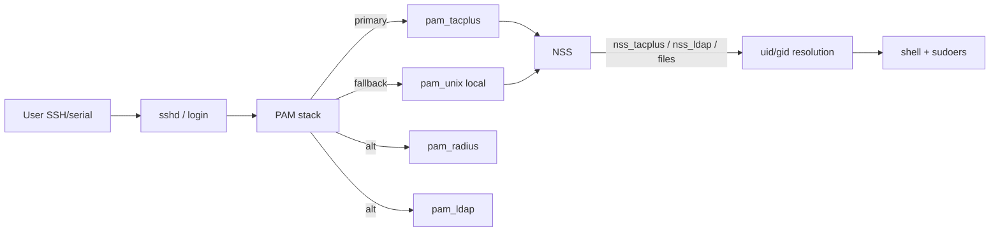
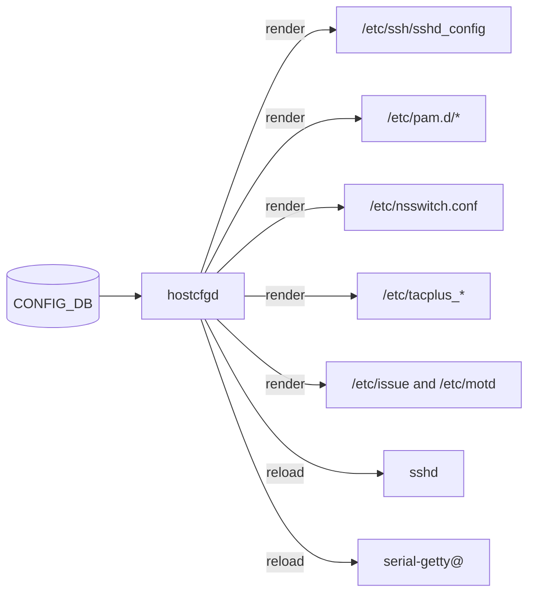

# アーキテクチャ

ここでは login が成立するまでの経路と、`CONFIG_DB` から `/etc/` 配下のサービス設定ファイルへ反映が走る経路を、[SONiC](../../reference/glossary.md#term-sonic) 固有部分に絞って示します。Linux 標準の PAM / NSS の挙動そのものは扱わず、SONiC が「どこで何を差し込んでいるか」に焦点を当てます。

## Login flow の全体像

外部から SSH や serial console で入ってきたユーザーは、PAM の認証スタックを通り、NSS でユーザー情報の解決を受け、最終的に shell とその sudo 権限を得ます。SONiC は PAM / NSS のモジュールチェーンに TACACS+、[RADIUS](../../reference/glossary.md#term-radius)、LDAP のクライアントを差し込み、`CONFIG_DB` の `AAA` テーブルでそれらの順序を制御します。詳細フローは [AAA improvements](../../management/aaa-improvements.md) と [TACACS+ authentication](../../management/tacacs-authentication.md) に図解があります。

`login_method` の順序、エラー時のフォールバック、`tacacs+` と `local` の組み合わせの注意点は [SONiC TACACS+ improvement](../../management/sonic-tacacs-improvement.md) に集約されています。RADIUS と LDAP の細部はそれぞれ [RADIUS management user authentication](../../management/radius-management-user-authentication.md)、[HLD LDAP](../../management/hld-ldap.md) を参照してください。

## hostcfgd と CONFIG_DB から /etc への反映

SSH の global config、serial console、banner、[AAA](../../reference/glossary.md#term-aaa) の設定は、ユーザーが直接 `/etc/ssh/sshd_config` などを編集する設計にはなっていません。`hostcfgd` が `CONFIG_DB` の該当テーブル（`SSH_SERVER`、`SERIAL_CONSOLE`、`BANNER_MESSAGE`、`AAA`、`TACPLUS`、`RADIUS`、`LDAP` など）を購読し、テンプレートからファイルを再生成して関連サービスを reload します。

SSH の global config テーブルと挙動の境界は [SSH server global config HLD](../../management/ssh-server-global-config-hld.md) に、serial console 側は [serial console global config HLD](../../management/serial-console-global-config-hld.md) にあります。

## TACACS+ クライアントの内部構造

SONiC の TACACS+ 統合は PAM と NSS の二段で実装されています。PAM 側は認証と授権・accounting、NSS 側は uid / gid の解決を担当します。passkey（共有秘密）の保存方法には平文と暗号化があり、後者の設計は [TACACS+ passkey encryption](../../management/tacacs-passkey-encryption.md) で導入されています。動作確認のシナリオは [TACACS test plan](../../management/tacacs-test-plan.md) に整理されています。

## Data plane と platform 側の参照

本ページは control plane のフローに限定しています。[MACsec](../../reference/glossary.md#term-macsec) と MKA のホスト・[SAI](../../reference/glossary.md#term-sai) 経路は [内部実装](internals.md) で、OpenSSL FIPS / secure boot / secure upgrade / container hardening は [発展トピック](advanced.md) で扱います。

<!-- glossary-links-injected: 7cebab29cbce -->
