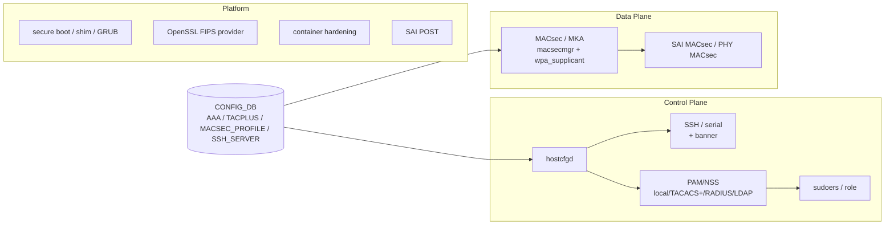
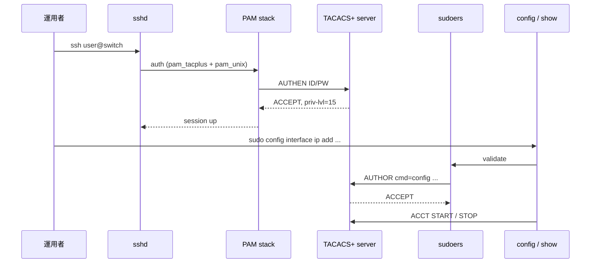

# 概念

SONiC のセキュリティ機能は、ひとつの巨大なサブシステムではなく、Linux の標準スタック（PAM、NSS、OpenSSL、systemd）と SONiC 固有のデーモン（`hostcfgd`、`macsecmgr`、[SAI](../../reference/glossary.md#term-sai)）に薄く重なって実装されています。最初に「どの層のどの問題を解いているか」を分類しておくと、個別 [HLD](../../reference/glossary.md#term-hld) を読む順番が決まります。

## 三層のセキュリティ境界

| 層 | 守るもの | 主な機能 | 主な実装 |
| --- | --- | --- | --- |
| Control plane | 誰がスイッチを操作できるか | [AAA](../../reference/glossary.md#term-aaa)、TACACS+、RADIUS、LDAP、local user、SSH、serial console、banner、password policy | PAM / NSS、`hostcfgd`、`config-db` |
| Data plane | リンク上の暗号と完全性 | MACsec、MKA、Gearbox 経由の MACsec | `macsecmgr`、`wpa_supplicant`、SAI、PHY |
| Platform | 起動・実行・更新の真正性 | OpenSSL FIPS、secure boot、secure upgrade、container hardening、SAI POST | GRUB、shim、OpenSSL FIPS provider、Docker、SAI |

このマトリクスは [概要](index.md) で示した三層と対応しています。以降のページは概ねこの順で並べます。

## AAA の語彙

AAA（Authentication / Authorization / Accounting）は、SONiC では Linux の PAM/NSS を介して TACACS+ / RADIUS / LDAP / local の各バックエンドに振り分けられます。詳細な実装は [AAA improvements](../../management/aaa-improvements.md) に集約されており、login flow とフォールバック順序の改善が議論されています。

- Authentication: ユーザーが本人であることの確認。`login_method` で複数のバックエンドを順序付けます。
- Authorization: そのユーザーが実行できるコマンドの範囲。TACACS+ の per-command 認可や、local の sudoers でカバーされます。
- Accounting: 実行履歴のログ送信。主に TACACS+ で利用されます。

local user の取り扱いは [password hardening 設計](../../architecture/pw-hardening-design.md) と [default credential management](../../management/default-credential-management-for-california-sb-327-conformance.md) で別途厳格化されています。これは初期パスワードや弱いパスワードの利用を防ぐためのもので、認証バックエンドの選択とは独立した層です。

## 管理面ポリシーの位置付け

SSH や serial console、banner は「認証の入口の設定」であり、AAA とは別レイヤーで動きます。`hostcfgd` が `CONFIG_DB` を購読し、`/etc/ssh/sshd_config` などのファイルへ反映します。詳細は [SSH server global config HLD](../../management/ssh-server-global-config-hld.md) と [serial console global config HLD](../../management/serial-console-global-config-hld.md) を参照してください。banner は [banner messages HLD](../../system/banner-messages-hld.md) にまとまっています。

## Data plane security の輪郭

MACsec はリンク単位の L2 暗号化で、SAI MACsec object と、ホスト側の `wpa_supplicant` ベースの MKA 実装を組み合わせて動きます。本章では [内部実装](internals.md) で扱い、設定面は [設定](setup.md) では深く触れません。MACsec の前提は [MACsec HLD](../../switching/macsec-sonic-high-level-design-document.md) を直接読むのが早道です。

## Platform security の輪郭

OpenSSL FIPS、secure boot、secure upgrade、container hardening は、いずれも「コードや鍵が改ざんされていないか」を担保する仕組みです。それぞれ独立した HLD があり、本章では [発展トピック](advanced.md) でまとめて扱います。SAI POST は MACsec 系の起動時健全性チェックで、[SAI POST support for MACsec](../../switching/sonic-sai-post-support-for-macsec.md) を参照します。

## 章の境界

- 管理プレーン向け [CoPP](../../reference/glossary.md#term-copp)（Control Plane [Policing](../../reference/glossary.md#term-policing)）は本章ではなく [ACL / CoPP / Mirror](../07-acl-copp-mirror/index.md) で扱います。本章は「誰が触れるか」の認証面、CoPP 章は「触ってよいパケットの帯域」の制御面と切り分けます。
- secure upgrade はライフサイクル全体の [Reboot / Upgrade / Lifecycle](../11-reboot/index.md) と重複しますが、本章では「信頼チェーン」の観点に限定し、warm/fast/SONiC-To-SONiC の手順は 11 章に委ねます。

## まず読み手の質問に答える

### この章はそもそも何の章か

「Security / AAA」は単一機能ではなく、**SONiC を「誰がどう触れ、どんなコードが動き、どのリンクが盗聴されないか」 を担保する一群の機能** をまとめた章です。Linux 標準スタック（PAM / NSS / sudoers / OpenSSL）と SONiC 固有 daemon（`hostcfgd` / `macsecmgr` / SAI 上の MACsec object）の組み合わせで実装されている点に注意します。

### 何を解決するか

ネットワーク機器を運用するうえで避けられない次のリスクを、層ごとに薄く重ねて押さえます。

- **本人なりすまし**: 共有パスワード / 弱いパスワード / 退職者アカウント残置 → AAA + password hardening + default credential 管理
- **権限逸脱**: 全員 root / sudo 全開 → TACACS+ per-command 認可 + role-based sudoers
- **証跡欠落**: 誰が何を打ったか後から追えない → TACACS+ accounting + syslog 集約
- **リンク盗聴 / 改竄**: 隣接機器との物理リンクが untrusted → MACsec / MKA
- **コード改竄**: ブート中・実行中バイナリの差し替え → secure boot + container hardening + SAI POST
- **暗号弱化**: TLS / SSH の弱 cipher 使用 → OpenSSL FIPS provider + sshd policy

### SONiC 内での位置

入口は概ね [CONFIG_DB](../../reference/glossary.md#term-config_db) と OS 設定ファイルで、出口は PAM スタック、`/etc/ssh/sshd_config`、`wpa_supplicant.conf`、SAI MACsec object です。

### 用語の最短整理

- **AAA**: Authentication（誰か）/ Authorization（何をできるか）/ Accounting（何をしたか）
- **PAM**: Pluggable Authentication Modules。Linux の認証フレームワーク
- **NSS**: Name Service Switch。`/etc/nsswitch.conf` 経由で user / group lookup を AAA バックエンドに振る
- **`hostcfgd`**: CONFIG_DB を購読し、`/etc/ssh/sshd_config` などホスト OS 側ファイルを生成 / reload する daemon
- **TACACS+**: Cisco 由来の AAA プロトコル。per-command 認可と詳細 accounting が強み
- **RADIUS**: もう一つの AAA プロトコル。認証と粗い accounting 向き
- **MACsec / MKA**: IEEE 802.1AE / 802.1X-2010。L2 リンク暗号化と鍵管理プロトコル
- **MKA peer / CKN / CAK**: MKA セッション識別子（CKN）と鍵（CAK）
- **secure boot**: shim → GRUB → kernel の署名チェーン
- **FIPS 140**: 暗号モジュールの認定。SONiC は OpenSSL FIPS provider 切替で対応
- **SAI POST**: Power-On Self Test。起動時に SAI レベルで MACsec 機能の健全性を確認
- **password hardening**: 最低長 / 履歴 / 期限 / 複雑さの強制。`PASSW_HARDENING|POLICIES` で制御

### 典型シーン: TACACS+ 認証でログインしてコマンドを打つ

ポイントは「認証だけ pass しても per-command 認可で弾ける」「accounting は CLI ラッパー側で発火する」の二点で、これにより local user 不要・全コマンドログという運用が成立します。

### 似ているが別物のもの

| 比較対象 | この章との違い |
| --- | --- |
| [ACL / CoPP / Mirror](../07-acl-copp-mirror/index.md) | パケット流入帯域の制限。「誰が」ではなく「どのパケットを」 |
| [VRF / management VRF](../04-vrf-ecmp/index.md) | 管理通信の経路隔離。AAA の到達経路に影響するが認証自体はこの章 |
| [GNMI / OpenConfig](../10-gnmi-openconfig/index.md) | [gNMI](../../reference/glossary.md#term-gnmi) 側 client 認証は TLS + cert 中心で、本章の PAM とは独立した認証経路 |
| [Reboot / Lifecycle](../11-reboot/index.md) | secure upgrade の手順は 11 章。「信頼チェーン」の理屈は本章 |
| データ暗号化（IPSec / TLS） | SONiC でユーザーが直接設定する範囲では大きくない。MACsec はリンク単位の L2 暗号で別物 |
| Linux 一般の hardening（kernel / sysctl） | SONiC では SAI / [orchagent](../../reference/glossary.md#term-orchagent) のセキュリティが上に乗るためここで補強する |

### 読了後にできるようになること

- 各 HLD（AAA improvements / password hardening / MACsec / secure boot / container hardening）が三層のどこを守るかを即答できる
- 「ssh は通るのに sudo が通らない」を NSS / PAM / sudoers / TACACS+ の切り分けで追える
- MACsec を入れるとどの daemon・どの SAI object・どの CONFIG_DB テーブルが増えるかが分かる
- secure boot 系を採用するかを「攻撃モデルと OPEX 増分」で議論できる

<!-- xref-prereq -->
## この章の前提知識

この章を読み進める前に、次の章を押さえておくと迷子になりにくい。

- [SONiC 全体像と設定基盤](../01-overview/index.md)

<!-- glossary-links-injected: 87fa713c3c5e -->
