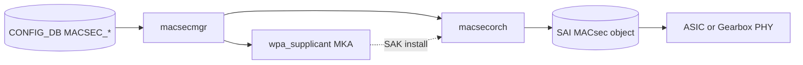

# 内部実装

ここではデータプレーン側のセキュリティ、特に MACsec / MKA とその ASIC・Gearbox 側の境界、起動時の SAI POST を扱います。control plane の AAA 系は [アーキテクチャ](architecture.md) で完結しており、本ページではリンクの暗号と完全性に話を限定します。

## MACsec の control / data plane 境界

MACsec はリンク単位の L2 暗号化規格で、SONiC では大きく二つの世界に分けて実装されています。

- Control plane: MKA（MACsec Key Agreement）と SAK 配布。ホスト側の `wpa_supplicant` ベースのプロセスが担当し、`macsecmgr` が `CONFIG_DB` と仲介します。
- Data plane: SAI MACsec object（SC、SA、フィルタ）と、ASIC または Gearbox PHY 上の暗号エンジン。

全体設計と既存ページの呼び出し方は [MACsec HLD](../../switching/macsec-sonic-high-level-design-document.md) に集約されています。CONFIG_DB から SAI までのデータフロー、cipher suite、replay protection の取り扱いはこの HLD を起点に読み進めます。

## Gearbox port での backend 選択

NPU 側と Gearbox PHY 側のどちらに MACsec engine を寄せるかは、プラットフォームごとに異なります。SONiC は両方を抽象化するため、決定的に backend を選ぶ仕組みが [deterministic MACsec backend selection for gearbox ports HLD](../../switching/sonic-hld-deterministic-macsec-backend-selection-for-gearbox-ports.md) で導入されています。設定の意図が「NPU で暗号する」「PHY で暗号する」のどちらなのかが、運用時の counter 配置や trouble shooting の起点を決めます。

## SAI POST

起動時に MACsec engine が正しく動作するかを確認する Power-On Self Test は、[SAI POST support for MACsec](../../switching/sonic-sai-post-support-for-macsec.md) で扱われます。MACsec を有効化したリンクで「鍵は配布されたのに通信が落ちる」という症状を切り分ける際、SAI POST の結果は最初に当たる材料です。本機能はプラットフォーム実装依存が大きいため、ベンダーの SAI ドライバ側のサポート状況を必ず確認します。

## control plane との接続点

MACsec の有効化は AAA や SSH のような login 系ポリシーとは独立に運用しますが、鍵のローテーションや障害時の bypass ポリシーは管理面 ACL や CoPP の設計と組み合わせて考えるべきです。CoPP の枠組みは [ACL / CoPP / Mirror](../07-acl-copp-mirror/index.md) を参照してください。

platform 側の信頼チェーン（OpenSSL FIPS、secure boot、secure upgrade）は [発展トピック](advanced.md) で扱います。
