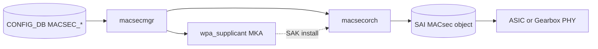
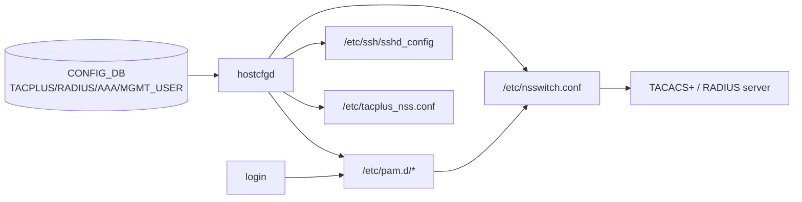
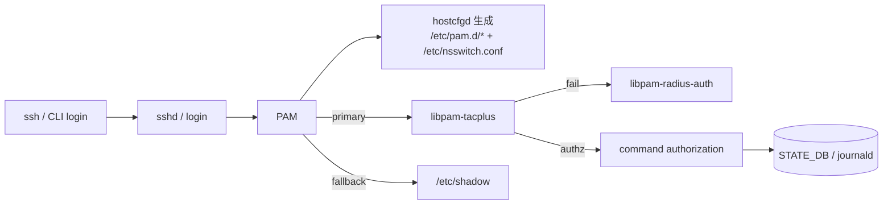

# 内部実装

ここではデータプレーン側のセキュリティ、特に [MACsec](../../reference/glossary.md#term-macsec) / MKA とその [ASIC](../../reference/glossary.md#term-asic)・Gearbox 側の境界、起動時の [SAI](../../reference/glossary.md#term-sai) POST を扱います。control plane の [AAA](../../reference/glossary.md#term-aaa) 系は [アーキテクチャ](architecture.md) で完結しており、本ページではリンクの暗号と完全性、および host 設定生成の流れに話を限定します。

## MACsec の control / data plane 境界

MACsec はリンク単位の L2 暗号化規格で、[SONiC](../../reference/glossary.md#term-sonic) では大きく二つの世界に分けて実装されています。

- Control plane: MKA（MACsec Key Agreement）と SAK 配布。ホスト側の `wpa_supplicant` ベースのプロセスが担当し、`macsecmgr` が `CONFIG_DB` と仲介します<!-- evidence: sonic-swss/cfgmgr/macsecmgr.cpp L27-29, L289-300 -->。
- Data plane: SAI MACsec object（MACsec / MACsecPort / MACsecFlow / MACsecSC / MACsecSA）と、ASIC または Gearbox PHY 上の暗号エンジン<!-- evidence: sonic-swss/orchagent/macsecorch.cpp L1238-1342, L1552-1632, L2065-2080, L2461-2487 -->。

全体設計と既存ページの呼び出し方は [MACsec HLD](../../switching/macsec-sonic-high-level-design-document.md) に集約されています。[CONFIG_DB](../../reference/glossary.md#term-config_db) から SAI までのデータフロー、cipher suite、replay protection の取り扱いはこの [HLD](../../reference/glossary.md#term-hld) を起点に読み進めます。



## Gearbox port での backend 選択

[NPU](../../reference/glossary.md#term-npu) 側と Gearbox PHY 側のどちらに MACsec engine を寄せるかは、プラットフォームごとに異なります。SONiC は両方を抽象化するため、決定的に backend を選ぶ仕組みが [deterministic MACsec backend selection for gearbox ports HLD](../../switching/sonic-hld-deterministic-macsec-backend-selection-for-gearbox-ports.md) で導入されています。設定の意図が「NPU で暗号する」「PHY で暗号する」のどちらなのかが、運用時の counter 配置や trouble shooting の起点を決めます。

## SAI POST

起動時に MACsec engine が正しく動作するかを確認する Power-On Self Test は、[SAI POST support for MACsec](../../switching/sonic-sai-post-support-for-macsec.md) で扱われます。MACsec を有効化したリンクで「鍵は配布されたのに通信が落ちる」という症状を切り分ける際、SAI POST の結果は最初に当たる材料です。macsecorch 側では MACsec object 生成時に `SAI_MACSEC_ATTR_ENABLE_POST` を渡す経路があり、ベンダー SAI が POST をサポートしている場合に有効化されます<!-- evidence: sonic-swss/orchagent/macsecorch.cpp L1248, L1280 -->。本機能はプラットフォーム実装依存が大きいため、ベンダーの SAI ドライバ側のサポート状況を必ず確認します。

## control plane との接続点

MACsec の有効化は AAA や SSH のような login 系ポリシーとは独立に運用しますが、鍵のローテーションや障害時の bypass ポリシーは管理面 [ACL](../../reference/glossary.md#term-acl) や [CoPP](../../reference/glossary.md#term-copp) の設計と組み合わせて考えるべきです。CoPP の枠組みは [ACL / CoPP / Mirror](../07-acl-copp-mirror/index.md) を参照してください。

platform 側の信頼チェーン（OpenSSL FIPS、secure boot、secure upgrade）は [発展トピック](advanced.md) で扱います。

## データフロー（AAA / management security 側）

MACsec 以外の AAA（TACACS+ / [RADIUS](../../reference/glossary.md#term-radius) / PAM / NSS / SSH）の制御パスも合わせて整理します。



`hostcfgd` (`sonic-host-services/scripts/hostcfgd`) が CONFIG_DB の `TACPLUS`、`RADIUS`、`AAA`、`MGMT_USER` を読み、PAM / NSS / sshd_config を render する Jinja template (`tacplus_nss.conf.j2` / `radius_nss.conf.j2` / `pam_radius_auth.conf.j2` 等) を持ちます<!-- evidence: sonic-host-services/scripts/hostcfgd L34-98, L354+ AaaCfg -->。

## 主要 daemon / コンポーネントの責務

| コンポーネント | 主実体 | 責務 |
| --- | --- | --- |
| `macsecmgr` (`cfgmgr/macsecmgr.cpp`) | `MACsecMgr::doTask` | CONFIG_DB の MACSEC_PROFILE / MACSEC_INTERFACE を読み、wpa_supplicant config と起動を管理 |
| `MACsecOrch` (`orchagent/macsecorch.cpp`) | `MACsecOrch::doTask` | [APPL_DB](../../reference/glossary.md#term-appl_db) から SAI MACsec object に展開 |
| `wpa_supplicant` (MKA mode) | open source wpa_supplicant | MKA peer 探索、SAK 生成・配布 |
| `hostcfgd` | python | AAA / SSH / SYSLOG 系の host 設定 render |
| `mgmt-framework` | [YANG](../../reference/glossary.md#term-yang) / REST | management plane 認証統合 |

## SAI 属性使用一覧（MACsec）

macsecorch.cpp で実際に set される属性のみを列挙します。SAI ヘッダにはこれ以外の属性も定義されていますが、SONiC 側で参照されていないものはここに含めていません。

| object | 属性 |
| --- | --- |
| `SAI_OBJECT_TYPE_MACSEC` | `SAI_MACSEC_ATTR_DIRECTION`、`SAI_MACSEC_ATTR_PHYSICAL_BYPASS_ENABLE`、`SAI_MACSEC_ATTR_ENABLE_POST`、`SAI_MACSEC_ATTR_SCI_IN_INGRESS_MACSEC_ACL`、`SAI_MACSEC_ATTR_MAX_SECURE_ASSOCIATIONS_PER_SC` |
| `SAI_OBJECT_TYPE_MACSEC_PORT` | `SAI_MACSEC_PORT_ATTR_MACSEC_DIRECTION`、`SAI_MACSEC_PORT_ATTR_PORT_ID` |
| `SAI_OBJECT_TYPE_MACSEC_FLOW` | `SAI_MACSEC_FLOW_ATTR_MACSEC_DIRECTION` |
| `SAI_OBJECT_TYPE_MACSEC_SC` | `SAI_MACSEC_SC_ATTR_MACSEC_DIRECTION`、`FLOW_ID`、`MACSEC_SCI`、`ENCRYPTION_ENABLE`、`MACSEC_EXPLICIT_SCI_ENABLE`、`MACSEC_CIPHER_SUITE` |
| `SAI_OBJECT_TYPE_MACSEC_SA` | `SAI_MACSEC_SA_ATTR_MACSEC_DIRECTION`、`SC_ID`、`AN`、`SAK`、`SALT`、`AUTH_KEY`、`MACSEC_SSCI`、`CONFIGURED_EGRESS_XPN`、`MINIMUM_INGRESS_XPN` |
| `SAI_OBJECT_TYPE_PORT_SERDES` | MACsec 有効時の SI（Gearbox backend） |

<!-- evidence: sonic-swss/orchagent/macsecorch.cpp L1238-1342 (MACSEC), L1552-1556 (MACSEC_PORT), L2065-2080 (MACSEC_SC), L2461-2487 (MACSEC_SA), L1124, L1188 (XPN) -->

`SAI_MACSEC_SA_ATTR_SAK` の wrap は SAK distribution の最終段で SAI に渡されます。鍵生成は wpa_supplicant 側です。Cipher suite は `MACsecOrch::createMACsecSC` 時にデフォルト `GCM_AES_128` で初期化され、profile 設定に応じて `GCM_AES_256` / `GCM_AES_XPN_128` / `GCM_AES_XPN_256` に切り替わります<!-- evidence: sonic-swss/orchagent/macsecorch.cpp L42, L1608-1632 -->。

> NOTE: replay protection の有効化や window 値は SAI MACsec attribute 群には HLD で定義がありますが、現在の macsecorch 実装では明示的な set は行われていません（SAI 側のデフォルトに委ねている）。実機検証時には `sai_get_attribute` で実際の値を確認してください。

## Redis テーブル参照関係

```yaml
CONFIG_DB:
  MACSEC_PROFILE, MACSEC_INTERFACE,
  TACPLUS, TACPLUS_SERVER, RADIUS, RADIUS_SERVER,
  AAA, MGMT_USER, USER_LIST,
  PASSWD_HARDENING
APPL_DB:
  MACSEC_INGRESS_SA_TABLE, MACSEC_EGRESS_SA_TABLE,
  MACSEC_INGRESS_SC_TABLE, MACSEC_EGRESS_SC_TABLE, MACSEC_PORT_TABLE
STATE_DB:
  MACSEC_INGRESS_SA_TABLE, MACSEC_EGRESS_SA_TABLE (運用状態)
COUNTERS_DB:
  COUNTERS:<macsec-sc-oid>, COUNTERS:<macsec-flow-oid>
ASIC_DB:
  MACSEC, MACSEC_PORT, MACSEC_FLOW, MACSEC_SC, MACSEC_SA
```

## ZMQ / Redis pub/sub

- ZMQ は使わない。
- `wpa_supplicant` と `macsecmgr` は `wpa_cli` の Unix socket（`-g <sock>`）で通信します<!-- evidence: sonic-swss/cfgmgr/macsecmgr.cpp L206-260, L635-659 -->。[Redis](../../reference/glossary.md#term-redis) 経由ではありません。
- AAA 認証（PAM → TACACS+/RADIUS）は同期 RPC で、Redis を経由しません。

## 既知の実装上の制約

- MACsec SAK の rekey 頻度（key lifetime）は wpa_supplicant の設定で、頻度を上げすぎると ASIC 側で `SA install` が間に合わず短時間 drop が発生します。
- `MACSEC_SA_ATTR_SAK` の wrap キーは平文で SAI まで渡る設計のため、[syncd](../../reference/glossary.md#term-syncd) / SAI のメモリ保護が信頼境界です。コア dump に鍵が出るリスクは HLD 範囲です。
- Gearbox backend 選択は装置依存で、deterministic 選択 HLD があっても全ベンダ実装が揃っているとは限りません。
- SAI POST は MACsec engine の起動確認のみで、運用中の rekey 失敗や cipher suite mismatch は捕捉しません。
- TACACS+ の `command` authorization は host CLI 経由のみで、`gnmi` / REST API 経路では別途 RBAC 設定が必要です。
- FIPS モードは OpenSSL の library 切替に依存し、libssl のバージョン整合と FIPS module の有無で「FIPS にしたつもりが効いていない」事故が起きやすい。

## AAA の認証フロー詳細

SONiC の AAA は **PAM + NSS** を起点に、TACACS+ / RADIUS / LDAP / local を順序通り問い合わせます。



順序と authz policy は `CONFIG_DB:AAA` テーブルから `hostcfgd` が `/etc/pam.d/common-auth-sonic` 等を render することで反映されます。`gnmi` や REST API の認証は PAM を経由しない別経路（gNSI authz、token-based）であり、TACACS+ の `command` authorization は host CLI のみに効きます。

<!-- glossary-links-injected: ae6c3c279b05 -->
