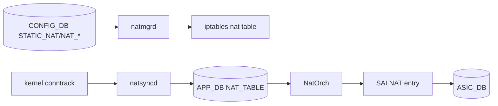
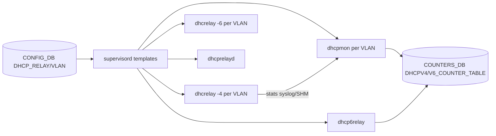
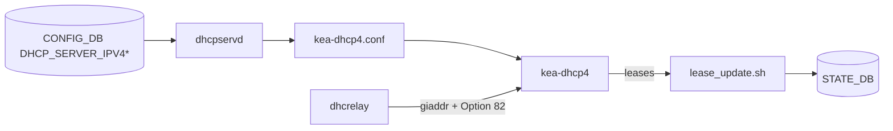

# アーキテクチャ

この章は [NAT](../../reference/glossary.md#term-nat)、DHCP relay、DHCP server の内部構造を「container → daemon → 設定生成 → packet path」の順に並べます。time / DNS と TWAMP Light は OS / [SAI](../../reference/glossary.md#term-sai) 寄りなので発展トピックに分けました。

## docker-nat と NAT orch

NAT は `docker-nat` という独立 container に閉じています。中で動く daemon は次の通りです。

- `natmgrd`: [CONFIG_DB](../../reference/glossary.md#term-config_db) の `STATIC_NAT` / `STATIC_NAPT` / `NAT_POOL` / `NAT_BINDINGS` / `NAT_ZONE` / `NAT_GLOBAL` を読み、Linux iptables の nat table と conntrack を設定します。`sonic-swss/cfgmgr/natmgrd.cpp` 系で実装されています。
- `natsyncd`: kernel の conntrack notification を購読し、動的 NAT entry を APP_DB に push します。`sonic-swss/natsyncd/natsyncd.cpp` 系です。
- `NatOrch`: [orchagent](../../reference/glossary.md#term-orchagent) 側の sub-orch で、APP_DB の NAT entry を SAI NAT API（SAI_OBJECT_TYPE_NAT_ENTRY）にプログラムします。

要点は、static NAT は CONFIG_DB → iptables + SAI の経路、dynamic NAT は kernel が学習した conntrack を natsyncd が拾って SAI にも push する経路、という二段構成です。CPU を抜けるフローと [ASIC](../../reference/glossary.md#term-asic) ハードウェアパスのフローで挙動が分かれるため、counter 確認も別パスで見ます。

## docker-dhcp-relay と dhcrelay / dhcpmon / dhcprelayd

`docker-dhcp-relay` には複数プロセスが supervisord で起動します。

- `dhcrelay`（v4）: [VLAN](../../reference/glossary.md#term-vlan) ごとに 1 プロセス。`docker-dhcp-relay/dhcp-relay.programs.j2` で `DHCP_RELAY[vlan_name]['dhcp_servers']` から `program:dhcrelay-Vlan<N>` が生成されます。
- `dhcrelay -6`: 同 container に並走し、`dhcpv6_servers` を持つ VLAN だけ起動します。DHCPv6 リレー [HLD](../../reference/glossary.md#term-hld) はこの並走構成を定義したものです。
- `dhcpmon`: relay と並走して DHCP packet を監視し、per-interface counter を [COUNTERS_DB](../../reference/glossary.md#term-counters_db) に書きます。マルチスレッド化済みです。
- `dhcp6relay`: 独立した DHCPv6 relay daemon（`sonic-dhcp-relay` リポジトリ）。Option 79（RFC 6939）対応と dual-ToR の loopback アドレス利用が責務です。
- `dhcprelayd`: kea ローカルモードのとき dhcrelay 側と協調して動的に config を更新する agent です。

per-interface counter は VLAN / [PortChannel](../../reference/glossary.md#term-portchannel) 単位だけでなく interface 単位で `DHCPV4_COUNTER_TABLE` / `DHCPV6_COUNTER_TABLE` を持つよう拡張されています。詳細は [per-interface counter ページ](../../routing/dhcp-relay-per-interface-counter.md)を参照してください。

## giaddr 固定（secondary subnet 対応）

VLAN_INTERFACE に secondary IPv4 を付けると、デフォルトの `dhcrelay` は最初に見つけたアドレスを giaddr にしてしまい、server 側 pool 選択がブレます。[SONiC](../../reference/glossary.md#term-sonic) は ISC dhcrelay にパッチ（`-pg`）を当てて、primary subnet の gateway を明示するようテンプレート（`dhcpv4-relay.agents.j2`）で `VLAN_INTERFACE | get_primary_addr` を回しています。`config interface ip add --secondary` で書き込む `secondary: "true"` フラグが起点です。詳細は [giaddr 固定ページ](../../management/dhcp-relay-v4-specify-gaaddr-as-primary-interface-s-gateway-explicitly.md)を参照してください。

## docker-dhcp-server と kea-dhcp4

ポートベース IPv4 DHCP server は kea を使います。

- `dhcpservd`: CONFIG_DB の `DHCP_SERVER_IPV4` / `DHCP_SERVER_IPV4_RANGE` / `DHCP_SERVER_IPV4_PORT` / `DHCP_SERVER_IPV4_CUSTOMIZED_OPTIONS` を読み、`kea-dhcp4.conf` を生成して kea を再起動します。
- `kea-dhcp4`: 実際の DHCP server プロセス。relay からの giaddr で subnet を選び、port 単位の reservation を Option 82 circuit-id 経由で照合します。
- `lease_update.sh`: kea の lease ファイル変更を [FDB](../../reference/glossary.md#term-fdb) / [ARP](../../reference/glossary.md#term-arp) と同期する hook。

`FEATURE` テーブルで `docker-dhcp-server` を有効化するのが起点で、無効化されている装置では `dhcprelayd` が外部 server 向けに動作します。詳細は [port-based DHCP server ページ](../../management/ipv4-port-based-dhcp-server-in-sonic.md)を参照してください。

## DHCP DoS 緩和（portmgrd + Linux tc）

DHCP DoS 緩和は SAI / [CoPP](../../reference/glossary.md#term-copp) ではなく Linux Traffic Control を使う設計です。`PORT` の `dhcp_rate_limit` を `portmgrd` が読み、`tc qdisc add dev <port> ingress` と `tc filter` を投入します。ただし master では [portmgrd](../../reference/glossary.md#term-portmgrd) 側の tc 投入ロジックは未取り込みで、CoPP の `dhcp_relay` trap も従来どおり残っています（[ページ参照](../../acl-qos/dhcp-dos-mitigation-in-sonic.md)）。本章では「設計上の置き場所」として CoPP / [ACL](../../reference/glossary.md#term-acl) 章ではなく DHCP 側に置きます。

## 関連ページ

- [NAT in SONiC](../../architecture/nat-in-sonic.md)
- [DHCPv4 Relay Agent](../../architecture/dhcpv4-relay-agent.md)
- [DHCPv6 Relay Agent](../../architecture/dhcpv6-relay-agent.md)
- [DHCPv6 リレー HLD](../../routing/dhcp-relay-for-ipv6-hld.md)
- [DHCP Relay per-interface counter](../../routing/dhcp-relay-per-interface-counter.md)
- [ポートベース IPv4 DHCP Server](../../management/ipv4-port-based-dhcp-server-in-sonic.md)
- [DHCPv4 Relay giaddr 固定](../../management/dhcp-relay-v4-specify-gaaddr-as-primary-interface-s-gateway-explicitly.md)

<!-- glossary-links-injected: ec18b66e3507 -->
