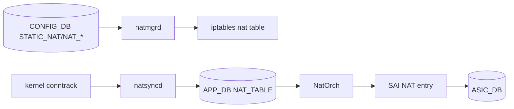
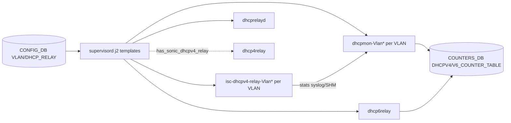
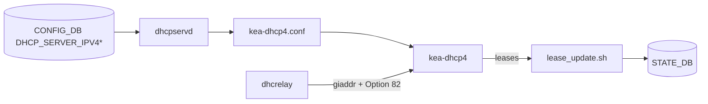

# アーキテクチャ

この章は [NAT](../../reference/glossary.md#term-nat)、DHCP relay、DHCP server の内部構造を「container → daemon → 設定生成 → packet path」の順に並べます。time / DNS と TWAMP Light は OS / [SAI](../../reference/glossary.md#term-sai) 寄りなので発展トピックに分けました。

## docker-nat と NAT orch

NAT は `docker-nat` という独立 container に閉じています。中で動く daemon は次の通りです。

- `natmgrd`: [CONFIG_DB](../../reference/glossary.md#term-config_db) の `STATIC_NAT` / `STATIC_NAPT` / `NAT_POOL` / `NAT_BINDINGS` / `NAT_GLOBAL` テーブルおよびインターフェース側の `NAT_ZONE` 属性を読み、Linux iptables の nat table と conntrack を設定します。`cfgmgr/natmgrd.cpp` で subscribe テーブル一覧が、`cfgmgr/natmgr.cpp` で `NAT_ZONE` ハンドリング等の本体ロジックが実装されています[^nat-natmgrd][^natmgr].
- `natsyncd`: kernel の conntrack notification を購読し、動的 NAT entry を APP_DB に push します。`natsyncd/natsyncd.cpp` がエントリポイント、`natsyncd/natsync.cpp` が conntrack ハンドラ本体です[^natsyncd].
- `NatOrch`: [orchagent](../../reference/glossary.md#term-orchagent) 側の sub-orch で、APP_DB の NAT entry を SAI NAT API（SAI_OBJECT_TYPE_NAT_ENTRY）にプログラムします。

[^nat-natmgrd]: `sonic-net/sonic-swss` `cfgmgr/natmgrd.cpp` L110-L114 で `CFG_STATIC_NAT_TABLE_NAME` / `CFG_STATIC_NAPT_TABLE_NAME` / `CFG_NAT_POOL_TABLE_NAME` / `CFG_NAT_BINDINGS_TABLE_NAME` / `CFG_NAT_GLOBAL_TABLE_NAME` を subscribe (`ref: 4305596156d70e9797e8a881b3d19b46de0bce0d`).
[^natmgr]: `sonic-net/sonic-swss` `cfgmgr/natmgr.cpp` L7499 付近で `NAT_ZONE` フィールドを参照 (`ref: 4305596156d70e9797e8a881b3d19b46de0bce0d`).
[^natsyncd]: `sonic-net/sonic-swss` `natsyncd/natsyncd.cpp` (entrypoint) と `natsyncd/natsync.cpp` (conntrack handler、約 1000 行) (`ref: 4305596156d70e9797e8a881b3d19b46de0bce0d`).

要点は、static NAT は CONFIG_DB → iptables + SAI の経路、dynamic NAT は kernel が学習した conntrack を natsyncd が拾って SAI にも push する経路、という二段構成です。CPU を抜けるフローと [ASIC](../../reference/glossary.md#term-asic) ハードウェアパスのフローで挙動が分かれるため、counter 確認も別パスで見ます。

## docker-dhcp-relay と dhcrelay / dhcpmon / dhcprelayd

`docker-dhcp-relay` には複数プロセスが supervisord で起動します。

- `isc-dhcpv4-relay-<vlan>`（ISC dhcrelay, v4）: [VLAN](../../reference/glossary.md#term-vlan) ごとに 1 プロセス。`docker-dhcp-relay/dhcpv4-relay.agents.j2` が `VLAN[vlan_name]['dhcp_servers']` を走査して `[program:isc-dhcpv4-relay-<vlan>]` block を生成します（DHCPv4 server を持つ VLAN のみ起動）[^v4agents].
- `dhcp6relay`: `sonic-dhcp-relay` リポジトリの独立 DHCPv6 relay daemon。Option 79（RFC 6939、Source Link-Layer Address option）対応と dual-ToR の Loopback アドレス利用が責務で、`DHCP_RELAY[vlan_name]['dhcpv6_servers']` を持つ VLAN がひとつでもあれば 1 プロセスが起動します[^dhcp6relay][^dhcpv6agents].
- `dhcpmon-<vlan>`: relay と並走して DHCP packet を監視し、per-VLAN counter を [COUNTERS_DB](../../reference/glossary.md#term-counters_db) に書きます。`dhcp-relay.monitors.j2` で per-VLAN `[program:dhcpmon-<vlan>]` block が生成されます[^monitors]. per-interface 粒度の `DHCPV4_COUNTER_TABLE` / `DHCPV6_COUNTER_TABLE` 拡張は別ページ参照。
- `dhcp4relay`: `has_sonic_dhcpv4_relay=True` の構成（sonic-dhcp-relay 製の新 v4 リレー）でのみ起動する代替プロセス。`dhcpv4-sonic-relay.agents.j2` で `[program:dhcp4relay]` が生成され、同時に ISC `dhcrelay` 側はテンプレートから除外されます[^v4sonic][^programs].
- `dhcprelayd`: `docker-dhcp-server` 有効時に kea 連携用設定を監視して相手側の relay agent を再生成する Python agent（`sonic-dhcp-utilities`）。`dhcp-relay.programs.j2` の group 必須メンバとして常時起動します[^dhcprelayd].

[^v4agents]: `sonic-net/sonic-buildimage` `dockers/docker-dhcp-relay/dhcpv4-relay.agents.j2` L1-L40（`VLAN[vlan_name]['dhcp_servers']` のループ、`[program:isc-dhcpv4-relay-{{ vlan_name }}]` 生成、`command=/usr/sbin/dhcrelay …`）(`ref: 9ea932ec2e18f35e58268ec2e4456b1d4afd65cd`).
[^dhcp6relay]: `sonic-net/sonic-dhcp-relay` `dhcp6relay/src/relay.cpp` L698-L700 で Option 79 (`option_linklayer_addr option79;`) を組み立て (`ref: 7316417034fee6a6c6002490362c9bc75eeafde1`).
[^dhcpv6agents]: `sonic-net/sonic-buildimage` `dockers/docker-dhcp-relay/dhcpv6-relay.agents.j2` L1-L25 で `DHCP_RELAY[vlan_name]['dhcpv6_servers']` を走査し `[program:dhcp6relay]` を生成 (`ref: 9ea932ec2e18f35e58268ec2e4456b1d4afd65cd`).
[^monitors]: `sonic-net/sonic-buildimage` `dockers/docker-dhcp-relay/dhcp-relay.monitors.j2` L22-L23（`[program:dhcpmon-{{ vlan_name }}] / command=/usr/sbin/dhcpmon -id {{ vlan_name }}`）(`ref: 9ea932ec2e18f35e58268ec2e4456b1d4afd65cd`).
[^v4sonic]: `sonic-net/sonic-buildimage` `dockers/docker-dhcp-relay/dhcpv4-sonic-relay.agents.j2` L1-L5（`[program:dhcp4relay] / command=/usr/sbin/dhcp4relay`）(`ref: 9ea932ec2e18f35e58268ec2e4456b1d4afd65cd`).
[^programs]: `sonic-net/sonic-buildimage` `dockers/docker-dhcp-relay/dhcp-relay.programs.j2` L1-L37 で `[group:dhcp-relay]` の構成員を生成。`has_sonic_dhcpv4_relay=True` で `dhcp4relay`、`dhcpv6_servers` ありで `dhcp6relay` を group に追加。group には `dhcprelayd` が常時含まれる (`ref: 9ea932ec2e18f35e58268ec2e4456b1d4afd65cd`).
[^dhcprelayd]: `sonic-net/sonic-buildimage` `src/sonic-dhcp-utilities/dhcp_utilities/dhcprelayd/dhcprelayd.py`（Python 製 agent、`docker-dhcp-server` 有効化時の relay 側設定切替を司る）(`ref: 9ea932ec2e18f35e58268ec2e4456b1d4afd65cd`).

per-interface counter は VLAN / [PortChannel](../../reference/glossary.md#term-portchannel) 単位だけでなく interface 単位で `DHCPV4_COUNTER_TABLE` / `DHCPV6_COUNTER_TABLE` を持つよう拡張されています。詳細は [per-interface counter ページ](../../routing/dhcp-relay-per-interface-counter.md)を参照してください。

## giaddr 固定（secondary subnet 対応）

VLAN_INTERFACE に secondary IPv4 を付けると、デフォルトの `dhcrelay` は最初に見つけたアドレスを giaddr にしてしまい、server 側 pool 選択がブレます。[SONiC](../../reference/glossary.md#term-sonic) は ISC dhcrelay にパッチ（`-pg`）を当てて、primary subnet の gateway を明示するようテンプレート（`dhcpv4-relay.agents.j2`）で `VLAN_INTERFACE | get_primary_addr` を回しています[^giaddr]. `config interface ip add --secondary` で書き込む `secondary: "true"` フラグが起点です。詳細は [giaddr 固定ページ](../../management/dhcp-relay-v4-specify-gaaddr-as-primary-interface-s-gateway-explicitly.md)を参照してください。

[^giaddr]: `sonic-net/sonic-buildimage` `dockers/docker-dhcp-relay/dhcpv4-relay.agents.j2` L28-L30（`VLAN_INTERFACE|get_primary_addr` を走査し、対象 VLAN なら `-pg {{ gateway }}` を追加）(`ref: 9ea932ec2e18f35e58268ec2e4456b1d4afd65cd`).

## docker-dhcp-server と kea-dhcp4

ポートベース IPv4 DHCP server は kea を使います。

- `dhcpservd`: CONFIG_DB の `DHCP_SERVER_IPV4` / `DHCP_SERVER_IPV4_RANGE` / `DHCP_SERVER_IPV4_PORT` / `DHCP_SERVER_IPV4_CUSTOMIZED_OPTIONS` を読み、`/etc/kea/kea-dhcp4.conf` を生成して kea を再起動します[^dhcpservd].
- `kea-dhcp4`: 実際の DHCP server プロセス。relay からの giaddr で subnet を選び、port 単位の reservation を Option 82 circuit-id 経由で照合します。
- `lease_update.sh`: kea の lease ファイル変更を [FDB](../../reference/glossary.md#term-fdb) / [ARP](../../reference/glossary.md#term-arp) と同期する hook（kea の lease commit/expire hook から呼ばれる shell script）[^leaseupdate].

[^dhcpservd]: `sonic-net/sonic-buildimage` `src/sonic-dhcp-utilities/dhcp_utilities/dhcpservd/dhcpservd.py` L17 `KEA_DHCP4_CONFIG = "/etc/kea/kea-dhcp4.conf"`、L32-L53（`_notify_kea_dhcp4_proc` / 設定生成）(`ref: 9ea932ec2e18f35e58268ec2e4456b1d4afd65cd`).
[^leaseupdate]: `sonic-net/sonic-buildimage` `dockers/docker-dhcp-server/lease_update.sh`（kea hook から呼び出される lease 同期スクリプト）(`ref: 9ea932ec2e18f35e58268ec2e4456b1d4afd65cd`).

`FEATURE` テーブルで `docker-dhcp-server` を有効化するのが起点で、無効化されている装置では `dhcprelayd` が外部 server 向けに動作します。詳細は [port-based DHCP server ページ](../../management/ipv4-port-based-dhcp-server-in-sonic.md)を参照してください。

## DHCP DoS 緩和（portmgrd + Linux tc）

DHCP DoS 緩和は SAI / [CoPP](../../reference/glossary.md#term-copp) ではなく Linux Traffic Control を使う設計です。[HLD](../../reference/glossary.md#term-hld) 上は `PORT` テーブルの `dhcp_rate_limit` 属性を [portmgrd](../../reference/glossary.md#term-portmgrd) が読み、`tc qdisc add dev <port> ingress` と `tc filter` を投入する想定で、`sonic-port.yang` には対応する leaf が定義されています[^rateleaf]. ただし master では portmgrd 側の tc 投入ロジックはまだ取り込まれておらず、CoPP の `dhcp_relay` trap も従来どおり残っています（[ページ参照](../../acl-qos/dhcp-dos-mitigation-in-sonic.md)）。本章では「設計上の置き場所」として CoPP / [ACL](../../reference/glossary.md#term-acl) 章ではなく DHCP 側に置きます。

[^rateleaf]: `sonic-net/sonic-buildimage` `src/sonic-yang-models/yang-models/sonic-port.yang` L106 `leaf dhcp_rate_limit`（[YANG](../../reference/glossary.md#term-yang) 定義は存在）(`ref: 9ea932ec2e18f35e58268ec2e4456b1d4afd65cd`).

## 関連ページ

- [NAT in SONiC](../../architecture/nat-in-sonic.md)
- [DHCPv4 Relay Agent](../../architecture/dhcpv4-relay-agent.md)
- [DHCPv6 Relay Agent](../../architecture/dhcpv6-relay-agent.md)
- [DHCPv6 リレー HLD](../../routing/dhcp-relay-for-ipv6-hld.md)
- [DHCP Relay per-interface counter](../../routing/dhcp-relay-per-interface-counter.md)
- [ポートベース IPv4 DHCP Server](../../management/ipv4-port-based-dhcp-server-in-sonic.md)
- [DHCPv4 Relay giaddr 固定](../../management/dhcp-relay-v4-specify-gaaddr-as-primary-interface-s-gateway-explicitly.md)

<!-- glossary-links-injected: a57d1eb92192 -->
