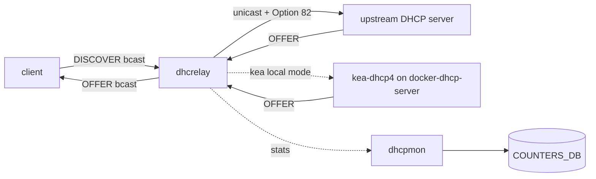
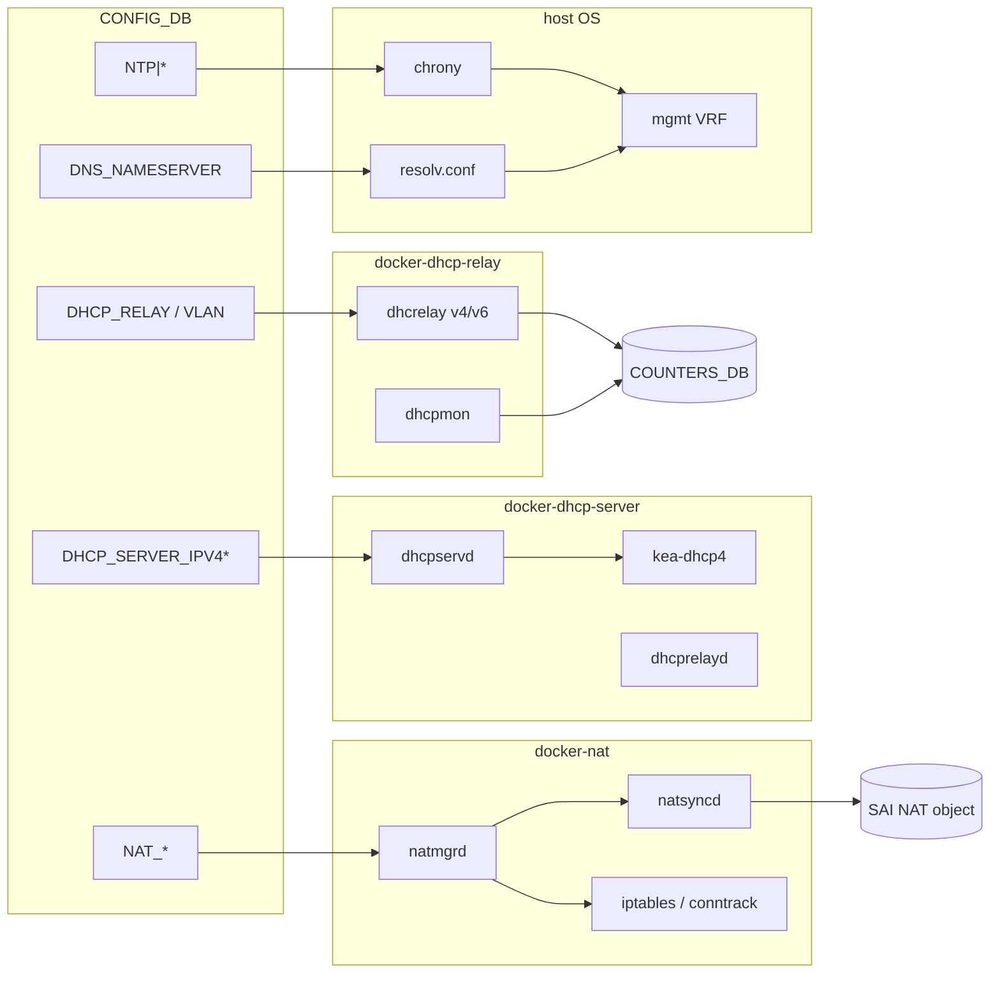
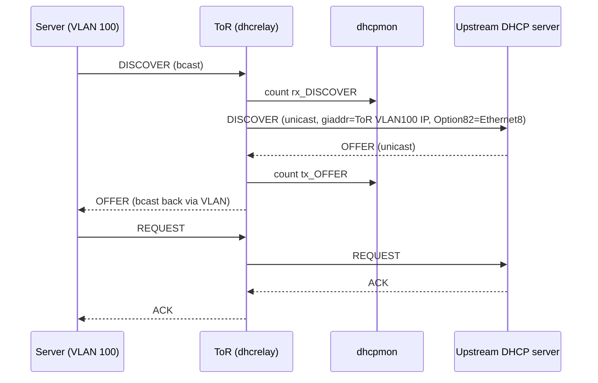

# 概念

「edge / management サービス」は、ToR や management スイッチに乗っている付帯機能の集合で、[SONiC](../../reference/glossary.md#term-sonic) では大きく 4 群に分けて読むと混乱しません。L3 forwarding 章で扱う routing そのものとは別の層であり、共通点は「container 単位で隔離された daemon が [CONFIG_DB](../../reference/glossary.md#term-config_db) を読んで OS パッケージや iptables を駆動する」点にあります。

## 4 つの責務

- [NAT](../../reference/glossary.md#term-nat): data plane でのアドレス書換。`docker-nat` の `natmgrd` が CONFIG_DB を読み、`natsyncd` が kernel conntrack を観測して、Linux iptables の conntrack エントリと [SAI](../../reference/glossary.md#term-sai) NAT 属性を同期します。SONiC では iptables ↔ SAI の二重管理がポイントです。
- DHCP relay: client broadcast を upstream server へ unicast 中継する agent。`docker-dhcp-relay` 内の ISC 由来 `dhcrelay` を [VLAN](../../reference/glossary.md#term-vlan) 単位で起動し、`dhcpmon` が監視と counter を持ちます。v4 と v6 で別プロセスです。
- DHCP server: kea ベースのポートベース server。`docker-dhcp-server` の `dhcpservd` が CONFIG_DB の `DHCP_SERVER_IPV4*` を読んで `kea-dhcp4.conf` を生成し、relay 側と Option 82 で連携します。
- Time / DNS: chrony（旧 ntpd）と静的 resolv.conf。OS レイヤの daemon が management [VRF](../../reference/glossary.md#term-vrf) 内で外向き通信します。CONFIG_DB の `NTP_*` / `DNS_NAMESERVER` から生成される設定ファイルが入口です。

## NAT と routing の境界

NAT は routing decision の後に動く data plane 機能ですが、NAT entry そのものは `NatOrch` 経由で SAI のオブジェクトとして [ASIC](../../reference/glossary.md#term-asic) にも乗ります。Linux 側の conntrack も走らせる二段構成で、CPU 経由のパケットは iptables、ASIC をハードウェアパスで通るフローは SAI NAT エントリで処理されます。route lookup と NAT lookup の関係は L3 forwarding 章ではなくこの章で扱います。

## DHCP relay と DHCP server の境界

DHCP relay は「broadcast を unicast に変換して upstream へ送る」中継機で、自分で leases を払い出しません。DHCP server は kea を内蔵して leases を払い出します。同じ ToR 上で両者が共存する場合、`dhcprelayd` が同居して relay のサブ機能（giaddr 固定、Option 82 挿入）を server 側と協調させます。

要点は、`dhcrelay` がどちらの上流（外部 DHCP server か、同居の kea か）に向くかは設定で切り替わり、`dhcpmon` は中継方向の packet を counter として観測する別プロセスである点です。

## Option 82 / Option 79 / giaddr の位置

- Option 82（DHCPv4 Relay Agent Info）: relay が circuit-id を挿入して downstream port を伝える仕組みです。dual-ToR や port-based server で必須です。
- Option 79（DHCPv6 Client Link-Layer Address）: relay が client の L2 アドレスを upstream に伝えるための DHCPv6 拡張です。RFC 6939 サポートとして `dhcpv6_option|rfc6939_support` で有効化します。
- giaddr 固定: VLAN_INTERFACE が secondary IPv4 を持つ場合、relay が任意の subnet を giaddr に選ぶと server 側の pool 選択がブレるため、`-pg` で primary に固定するパッチが入っています。

## Time / DNS が management VRF を必要とする理由

SONiC では front-panel port は data VRF（default や user VRF）にあり、外向き management 通信は通常 management VRF（`mgmt`）から出ます。chrony / resolved / static resolv.conf 系はこの VRF を経由する必要があり、`NTP|global` の `vrf` フィールドや `MGMT_VRF_CONFIG` の設定が前提になります。VRF を意識しない設定だと「装置から ping は通るのに ntp が同期しない」事象になります。

## TWAMP Light と terminal server の置き場所

TWAMP Light（RFC 5357）は data plane の測定プロトコルで、本来は [QoS](../../reference/glossary.md#term-qos) / observability 寄りですが、サービス系として「control 接続を持たない軽量サービス」枠でこの章の発展トピックに置きます。terminal server は udev rules で `/dev/ttyUSB*` を安定 symlink にする platform 寄りの話で、management 装置として SONiC を使うときの周辺機能です。

## まず読み手の質問に答える

### この章はそもそも何をまとめているか

「Edge / management services」は **forwarding ではないが ToR / management スイッチの上に必ず乗る付帯サービス** の集合です。NAT・DHCP relay・DHCP server・NTP・DNS が中心で、共通点は次の 3 つです。

- 専用 container 単位で daemon が隔離されている（`docker-nat` / `docker-dhcp-relay` / `docker-dhcp-server` ほか）
- CONFIG_DB の数テーブルを読んで OS 側ファイル（iptables / kea / chrony / resolv.conf）を生成する
- 外向き通信は **management VRF** を経由するか、front-panel VRF を経由するかで差が出る

### 何を解決するか

データセンター ToR / management スイッチ運用で実際に困るのは次のような場面です。

- 管理 IP のために v4 アドレスを節約したい → outbound NAT / port forward
- サーバへ IP を配布したいが central DHCP に届かせたい → DHCP relay（VLAN per ToR）
- 小規模 lab で DHCP server を ToR に直接置きたい → kea ベース DHCP server
- dual-ToR で client が active 側に確実に届くようにしたい → Option 82 と giaddr 固定
- 装置の時刻が揃わないと log と TLS 検証が壊れる → chrony + management VRF
- DNS 名前解決を ToR から打ちたいが out-of-band で出したい → static resolv.conf + mgmt VRF

これらは個別 [HLD](../../reference/glossary.md#term-hld) としてバラバラに見えても、運用ではセットで設計されます。

### SONiC 内での位置

レイヤ的には L3 forwarding の **横（付帯）** であって、上下関係ではありません。

### 用語の最短整理

- **`natmgrd`**: CONFIG_DB の `STATIC_NAT` / `STATIC_NAPT` / `NAT_POOL` / `NAT_BINDINGS` / `NAT_GLOBAL` を読んで iptables と APP_DB に展開する
- **`natsyncd`**: kernel netlink (conntrack) を購読し、動的 NAT エントリを APP_DB に書き込む（[STATE_DB](../../reference/glossary.md#term-state_db) は warm restart 用 `STATE_NAT_RESTORE_TABLE` を read-only で参照するのみ）
- **SAI NAT object**: ASIC 側 NAT エントリ。fast path に乗せるためのもの
- **`dhcrelay`**: ISC dhcp 由来。VLAN 1 本に 1 process が標準
- **`dhcpmon`**: relay のヘルスとパケット counter を取る別 process。`COUNTERS_DB` に書く
- **`dhcpservd`**: kea ベース DHCP server の管理 daemon。CONFIG_DB から `kea-dhcp4.conf` を生成
- **`dhcprelayd`**: DHCP server と同居する relay 補助。Option 82 や `giaddr` を server 側と協調させる
- **Option 82 / `circuit-id`**: DHCPv4 relay agent info。downstream port を server に伝える
- **Option 79**: DHCPv6 client link-layer address option（RFC 6939）
- **`giaddr`**: DHCPv4 の gateway IP address。server が pool を選ぶ key
- **management VRF (`mgmt`)**: 管理通信専用 VRF。front-panel VRF と分離
- **chrony**: NTP client / server 実装。ntpd の後継
- **TWAMP Light**: RFC 5357。data plane 測定プロトコル。本章では control 接続を持たない軽量 service として扱う

### 典型シーン: ToR 配下のサーバが DHCP で IP を取る

ここでサーバが IP を取れない場合、`dhcpmon` の counter（rx_DISCOVER / tx_DISCOVER / rx_OFFER）を順に見ていけば「broadcast が ToR まで届いていない / relay が unicast を出していない / server から応答がない」のどこで止まっているか判定できます。

### 似ているが別物のもの

| 比較対象 | この章との違い |
| --- | --- |
| L3 forwarding 章（[02 BGP](../02-bgp/index.md) / [04 VRF/ECMP](../04-vrf-ecmp/index.md)） | route 決定そのもの。NAT / DHCP は route 決定の前後で動く付帯 |
| [QoS / Buffer](../08-qos-buffer/index.md) | TWAMP Light は本来 QoS / observability 寄りだが、control 接続を持たない軽量 service としてこの章で扱う |
| [Security / AAA](../15-security-aaa/index.md) | 管理通信の経路（mgmt VRF）はこの章。認証は 15 章 |
| [Dual-ToR](../05-dual-tor/index.md) | Option 82 や giaddr 固定が dual-ToR でなぜ必要かは 05 章の文脈、設定そのものは本章 |
| ホスト Linux の DHCP / NAT 単体 | SONiC では CONFIG_DB → 各 container daemon → OS / SAI の二段で動く点が違う |
| [DASH / SmartSwitch](../13-dash-smartswitch/index.md) | [DASH](../../reference/glossary.md#term-dash) NAT は overlay tenant 単位の NAT で、本章の管理 / edge NAT とはスケール感が違う |

### 読了後にできるようになること

- 「ping は通るが NTP / DNS / DHCP が動かない」事象を VRF / iptables / kea / relay の切り分けで追える
- NAT が hardware path に乗っているか CPU 経由かを `NatOrch` ↔ SAI ↔ iptables の構造で判別できる
- dual-ToR で Option 82 / giaddr 固定が必要な理由を 05 章とつないで説明できる
- TWAMP Light や terminal server がなぜこの章にあるかが分かる

## 関連ページ

- [NAT in SONiC](../../architecture/nat-in-sonic.md)
- [DHCPv4 Relay Agent](../../architecture/dhcpv4-relay-agent.md)
- [DHCPv6 Relay Agent](../../architecture/dhcpv6-relay-agent.md)
- [DHCPv6 リレー](../../routing/dhcp-relay-for-ipv6-hld.md)
- [ポートベース IPv4 DHCP Server](../../management/ipv4-port-based-dhcp-server-in-sonic.md)

<!-- xref-prereq -->
## この章の前提知識

この章を読み進める前に、次の章を押さえておくと迷子になりにくい。

- [SONiC 全体像と設定基盤](../01-overview/index.md)
- [VRF / ECMP / RIB-FIB パイプライン](../04-vrf-ecmp/index.md)

<!-- glossary-links-injected: ec18b66e3507 -->
