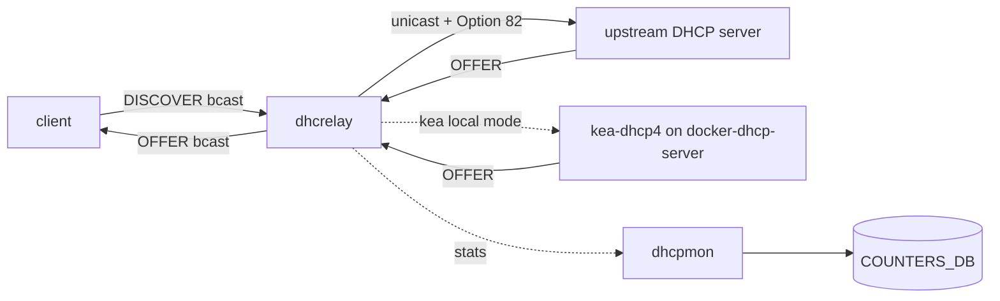

# 概念

「edge / management サービス」は、ToR や management スイッチに乗っている付帯機能の集合で、SONiC では大きく 4 群に分けて読むと混乱しません。L3 forwarding 章で扱う routing そのものとは別の層であり、共通点は「container 単位で隔離された daemon が CONFIG_DB を読んで OS パッケージや iptables を駆動する」点にあります。

## 4 つの責務

- NAT: data plane でのアドレス書換。`docker-nat` の `natmgrd` / `natsyncd` が CONFIG_DB を読み、Linux iptables の conntrack エントリと SAI NAT 属性を同期します。SONiC では iptables ↔ SAI の二重管理がポイントです。
- DHCP relay: client broadcast を upstream server へ unicast 中継する agent。`docker-dhcp-relay` 内の ISC 由来 `dhcrelay` を VLAN 単位で起動し、`dhcpmon` が監視と counter を持ちます。v4 と v6 で別プロセスです。
- DHCP server: kea ベースのポートベース server。`docker-dhcp-server` の `dhcpservd` が CONFIG_DB の `DHCP_SERVER_IPV4*` を読んで `kea-dhcp4.conf` を生成し、relay 側と Option 82 で連携します。
- Time / DNS: chrony（旧 ntpd）と静的 resolv.conf。OS レイヤの daemon が management VRF 内で外向き通信します。CONFIG_DB の `NTP_*` / `DNS_NAMESERVER` から生成される設定ファイルが入口です。

## NAT と routing の境界

NAT は routing decision の後に動く data plane 機能ですが、NAT entry そのものは `NatOrch` 経由で SAI のオブジェクトとして ASIC にも乗ります。Linux 側の conntrack も走らせる二段構成で、CPU 経由のパケットは iptables、ASIC をハードウェアパスで通るフローは SAI NAT エントリで処理されます。route lookup と NAT lookup の関係は L3 forwarding 章ではなくこの章で扱います。

## DHCP relay と DHCP server の境界

DHCP relay は「broadcast を unicast に変換して upstream へ送る」中継機で、自分で leases を払い出しません。DHCP server は kea を内蔵して leases を払い出します。同じ ToR 上で両者が共存する場合、`dhcprelayd` が同居して relay のサブ機能（giaddr 固定、Option 82 挿入）を server 側と協調させます。

要点は、`dhcrelay` がどちらの上流（外部 DHCP server か、同居の kea か）に向くかは設定で切り替わり、`dhcpmon` は中継方向の packet を counter として観測する別プロセスである点です。

## Option 82 / Option 79 / giaddr の位置

- Option 82（DHCPv4 Relay Agent Info）: relay が circuit-id を挿入して downstream port を伝える仕組みです。dual-ToR や port-based server で必須です。
- Option 79（DHCPv6 Client Link-Layer Address）: relay が client の L2 アドレスを upstream に伝えるための DHCPv6 拡張です。RFC 6939 サポートとして `dhcpv6_option|rfc6939_support` で有効化します。
- giaddr 固定: VLAN_INTERFACE が secondary IPv4 を持つ場合、relay が任意の subnet を giaddr に選ぶと server 側の pool 選択がブレるため、`-pg` で primary に固定するパッチが入っています。

## Time / DNS が management VRF を必要とする理由

SONiC では front-panel port は data VRF（default や user VRF）にあり、外向き management 通信は通常 management VRF（`mgmt`）から出ます。chrony / resolved / static resolv.conf 系はこの VRF を経由する必要があり、`NTP|global` の `vrf` フィールドや `MGMT_VRF_CONFIG` の設定が前提になります。VRF を意識しない設定だと「装置から ping は通るのに ntp が同期しない」事象になります。

## TWAMP Light と terminal server の置き場所

TWAMP Light（RFC 5357）は data plane の測定プロトコルで、本来は QoS / observability 寄りですが、サービス系として「control 接続を持たない軽量サービス」枠でこの章の発展トピックに置きます。terminal server は udev rules で `/dev/ttyUSB*` を安定 symlink にする platform 寄りの話で、management 装置として SONiC を使うときの周辺機能です。

## 関連ページ

- [NAT in SONiC](../../architecture/nat-in-sonic.md)
- [DHCPv4 Relay Agent](../../architecture/dhcpv4-relay-agent.md)
- [DHCPv6 Relay Agent](../../architecture/dhcpv6-relay-agent.md)
- [DHCPv6 リレー](../../routing/dhcp-relay-for-ipv6-hld.md)
- [ポートベース IPv4 DHCP Server](../../management/ipv4-port-based-dhcp-server-in-sonic.md)
