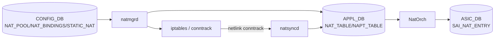
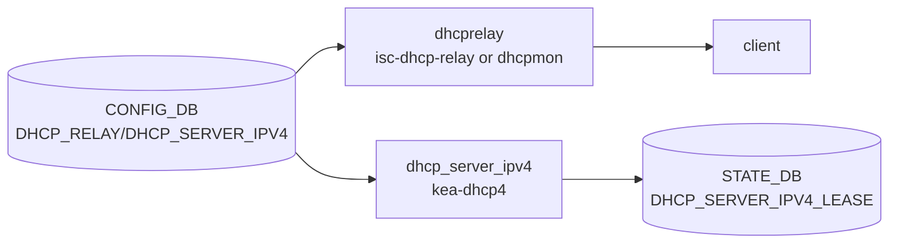
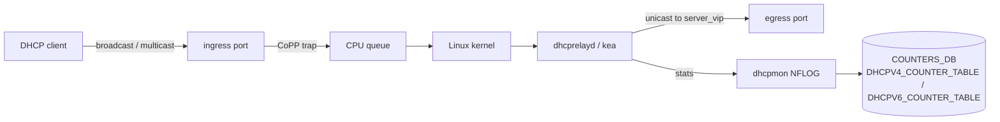

# 内部実装

[NAT](../../reference/glossary.md#term-nat) / DHCP / DNS の内部実装は「SONiC は何を ASIC に任せ、何を Linux user space daemon に任せているか」の切り分けを意識すると整理しやすいです。NAT は [SAI](../../reference/glossary.md#term-sai) で hardware offload する path と conntrack で kernel に任せる path があり、DHCP は relay agent / server agent の二種類、DNS は基本 systemd-resolved + /etc/resolv.conf です。

## データフロー

### NAT



### DHCP relay / DHCP server



## 主要 daemon の責務

### NAT

| コンポーネント | 主実体 | 責務 |
| --- | --- | --- |
| `natmgrd` (`cfgmgr/natmgr.cpp`) | `NatMgr::doTask` | `STATIC_NAT` / `STATIC_NAPT` / `NAT_POOL` / `NAT_BINDINGS` を `iptables` と [APPL_DB](../../reference/glossary.md#term-appl_db) に展開 |
| `NatOrch` (`orchagent/natorch.cpp`) | `NatOrch::doTask`、`addNatEntry`、`removeNatEntry` | APPL_DB を読み SAI NAT entry に投入 |
| `natsyncd` (`natsyncd/natsync.cpp`) | conntrack netlink listener | kernel conntrack イベントを `APPL_DB:NAT_TABLE` に sync（ダイナミック NAT の hardware offload） |
| `iptables` rules (NAT/MANGLE) | [natmgrd](../../reference/glossary.md#term-natmgrd-natsyncd) が生成 | 初回パケットを kernel で NAT してから ASIC に load する |

### DHCP

| コンポーネント | 主実体 | 責務 |
| --- | --- | --- |
| `dhcprelay` (`dockers/docker-dhcp-relay`) | `isc-dhcp-relay` + `dhcpmon` | DHCPv4 / DHCPv6 relay。`dhcpmon` がカウンタを `COUNTERS_DB` (`DHCPV4_COUNTER_TABLE` / `DHCPV6_COUNTER_TABLE`) に書く |
| `dhcp_server_ipv4` (`src/sonic-dhcp-server`) | `kea-dhcp4` based | フル DHCP server。`DHCP_SERVER_IPV4*` 系テーブルから設定生成、lease を [Redis](../../reference/glossary.md#term-redis) に書く |
| `dhcp6relay` | isc-dhcp-relay -6 | DHCPv6 relay |

### DNS

| コンポーネント | 主実体 | 責務 |
| --- | --- | --- |
| `resolv.conf` 管理 | `hostcfgd` の DNS task | `CONFIG_DB:DNS_NAMESERVER` から `/etc/resolv.conf` 生成 |

## SAI 属性使用一覧

NAT 関連:

| object | 属性 |
| --- | --- |
| `SAI_OBJECT_TYPE_NAT_ENTRY` | `SAI_NAT_ENTRY_ATTR_NAT_TYPE = SOURCE_NAT/DESTINATION_NAT/DOUBLE_NAT`、`SAI_NAT_ENTRY_ATTR_SRC_IP`、`SAI_NAT_ENTRY_ATTR_DST_IP`、`SAI_NAT_ENTRY_ATTR_HIT_BIT`、`SAI_NAT_ENTRY_ATTR_AGING_TIME` |
| `SAI_OBJECT_TYPE_ROUTER_INTERFACE` | `SAI_ROUTER_INTERFACE_ATTR_NAT_ZONE_ID`（NAT zone を rif に紐付け） |
| `SAI_OBJECT_TYPE_SWITCH` | `SAI_SWITCH_ATTR_NAT_ENABLE`（NAT 機能の全体スイッチ） |

DHCP / DNS には SAI 属性は使われません（kernel で完結）。

## Redis テーブル参照関係

```yaml
CONFIG_DB:
  NAT_POOL, NAT_BINDINGS, STATIC_NAT, STATIC_NAPT, NAT_GLOBAL,
  DHCP_RELAY, DHCP_SERVER_IPV4, DHCP_SERVER_IPV4_*,
  DNS_NAMESERVER
APPL_DB:
  NAT_TABLE, NAPT_TABLE, NAT_TWICE_TABLE, NAPT_TWICE_TABLE
STATE_DB:
  NAT_TABLE, NAPT_TABLE, NAT_RESTORE_TABLE,
  DHCP_SERVER_IPV4_LEASE
COUNTERS_DB:
  DHCPV4_COUNTER_TABLE, DHCPV6_COUNTER_TABLE
ASIC_DB:
  NAT_ENTRY
```

## ZMQ / Redis pub/sub

- NAT: 通常の [ProducerStateTable](../../reference/glossary.md#term-producerstatetable) / SubscriberStateTable のみ。
- `natsyncd` は `conntrack-tools` の netlink を直接 listen し、Redis に書く片方向経路。conntrack 自体が pub/sub ではない点に注意。
- DHCP: `dhcpmon` が pcap または syslog をパースする実装で、Redis 経由ではなく直接 counter を `COUNTERS_DB` の `DHCPV4_COUNTER_TABLE` / `DHCPV6_COUNTER_TABLE` に書く。
- DNS: pub/sub 経路はありません。

## 既知の実装上の制約

- NAT の **hardware offload** は ASIC によって対応・非対応が分かれます。`SAI_SWITCH_ATTR_NAT_ENABLE` がサポートされていない ASIC では NAT は kernel のみ動作し、large flow のスループットが極端に落ちます。
- `natsyncd` は conntrack の age を SAI に正確に反映できないことがあり、`SAI_NAT_ENTRY_ATTR_HIT_BIT` を polling して timeout を判断する設計に依存します。これがベンダ SAI で未対応だと NAT entry が枯渇しやすいです。
- DHCP server (`kea-dhcp4`) はまだ全機能を網羅しておらず、特に option 82 周辺と高可用構成は限定的です。
- DHCP relay の counter は `dhcpmon` が pcap-based で kernel iptables NFLOG を見ている実装で、高負荷時にパケットを取りこぼします。「relay packets <count>」を SLA に使うのは避けてください。
- DNS は SONiC で独自設定はなく、`hostcfgd` が `/etc/resolv.conf` を上書きする単純な実装。DNS-over-TLS や split-DNS は未対応。
- IPv6 NAT（NAT66 / NPTv6）は SAI で属性は定義されているが、SONiC [orchagent](../../reference/glossary.md#term-orchagent) の対応が partial で、[HLD](../../reference/glossary.md#term-hld) と実装の discrepancy が出やすい部分です。

## DHCP relay の packet path

DHCP relay (`dhcprelayd` および `kea-dhcp4`/`kea-dhcp6` relay モード) は [CoPP](../../reference/glossary.md#term-copp) 経由で trap された DHCP パケットを処理します。



`CoPP` の trap group `dhcp` / `dhcpv6` がデフォルトで設定され、レート制限は `COPP_TABLE` の `cir`/`cbs` で調整されます。dhcpmon の counter は NFLOG ベースで参考値扱いが妥当です。

## 関連ページ

- [NAT in SONiC](../../architecture/nat-in-sonic.md)
- [DHCPv4 relay agent](../../architecture/dhcpv4-relay-agent.md)
- [DHCPv6 relay agent](../../architecture/dhcpv6-relay-agent.md)
- [IPv4 port-based DHCP server](../../management/ipv4-port-based-dhcp-server-in-sonic.md)
- [DHCP relay for IPv6 HLD](../../routing/dhcp-relay-for-ipv6-hld.md)
- [DHCP relay per-interface counter](../../routing/dhcp-relay-per-interface-counter.md)

<!-- glossary-links-injected: 88eb10d428e5 -->
