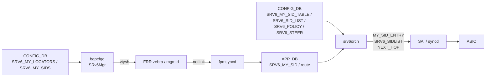
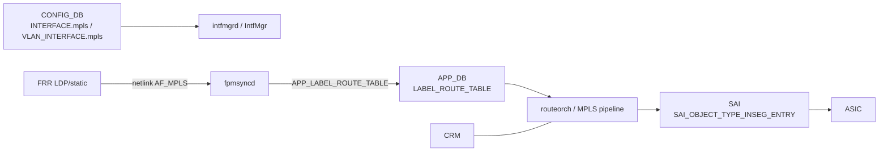

# アーキテクチャ

[SRv6](../../reference/glossary.md#term-srv6) / [MPLS](../../reference/glossary.md#term-mpls) / Path Tracing は別機能ですが、[SONiC](../../reference/glossary.md#term-sonic) 内部では「[CONFIG_DB](../../reference/glossary.md#term-config_db) → [orchagent](../../reference/glossary.md#term-orchagent) → [SAI](../../reference/glossary.md#term-sai) → [ASIC](../../reference/glossary.md#term-asic)」「[FRR](../../reference/glossary.md#term-frr)/netlink → [fpmsyncd](../../reference/glossary.md#term-fpmsyncd) → APP_DB → orchagent → SAI」という同じ 2 系統のデータ経路に乗ります。ここでは feature ごとの object flow を、その共通図に当てはめて読みます。

## SRv6 の object flow

SRv6 の中核は `srv6orch` で、CONFIG_DB の `SRV6_MY_SID_TABLE` / `SRV6_SID_LIST` / `SRV6_POLICY` / `SRV6_STEER` を読み、SAI の `SAI_MY_SID_ENTRY_*` や `SAI_OBJECT_TYPE_SRV6_SIDLIST` を組み立てます。Static SID 経路では `bgpcfgd` の `SRv6Mgr` が CONFIG_DB の `SRV6_MY_LOCATORS` / `SRV6_MY_SIDS` を受け、`vtysh` で FRR に `segment-routing srv6 static-sids` を書き込みます。

`srv6orch` の `end_behavior_map` には `end` / `end.dt46` / `end.dt4` / `end.dt6` / `un` / `ua` / `udt4` / `udt6` / `udt46` / `udx4` / `udx6` などが登録されており、それぞれ `SAI_MY_SID_ENTRY_ENDPOINT_BEHAVIOR_*` にマップされます。Phase 1 では `END` / `END.DT46` / `H.Encaps.Red`、uSID [HLD](../../reference/glossary.md#term-hld) で `uN` / `uA` / `uDT*` / `uDX*` が追加され、L3Adj HLD で `uA` / `End.X` 系の出口 nexthop 処理が完成しました。

## L3 隣接の解決

`uA` / `End.X` / `uDX4` / `uDX6` / `End.DX4` / `End.DX6` のような cross-connect 系 behavior は出口に L3 隣接が必須です。`srv6orch` は `m_pendingSRv6MySIDEntries` という pending queue を持ち、Neighbor 未解決時は SID 投入を保留、Neighbor が確定したタイミングで queue を flush し、`SAI_MY_SID_ENTRY_ATTR_NEXT_HOP_ID` を SAI に渡します。これにより「先に SID を CONFIG_DB に書いて、後から neighbor が上がる」順序にも耐えます。

## SRv6 VPN / Policy

L3VPN over SRv6 では `srv6orch` 内部の `srv6_prefix_agg_id_table_` が VPN prefix を AGG_ID にまとめ、`createSrv6Vpn` / `deleteSrv6Vpn` で VPN encap mapper を介して `vpn_sid` を route nexthop に紐付けます。SRv6 Policy は SID list と steering 条件を別オブジェクトとして持ち、`SRV6_STEER` がトリガで対応 SID list を選ぶ構造です。

## MPLS の pipeline

MPLS は AF_MPLS という別 family を扱うため、IPv4/IPv6 routing と並走する経路を持ちます。

`fpmsyncd` は `AF_MPLS` の route と `LWTUNNEL_ENCAP_MPLS` の attribute から push label stack を取り出し、APP_DB の `LABEL_ROUTE_TABLE` に流します。orchagent 側で in-segment entry を bulk programming することで、大規模な静的 LSP でも load を抑える設計です。

## Path Tracing の挿入点

Path Tracing Midpoint は forwarding そのものを変えず、出口 port 単位で HbH-PT に書き込む MCD を決めます。`PORT|<port>` の `pt_interface_id` と `pt_timestamp_template` を `portmgrd` / `orchagent` が SAI の `SAI_PORT_ATTR_PATH_TRACING_INTF` / `SAI_PORT_ATTR_PATH_TRACING_TIMESTAMP_TYPE` に渡し、ASIC 側が IPv6 出力時に HbH-PT に MCD を追記します。Timestamp template は `12_19` のようにビット幅指定で、TimeSeries DB 側の解像度と合わせます。

SRv6 endpoint 処理は HbH-PT の有無に関わらず動くため、Path Tracing は SRv6 と直交して有効化できます。逆に言うと「SRv6 endpoint で IPv6 ヘッダが書き換わる場面でも HbH option が継承されるか」は ASIC 実装依存で、運用前に確認すべき項目です。

## 共通する topic

- **counter** — SRv6 の MySID counter（後続 phase）、MPLS の in-segment 統計、router interface counter は同じ flex counter / counterd 系基盤に乗ります。[02 BGP の運用](../02-bgp/operations.md) で扱う FRR 経路と区別するには、APP_DB / netlink どちらから入った route かを見ます。
- **[CRM](../../reference/glossary.md#term-crm)** — MPLS は `CRM` テーブルに in-segment / nexthop の使用量を加えています。SRv6 系は HLD 時点で CRM 統合がはっきり書かれていない領域があり、今後拡張される想定です。
- **[YANG](../../reference/glossary.md#term-yang)** — `sonic-srv6` が SRV6_MY_LOCATORS / SRV6_MY_SIDS を、`sonic-interface` 等が `mpls` 属性を、`sonic-port` が PT 関連属性を持ちます。設定ページからの逆引きはこの章で集約します。

## 関連ページ

- [SRv6 HLD](../../routing/segment-routing-over-ipv6-srv6-hld.md)
- [SRv6 SID の L3 隣接](../../routing/srv6-sid-l3adj.md)
- [SRv6 VPN](../../routing/srv6-vpn-hld.md)
- [SRv6 Static SID / Locator 設定](../../routing/static-configuration-of-srv6-in-sonic-hld.md)
- [SONiC の MPLS 基盤](../../routing/mpls-for-sonic-high-level-design-document.md)
- [Path Tracing Midpoint](../../routing/path-tracing-midpoint.md)

<!-- glossary-links-injected: ec18b66e3507 -->
