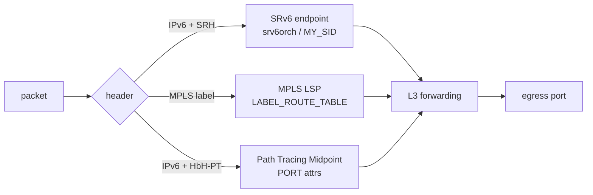

# 概念

SRv6、MPLS、Path Tracing はいずれも「IPv4/IPv6 forwarding の上に、追加のラベルまたはオプションを積んで経路や挙動を決める」仕組みです。SONiC で読み解く前に、まずどこで通常の routing 章（[02 BGP](../02-bgp/index.md) や [04 VRF / ECMP](../04-vrf-ecmp/index.md)）と分かれるかを整理します。

## SRv6 の積み上げ順

SRv6 は HLD が一気に揃っているわけではなく、機能ごとに別 HLD として段階的に追加されています。読む順は実装の追加順と一致させると迷いません。

1. **SRv6 base** — `END` / `END.DT46` / `H.Encaps.Red` などの基本 behavior、`SRV6_SID_LIST` / `SRV6_MY_SID_TABLE` / `SRV6_POLICY` / `SRV6_STEER` のスキーマ。Phase 1 では FRR の SRv6 が未成熟なため、静的 SID と policy を CONFIG_DB に直接書く運用が前提です。
2. **uSID** — 128bit IPv6 アドレスに最大 6 個の uSID を圧縮して詰める方式。SAI 変更なしで `srv6orch` の `end_behavior_map` に `un` / `ua` / `udt4` / `udt6` / `udt46` / `udx4` / `udx6` を追加する拡張です。
3. **Static SID / Locator 設定** — `SRV6_MY_LOCATORS` / `SRV6_MY_SIDS` を CONFIG_DB 経由で受け、`bgpcfgd` の `SRv6Mgr` が `vtysh` で FRR の `segment-routing srv6` 設定に流し込む経路です。
4. **L3 隣接** — `uA` / `End.X` / `uDX4` / `uDX6` / `End.DX4` / `End.DX6` のような cross-connect 系 behavior は出口の nexthop（L3 隣接）が必要で、`srv6orch` が pending queue で Neighbor 解決を待ちます。
5. **VPN / Policy** — L3VPN over SRv6 は `srv6_prefix_agg_id_table_` のような Prefix AGG_ID と VPN encap mapper を介して `vpn_sid` を管理し、SRv6 Policy で steering します。

この順序を踏まえると、`SRV6_MY_SID_TABLE` の `action` 値や `adj` パラメータが「どの phase で意味を持つか」が分かれます。

## MPLS の位置付け

SONiC の MPLS は **静的 LSP** を前提に、IPv4/IPv6 routing インフラを MPLS にも拡張する設計です。動的シグナリング（LDP / RSVP-TE）は初期 scope 外で、以下の 4 点が基盤になります。

- **per-RIF で MPLS を enable/disable** — `INTERFACE` / `VLAN_INTERFACE` / `PORTCHANNEL_INTERFACE` の `mpls` 属性で明示的に許可した interface のみ MPLS を扱う。
- **Push / Pop / Swap** — implicit-null / explicit-null を含むラベル操作。
- **bulk MPLS in-segment entry の SAI programming** — `LABEL_ROUTE_TABLE` を APP_DB 経由で `fpmsyncd` が `AF_MPLS` の netlink から受けて流し込む。
- **CRM 統合** — MPLS in-segment / nexthop の使用量を Critical Resource Monitoring に乗せる。

QoS 連携は `MPLS_TC_TO_TC_MAP` と `PORT_QOS_MAP` の `mpls_tc_to_tc_map` フィールドで、MPLS パケットの TC を SONiC 内部 TC に変換します。

## Path Tracing は何を観測するか

Path Tracing は IETF spring-path-tracing で定義され、各 transit が **MCD（Midpoint Compressed Data）** を IPv6 **Hop-by-Hop Path Tracing Option (HbH-PT)** に書き足していく仕組みです。SRC が probe を生成、Midpoint が MCD を追記、SINK が回収して Regional Collector で時系列に再構築します。

SONiC は **Midpoint** を実装する側で、`PORT` テーブルの `pt_interface_id` / `pt_timestamp_template` が SAI の `SAI_PORT_ATTR_PATH_TRACING_INTF` / `SAI_PORT_ATTR_PATH_TRACING_TIMESTAMP_TYPE` に対応します。通常 IPv6 forwarding に MCD 書き込みが追加されるだけで、経路選択そのものは変えません。

## 三者の境界

要点は、SRv6 と Path Tracing は IPv6 forwarding の中でそれぞれの拡張ヘッダ／オプションを処理する点が共通している一方、MPLS は AF_MPLS という別の address family で動く点です。

## 他章との境界

- BGP / FRR 連携は [02 BGP](../02-bgp/index.md) の章に、SRv6 / MPLS で追加される BGP family（SR-MPLS、SRv6 L3VPN）はこの章で扱います。
- VRF / VPN の一般的な構造は [04 VRF / ECMP](../04-vrf-ecmp/index.md) で、SRv6 VPN による L3VPN の SID マッピングはこの章です。
- EVPN-VXLAN は [03 VXLAN-EVPN](../03-vxlan-evpn/index.md) で、SRv6 を underlay にする方向は本章の発展トピックから辿ります。

## 関連ページ

- [SRv6 HLD](../../routing/segment-routing-over-ipv6-srv6-hld.md)
- [SRv6 uSID](../../routing/sonic-usid.md)
- [SONiC の MPLS 基盤](../../routing/mpls-for-sonic-high-level-design-document.md)
- [Path Tracing Midpoint](../../routing/path-tracing-midpoint.md)
