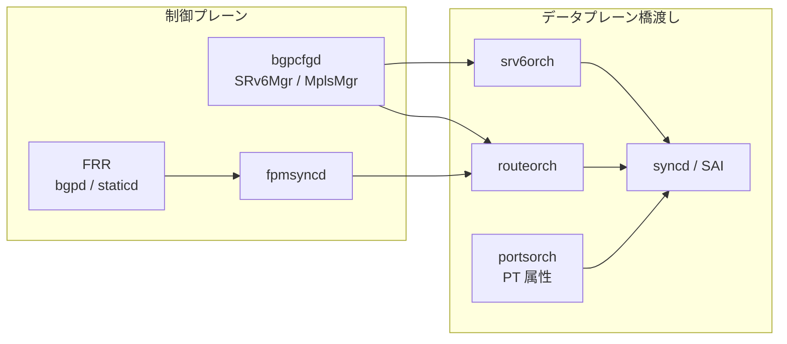
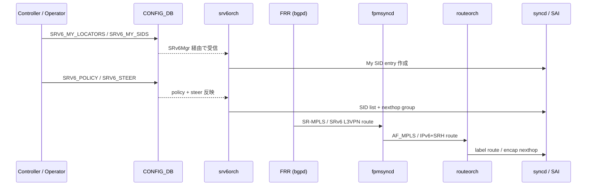
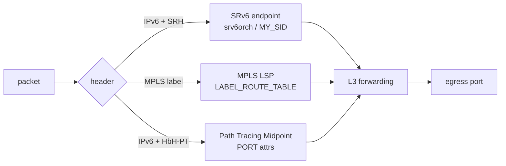
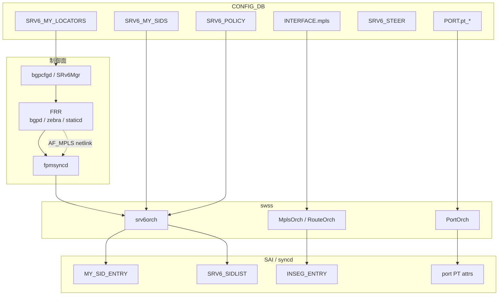
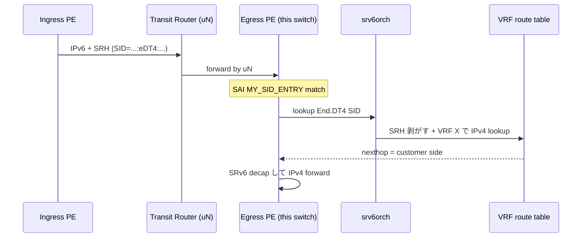

# 概念

[SRv6](../../reference/glossary.md#term-srv6)、[MPLS](../../reference/glossary.md#term-mpls)、Path Tracing はいずれも「IPv4/IPv6 forwarding の上に、追加のラベルまたはオプションを積んで経路や挙動を決める」仕組みです。[SONiC](../../reference/glossary.md#term-sonic) で読み解く前に、まずどこで通常の routing 章（[02 BGP](../02-bgp/index.md) や [04 VRF / ECMP](../04-vrf-ecmp/index.md)）と分かれるかを整理します。

## この章は何のためにあるか

通常の [BGP](../../reference/glossary.md#term-bgp) / [VRF](../../reference/glossary.md#term-vrf) 章では「宛先 IP に対応する nexthop を引き、L2 ヘッダを差し替えて送出する」までを扱います。本章はそこに **追加のヘッダ操作（push / pop / swap）** や **経路情報の付加（SID リスト、HbH オプション）** が入る場合、SONiC のどの daemon と DB がどう拡張されるかを読み解きます。読み手が最初に持つ疑問は次の 4 つで、本章のすべての節はそれに答える形で並んでいます。

1. SRv6 / MPLS / Path Tracing は「同じ拡張ヘッダ」の仲間か、それとも別物か
2. SONiC に入れるとき、どの daemon と DB が増えるか／流用されるか
3. 既存の BGP / VRF 設定とどこで衝突するか
4. どこまでが master 実装済みで、どこから提案段階の [HLD](../../reference/glossary.md#term-hld) か

## 何を解決するか

- **traffic engineering を IGP/BGP の外側に出す**: 経路を IGP メトリックではなく、operator が指定した SID リストや LSP に沿わせたい。
- **VPN を「underlay 共通」で多重化する**: SRv6 L3VPN や MPLS L3VPN は、underlay を 1 本に保ったまま customer VRF を多重化する。VRF をそのまま BGP で広告する vrf-lite と違い、PE 間で経路を共有しつつ data plane で分離できる。
- **path 観測の精度を上げる**: Path Tracing は「どの transit を経由したか」「各 hop の interface / timestamp は何か」を data plane に書き込む。ping / traceroute と違い、本物のトラフィックそのものに経路情報が残る。

## SONiC 内での位置

通常の BGP route が `fpmsyncd -> routeorch` で流れるのに対し、SRv6 の SID / Policy / Steer 情報は `bgpcfgd (SRv6Mgr) -> srv6orch` で流れます。MPLS は label を持つ route として `LABEL_ROUTE_TABLE` に乗りますが、L3 nexthop は通常の routeorch と共有します。Path Tracing は forwarding そのものを変えず、port 属性として [SAI](../../reference/glossary.md#term-sai) に渡るだけです。

## 用語の整理

| 用語 | 意味 | SONiC で対応する場所 |
| --- | --- | --- |
| SID | Segment Identifier。SRv6 では 128bit IPv6 アドレス、SR-MPLS では label。 | `SRV6_MY_SID_TABLE` / `LABEL_ROUTE_TABLE` |
| Locator | uSID block + node id をまとめた IPv6 prefix。 | `SRV6_MY_LOCATORS` |
| Behavior | SID に紐づく動作（END、END.DT4、uA など）。 | `SRV6_MY_SID_TABLE.action` |
| Policy | source routing の発射台。SID list を持ち、color / endpoint で identified。 | `SRV6_POLICY` |
| Steer | どの prefix / vrf を policy に流すか。 | `SRV6_STEER` |
| LSP | Label Switched Path。MPLS の path。 | `LABEL_ROUTE_TABLE` の連鎖 |
| MCD | Midpoint Compressed Data。Path Tracing で各 transit が書く 4 byte 情報。 | port 属性で hardware が生成 |
| HbH-PT | Hop-by-Hop Path Tracing Option。IPv6 拡張ヘッダの一種。 | data plane でのみ参照 |

## 典型シーンを 1 枚で

ポイントは、**operator が直接書く部分（locator / sid / policy / steer）** と **[FRR](../../reference/glossary.md#term-frr) 経由で来る部分（L3VPN route）** が同じ章で扱われる点です。Phase 1 では FRR の SRv6 が未成熟なため、operator が [CONFIG_DB](../../reference/glossary.md#term-config_db) を書く割合が大きくなります。

## 似た機能との違い

| 比較 | 共通点 | 違い |
| --- | --- | --- |
| [EVPN](../../reference/glossary.md#term-evpn)-[VXLAN](../../reference/glossary.md#term-vxlan) との違い | underlay が L3、tenant を多重化する | EVPN は L2 拡張も含み、VXLAN UDP を使う。SRv6 は IPv6 SRH、MPLS は label。 |
| Static route との違い | 経路を operator が指定する | static route は「次の hop」のみ指定。SRv6 / MPLS は **経路全体を SID/label の列で指定** できる。 |
| GRE / [IPinIP](../../reference/glossary.md#term-ipinip) との違い | encap で tenant を運ぶ | GRE は単純な tunnel、SRv6 は SID 列で TE / VPN / function を同時に表現できる。 |
| Inband telemetry ([INT](../../reference/glossary.md#term-int)) との違い | data plane に観測情報を埋め込む | INT は metadata stack をパケットに積む。Path Tracing は 4 byte MCD と HbH オプションに限定。 |

## SRv6 の積み上げ順

SRv6 は HLD が一気に揃っているわけではなく、機能ごとに別 HLD として段階的に追加されています。読む順は実装の追加順と一致させると迷いません。

1. **SRv6 base** — `END` / `END.DT46` / `H.Encaps.Red` などの基本 behavior、`SRV6_SID_LIST` / `SRV6_MY_SID_TABLE` / `SRV6_POLICY` / `SRV6_STEER` のスキーマ。Phase 1 では FRR の SRv6 が未成熟なため、静的 SID と policy を CONFIG_DB に直接書く運用が前提です。
2. **uSID** — 128bit IPv6 アドレスに最大 6 個の uSID を圧縮して詰める方式。SAI 変更なしで `srv6orch` の `end_behavior_map` に `un` / `ua` / `udt4` / `udt6` / `udt46` / `udx4` / `udx6` を追加する拡張です。
3. **Static SID / Locator 設定** — `SRV6_MY_LOCATORS` / `SRV6_MY_SIDS` を CONFIG_DB 経由で受け、`bgpcfgd` の `SRv6Mgr` が `vtysh` で FRR の `segment-routing srv6` 設定に流し込む経路です。
4. **L3 隣接** — `uA` / `End.X` / `uDX4` / `uDX6` / `End.DX4` / `End.DX6` のような cross-connect 系 behavior は出口の nexthop（L3 隣接）が必要で、`srv6orch` が pending queue で Neighbor 解決を待ちます。
5. **VPN / Policy** — L3VPN over SRv6 は `srv6_prefix_agg_id_table_` のような Prefix AGG_ID と VPN encap mapper を介して `vpn_sid` を管理し、SRv6 Policy で steering します。

この順序を踏まえると、`SRV6_MY_SID_TABLE` の `action` 値や `adj` パラメータが「どの phase で意味を持つか」が分かれます。

## MPLS の位置付け

SONiC の MPLS は **静的 LSP** を前提に、IPv4/IPv6 routing インフラを MPLS にも拡張する設計です。動的シグナリング（LDP / RSVP-TE）は初期 scope 外で、以下の 4 点が基盤になります。

- **per-[RIF](../../reference/glossary.md#term-rif) で MPLS を enable/disable** — `INTERFACE` / `VLAN_INTERFACE` / `PORTCHANNEL_INTERFACE` の `mpls` 属性で明示的に許可した interface のみ MPLS を扱う。
- **Push / Pop / Swap** — implicit-null / explicit-null を含むラベル操作。
- **bulk MPLS in-segment entry の SAI programming** — `LABEL_ROUTE_TABLE` を APP_DB 経由で `fpmsyncd` が `AF_MPLS` の netlink から受けて流し込む。
- **[CRM](../../reference/glossary.md#term-crm) 統合** — MPLS in-segment / nexthop の使用量を Critical Resource Monitoring に乗せる。

[QoS](../../reference/glossary.md#term-qos) 連携は `MPLS_TC_TO_TC_MAP` と `PORT_QOS_MAP` の `mpls_tc_to_tc_map` フィールドで、MPLS パケットの TC を SONiC 内部 TC に変換します。

## Path Tracing は何を観測するか

Path Tracing は IETF spring-path-tracing で定義され、各 transit が **MCD（Midpoint Compressed Data）** を IPv6 **Hop-by-Hop Path Tracing Option (HbH-PT)** に書き足していく仕組みです。SRC が probe を生成、Midpoint が MCD を追記、SINK が回収して Regional Collector で時系列に再構築します。

SONiC は **Midpoint** を実装する側で、`PORT` テーブルの `pt_interface_id` / `pt_timestamp_template` が SAI の `SAI_PORT_ATTR_PATH_TRACING_INTF` / `SAI_PORT_ATTR_PATH_TRACING_TIMESTAMP_TYPE` に対応します。通常 IPv6 forwarding に MCD 書き込みが追加されるだけで、経路選択そのものは変えません。

## 三者の境界

要点は、SRv6 と Path Tracing は IPv6 forwarding の中でそれぞれの拡張ヘッダ／オプションを処理する点が共通している一方、MPLS は AF_MPLS という別の address family で動く点です。

## 読了後にできること

- SRv6 の uSID / Locator / Behavior / Policy / Steer がそれぞれ CONFIG_DB のどのテーブルに対応するかを思い出せる。
- MPLS の per-RIF enable、in-segment programming、QoS map の流れを 1 本で説明できる。
- Path Tracing が forwarding を変えないこと、PORT 属性が SAI のどの属性に対応するかを言える。
- 「BGP route が反映されない」「policy で steer されない」「MPLS label が pop されない」が起きたとき、`bgpcfgd` / `srv6orch` / `routeorch` のうちどれを最初に疑うかを決められる。
- 章末の発展トピックや operations 章に進む準備が整う。

## 他章との境界

- BGP / FRR 連携は [02 BGP](../02-bgp/index.md) の章に、SRv6 / MPLS で追加される BGP family（SR-MPLS、SRv6 L3VPN）はこの章で扱います。
- VRF / VPN の一般的な構造は [04 VRF / ECMP](../04-vrf-ecmp/index.md) で、SRv6 VPN による L3VPN の SID マッピングはこの章です。
- EVPN-VXLAN は [03 VXLAN-EVPN](../03-vxlan-evpn/index.md) で、SRv6 を underlay にする方向は本章の発展トピックから辿ります。

## まず読み手の質問に答える

### この章はそもそも何の章か

「SRv6 / MPLS / Path Tracing」は **IPv4/IPv6 forwarding の上に「ラベル」「セグメント」「観測メタデータ」を積む 3 種類の機能** をまとめた章です。

- **SRv6**: IPv6 アドレスを SID（Segment Identifier）として使い、経路 / VPN / Policy を表現する
- **MPLS**: 4 byte ラベルを別 address family（AF_MPLS）として扱い、静的 LSP / L3VPN underlay に使う
- **Path Tracing**: IPv6 HbH オプション（HbH-PT）に各 transit が MCD を書き加え、経路と遅延を観測する

通常の routing が「どこ宛か」を決めるのに対し、この章は「どのラベル / セグメント / 観測メタを積むか」を扱います。

### 何を解決するか

- **テナント / SLA 別の経路指定** → SRv6 Policy / Binding SID で「この traffic は東経路、別 traffic は西経路」のような明示経路を作る
- **L3VPN / L2VPN underlay の現代化** → SRv6 で IPv6 だけの underlay に L3VPN を載せる（MPLS underlay を畳む）
- **既存 MPLS 網との接続** — SONiC を MPLS LSR として配置し、静的 LSP で連携する
- **障害観測の解像度向上** → Path Tracing で経路上の各 hop の通過時刻と nexthop を probe 単位で取る

純粋な BGP / [ECMP](../../reference/glossary.md#term-ecmp) では表現できない「経路の制御」「経路の可観測性」を担うのがこの章です。

### SONiC 内での位置

「経路の決定」は FRR、「ラベル / SID の生成と SAI への落とし込み」は SONiC 内 [orchagent](../../reference/glossary.md#term-orchagent) と分担しています。

### 用語の最短整理

- **SID**: Segment Identifier。SRv6 では 128bit IPv6 アドレス相当
- **uSID**: SID を 16 / 32bit 単位に圧縮し 1 つの IPv6 アドレスに最大 6 個積む方式
- **Locator**: SID のうち「装置を指す prefix」部分。SRv6 では 1 装置の SID 群が同じ Locator を共有する
- **Function**: SID の挙動を示す部分（`uN` / `uA` / `uDT4` / `uDX6` 等）
- **`END.X` / `End.DT4` / `End.DT46`**: SRv6 endpoint behavior。例えば `End.DT4` は SID から VRF を抜く挙動
- **`SRV6_MY_SID_TABLE`**: 自装置が処理するべき SID を保持する APP_DB テーブル
- **`SRV6_SID_LIST` / `SRV6_POLICY` / `SRV6_STEER`**: encap 側 SID list / Policy bind / steering rule
- **`srv6orch`**: SRv6 関連の orchagent
- **`LABEL_ROUTE_TABLE`**: MPLS in-segment entry の APP_DB 表現
- **AF_MPLS**: Linux の MPLS address family。netlink で route が流れる
- **PHP / explicit-null / implicit-null**: penultimate hop popping と end-of-LSP のラベル挙動
- **`MPLS_TC_TO_TC_MAP`**: MPLS パケットの TC（traffic class）を SONiC 内部 TC に変換する QoS map
- **HbH-PT / MCD**: IPv6 Hop-by-Hop Path Tracing Option / Midpoint Compressed Data
- **SRC / Midpoint / SINK**: Path Tracing の役割。SONiC は Midpoint を実装
- **Regional Collector**: SINK が集めた MCD を時系列で再構築する外部システム（HLD 外）

### 典型シーン: SRv6 L3VPN 着信ノードでの SID 解決

ここで Neighbor 未解決の `uA` / `End.X` 系は `srv6orch` の pending queue で待ち、Neighbor 解決後に SAI への push がリトライされます。設定したのに動かない場合は [ARP](../../reference/glossary.md#term-arp)/ND 状態と pending queue の双方を確認します。

### 似ているが別物のもの

| 比較対象 | この章との違い |
| --- | --- |
| [BGP](../02-bgp/index.md) | 経路情報の交換そのもの。SRv6/MPLS で追加される BGP family（SR-MPLS / SRv6 L3VPN）の挙動は本章 |
| [VRF / ECMP](../04-vrf-ecmp/index.md) | VRF 一般構造は 04 章。SRv6 SID と VRF の紐付けは本章 |
| [VXLAN / EVPN](../03-vxlan-evpn/index.md) | overlay は UDP encap 主体。SRv6 / MPLS は IPv6 / AF_MPLS native |
| [DASH / SmartSwitch](../13-dash-smartswitch/index.md) | [DASH](../../reference/glossary.md#term-dash) は per-[ENI](../../reference/glossary.md#term-eni) overlay。SRv6 / MPLS は装置間 fabric の話 |
| [Telemetry / SNMP](../09-telemetry-snmp/index.md) | counter / event の収集。Path Tracing は data plane に観測ヘッダを埋める点で別軸 |
| LDP / RSVP-TE | 動的 MPLS シグナリング。SONiC は初期 scope 外、本章は静的 LSP + bulk programming のみ |

### 読了後にできるようになること

- 機能ごとの HLD（SRv6 base / uSID / static SID / L3 隣接 / VPN / MPLS / Path Tracing）が **どの phase の話か** を識別できる
- `SRV6_MY_SID_TABLE` の `action` と SAI MY_SID_ENTRY の attribute の対応が読める
- 「MPLS が forward しない」事象で per-RIF `mpls` 属性、AF_MPLS netlink、`INSEG_ENTRY` の順に切り分けできる
- Path Tracing を有効化するときの `pt_interface_id` / `pt_timestamp_template` の意味と SAI 対応 attribute が答えられる
- 自社の網設計に SRv6 / MPLS / Path Tracing のどれを採用するか、設定範囲と必要 HLD を提示できる

## 関連ページ

- [SRv6 HLD](../../routing/segment-routing-over-ipv6-srv6-hld.md)
- [SRv6 uSID](../../routing/sonic-usid.md)
- [SONiC の MPLS 基盤](../../routing/mpls-for-sonic-high-level-design-document.md)
- [Path Tracing Midpoint](../../routing/path-tracing-midpoint.md)

<!-- xref-prereq -->
## この章の前提知識

この章を読み進める前に、次の章を押さえておくと迷子になりにくい。

- [SONiC 全体像と設定基盤](../01-overview/index.md)
- [BGP と FRR 制御プレーン](../02-bgp/index.md)
- [VRF / ECMP / RIB-FIB パイプライン](../04-vrf-ecmp/index.md)

<!-- glossary-links-injected: 8ba32e5aa69d -->
