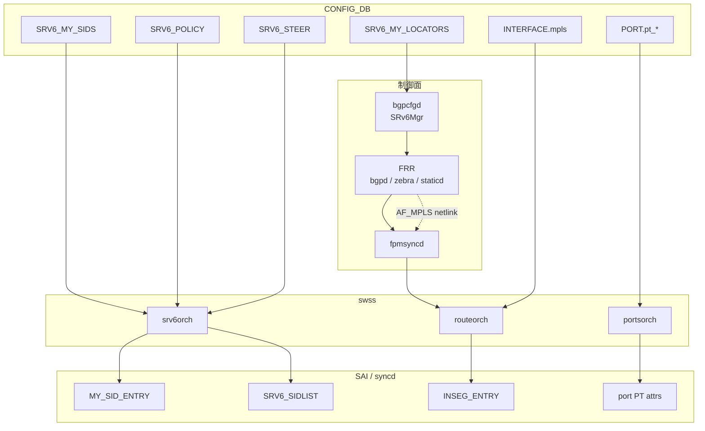
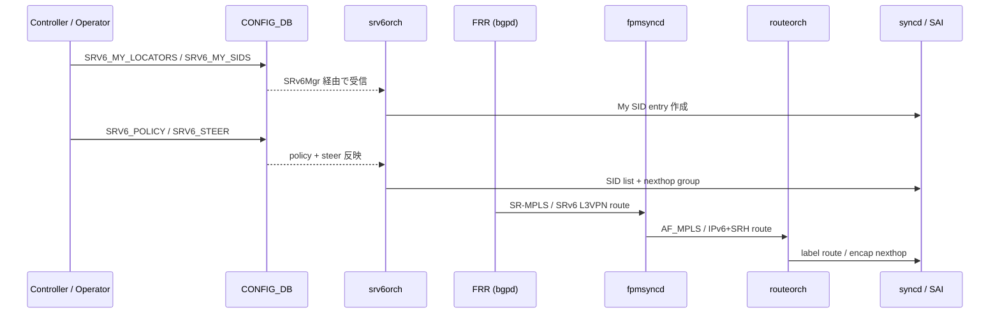
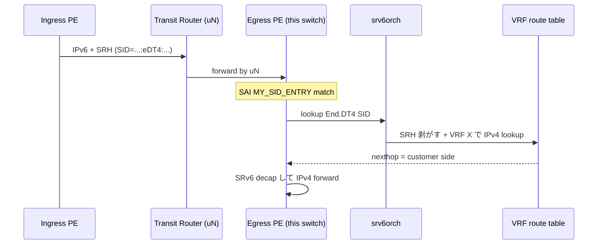
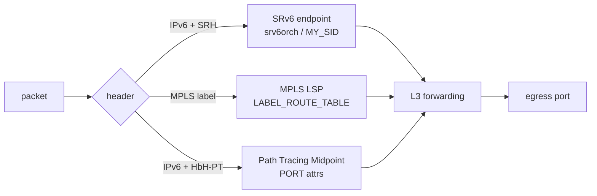

# 概念

[SRv6](../../reference/glossary.md#term-srv6)、[MPLS](../../reference/glossary.md#term-mpls)、Path Tracing はいずれも「IPv4/IPv6 forwarding の上に、追加のラベルまたはオプションを積んで経路や挙動を決める」仕組みです。[SONiC](../../reference/glossary.md#term-sonic) で読み解く前に、まずどこで通常の routing 章（[02 BGP](../02-bgp/index.md) や [04 VRF / ECMP](../04-vrf-ecmp/index.md)）と分かれるかを整理します。

## この章は何のためにあるか

通常の [BGP](../../reference/glossary.md#term-bgp) / [VRF](../../reference/glossary.md#term-vrf) 章では「宛先 IP に対応する nexthop を引き、L2 ヘッダを差し替えて送出する」までを扱う。本章はそこに **追加のヘッダ操作（push / pop / swap）** や **経路情報の付加（SID リスト、HbH オプション）** が入る場合、SONiC のどの daemon と DB がどう拡張されるかを読み解く。読み手が最初に持つ疑問は次の 4 つで、本章のすべての節はそれに答える形で並ぶ。

1. SRv6 / MPLS / Path Tracing は「同じ拡張ヘッダ」の仲間か、それとも別物か
2. SONiC に入れるとき、どの daemon と DB が増えるか／流用されるか
3. 既存の BGP / VRF 設定とどこで衝突するか
4. どこまでが master 実装済みで、どこから提案段階の [HLD](../../reference/glossary.md#term-hld) か

## 何を解決するか

- **traffic engineering を IGP/BGP の外側に出す**: 経路を IGP メトリックではなく、operator が指定した SID リストや LSP に沿わせたい。SRv6 Policy / Binding SID で「この traffic は東経路、別 traffic は西経路」のような明示経路を作る。
- **L3VPN underlay の現代化**: SRv6 L3VPN や MPLS L3VPN は、underlay を 1 本に保ったまま customer VRF を多重化する。VRF をそのまま BGP で広告する vrf-lite と違い、PE 間で経路を共有しつつ data plane で分離できる[^srv6vpn]。
- **既存 MPLS 網との接続**: SONiC を MPLS LSR として配置し、静的 LSP で連携する[^mplshld]。
- **path 観測の精度を上げる**: Path Tracing は「どの transit を経由したか」「各 hop の interface / timestamp は何か」を data plane に書き込む[^pt]。ping / traceroute と違い、本物のトラフィックそのものに経路情報が残る。

純粋な BGP / [ECMP](../../reference/glossary.md#term-ecmp) では表現できない「経路の制御」「経路の可観測性」を担うのがこの章。

## SONiC 内での位置

通常の BGP route が `fpmsyncd -> routeorch` で流れるのに対し、SRv6 の SID / Policy / Steer 情報は `bgpcfgd (SRv6Mgr) -> srv6orch` で流れる。MPLS は label を持つ route として [APPL_DB](../../reference/glossary.md#term-appl_db) の `LABEL_ROUTE_TABLE` に乗り、L3 nexthop は `routeorch` が SAI MPLS inseg API に翻訳する[^mplshld]（SONiC swss に独立した MplsOrch クラスは存在しない）。Path Tracing は forwarding そのものを変えず、port 属性として [SAI](../../reference/glossary.md#term-sai) に渡るだけ[^pt]。

## 用語の整理

| 用語 | 意味 | SONiC で対応する場所 |
| --- | --- | --- |
| SID | Segment Identifier。SRv6 では 128bit IPv6 アドレス、SR-MPLS では label。 | `SRV6_MY_SID_TABLE`[^srv6hld] / `LABEL_ROUTE_TABLE`[^mplshld] |
| uSID | SID を 16 / 32bit 単位に圧縮し 1 つの IPv6 アドレスに最大 6 個積む方式。 | `srv6orch` の `end_behavior_map`（`un` / `ua` / `udt4` / `udt6` / `udt46` / `udx4` / `udx6`） |
| Locator | uSID block + node id をまとめた IPv6 prefix。1 装置の SID 群が同じ Locator を共有する。 | `SRV6_MY_LOCATORS` |
| Behavior | SID に紐づく動作（`END` / `End.DT4` / `End.DT46` / `uA` など）。 | `SRV6_MY_SID_TABLE.action`[^srv6hld] |
| Policy | source routing の発射台。SID list を持ち、color / endpoint で identify。 | `SRV6_POLICY`[^srv6hld] |
| Steer | どの prefix / vrf を policy に流すか。 | `SRV6_STEER`[^srv6hld] |
| LSP | Label Switched Path。MPLS の path。 | `LABEL_ROUTE_TABLE` の連鎖[^mplshld] |
| AF_MPLS | Linux の MPLS address family。netlink で route が流れる。 | `fpmsyncd` が受信して APPL_DB に展開 |
| PHP / explicit-null / implicit-null | penultimate hop popping と end-of-LSP のラベル挙動。 | `LABEL_ROUTE_TABLE.mpls_pop`[^mplshld] |
| `MPLS_TC_TO_TC_MAP` | MPLS パケットの TC を SONiC 内部 TC に変換する QoS map。 | `PORT_QOS_MAP.mpls_tc_to_tc_map`[^mplstc] |
| MCD | Midpoint Compressed Data。Path Tracing で各 transit が書く 4 byte 情報。 | port 属性で hardware が生成[^pt] |
| HbH-PT | Hop-by-Hop Path Tracing Option。IPv6 拡張ヘッダの一種。 | data plane でのみ参照 |
| SRC / Midpoint / SINK | Path Tracing の役割。 | SONiC は Midpoint を実装[^pt] |

## 典型シーンを 1 枚で

ポイントは、**operator が直接書く部分（locator / sid / policy / steer）** と **[FRR](../../reference/glossary.md#term-frr) 経由で来る部分（L3VPN route）** が同じ章で扱われる点。Phase 1 では FRR の SRv6 が未成熟なため、operator が [CONFIG_DB](../../reference/glossary.md#term-config_db) を書く割合が大きい[^srv6static]。

## 似た機能との違い

| 比較 | 共通点 | 違い |
| --- | --- | --- |
| [BGP](../02-bgp/index.md) | 経路情報そのもの | BGP 一般は 02 章。SRv6/MPLS で追加される BGP family（SR-MPLS / SRv6 L3VPN）の挙動は本章。 |
| [VRF / ECMP](../04-vrf-ecmp/index.md) | VRF を多重化する | VRF 一般構造は 04 章。SRv6 SID と VRF の紐付け（`End.DT4` / `End.DT46`）は本章。 |
| [EVPN](../../reference/glossary.md#term-evpn)-[VXLAN](../../reference/glossary.md#term-vxlan) | underlay が L3、tenant を多重化する | EVPN は L2 拡張も含み、VXLAN UDP encap を使う。SRv6 は IPv6 SRH、MPLS は label。 |
| Static route | 経路を operator が指定する | static route は「次の hop」のみ。SRv6 / MPLS は **経路全体を SID/label の列で指定** できる。 |
| GRE / [IPinIP](../../reference/glossary.md#term-ipinip) | encap で tenant を運ぶ | GRE は単純な tunnel、SRv6 は SID 列で TE / VPN / function を同時に表現。 |
| [DASH / SmartSwitch](../13-dash-smartswitch/index.md) | tenant overlay | [DASH](../../reference/glossary.md#term-dash) は per-[ENI](../../reference/glossary.md#term-eni) overlay。SRv6 / MPLS は装置間 fabric の話。 |
| Inband telemetry ([INT](../../reference/glossary.md#term-int)) / [Telemetry / SNMP](../09-telemetry-snmp/index.md) | 観測 | INT は metadata stack をパケットに積む。Path Tracing は 4 byte MCD と HbH オプションに限定。 |
| LDP / RSVP-TE | 動的 MPLS シグナリング | SONiC は初期 scope 外、本章は静的 LSP + bulk programming のみ[^mplshld]。 |

## SRv6 の積み上げ順

SRv6 は HLD が一気に揃っているわけではなく、機能ごとに別 HLD として段階的に追加されている。読む順は実装の追加順と一致させると迷わない。

1. **SRv6 base** — `END` / `END.DT46` / `H.Encaps.Red` などの基本 behavior、`SRV6_SID_LIST` / `SRV6_MY_SID_TABLE` / `SRV6_POLICY` / `SRV6_STEER` のスキーマ[^srv6hld]。Phase 1 では FRR の SRv6 が未成熟なため、静的 SID と policy を CONFIG_DB に直接書く運用が前提。
2. **uSID** — 128bit IPv6 アドレスに最大 6 個の uSID を圧縮して詰める方式。SAI 変更なしで `srv6orch` の `end_behavior_map` に `un` / `ua` / `udt4` / `udt6` / `udt46` / `udx4` / `udx6` を追加する拡張[^usid]。
3. **Static SID / Locator 設定** — `SRV6_MY_LOCATORS` / `SRV6_MY_SIDS` を CONFIG_DB 経由で受け、`bgpcfgd` の `SRv6Mgr` が `vtysh` で FRR の `segment-routing srv6` 設定に流し込む経路[^srv6static]。
4. **L3 隣接** — `uA` / `End.X` / `uDX4` / `uDX6` / `End.DX4` / `End.DX6` のような cross-connect 系 behavior は出口の nexthop（L3 隣接）が必要で、`srv6orch` が pending queue で Neighbor 解決を待つ[^srv6adj]。Neighbor 解決前は SAI 上 Drop で programming され、解決後に Forward へ書き換わる[^srv6orchcode]。
5. **VPN / Policy** — L3VPN over SRv6 は `srv6_prefix_agg_id_table_` のような Prefix AGG_ID と VPN encap mapper を介して `vpn_sid` を管理し、SRv6 Policy で steering する[^srv6vpn]。

この順序を踏まえると、`SRV6_MY_SID_TABLE` の `action` 値や `adj` パラメータが「どの phase で意味を持つか」が分かれる。

## MPLS の位置付け

SONiC の MPLS は **静的 LSP** を前提に、IPv4/IPv6 routing インフラを MPLS にも拡張する設計[^mplshld]。動的シグナリング（LDP / RSVP-TE）は初期 scope 外で、以下の 4 点が基盤になる。

- **per-[RIF](../../reference/glossary.md#term-rif) で MPLS を enable/disable** — `INTERFACE` / `VLAN_INTERFACE` / `PORTCHANNEL_INTERFACE` の `mpls` 属性で明示的に許可した interface のみ MPLS を扱う[^mplshld]。
- **Push / Pop / Swap** — implicit-null / explicit-null を含むラベル操作。`LABEL_ROUTE_TABLE.mpls_pop` で pop 動作を制御する[^mplshld]。
- **bulk MPLS in-segment entry の SAI programming** — `LABEL_ROUTE_TABLE` を APPL_DB 経由で `fpmsyncd` が `AF_MPLS` の netlink から受けて流し込み、`routeorch` が SAI MPLS inseg API へ翻訳する[^mplshld]。
- **[CRM](../../reference/glossary.md#term-crm) 統合** — MPLS in-segment / nexthop の使用量を Critical Resource Monitoring に乗せる[^mplshld]。

[QoS](../../reference/glossary.md#term-qos) 連携は `MPLS_TC_TO_TC_MAP` と `PORT_QOS_MAP` の `mpls_tc_to_tc_map` フィールドで、MPLS パケットの TC を SONiC 内部 TC に変換する[^mplstc]。

## Path Tracing は何を観測するか

Path Tracing は IETF spring-path-tracing で定義され、各 transit が **MCD（Midpoint Compressed Data）** を IPv6 **Hop-by-Hop Path Tracing Option (HbH-PT)** に書き足していく仕組み[^pt]。SRC が probe を生成、Midpoint が MCD を追記、SINK が回収して Regional Collector で時系列に再構築する。

SONiC は **Midpoint** を実装する側で、`PORT` テーブルの `pt_interface_id`（1-4095）と `pt_timestamp_template`（`template1`〜`template4`）が SAI の `SAI_PORT_ATTR_PATH_TRACING_INTF` / `SAI_PORT_ATTR_PATH_TRACING_TIMESTAMP_TYPE` に対応する[^pt]。通常 IPv6 forwarding に MCD 書き込みが追加されるだけで、経路選択そのものは変えない。

## 典型シーン: SRv6 L3VPN 着信ノードでの SID 解決

ここで Neighbor 未解決の `uA` / `End.X` 系は `srv6orch` の pending queue で待ち、Neighbor 解決後に SAI への push がリトライされる[^srv6orchcode]。設定したのに動かない場合は [ARP](../../reference/glossary.md#term-arp)/ND 状態と pending queue の双方を確認する。

## 三者の境界

要点は、SRv6 と Path Tracing は IPv6 forwarding の中でそれぞれの拡張ヘッダ／オプションを処理する点が共通している一方、MPLS は AF_MPLS という別の address family で動く点。

## 読了後にできること

- SRv6 の uSID / Locator / Behavior / Policy / Steer がそれぞれ CONFIG_DB のどのテーブルに対応するかを思い出せる。
- 機能ごとの HLD（SRv6 base / uSID / static SID / L3 隣接 / VPN / MPLS / Path Tracing）が **どの phase の話か** を識別できる。
- `SRV6_MY_SID_TABLE` の `action` と SAI `MY_SID_ENTRY` の attribute の対応が読める。
- MPLS の per-RIF enable、in-segment programming、QoS map の流れを 1 本で説明できる。
- 「MPLS が forward しない」事象で per-RIF `mpls` 属性、AF_MPLS netlink、`INSEG_ENTRY` の順に切り分けできる。
- Path Tracing が forwarding を変えないこと、`pt_interface_id` / `pt_timestamp_template` が SAI のどの属性に対応するかを言える。
- 「BGP route が反映されない」「policy で steer されない」「MPLS label が pop されない」が起きたとき、`bgpcfgd` / `srv6orch` / `routeorch` のうちどれを最初に疑うかを決められる。
- 自社の網設計に SRv6 / MPLS / Path Tracing のどれを採用するか、設定範囲と必要 HLD を提示できる。

## 他章との境界

- BGP / FRR 連携は [02 BGP](../02-bgp/index.md) の章に、SRv6 / MPLS で追加される BGP family（SR-MPLS、SRv6 L3VPN）はこの章で扱う。
- VRF / VPN の一般的な構造は [04 VRF / ECMP](../04-vrf-ecmp/index.md) で、SRv6 VPN による L3VPN の SID マッピングはこの章。
- EVPN-VXLAN は [03 VXLAN-EVPN](../03-vxlan-evpn/index.md) で、SRv6 を underlay にする方向は本章の発展トピックから辿る。

## 関連ページ

- [SRv6 HLD](../../routing/segment-routing-over-ipv6-srv6-hld.md)
- [SRv6 uSID](../../routing/sonic-usid.md)
- [SONiC の MPLS 基盤](../../routing/mpls-for-sonic-high-level-design-document.md)
- [Path Tracing Midpoint](../../routing/path-tracing-midpoint.md)

<!-- xref-prereq -->
## この章の前提知識

この章を読み進める前に、次の章を押さえておくと迷子になりにくい。

- [SONiC 全体像と設定基盤](../01-overview/index.md)
- [BGP と FRR 制御プレーン](../02-bgp/index.md)
- [VRF / ECMP / RIB-FIB パイプライン](../04-vrf-ecmp/index.md)

[^srv6hld]: SONiC SRv6 HLD, `SONiC/doc/srv6/srv6_hld.md` lines 167-260（`SRV6_MY_SID_TABLE` / `SRV6_POLICY_TABLE` / `SRV6_STEER_MAP` schema）。
[^srv6vpn]: SONiC SRv6 VPN HLD, `SONiC/doc/srv6/srv6_vpn.md`（L3VPN over SRv6 の SID マッピング / Prefix AGG_ID）。
[^usid]: SONiC uSID HLD, `SONiC/doc/srv6/SRv6_uSID.md`（`srv6orch` の `end_behavior_map` 拡張、SAI 変更なし）。
[^srv6static]: SONiC SRv6 Static Config HLD, `SONiC/doc/srv6/srv6_static_config_hld.md`（`SRV6_MY_LOCATORS` / `SRV6_MY_SIDS` を `bgpcfgd` SRv6Mgr が FRR に流し込む）。
[^srv6adj]: SONiC SRv6 SID L3 Adjacency HLD, `SONiC/doc/srv6/srv6_sid_l3adj.md`（`uA` / `End.X` 系の Neighbor 解決依存）。
[^srv6orchcode]: `sonic-swss/orchagent/srv6orch.cpp`（`SRV6_MY_SID_TABLE` の `END.X` で IP NextHop 未解決時に Drop で programming → NeighOrch 解決後に Forward へ更新する実装、`srv6_hld.md` line 441 にも記述あり）。
[^mplshld]: SONiC MPLS HLD, `SONiC/doc/mpls/MPLS_hld.md` lines 176-360（`LABEL_ROUTE_TABLE` を APPL_DB に追加、`RouteOrch` が SAI MPLS inseg API に翻訳。per-RIF `mpls` 属性、`mpls_pop`、CRM 統合、静的 LSP のみで LDP/RSVP-TE は scope 外）。
[^mplstc]: SONiC MPLS TC HLD, `SONiC/doc/qos/mpls_tc_to_tc_map.md`（`PORT_QOS_MAP.mpls_tc_to_tc_map`）。
[^pt]: SONiC Path Tracing Midpoint HLD, `SONiC/doc/path_tracing/path_tracing_midpoint.md` lines 260-380（`PORT.pt_interface_id` (1-4095) / `pt_timestamp_template` (template1〜4) が `SAI_PORT_ATTR_PATH_TRACING_INTF` / `SAI_PORT_ATTR_PATH_TRACING_TIMESTAMP_TYPE` に対応）。

<!-- glossary-links-injected: 9cc90e2e6da0 -->
